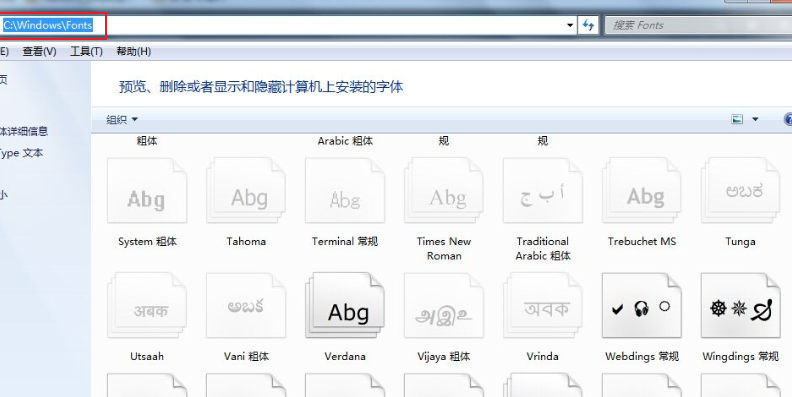
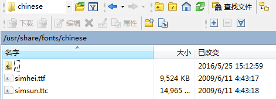
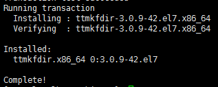
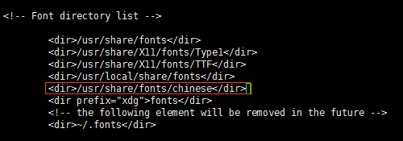

Linux字体确实是个问题。场景一：验证码已成为了用户认证的标配，动态变动可以有效防止注入，提高用户认证的安全。场景二：开发的系统中依赖系统的字体，如报表系统中发现中文乱码或中文字体重叠的情况等问题，这些都是linux字体惹的祸。本文以安装中文字体为例帮你解决字体这一小问题。


<!--more-->

## 查看字体

首先考虑的就是操作系统是否有中文字体，在[CentOS](http://www.linuxidc.com/topicnews.aspx?tid=14) 7中发现输入命令查看字体列表是提示命令无效： 
 
如上图可以看出，不仅没有中文字体，连字体库都没有呢。


## 安装字体库

从CentOS 4.x开始就用fontconfig来管理系统字体，如没有字体库安装即可，命令如下：

```bash
yum -y install fontconfig
```

当看到下图的提示信息时说明已安装成功： 


这时在/usr/share目录就可以看到fonts和fontconfig目录（之前没有）： 


字体库已安装完成。


## 添加中文字体

在CentOS中，字体库的存放位置正是上图中看到的fonts目录（/usr/share/fonts）中，我们首先要做的就是找到中文字体文件放到该目录下，而中文字体文件在windows系统中就可以找到，打开c盘下的Windows/Fonts目录： 


如上图，我们只需将需要的字体拷贝出来并上传至linux服务器即可。

这里选择宋体和黑体（报表中用到了这两种字体），可以看到是两个后缀名为ttf和ttc的文件： 
先新建目录，首先在/usr/shared/fonts目录下新建一个目录chinese： 


然后将上面的两个字体上传至/usr/shared/fonts/chinese目录下即可： 


修改chinese目录的权限：

```bash
chmod -R 755 /usr/share/fonts/chinese
```

安装ttmkfdir来搜索目录中所有的字体信息，并汇总生成fonts.scale文件，输入命令：

```bash
yum -y install ttmkfdir
```

当看到下图的提示信息时说明已安装成功： 


执行ttmkfdir命令即可：

```bash
ttmkfdir -e /usr/share/X11/fonts/encodings/encodings.dir
```

修改字体配置文件，首先通过编辑器打开配置文件：

```bash
vi /etc/fonts/fonts.conf
```

在Font list标签，即字体列表下，需要添加的中文字体位置加进去： 
 
刷新内存中的字体缓存或reboot重启：

```bash
fc-cache
```

**校验**

这样中文字体已安装完成，最后再次通过fc-list看一下字体列表： 


可以看到已经成功安装上了中文字体，至此安装过程就全部结束。


## 总结

Linux中的字体问题不是大问题，但为了系统的功能和易读性也需要按照上面教程切实解决下。安装其他字体和上面教程类似。


