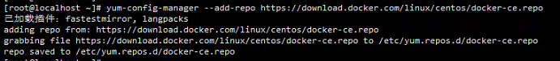
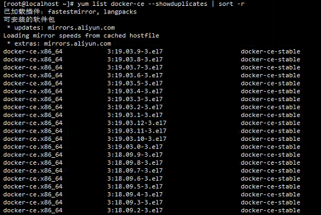
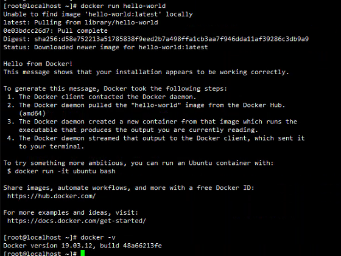

## **Docker版本说明**

Docker-CE指Docker社区版，由社区维护和提供技术支持，为免费版本，适合个人开发人员和小团队使用。

Docker-EE指Docker企业版，为收费版本，由售后团队和技术团队提供技术支持，专为企业开发和IT团队而设计。

相比Docker-EE，增加一些额外功能，更重要的是提供了更安全的保障。

此外，Docker的发布版本分为Stable版和Edge版，区别在于前者是按季度发布的稳定版(发布慢)，后者是按月发布的边缘版(发布快)。

通常情况下，Docker-CE足以满足我们的需求。


<!--more-->

## 安装

#### 配置docker yum源

```bash
yum-config-manager --add-repo https://download.docker.com/linux/centos/docker-ce.repo
```



#### 安装指定版本docker-ce

```bash
sudo yum update
sudo yum install -y yum-utils
sudo yum install docker-ce

# 查看可安装的版本
yum list docker-ce --showduplicates | sort -r

#安装指定版本
yum install docker-ce-<VERSION STRING>
#如果不指定，默认安装最新版本
```



#### 启动docker

```bash
systemctl start docker
#加入开机启动
systemctl enable docker
```

## 验证

```bash
docker -v
docker run hello-world
```

