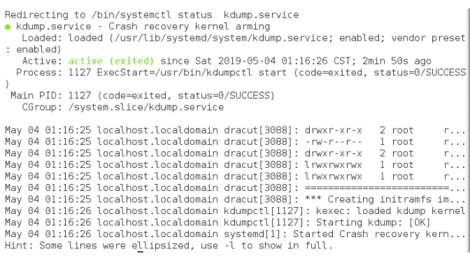

kdump是一种基于kexec的内核崩溃转储技术。kdump需要两个内核，分别是生产内核和捕获内核，生产内核是捕获内核服务的对象，且保留了内存的一部分给捕获内核启动使用。当系统崩溃时，kdump使用kexec启动捕获内核，以相应的ramdisk一起组建一个微环境，用以对生产内核下的内存进行收集和转存。

<!--more-->


## 配置kdump

实验环境：CentOS7
实验内核：linux-3.10.0-514.el7.x86_64


### 安装kexec-tools

使用kdump服务，必须要用到kexec-tools工具包。

```shell
sudo yum update
sudo yum install kexec-tools
```

安装完成之后可以通过kexec -version查看kexec的版本。


### 配置kdump kernel

需要为kdump kernel配置内存区域，kdump要求系统正常使用时，不能使用kdump kernel所占用的内存。

**修改grub文件**

```shell
vim /etc/default/grub
```

需要将GRUB_CMDLINE_LINUX="crashkernel=auto..."中的auto修改为128M。一般设为128M或256M。

**更新grub配置**

只要更改了grub文件，都需要更改grub配置

```shell
sudo grub2-mkconfig -o /boot/grub2/grub.cfg
```


**重启系统**

```shell
reboot
```


### 修改kdump默认配置

```shell
vim /etc/kdump.conf
```

其中，需要注意的三行内容是

```bash
path /var/crash            #指定coredump文件放在/var/crash文件夹中
core_collector makedumpfile -c -l -message-level 1 -d 31   #加上-c表示压缩，原文件中没有
default reboot         #生成coredump后，重启系统
```


### 开启kdump服务

```shell
systemctl start kdump.service     //启动kdump
systemctl enable kdump.service    //设置开机启动
```


### 测试kdump是否开启

**检查kdump开启成功**

```shell
service kdump status
```

如下所示，表示开启成功



kdump开启成功


**手动触发crash**

```shell
#echo 1 > /proc/sys/kernel/sysrq
#echo c > /proc/sysrq-trigger
```

如果配置成功，系统将自动重启，重新进入系统，可以看到/var/crash文件夹下生成了相应文件，是一个以生成coredump日期为文件名的文件,如图所示：


