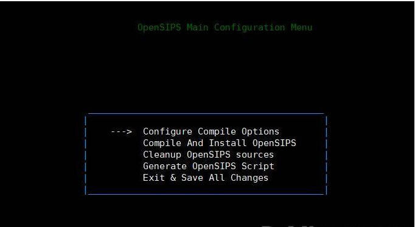
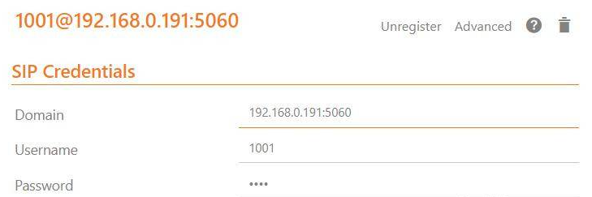
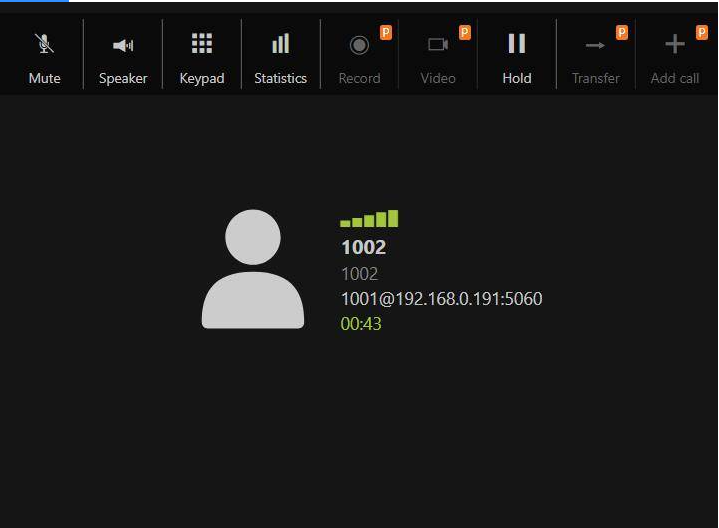

## 背景

先是使用`opensips`官方的`docker`尝试，好不容易装好了，软电话（`sipphone`）上注册不成功，主要是我`docker`又是装在`VirtualBox`的虚拟机里的，网络结构致使调试困难，直接新开一个虚拟机，很顺利的就安装成功并且实现局域网终端之间通话。

<!--more-->


## 准备工作

### 安装依赖

```bash
yum install mysql mysql-server mysql-devel gcc gcc-c++ ncurses-devel flex bison -y
```

机器上已经又`mysql`正常运行的话就跳过`mysql`相关的安装了。
注意在安装`mysql-server`的时候可能会出现找不到包，提示使用`mariadb-server`替代，那就老实使用`yum install mariadb-server mariadb`安装吧。

### mysql 设置密码并打开远程访问权限

装好的`mysql`启动默认是没有密码的，进入`mysql`后进去运行下面的代码。

```bash
// 设置密码
set password for 'root'@'localhost' =password('123456');
// 设置远程访问及全表权限
grant all privileges on *.* to root@'%'identified by '123456';
// 更新权限
flush privileges;
```

这里的设置根据需要来就好了。

### 开启防火墙5060端口

```bash
firewall-cmd --zone=public --add-port=5060/udp --permanent
firewall-cmd --reload
```

## 安装opensips

### 下载源码并选择模块

```bash
cd /usr/local/src 
git clone https://github.com/OpenSIPS/opensips.git -b 2.4 opensips-2.4
cd opensips-2.4
make all
# 如果这里报错，停止，装好依赖再make all
make menuconfig
```



进入这个菜单后，根据需要使用这个工具（左右键进入返回，空格键选中，回车键确定），但有个必须的是进入`Configure Compile Options`，选中`db_mysql`保存，返回主菜单选择`Compile And Install OpenSIPS`编译安装即可。完成后会回到这个界面，保存退出。

### 修改配置文件

```bash
# 配置文件目录
ls /usr/local/etc/opensips/

opensips.cfg  opensipsctlrc  osipsconsolerc  scenario_callcenter.xml

# 运行程序目录
ls /usr/local/sbin

opensips  opensipsctl  opensipsdbctl  opensipsunix  osipsconfig  osipsconsole

# 修改配置
vim opensipsctlrc

# 修改后的配置
# $Id$
#
# The OpenSIPS configuration file for the control tools.
#
# Here you can set variables used in the opensipsctl and opensipsdbctl setup
# scripts. Per default all variables here are commented out, the control tools
# will use their internal default values.
## your SIP domain
SIP_DOMAIN=192.168.0.191
## chrooted directory
# $CHROOT_DIR="/path/to/chrooted/directory"
## database type: MYSQL, PGSQL, ORACLE, DB_BERKELEY, DBTEXT, or SQLITE
## by default none is loaded
# If you want to setup a database with opensipsdbctl, you must at least specify
# this parameter.
DBENGINE=MYSQL
## database port (PostgreSQL=5432 default; MYSQL=3306 default)
DBPORT=3306
## database host
DBHOST=localhost
## database name (for ORACLE this is TNS name)
DBNAME=opensips
# database path used by dbtext, db_berkeley, or sqlite
DB_PATH="/usr/local/etc/opensips/dbtext"
## database read/write user
DBRWUSER=opensips
## password for database read/write user
DBRWPW="opensipsrw"
## engine type for the MySQL/MariaDB tabels (default InnoDB)
MYSQL_ENGINE="MyISAM"
## database super user (for ORACLE this is 'scheme-creator' user)
DBROOTUSER="root"
```

这里主要是`mysql`连接信息，保证能正常连接即可。还有一个`SIP_DOMAIN`能连接到本服务的域名或者`IP地址`即可。

**修改opensips.cfg**

```bash
vim opensips.cfg

# 修改配置项
listen=udp:192.168.0.191:5060 # CUSTOMIZE ME
```

这里如果你不确定该怎么填的话，运行下面的命令看一下，一般是本机`IP`。

```bash
ip route get 8.8.8.8 | head -n +1 | tr -s " " | cut -d " " -f 7
```

### 创建数据库

```bash
cd /usr/local/sbin

opensipsdbctl create
……
INFO: creating database opensips ...
INFO: Using table engine MyISAM.
INFO: Core OpenSIPS tables successfully created.
Install presence related tables? (Y/n): y
INFO: creating presence tables into opensips ...
INFO: Presence tables successfully created.
Install tables for 
    b2b
    cachedb_sql
    call_center
    carrierroute
    cpl
    domainpolicy
    emergency
    fraud_detection
    freeswitch_scripting
    imc
    registrant
    siptrace
    userblacklist
? (Y/n): y
INFO: creating extra tables into opensips ...
INFO: Extra tables successfully created.
```

之后就是根据提示傻瓜操作创建数据库就好了，如果前面的`mysql`环境没装好，数据库连接有问题，这里就会报错，如果提示类似下面的编码问题，输入`latin1`即可。

```bash
WARNING: Your current default mysql characters set cannot be used to create DB. Please choice another one from the following list:
```

这一步完成之后，会在数据库新建一个`opensips`（名字是在上面的配置文件里设置的）的数据库。

### 启动opensips

```bash
# 启动
[root@localhost sbin]# opensipsctl start
INFO: Starting OpenSIPS : 
INFO: started (pid: 26051)
# 查看opensips进程
[root@localhost sbin]# ps -aux | grep opensips
root      3504  0.0  0.4  70536  4420 ?        S    3月07   0:00 /usr/local/sbin/opensips -P /var/run/opensips.pid
root      3505  3.1  0.1  70776  1368 ?        S    3月07  12:35 /usr/local/sbin/opensips -P /var/run/opensips.pid
root      3506  0.1  0.0  70536   476 ?        S    3月07   0:29 /usr/local/sbin/opensips -P /var/run/opensips.pid
root      3507  0.0  0.0  70536   688 ?        S    3月07   0:08 /usr/local/sbin/opensips -P /var/run/opensips.pid
root      3508  0.0  0.2  70536  2396 ?        S    3月07   0:03 /usr/local/sbin/opensips -P /var/run/opensips.pid
root      3509  0.0  0.1  70536  1424 ?        S    3月07   0:01 /usr/local/sbin/opensips -P /var/run/opensips.pid
root      3510  0.0  0.1  70536  1912 ?        S    3月07   0:01 /usr/local/sbin/opensips -P /var/run/opensips.pid
root      3511  0.0  0.2  70536  2392 ?        S    3月07   0:01 /usr/local/sbin/opensips -P /var/run/opensips.pid
root      3512  0.0  0.1  70536  1164 ?        S    3月07   0:01 /usr/local/sbin/opensips -P /var/run/opensips.pid
# 注册用户格式 opensipsctl 用户名 密码
[root@localhost sbin]# opensipsctl add 1001 1001
new user '1001' added
[root@localhost sbin]# opensipsctl add 1002 1002
new user '1002' added
```

到这里就成功的启动了服务并添加了两个用户（1001，1002），下面我们来在局域网测试一下。

### 测试通话

在同一个局域网的手机上装上支持`sip`的软电话应用市场搜`sip phone`应该能找到不少，电脑端也有。
配置一般是这样的



拨打电话成功



配置好两个终端直接拨号就行了，号码就是1001，1002，经测试视频通话也是默认就支持的，很6哦。至此，借助`opensips`实现`sip`通话已经完成，只是实现最基本的功能，`opensips`还有很多好用的功能供大家来挖掘。