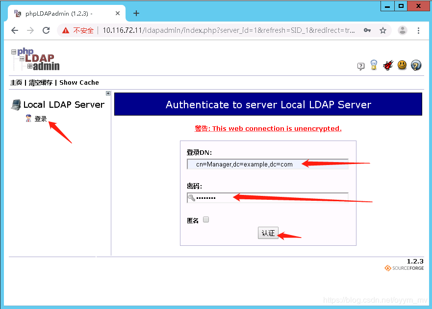
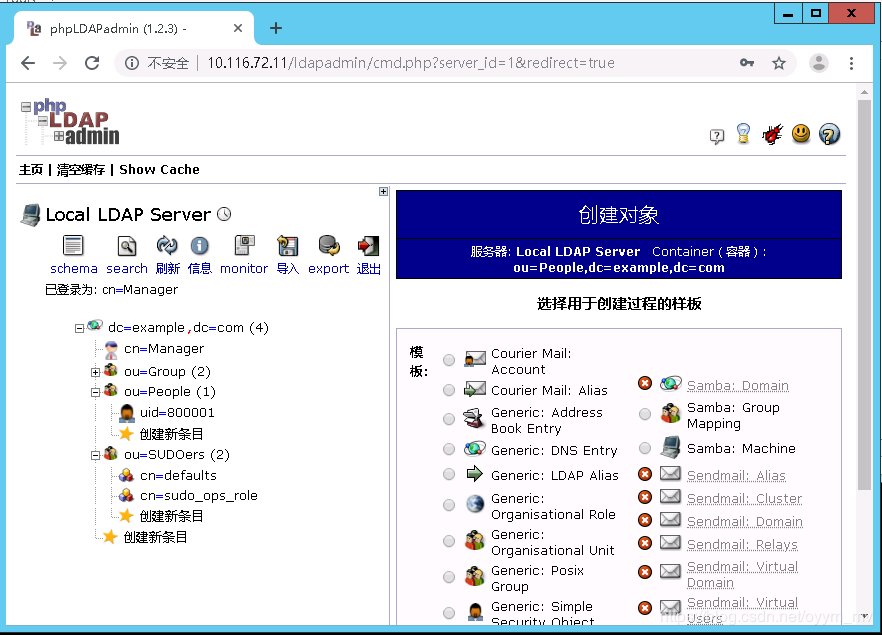
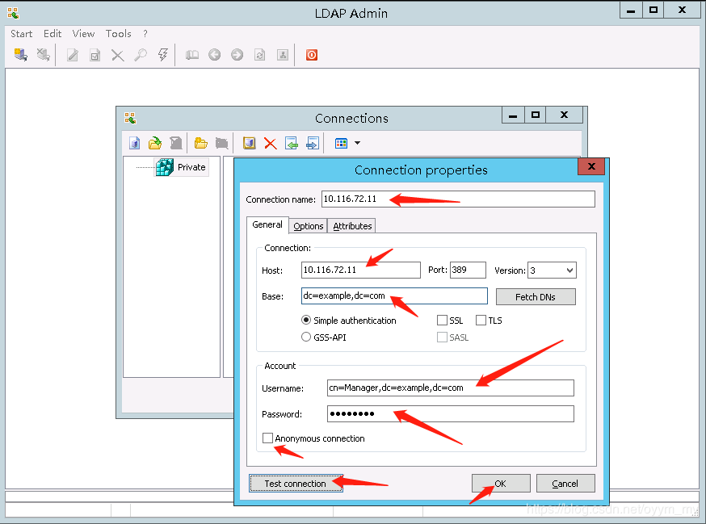
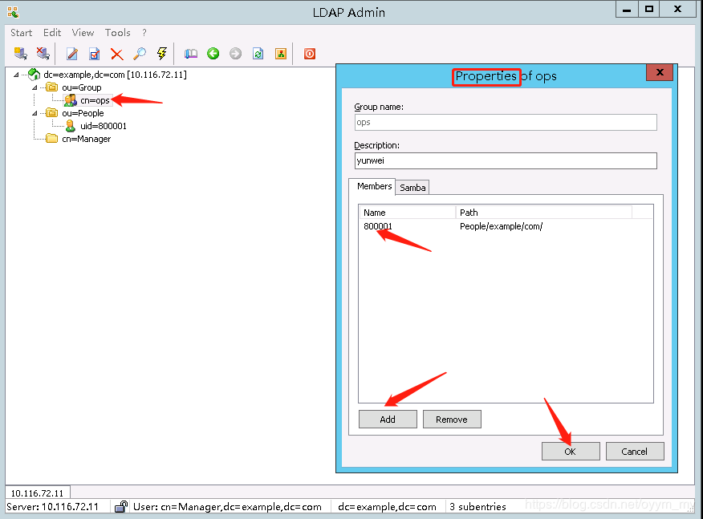

## 目的

本文详细介绍了在centos7上安装最新版openldap的过程和常见场景。


## 环境

操作系统：centos7.6

软件版本：openldap-2.4.44

配置示例:   dc=example,dc=com


<!--more-->

## 准备工作

为了方便配置防火墙以及禁用selinux，或者关闭防火墙。

查看防火墙状态

```shell
firewall-cmd --state
```

停止firewall

```
systemctl stop firewalld.service
```

禁止firewall开机启动

```
systemctl disable firewalld.service 
```

关闭selinux 

进入到/etc/selinux/config文件

```bash
vim /etc/selinux/config
将SELINUX=enforcing改为SELINUX=disabled
```

## OpenLDAP服务端配置

创建一个配置目录，将相关配置文件放在这个目录下面

```bash
openldap
├── base.ldif
├── config.ldif
├── demo.ldif
├── loglevel.ldif
├── schema
│   ├── sudo.ldif
│   └── sudo.schema
├── sudo_ops_role.ldif
└── SUODers.ldif

cd openldap
```

## 安装LDAP组件并启动服务

```bash
# yum安装
yum -y install openldap  openldap-clients openldap-servers 

# 建立Ldap数据库
cp /usr/share/openldap-servers/DB_CONFIG.example /var/lib/ldap/DB_CONFIG
chown ldap:ldap /var/lib/ldap/*

# 启动和开机自启
systemctl start slapd.service
systemctl enable slapd.service

# 验证
netstat -antup | grep -i 389
tcp     0    0 0.0.0.0:389      0.0.0.0:*   LISTEN      16349/slapd     
tcp6    0    0 :::389           :::*        LISTEN      16349/slapd 
```

## 配置OpenLDAP服务

```bash
# 生成Ldap root密码
~]# slappasswd
New password: openldap
Re-enter new password: openldap 
{SSHA}npo7WhvpY+s4+p584zAnoduStQzeTxHE

# 添加需要的schemas [可以根据需要添加更多]
ldapadd -Y EXTERNAL -H ldapi:/// -f /etc/openldap/schema/cosine.ldif
ldapadd -Y EXTERNAL -H ldapi:/// -f /etc/openldap/schema/nis.ldif 
ldapadd -Y EXTERNAL -H ldapi:/// -f /etc/openldap/schema/inetorgperson.ldif

# 配置openLDAP服务
vim config.ldif

dn: olcDatabase={1}monitor,cn=config
changetype: modify
replace: olcAccess
olcAccess: {0}to * by dn.base="gidNumber=0+uidNumber=0,cn=peercred,cn=external, cn=auth" read by dn.base="cn=Manager,dc=example,dc=com" read by * none

dn: olcDatabase={2}hdb,cn=config
changetype: modify
replace: olcSuffix
olcSuffix: dc=example,dc=com

dn: olcDatabase={2}hdb,cn=config
changetype: modify
replace: olcRootDN
olcRootDN: cn=Manager,dc=example,dc=com

dn: olcDatabase={2}hdb,cn=config
changetype: modify
replace: olcRootPW
olcRootPW: {SSHA}npo7WhvpY+s4+p584zAnoduStQzeTxHE

dn: olcDatabase={2}hdb,cn=config
changetype: modify
add: olcAccess
olcAccess: {0}to attrs=userPassword,shadowLastChange by dn="cn=Manager,dc=example,dc=com" write by anonymous auth by self write by * none
olcAccess: {1}to dn.base="" by * read
olcAccess: {2}to * by dn="cn=Manager,dc=example,dc=com" write by * read

# 发送配置到LDAP服务
ldapmodify -Y EXTERNAL  -H ldapi:/// -f config.ldif

# 域example.com配置
vi base.ldif

dn: dc=example,dc=com
o: example com
dc: example
objectClass: top
objectClass: dcObject
objectClass: organization

dn: cn=Manager,dc=example,dc=com
objectClass: organizationalRole
cn: Manager
description: LDAP Manager

dn: ou=People,dc=example,dc=com
objectClass: organizationalUnit
ou: People

dn: ou=Group,dc=example,dc=com
objectClass: organizationalUnit
ou: Group

# 发送配置到LDAP服务
ldapadd -x -W -D "cn=Manager,dc=example,dc=com" -f base.ldif


# 配置ldap log
vim loglevel.ldif

dn: cn=config
changetype: modify
replace: olcLogLevel
olcLogLevel: stats

# 发送配置到LDAP服务
ldapmodify -Y EXTERNAL -H ldapi:/// -f loglevel.ldif

echo "local4.*  /var/log/slapd/slapd.log" >> /etc/rsyslog.conf

vi /etc/logrotate.d/slapd

/var/log/openldap.log {
    rotate 14
    size 10M
    missingok
    compress
    copytruncate
}

systemctl restart rsyslog
# 如果有需要还可以配置日志轮转

# 创建一个测试用户
vi demo.ldif

dn: uid=800001,ou=People,dc=example,dc=com
objectClass: top
objectClass: account
objectClass: posixAccount
objectClass: shadowAccount
cn: demo
uid: 800001
uidNumber: 3000
gidNumber: 100
homeDirectory: /home/ldapusers
loginShell: /bin/bash
gecos: Demo [Demo user (at) example]
userPassword: {crypt}x
shadowLastChange: 17058
shadowMin: 0
shadowMax: 99999
shadowWarning: 7

dn: cn=ops,ou=Group,dc=example,dc=com
objectClass: posixGroup
objectClass: top
cn: ops
gidNumber: 80001
memberUid: 800001

# 创建
ldapadd -x -W -D "cn=Manager,dc=example,dc=com" -f demo.ldif
# 改密
ldappasswd -s 'passwd@123' -W -D "cn=Manager,dc=example,dc=com" -x "uid=800001,ou=People,dc=example,dc=com"

# 验证搜索
ldapsearch -x uid=800001 -b dc=example,dc=com

//删除使用如下命令，暂不删除，因后续实验需用到测试用户
ldapdelete -W -D "cn=Manager,dc=example,dc=com" -x "uid=800001,ou=People,dc=example,dc=com"
```

## ldap客户端配置

```bash
# 安装组件
yum install -y openldap-clients nss-pam-ldapd

# 添加client服务器到LDAP服务,注意IP
authconfig --enableldap --enableldapauth --ldapserver="localhost" --ldapbasedn="dc=example,dc=com" --update
# 这个指令修改了/etc/nsswitch.conf 以及/etc/openldap/ldap.conf文件

# 启动ldap客户端服务
systemctl restart  nslcd

# 验证
getent passwd 800001
800001:3000:100:Demo [Demo user (at) example]:/home/demo:/bin/bash

# 远程ssh登录验证
ssh 800001@10.116.72.15
800001@10.116.72.15's password: demopassword
-bash-4.2$ id 800001
uid=3000(800001) gid=100(users) groups=100(users),80001(ops)
-bash-4.2$ 

# 这里可以看到没有配置自动生成账户的家目录，在实际的运维过程中，也不会去生成家目录（不然一堆的账户加目录），而是让运维账户统一一个家目录，并且设置为只读。
# 不过如果有需要配置配置家目录自动生成，需要修改pam模块
```

##  配置LDAP使用公钥(publicKey)远程ssh登录客户主机

### openldap服务端配置

```bash
# 安装openssh-ldap
yum install openssh-ldap

# 查看
rpm -aql |grep openssh-ldap
/usr/share/doc/openssh-ldap-7.4p1
/usr/share/doc/openssh-ldap-7.4p1/HOWTO.ldap-keys
/usr/share/doc/openssh-ldap-7.4p1/ldap.conf
/usr/share/doc/openssh-ldap-7.4p1/openssh-lpk-openldap.ldif
/usr/share/doc/openssh-ldap-7.4p1/openssh-lpk-openldap.schema
/usr/share/doc/openssh-ldap-7.4p1/openssh-lpk-sun.ldif
/usr/share/doc/openssh-ldap-7.4p1/openssh-lpk-sun.schema

# 配置添加相关schema
cp /usr/share/doc/openssh-ldap-7.4p1/openssh-lpk-openldap.ldif /etc/openldap/schema/
cp /usr/share/doc/openssh-ldap-7.4p1/openssh-lpk-openldap.schema /etc/openldap/schema/

# 添加
ldapadd -Y EXTERNAL -H ldapi:/// -f /etc/openldap/schema/openssh-lpk-openldap.ldif

# 账户添加objectClass: ldapPublicKey 并添加属性sshPublicKey
# 具体修改流程，可以使用下面安装的ldapadmin或者phpldapadmin进行配置
objectClass: ldapPublicKey
sshPublicKey:  值是具体的publickey
```

### 客户主机配置

```bash
# 安装
yum install openssh-ldap
cp /usr/share/doc/openssh-ldap-7.4p1/ldap.conf /etc/ssh/

# 如果使用TLS 配置TLS,这里不使用
vim /etc/ssh/ldap.conf

ssl no
uri ldap://10.116.72.11/

vim /etc/ssh/sshd_config
# 脚本将从LDAP获取密钥并将其提供给SSH服务器
AuthorizedKeysCommand /usr/libexec/openssh/ssh-ldap-wrapper
AuthorizedKeysCommandUser nobody
PubkeyAuthentication yes
```

### 登录验证

```bash
ssh -i ~/.ssh/id_rsa 800001@10.116.72.15
Last login: Thu Jul  4 16:15:30 2019 from 10.116.71.200
Could not chdir to home directory /home/demo: No such file or directory
-bash-4.2$ 
```

## 配置LDAP账户可以登录的主机列表

测试使用的远程ssh服务器是10.116.72.15，我们验证如下

1. 添加账户主机列表（host属性）不包含116.116.72.15 测试是否可以正常登录

2. 添加账户主机列表（host属性）包含116.116.72.15 测试是否可以正常登录

   

### 需要通过Ldap远程登录的客户机配置

```bash
vi /etc/nsswitch.conf
# 添加如下过滤配置，包含本机主机名称。表示过滤匹配包括本机IP或者允许任意IP地址的账户授权信息
filter passwd (|(host=10.116.72.15)(host=\*))(host=ALL)
```

备注：如果远程主机是centos6，配置稍有不同

```bash
vi /etc/pam_ldap.conf
pam_filter |(host=10.116.72.16)(host=\*)(host=ALL)
```

### LDAP账户配置

ldap命令或者ldapadmin管理工具为账户添加属性host，这个属性可以添加多次。

- 第一次配置不包含测试主机10.116.72.15

```bash
ldapsearch -x uid=800001 -b 'ou=People,dc=example,dc=com'

dn: uid=800001,ou=People,dc=example,dc=com
objectClass: top
objectClass: account
objectClass: posixAccount
objectClass: shadowAccount
cn: demo
uid: 800001
uidNumber: 3000
gidNumber: 100
homeDirectory: /home/demo
loginShell: /bin/bash
gecos: Demo [Admin (at) eju]
shadowMin: 0
shadowMax: 99999
shadowWarning: 7
host: 10.116.72.12
host: 10.116.72.16

测试登录
# ssh 800001@10.116.72.15
800001@10.116.72.15's password: 
Permission denied, please try again.
```

- 第二次配置包含测试主机10.116.72.15

```bash
ldapsearch -x uid=800001 -b 'ou=People,dc=example,dc=com'

dn: uid=800001,ou=People,dc=example,dc=com
objectClass: top
objectClass: account
objectClass: posixAccount
objectClass: shadowAccount
cn: demo
uid: 800001
uidNumber: 3000
gidNumber: 100
homeDirectory: /home/demo
loginShell: /bin/bash
gecos: Demo [Admin (at) eju]
shadowMin: 0
shadowMax: 99999
shadowWarning: 7
host: 10.116.72.12
host: 10.116.72.15
host: 10.116.72.16

测试登录
# ssh 800001@10.116.72.15
800001@10.116.72.15's password: 
Last login: Thu Jul  4 16:15:30 2019 from 10.116.71.200
Could not chdir to home directory /home/demo: No such file or directory
-bash-4.2$ 
```

以上，测试通过。

##  配置LDAP sudo权限管理

### 服务配置

CentOS7.6下安装的OpenLDAP是2.4.44 ,schema目录下并没有sudo.ldif以及sudo.schema文件，需要单独处理。 sudo是默认安装的，sudo相关目录下有sudo.schema模板文件schema.OpenLDAP

```bash
find / -name schema.OpenLDAP -exec cp {} /etc/openldap/schema/sudo.schema \;

# 生成sudo.ldif
echo 'include     /etc/openldap/schema/sudo.schema' > /tmp/sudo.conf
mkdir /tmp/sudo
slaptest -f /tmp/sudo.conf -F /tmp/sudo

vim /tmp/sudo/cn=config/cn=schema/cn={0}sudo.ldif

替换（前3行）
dn: cn={0}sudo
objectClass: olcSchemaConfig
cn: {0}sudo
为
dn: cn=sudo,cn=schema,cn=config
objectClass: olcSchemaConfig
cn: sudo
删除(最后7行)
structuralObjectClass: olcSchemaConfig
entryUUID: ec3b659a-31a9-1039-90ae-87c69280e4a2
creatorsName: cn=config
createTimestamp: 20190703064542Z
entryCSN: 20190703064542.945991Z#000000#000#000000
modifiersName: cn=config
modifyTimestamp: 20190703064542Z

cp /tmp/sudo/cn=config/cn=schema/cn={0}sudo.ldif /etc/openldap/schema/sudo.ldif
ldapadd -Y EXTERNAL -H ldapi:/// -f /etc/openldap/schema/sudo.ldif

rm -f /tmp/sudo.conf /tmp/sudo
```

### 权限配置

```bash
vim SUODers.ldif

dn: ou=SUDOers,dc=example,dc=com
ou: SUDOers
objectClass: top
objectClass: organizationalUnit

dn: cn=defaults,ou=SUDOers,dc=example,dc=com
objectClass: sudoRole
cn: defaults
sudoOption: requiretty
sudoOption: !visiblepw
sudoOption: always_set_home
sudoOption: env_reset
sudoOption: env_keep =  "COLORS DISPLAY HOSTNAME HISTSIZE INPUTRC KDEDIR LS_COLORS"
sudoOption: env_keep += "MAIL PS1 PS2 QTDIR USERNAME LANG LC_ADDRESS LC_CTYPE"
sudoOption: env_keep += "LC_COLLATE LC_IDENTIFICATION LC_MEASUREMENT LC_MESSAGES"
sudoOption: env_keep += "LC_MONETARY LC_NAME LC_NUMERIC LC_PAPER LC_TELEPHONE"
sudoOption: env_keep += "LC_TIME LC_ALL LANGUAGE LINGUAS _XKB_CHARSET XAUTHORITY"
sudoOption: secure_path = /sbin:/bin:/usr/sbin:/usr/bin
sudoOption: logfile = /var/log/sudo

# 添加
ldapadd -x -W -D "cn=Manager,dc=example,dc=com" -f SUODers.ldif
```

### 将上面的demo（800001）账户配置为sudo权限

这里配置一个运维sudo role，名称为sudo_ops_role，简单配置为sudo 到root所有权限，并将800001加入该role

```bash
vim sudo_ops_role.ldif

dn: cn=sudo_ops_role,ou=SUDOers,dc=example,dc=com
objectClass: sudoRole
cn: sudo_ops_role
sudoOption: !authenticate
sudoRunAsUser: root
sudoCommand: ALL
sudoHost: ALL
sudoUser: 800001

# 添加
ldapadd -x -W -D "cn=Manager,dc=example,dc=com" -f sudo_ops_role.ldif
```

### 客户端增加如下配置

```bash
vim /etc/nsswitch.conf
# 追加内存
sudoers:    files ldap

mv /etc/sudo-ldap.conf{,.bak}
vi /etc/sudo-ldap.conf
uri ldap://10.116.72.11/ 
base dc=example,dc=com
sudoers_base ou=SUDOers,dc=example,dc=com
```

测试

```bash
# ssh 800001@10.116.72.15
800001@10.116.72.15's password: 
Could not chdir to home directory /home/ldapusers: No such file or directory
-bash-4.2$ sudo su -
Last login: Wed Jul  3 15:09:21 CST 2019 from 10.116.71.200 on pts/0
[root@systerm-shylf-1 ~]# 
```

## 基于web的OpenLDAP管理工具phpldapadmin

实例在openldap安装，实际使用中可以部署在其他服务器上通过网络访问。前端还可以配置一个nginx去代理实现高可用

### 安装配置phpldapadmin

```bash
# 安装组件
yum -y install epel-release
yum -y install httpd phpldapadmin
# yum安装后的项目文件位置/usr/share/phpldapadmin/htdocs，配置文件位置/etc/phpldapadmin/config.php

# phpldapadmin修改
vim /etc/phpldapadmin/config.php

# 注释掉
//$servers->setValue('login','attr','uid');
# 或者修改为
$servers->setValue('login','attr','dn');
$servers->newServer('ldap_pla');
$servers->setValue('server','name','LDAP Server'); 
$servers->setValue('server','host','127.0.0.1'); //根据需要修改为实际地址,这个部署到openldap本机直接保留127.0.0.1
$servers->setValue('server','port',389);
$servers->setValue('server','base',array('dc=example,dc=com'));   //
$servers->setValue('login','auth_type','cookie');
$servers->setValue('login','bind_id','cn=Manager,dc=example,dc=com');
$servers->setValue('login','bind_pass','');
$servers->setValue('server','tls',false);

# httpd修改
vim /etc/httpd/conf.d/phpldapadmin.conf

Alias /phpldapadmin /usr/share/phpldapadmin/htdocs
Alias /ldapadmin /usr/share/phpldapadmin/htdocs

<Directory /usr/share/phpldapadmin/htdocs>
  <IfModule mod_authz_core.c>
    # Apache 2.4
    # Require local
    Require all granted
  </IfModule>
  <IfModule !mod_authz_core.c>
    # Apache 2.2
    Order Deny,Allow
    Deny from all
    Allow from 127.0.0.1
    Allow from ::1
    # 根据需要配置许可
    Allow from 10.116
  </IfModule>
</Directory>

# 启动httpd服务
systemctl restart httpd
```

### 使用phpldapadmin





备注，如果报错如下

```bash
Forbidden 
You don't have permission to access /ldapadmin/ on this server.

可以尝试修改httpd.conf
vi /etc/httpd/conf/http.conf
修改
<Directory />
    AllowOverride none
    Require all denied
</Directory>
为
<Directory /> 
Options Indexes FollowSymLinks 
AllowOverride None 
</Directory>

systemctl restart httpd
```

### 为phpldapadmin添加suorole配置模版

从[官网地址](http://phpldapadmin.sourceforge.net/wiki/index.php/TemplatesContributed:Sudo) 可以获取到sudoRole模板，可以在这个基础上进行修改

```bash
ll /usr/share/phpldapadmin/templates
# ll /usr/share/phpldapadmin/templates
total 8
drwxr-xr-x 2 root root 4096 Jul  4 15:32 creation
drwxr-xr-x 2 root root   69 Jul  4 15:31 modification
-rw-r--r-- 1 root root 2089 Oct  1  2012 template.dtd
```

vim  /usr/share/phpldapadmin/templates/creation/sudo.xml 注意根据需要进行修改，我的sudo ou名称是SUDOers

```xml
<?xml version="1.0" encoding="UTF-8" standalone="no"?>
<!DOCTYPE template SYSTEM "template.dtd">
<template>
<title>Sudo Policy</title>
<regexp>^ou=SUDOers,dc=.*</regexp>
<icon>images/door.png</icon>
<description>New Sudo Policy</description>
<askcontainer>1</askcontainer>
<rdn>cn</rdn>
<visible>1</visible>

<objectClasses>
<objectClass id="sudoRole"></objectClass>
</objectClasses>

<attributes>
<attribute id="cn">
        <display>Policy Name</display>
        <order>1</order>
        <page>1</page>
</attribute>
<attribute id="sudoOption">
        <display>Sudo Option</display>
        <order>2</order>
        <page>1</page>
        <spacer>1</spacer>
</attribute>
<attribute id="sudoRunAsUser">
        <display>Sudo Run As User</display>
        <order>3</order>
        <page>1</page>
        <spacer>1</spacer>
</attribute>
<attribute id="sudoCommand">
        <display>Sudo Command</display>
        <order>4</order>
        <page>1</page>
        <spacer>1</spacer>
</attribute>
<attribute id="sudoUser">
        <display>Sudo Users</display>
        <option>=php.MultiList(/,(objectClass=posixAccount),uid,%uid%
(%cn%),sudoUser)</option>
        <order>5</order>
        <page>1</page>
        <spacer>1</spacer>
</attribute>
<attribute id="sudoHost">
        <display>Sudo Hosts</display>
        <array>10</array>
        <order>6</order>
        <page>1</page>
        <spacer>1</spacer>
</attribute>
<attribute id="description">
        <type>textarea</type>
        <display>Description</display>
        <order>7</order>
        <page>1</page>
</attribute>
</attributes>
</template>
```

vim  /usr/share/phpldapadmin/templates/modification/sudo.xml

```xml
<?xml version="1.0" encoding="UTF-8" standalone="no"?>
<!DOCTYPE template SYSTEM "template.dtd">
<template>
<title>Sudo Policy</title>
<regexp>^cn=.*,ou=SUDOers,dc=.*</regexp>
<icon>images/door.png</icon>
<description>Sudo Policy</description>
<askcontainer>1</askcontainer>
<rdn>cn</rdn>
<visible>1</visible>

<objectClasses>
<objectClass id="sudoRole"></objectClass>
</objectClasses>

<attributes>
<attribute id="cn">
        <display>Policy Name</display>
        <order>1</order>
        <page>1</page>
</attribute>
<attribute id="sudoOption">
        <display>Sudo Option</display>
        <order>2</order>
        <page>1</page>
        <spacer>1</spacer>
</attribute>
<attribute id="sudoRunAsUser">
        <display>Sudo Run As User</display>
        <order>3</order>
        <page>1</page>
        <spacer>1</spacer>
</attribute>
<attribute id="sudoCommand">
        <display>Sudo Command</display>
        <order>4</order>
        <page>1</page>
        <spacer>1</spacer>
</attribute>
<attribute id="sudoUser">
        <display>Sudo Users</display>
        <order>5</order>
        <page>1</page>
        <spacer>1</spacer>
</attribute>
<attribute id="sudoHost">
        <display>Sudo Hosts</display>
        <!-- <array>10</array> -->
        <order>6</order>
        <page>1</page>
        <spacer>1</spacer>
</attribute>
<attribute id="description">
        <type>textarea</type>
        <display>Description</display>
        <order>7</order>
        <page>1</page>
        <cols>200</cols>
        <rows>10</rows>
</attribute>
</attributes>
</template>
```

重启httpd服务

```bash
systemctl restart httpd
```

浏览器查看(ou=SUODers,dc=example,dc=com 创建一条子目录 sudoRole)


## windows下的一个OpenLDAP管理工具 LdapAdmin

下载地址 [LdapAdmin](http://www.ldapadmin.org/download/ldapadmin.html), 当前最新版本是[1.8.3](https://sourceforge.net/projects/ldapadmin/files/ldapadmin/1.8.3/LdapAdminExe-w64-1.8.3.zip/download)。 下载后直接解压就是一个exe文件。

### 创建连接到openldap服务



### 配置一个运维组ops，然后将用户800001加入到ops组




## 开启memberOf

默认情况下openldap的用户组属性是Posixgroup，Posixgroup用户组属性和用户没有实际的对应关系。如果要对应起来的话，就需要单独把用户设置到Posixgroup中

开启memberOf之后可以配置groupOfUniqueNames用户组属性，可以根据用户组过滤用户，这个过滤是唯一的

开启memberof，并让新增用户支持memberof

创建 memberof_config.ldif

```ldif
dn: cn=module{0},cn=config
cn: modulle{0}
objectClass: olcModuleList
objectclass: top
olcModuleload: memberof.la
olcModulePath: /usr/lib64/openldap

dn: olcOverlay={0}memberof,olcDatabase={2}hdb,cn=config
objectClass: olcConfig
objectClass: olcMemberOf
objectClass: olcOverlayConfig
objectClass: top
olcOverlay: memberof
olcMemberOfDangling: ignore
olcMemberOfRefInt: TRUE
olcMemberOfGroupOC: groupOfNames
olcMemberOfMemberAD: member
olcMemberOfMemberOfAD: memberOf
```

创建 refint1.ldif

```
dn: cn=module{0},cn=config
add: olcmoduleload
olcmoduleload: refint
```

创建 refint2.ldif

```
dn: olcOverlay=refint,olcDatabase={2}hdb,cn=config
objectClass: olcConfig
objectClass: olcOverlayConfig
objectClass: olcRefintConfig
objectClass: top
olcOverlay: refint
olcRefintAttribute: memberof member manager owner
```

导入配置

```bash
ldapadd -Q -Y EXTERNAL -H ldapi:/// -f memberof_config.ldif
ldapmodify -Q -Y EXTERNAL -H ldapi:/// -f refint1.ldif
ldapadd -Q -Y EXTERNAL -H ldapi:/// -f refint2.ldif
# 导入refint2时如果有报错，把最后一句改为：olcRefintAttribute: memberof uniqueMember  manager owner
```

验证一下配置，这个命令可以列出所有配置

```bash
slapcat -b cn=config
```

## **禁止匿名访问**

默认情况下匿名用户可以获取所有用户信息，甚至是密码字段，虽然密码字段是经过加密的那也很危险

创建disable_anon.ldif文件

```
dn: cn=config
changetype: modify
add: olcDisallows
olcDisallows: bind_anon

dn: cn=config
changetype: modify
add: olcRequires
olcRequires: authc

dn: olcDatabase={-1}frontend,cn=config
changetype: modify
add: olcRequires
olcRequires: authc
```

导入配置

```
ldapadd -Q -Y EXTERNAL -H ldapi:/// -f disable_anon.ldif 
```

## 设置ACL

拒绝所有用户查看用户信息，并且添加有ldap管理账号

创建acl.ldif

```
dn: olcDatabase={2}hdb,cn=config
changetype: modify
replace: olcAccess
olcAccess: to attrs=userPassword
  by anonymous auth
  by dn.base="cn=ldapadmin,ou=manage,dc=taovip,dc=com" write
  by * none
olcAccess: to *
  by anonymous auth
  by dn.base="cn=ldapadmin,ou=manage,dc=taovip,dc=com" write
  by dn.base="cn=ldapread,ou=manage,dc=taovip,dc=com" read
  by * none
```

导入配置

```
ldapmodify -Q -Y EXTERNAL -H ldapi:/// -f acl.ldif 
```

删除ACL

创建文件del_acl.ldif

```
dn: olcDatabase={2}hdb,cn=config
changetype: modify
delete: olcAccess
olcAccess: {0}
```

导入配置

```
ldapmodify -Q -Y EXTERNAL -H ldapi:/// -f acl.ldif 
```

## 创建管理用户

创建add_ou.ldif

```
dn: ou=manage,dc=example,dc=com
ou: manage
description: Directory Manage
objectClass: top
objectClass: organizationalUnit
```

创建add_manage_user.ldif

```
n: cn=ldapadmin,ou=manage,dc=example,dc=com
cn: ldapadmin
sn: ldapadmin
uid: ldapadmin
objectClass: top
objectClass: shadowAccount
objectClass: inetOrgPerson
objectClass: organizationalPerson
objectClass: person
userPassword: {SSHA}4eDZHnxvfOOoAgSM6tDLDueCIUB9sRuDHVpVJ

dn: cn=ldapread,ou=manage,dc=example,dc=com
cn: ldapread
sn: ldapread
uid: ldapread
objectClass: top
objectClass: shadowAccount
objectClass: inetOrgPerson
objectClass: organizationalPerson
objectClass: person
userPassword: {SSHA}4eDZHnxvfOOoAgSM6tDLDueCIUB9sRuDHVpVJ
```

导入配置

```
ldapadd -x -D cn=root,dc=example,dc=com -W -f add_ou.ldif
ldapadd -x -D cn=root,dc=example,dc=com -W -f add_manage_user.ldif
```

