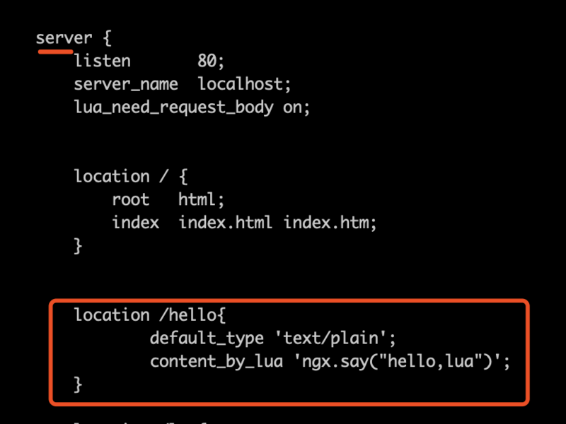

## 背景

Lua 是一种轻量小巧的脚本语言，用标准C语言编写并以源代码形式开放， 其设计目的是为了嵌入应用程序中，从而为应用程序提供灵活的扩展和定制功能。现在通常把lua迁入nginx中，根据lua脚本规则，强化nginx的能力。本文介绍在centos7中安装nginx整合lua。

<!--more-->


## 环境

**centos7**


## 安装

### 关闭防火墙

```bash
systemctl stop firewalld.service #停止firewall
systemctl disable firewalld.service #禁止firewall开机启动
```

### 安装依赖环境

```bash
yum -y install yum-utils gcc zlib zlib-devel pcre-devel openssl openssl-devel wget
```

### 安装LuaJIT

```bash
wget http://luajit.org/download/LuaJIT-2.0.2.tar.gz
tar -xvf LuaJIT-2.0.2.tar.gz
cd LuaJIT-2.0.2
make install
```

### 安装nginx

**下载ngx_devel_kit、lua-nginx-module、nginx**

```bash
wget https://github.com/simpl/ngx_devel_kit/archive/v0.3.0.tar.gz
wget https://github.com/openresty/lua-nginx-module/archive/v0.10.9rc7.tar.gz
wget http://nginx.org/download/nginx-1.12.1.tar.gz 
#注意下载后的压缩包没有文件名称，但是根据版本号能区分是哪个文件
tar -xvf v0.3.0.tar.gz
tar -xvf v0.10.9rc7.tar.gz
tar -xvf nginx-1.12.1.tar.gz
```

### 编译Nginx

```bash
cd nginx-1.12.1
./configure --prefix=/usr/local/nginx --add-module=../ngx_devel_kit-0.3.0 --add-module=../lua-nginx-module-0.10.9rc7  --with-http_ssl_module  --with-http_stub_status_module  --with-http_gzip_static_module
```

### 安装

```bash
make && make install
```

### 启动nginx

启动时会nginx可能会报错

```
./nginx: error while loading shared libraries: libluajit-5.1.so.2: cannot open shared object file: 
```

原因是：找不到libluajit-5.1.so.2这个文件

**解决办法**

找到 libluajit-5.1.so.2,libluajit-5.1.so.2.0.2这两个文件复制到 对应的lib下
64位是 /usr/lib64
32位是 /usr/lib

```bash
find / -name libluajit-5.1.so.2
```


文件默认是安装在 /usr/local/lib/libluajit-5.1.so.2下

```bash
cp /usr/local/lib/libluajit-5.1.so.2 /usr/lib64/
cp /usr/local/lib/libluajit-5.1.so.2.0.2 /usr/lib64
```

**然后启动**

```bash
/usr/local/nginx/sbin/nginx
```

## 验证

在nginx安装目录下，修改nginx.conf文件

在Server代码块下添加如下代码

```bash
location /hello{
        default_type 'text/plain';
        content_by_lua 'ngx.say("hello,lua")';
}
```



**配置生效**

```bash
 /usr/local/nginx/sbin/nginx -t
 /usr/local/nginx/sbin/nginx -s reload
```

**浏览器访问** 

访问地址： http://xxx.xxx.xxx/hello


到此就成功了。

## 添加服务

这时nginx只能用绝对路径启动，测试和重载，非常不方便。那需要把nginx添加到linux的服务管理中。

**编写nginx.service文件**

```
[Unit]
Description=nginx
After=network.target

[Service]
Type=forking
ExecStart=/usr/local/nginx/sbin/nginx
ExecReload=/usr/local/nginx/sbin/nginx -s reload
ExecStop=/usr/local/nginx/sbin/nginx -s quit
PrivateTmp=true

[Install]
WantedBy=multi-user.target
```

**添加**

```
cp ./nginx.service /lib/systemd/system/
```

**重新加载**

```bash
systemctl daemon-reload
```

**验证**

```bash
systemctl start nginx.service
systemctl status nginx.service
systemctl enable nginx.service
```

