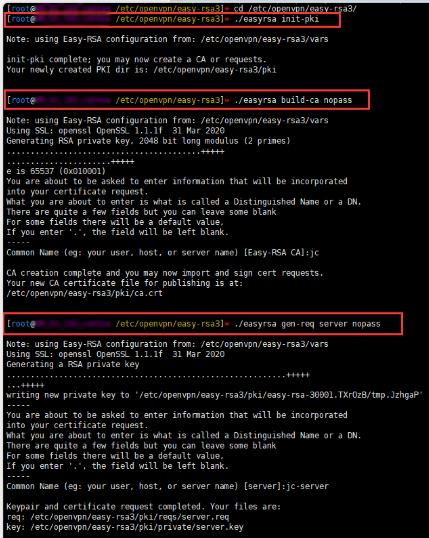

## 目的

OpenVPN是一个开源的应用程序，它允许您通过公共互联网创建一个安全的专用网络。OpenVPN实现一个虚拟专用网（VPN）来创建一个安全连接。OpenVPN使用OpenSSL库提供加密，它提供了几种身份验证机制，如基于证书的、预共享密钥和用户名/密码身份验证。本文详细介绍了OpenVPN搭建过程，并利用pam_sqlite3插件实现用户认证；通过openvpn_web进行用户管理与日志系统。


## **环境**

服务端：CentOS7.x

客户端：Windows10

<!--more-->


## 服务端安装

### 安装openvpn

```bash
#临时关闭selinux
setenforce 0
#配置文件永久关闭 修改/etc/selinux/config 文件
SELINUX=disabled

#添加epel yum源
wget -O /etc/yum.repos.d/epel-7.repo http://mirrors.aliyun.com/repo/epel-7.repo

#yum安装包
yum install openvpn -y
```

### **配置EasyRSA**

```bash
#下载EasyRSA 3.0.7
cd /opt/
wget https://github.com/OpenVPN/easy-rsa/releases/download/v3.0.7/EasyRSA-3.0.7.tgz
tar xf EasyRSA-3.0.7.tgz
cp -r easyRSA-3.0.7/ /etc/openvpn/easy-rsa3
cp /etc/openvpn/easy-rsa3/vars.example /etc/openvpn/easy-rsa3/vars
```

### **创建相关证书和秘钥**

```bash
cd /etc/openvpn/easy-rsa3/

#初始化目录
./easyrsa init-pki

#创建根证书
#nopass 参数表示不加密；也可以不加此参数，那就需要输入密码短语
./easyrsa build-ca nopass

#创建服务端秘钥
./easyrsa gen-req server nopass
```



```bash
#给服务端证书签名，这里要输入yes才能完成
./easyrsa sign-req server server

##创建客户端秘钥
./easyrsa gen-req client nopass
```


```bash
#给客户端证书签名，这里要输入yes才能完成
./easyrsa sign-req client client
```


```bash
#创建Diffie-Hellman
./easyrsa gen-dh

#创建TLS认证密钥
openvpn --genkey --secret /etc/openvpn/ta.key
```


### **拷贝证书到目录**

```bash
#目录自定义，配置文件中要用到
/etc/openvpn/easy-rsa3/pki/
cp ca.crt dh.pem /etc/openvpn/
cp private/server.key issued/server.crt /etc/openvpn/server/
cp private/client.key issued/client.crt /etc/openvpn/client/
```

### **编辑配置文件**

```bash
cd /etc/openvpn/

cp /usr/share/doc/openvpn-2.4.8/sample/sample-config-files/server.conf ./

vim server.conf

#监听本机ip地址
local 0.0.0.0
#监控本机端口号
port 1194
#指定采用的传输协议，可以选择tcp或udp
proto tcp
#指定创建的通信隧道类型，可选tun或tap
dev tun
#指定CA证书的文件路径
ca /etc/openvpn/ca.crt
#指定服务器端的证书文件路径
cert /etc/openvpn/server/server.crt
#指定服务器端的私钥文件路径
key /etc/openvpn/server/server.key
#指定迪菲赫尔曼参数的文件路径
dh /etc/openvpn/dh.pem
#指定虚拟局域网占用的IP地址段和子网掩码，此处配置的服务器自身占用.1的ip地址
server 10.8.0.0 255.255.255.0
#服务器自动给客户端分配IP后，客户端下次连接时，仍然采用上次的IP地址(第一次分配的IP保存在ipp.txt中，下一次分配其中保存的IP)。
ifconfig-pool-persist ipp.txt
#自动推送客户端上的网关及DHCP
push "redirect-gateway def1 bypass-dhcp"
#OpenVPN的DHCP功能为客户端提供指定的 DNS、WINS 等
push "dhcp-option DNS 114.114.114.114"
#允许客户端与客户端相连接，默认情况下客户端只能与服务器相连接
client-to-client
#每10秒ping一次，连接超时时间设为120秒
keepalive 10 120
#开启TLS-auth，使用ta.key防御攻击。服务器端的第二个参数值为0，客户端的为1。
tls-auth /etc/openvpn/ta.key 0
#加密认证算法
cipher AES-256-CBC
auth SHA512
tls-version-min 1.2
tls-cipher TLS-DHE-RSA-WITH-AES-256-GCM-SHA384:TLS-DHE-RSA-WITH-AES-128-GCM-SHA256:TLS-DHE-RSA-WITH-AES-256-CBC-SHA:TLS-DHE-RSA-WITH-CAMELLIA-256-CBC-SHA:TLS-DHE-RSA-WITH-AES-128-CBC-SHA:TLS-DHE-RSA-WITH-CAMELLIA-128-CBC-SHA
#使用lzo压缩的通讯,服务端和客户端都必须配置
comp-lzo
compress "lz4"
#最大连接用户
max-clients 100 
#定义运行的用户和组
user openvpn
group openvpn
#重启时仍保留一些状态
persist-key
persist-tun
#输出短日志,每分钟刷新一次,以显示当前的客户端
status /var/log/openvpn-status.log
#日志保存路径
log         /var/log/openvpn.log
log-append  /var/log/openvpn.log
#指定日志文件的记录详细级别，可选0-9，等级越高日志内容越详细
verb 4
#相同信息的数量，如果连续出现 20 条相同的信息，将不记录到日志中
mute 20
```

### **配置系统转发和开放端口，云服务器记得安全组要开放对应端口**

```shell
#修改文件目录权限
chown root.openvpn /etc/openvpn/* -R

#/etc/sysctl.conf 配置文件中添加
net.ipv4.ip_forward=1

#生效
sysctl -p 

#iptables
iptables -t nat -A POSTROUTING -s 10.8.0.0/24 -o eth0 -j MASQUERADE
iptables -I INPUT -p tcp --dport 1194 -j ACCEPT

#保存规则并重启
service iptables save
systemctl restart iptables
```

### **启动openvpn服务**

```bash
#启动openvpn服务
systemctl start openvpn@server

#确认服务进程是否存在
netstat -nap|grep openvpn
ps -ef|grep openvpn
```


## **win10客户端连接测试**

### **下载客户端:**

 [openvpn-install-2.4.8-I602-Win10.exe](https://ossjc-1252545319.cos.ap-shanghai.myqcloud.com/other/Software/openvpn/openvpn-install-2.4.8-I602-Win10.exe)

### **证书配置**

把ca.crt、client.crt、client.key、ta.key 4个文件放到软件安装目录下\OpenVPN\config

### 编辑配置文件

新建文件client.ovpn,把下面的参数粘贴到里面

```bash
#客户端配置文件
client
dev tun
proto tcp
remote 你的服务器ip/域名 1194
resolv-retry infinite
nobind
persist-key
persist-tun
ca ca.crt
cert client.crt
key client.key
ns-cert-type server
tls-auth ta.key 1
cipher AES-256-CBC
auth SHA512
tls-version-min 1.2
tls-cipher TLS-DHE-RSA-WITH-AES-256-GCM-SHA384:TLS-DHE-RSA-WITH-AES-128-GCM-SHA256:TLS-DHE-RSA-WITH-AES-256-CBC-SHA:TLS-DHE-RSA-WITH-CAMELLIA-256-CBC-SHA:TLS-DHE-RSA-WITH-AES-128-CBC-SHA:TLS-DHE-RSA-WITH-CAMELLIA-128-CBC-SHA
auth-nocache
verb 4
comp-lzo
compress "lz4"
```

### **启动OpenVPN GUI软件**


### **连通性和上网测试**


## 密码认证

**基于证书的认证方式已经完成了，但是有些老铁想要用用户名和密码来认证，那要怎么做呢？下面介绍基于用户密码的认证方式**

**在证书认证的基础上修改openvpn配置**

### **修改服务端 server.conf配置文件**

```shell
#添加几个参数
#客户端不进行证书认证，如果不加将实现证书和用户密码双重认证
client-cert-not-required

#用户和密码验证脚本
auth-user-pass-verify /etc/openvpn/checkpsw.sh via-env

#使用用户名密码登录认证
username-as-common-name

#脚本安全级别
script-security 3
```

### **创建脚本和用户密码文件**

```bash
#脚本
vim /etc/openvpn/checkpsw.sh

#!/bin/bash
#############################################
# checkpsw.sh (C) 2004 Mathias Sundman <mathias@openvpn.se>
#
# This script will authenticate OpenVPN users against
# a plain text file. The passfile should simply contain
# one row per user with the username first followed by
# one or more space(s) or tab(s) and then the password.

PASSFILE="/etc/openvpn/psw-file"
LOG_FILE="/var/log/openvpn-password.log"
TIME_STAMP=`date "+%Y-%m-%d %T"`

#############################################

if [ ! -r "${PASSFILE}" ]; then
    echo "${TIME_STAMP}: Could not open password file \"${PASSFILE}\" for reading." >>  ${LOG_FILE}
    exit 1
fi

CORRECT_PASSWORD=`awk '!/^;/&&!/^#/&&$1=="'${username}'"{print $2;exit}' ${PASSFILE}`
if [ "${CORRECT_PASSWORD}" = "" ]; then
    echo "${TIME_STAMP}: User does not exist: username=\"${username}\", password=\"${password}\"." >> ${LOG_FILE}
    exit 1
fi

if [ "${password}" = "${CORRECT_PASSWORD}" ]; then
    echo "${TIME_STAMP}: Successful authentication: username=\"${username}\"." >> ${LOG_FILE}
    exit 0
fi

echo "${TIME_STAMP}: Incorrect password: username=\"${username}\", password=\"${password}\"." >> ${LOG_FILE}
exit 1

#增加执行权限
chmod +x /etc/openvpn/checkpsw.sh

#用户密码文件，格式：一行对应一个用户
vim psw-file
wandou  123456
duoduo  456789

#修改权限
chmod 777 psw-file
chown root.openvpn /etc/openvpn/* -R

#重启openvpn服务
systemctl restart openvpn@server
```

### **win10 客户端配置文件修改**

```bash
#注释掉
;cert client.crt
;key client.key

#添加上
auth-user-pass
```


## 管理界面安装

### 下载pam_sqlite3并安装

```shell
git clone https://gitee.com/lang13002/pam_sqlite3.git
cd pam_sqlite3
make && make install
```

### 添加pam认证文件

```shell
# vim /etc/pam.d/openvpn

auth        required    pam_sqlite3.so db=/etc/openvpn/openvpn.db table=t_user user=username passwd=password expire=expire crypt=1
account     required    pam_sqlite3.so db=/etc/openvpn/openvpn.db table=t_user user=username passwd=password expire=expire crypt=1
```

### 创建sqlite3数据库文件

```shell
# sqlite3 /etc/openvpn/openvpn.db

sqlite> create table t_user (
     username text not null, 
     password text not null, 
     active int, 
     expire text
);
sqlite> .quit
```

### 在服务端配置添加认证插件

**生成插件**

因为用yum安装默认是没有插件的，所以需要用源码先生成插件。有了这个插件openvpn才能用数据库来管理

```bash
# 安装依赖组件，如果不安装会报错
yum install lzo-devel
# 下载源码包
wget https://files01.tchspt.com/temp/openvpn-2.4.9.tar.gz
# 解压
tar -xzvf openvpn-2.4.9.tar.gz
# 插件生成
cd openvpn-2.4.9
./configure 
cd src/plugins/auth-pam/
make -j4
cd .libs/
cp openvpn-plugin-auth-pam.so /etc/openvpn/
```

在openvpn的服务器配置中添加下面配置

```
verify-client-cert none
username-as-common-name
plugin /etc/openvpn/openvpn-plugin-auth-pam.so openvpn
```

### 安装依赖

```bash
pip2 install peewee tornado==5.1.1
```

### 下载openvpn-web

```bash
git clone https://gitee.com/lang13002/openvpn_web.git
```

### 创建相应的数据库表

```bash
# sqlite3 /etc/openvpn/openvpn.db
sqlite> .read openvpn_web/model/openvpn.sql
```

### OpenVPN运行脚本写日志

 服务端配置添加运行脚本   

```bash
script-security 2
client-connect /etc/openvpn/server/connect.py
client-disconnect /etc/openvpn/server/disconnect.py
```

connect.py

```python
#!/usr/bin/python

import os
import time
import sqlite3

username = os.environ['common_name']
trusted_ip = os.environ['trusted_ip']
trusted_port = os.environ['trusted_port']
local = os.environ['ifconfig_local']
remote = os.environ['ifconfig_pool_remote_ip']
timeunix= os.environ['time_unix']

logintime = time.strftime("%Y-%m-%d %H:%M:%S", time.localtime(time.time()))

conn = sqlite3.connect("/etc/openvpn/openvpn.db")
cursor = conn.cursor()
query = "insert into t_logs(username, timeunix, trusted_ip, trusted_port, local, remote, logintime) values('%s','%s', '%s', '%s', '%s', '%s', '%s')" %  (username, timeunix, trusted_ip, trusted_port, local, remote, logintime)
cursor.execute(query)
conn.commit()
conn.close()
```

disconnect.py

```python
#!/usr/bin/python

import os
import time
import sqlite3

username = os.environ['common_name']
trusted_ip = os.environ['trusted_ip']
received = os.environ['bytes_received']
sent = os.environ['bytes_sent']

logouttime = time.strftime("%Y-%m-%d %H:%M:%S", time.localtime(time.time()))

conn = sqlite3.connect("/etc/openvpn/openvpn.db")
cursor = conn.cursor()
query = "update t_logs set logouttime='%s', received='%s', sent= '%s' where username = '%s' and trusted_ip = '%s'" %  (logouttime, received, sent, username, trusted_ip)
cursor.execute(query)
conn.commit()
conn.close()
```

### 启动服务

```bash
python myapp.py
```

### 管理界面


