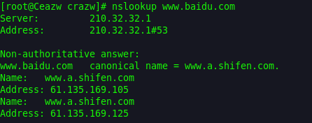
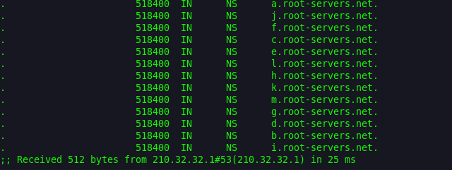
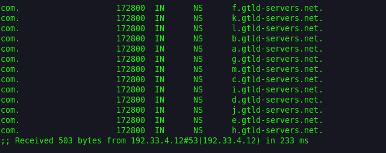
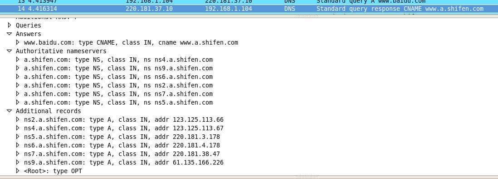

##  目的

本文详细介绍了dns的解析过程，以及对解析过程中所涉及的名词进行说明。

<!--more-->

## 根域

就是所谓的“.”，其实我们的网址www.baidu.com在配置当中应该是www.baidu.com.（最后有一点），一般我们在浏览器里输入时会省略后面的点，而这也已经成为了习惯。

根域服务器我们知道有13台，但是这是错误的观点。

根域服务器只是具有13个IP地址，但机器数量却不是13台，因为这些IP地址借助了[任播](https://zh.wikipedia.org/zh/任播)的技术，所以我们可以在全球设立这些IP的镜像站点，你访问到的这个IP并不是唯一的那台主机。

具体的镜像分布可以参考[维基百科](https://zh.wikipedia.org/wiki/根域名服務器)。这些主机的内容都是一样的

## 域的划分

根域下来就是顶级域或者叫一级域，

有两种划分方式，一种互联网刚兴起时的按照行业性质划分的com.，net.等，一种是按国家划分的如cn.，jp.，等。

具体多少你可以自己去查，我们这里不关心。

每个域都会有域名服务器，也叫权威域名服务器。

Baidu.com就是一个顶级域名，而www.baidu.com却不是顶级域名，他是在baidu.com 这个域里的一叫做www的主机。

一级域之后还有二级域，三级域，只要我买了一个顶级域，并且我搭建了自己BIND服务器（或者其他软件搭建的）注册到互联网中，那么我就可以随意在前面多加几个域了（当然长度是有限制的）。

比如a.www.baidu.com，在这个网址中，www.baidu.com变成了一个二级域而不是一台主机，主机名是a。

## 域名服务器

能提供域名解析的服务器，上面的记录类型可以是A(address)记录，NS记录（name server），MX（mail），CNAME等。

A记录是什么意思呢，就是记录一个IP地址和一个主机名字，比如我这个域名服务器所在的域test.baidu.com，我们知道这是一个二级的域名，然后我在里面有一条A记录,记录了主机为a的IP，查到了就返回给你了。

如果我现在要想baidu.com这个域名服务器查询a.test.baidu.com，那么这个顶级域名服务器就会发现你请求的这个网址在 test.baidu.com这个域中，我这里记录了这个二级域的域名服务器test.baidu.com的NS的IP。我返回给你这个地址你再去查主机 为a的主机把。

这些域内的域名服务器都称为权威服务器，直接提供DNS查询服务。（这些服务器可不会做递归哦）

## 解析过程

那么我们的DNS是怎么解析一个域名的呢？

1. 现在我有一台计算机，通过ISP接入了互联网，那么ISP就会给我分配一个DNS服务器，**这个DNS服务器不是权威服务器**，而是相当于一个代理的dns解析服务器，他会帮你迭代权威服务器返回的应答，然后把最终查到IP返回给你。

2. 现在的我计算机要向这台ISPDNS发起请求查询www.baidu.com这个域名了，(经网友提醒：这里其实准确来说不是ISPDNS，而应该是用户自己电脑网络设置里的DNS，并不一定是ISPDNS。比如也有可能你手工设置了8.8.8.8)

3. ISPDNS拿到请求后，先检查一下自己的缓存中有没有这个地址，有的话就直接返回。这个时候拿到的ip地址，会被标记为**非权威服务器的应答**。

4. 如果缓存中没有的话，ISPDNS会从**配置文件**里面读取13个根域名服务器的地址（这些地址是不变的，直接在BIND的配置文件中），

5. 然后像其中一台发起请求。

6. 根服务器拿到这个请求后，知道他是com.这个顶级域名下的，所以就会返回com域中的NS记录，一般来说是13台主机名和IP。

7. 然后ISPDNS向其中一台再次发起请求，com域的服务器发现你这请求是baidu.com这个域的，我一查发现了这个域的NS，那我就返回给你，你再去查。

（目前百度有4台baidu.com的顶级域名服务器）。

8. ISPDNS不厌其烦的再次向baidu.com这个域的权威服务器发起请求，baidu.com收到之后，查了下有www的这台主机，就把这个IP返回给你了，

9. 然后ISPDNS拿到了之后，将其返回给了客户端，并且把这个保存在高速缓存中。

## 验证

下面我们来用 nslookup 这个工具详细来说一下解析步骤：

从上图我们可以看到:

第一行Server是：DNS服务器的主机名--210.32.32.1

第二行Address是： 它的IP地址--210.32.32.1#53

下面的Name是：解析的URL--    www.jsjzx.com

Address是：解析出来的IP--112.121.162.168

但是也有像百度这样的DNS比较复杂的解析:

你会发现百度有一个cname = www.a.shifen.com  的别名。

这是怎么一个过程呢？

我们用dig工具来跟踪一下把（linux系统自带有）

Dig工具会在本地计算机做迭代，然后记录查询的过程。

第一步：是向我这台机器的ISPDNS获取到根域服务区的13个IP和主机名[b-j].root-servers.net.。

第二步：是向其中的一台根域服务器（Servername就是末行小括号里面的）发送www.baidu.com的查询请求，他返回了com.顶级域的服务器IP（未显示）和名称，

第三步：便向com.域的一台服务器192.33.4.12请求,www.baidu.com，他返回了baidu.com域的服务器IP（未显示）和名称，百度有四台顶级域的服务器

​     【此处可以用dig @192.33.4.12 www.baidu.com查看返回的百度顶级域名服务器IP地址】。

第四步：向百度的顶级域服务器（202.108.22.220）请求www.baidu.com，他发现这个www有个别名，而不是一台主机，别名是www.a.shifen.com。

按照一般的逻辑，当dns请求到别名的时候，查询会终止，而是重新发起查询别名的请求，所以此处应该返回的是www.a.shifen.com而已。

但是为什么返回a.shifen.com的这个域的NS呢？

我们可以尝试下面的这个命令：dig +trace  shifen.com 看看有什么结果。。。。。。。。

你会发现第三步时shifen.com这个顶级域的域名服务器和baidu.com这个域的域名服务器是同一台主机（即：dns.baidu.com）！

当我拿到www.baidu.com的别名www.a.shifen.com的时候，我本来需要重新到com域查找shifen.com域的NS，但是因为这两个域在同一台NS上，所以直接向本机发起了，

shifen.com域发现请求的www.a.shifen.com是属于a.shifen.com这个域的，

于是就把a.shifen.com的这个NS和IP返回，让我到a.shifen.com这个域的域名服务器上查询www.a.shifen.com。

于是我便从ns X .a.shifen.com中一台拿到了一条A记录，最终的最终也便是www.baidu.com的IP地址了.【此处也可以用dig +trace www.a.shifen.com】跟踪一下

用一个图来说明一下(图中第三步的全世界只有13台是错误的)

以下内容为在虚拟机中搭建local dns服务器得到的实验数据，纠正上述结论

在上面的分析中，我们用dig工具进行了追踪，但是dig没有继续追踪当我们从baidu.com拿到cname和ns2.a.shifen.com的IP之后的事情。

我们就所以然的下结论认为local dns会向ns2.a.shifen.com请求www.a.shifenc.om。

其实这个想法是错误，在自己的本地搭建一个local dns，抓取整个解析过程中是所有包，看看就明白拉。

实际的结果是虽然dns.baidu.com返回了a.shifen.com域的服务器地址和IP，

但是local dns并不是直接向上述返回的IP请求www.a.shifen.com，而是再一次去请求com域，得到shifen.com域的服务器（也就是baidu.com的那四台），

然后又请求www.a.shifen.com，返回a.shifen.com的域的服务器，最后才是去请求www.a.shifen.com，

虽然上面已经返回了IP，但是实验的结果就是再走一遍shifen.com域的查询。

上图就是localdns在解析www.baidu.com的抓包全过程。蓝色那条就是在收到cname和响应的a.shifen.com的域名服务器IP地址之后，继续向com域请求shifen.com。

这个图充分说明了返回cname的同时也返回了ns2.a.shifen.com的IP。

## 总结

①本机向local dns请求www.baidu.com

②local dns向根域请求www.baidu.com，根域返回com.域的服务器IP

③向com.域请求www.baidu.com，com.域返回baidu.com域的服务器IP

④向baidu.com请求www.baidu.com，返回cname www.a.shifen.com和a.shifen.com域的服务器IP

⑤向root域请求www.a.shifen.com

⑥向com.域请求www.a.shife.com

⑦向shifen.com请求

⑧向a.shifen.com域请求

⑨拿到www.a.shifen.com的IP

 ⑩localdns返回本机www.baidu.com cname www.a.shifen.com 以及 www.a.shifen.com的IP