## 目的

本文通过在centos 7上Docker安装Wiki软件Confluence，并通过破解，让公司有一个稳定高效的文档平台。


<!--more-->

## 安装docker

### yum安装docker

```shell
yum update # 更新yum
yum install docker # yum安装docker`
```

### 开启镜像加速

由于国内网络问题拉取 Docker 镜像会十分缓慢，所以可以添加网易镜像地址：http://hub-mirror.c.163.com 加速。

```shell
vi /etc/docker/daemon.json
```

将其中的内容替换为如下，当然你可以添加其它镜像地址。

```json
{"registry-mirrors": ["http://hub-mirror.c.163.com"]}
```

### 启动docker

```shell
docker --version # 查看docker版本
service docker start # 启动docker
ps -ef | grep docker # 查看docker进程是否正常启动
```

## 安装数据库PostgreSQL

安装 PostgreSQL 所使用的镜像在：https://hub.docker.com/_/postgres/

### 安装PostgreSQL

```shell
docker run --name postgresdb -p 5432:5432 -e POSTGRES_PASSWORD=W**** -d postgres
```

注：

1. -p 5432:5432 选项是可选的，因为在后面启动Confluence容器的时候，postgresdb这个容器会以别名db连接到confluence容器，也就是说对confluence这个容器来说，可以通过db:5432的网络地址访问到postgresql服务，不需要在主机上开放5432端口。
2. W**** 是密码需要设置成你需要的密码

### 进入docker容器并创建confluence数据库

```shell
docker exec -it postgresdb bash # 进入docker容器
psql -U postgres 
\l
CREATE DATABASE confluence WITH OWNER postgres; 
\q
```

## 安装wiki Confluence

下文中使用的镜像 [https://hub.docker.com/r/cptactionhank/atlassian-confluence/ ](https://hub.docker.com/r/cptactionhank/atlassian-confluence/)

也可以使用 https://github.com/jgrodziski/docker-confluence/blob/master/Dockerfile 这个镜像他把PostgreSQL和 Confluence包含在一个image里面，参考：[http://blogs.atlassian.com/2013/11/docker-all-the-things-at-atlassian-automation-and-wiring/](http://blogs.atlassian.com/2013/11/docker-all-the-things-at-atlassian-automation-and-wiring/)

### 安装wiki Confluence

```shell
docker run -d --name confluence -p 8090:8090 --link postgresdb:db --user root:root cptactionhank /atlassian-confluence:latest
```

以上命令将在主机上开放8090端口，如果想使用80端口访问wiki请使用一下命令安装

```shell
docker run -d --name confluence -p 80:8090 --link postgresdb:db --user root:root cptactionhank /atlassian-confluence:latest
```

### 检查confluence是否启动

```shell
docker ps # 列出运行的容器
```

可以看到刚才安装的两个容器，启动 wiki confluence

```shell
docker start postgresdb # 启动数据库 
postgresdb
docker start confluence # 启动 Wiki confluence``docker 
ps # 列出运行的容器
```

可以看到 wiki confluence已经启动

### 浏览器访问 

http://ip/就可以看到Confluence的配置页面

## 破解Confluence

### 访问页面记录Server ID 

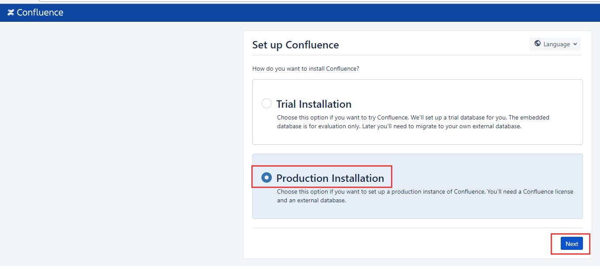

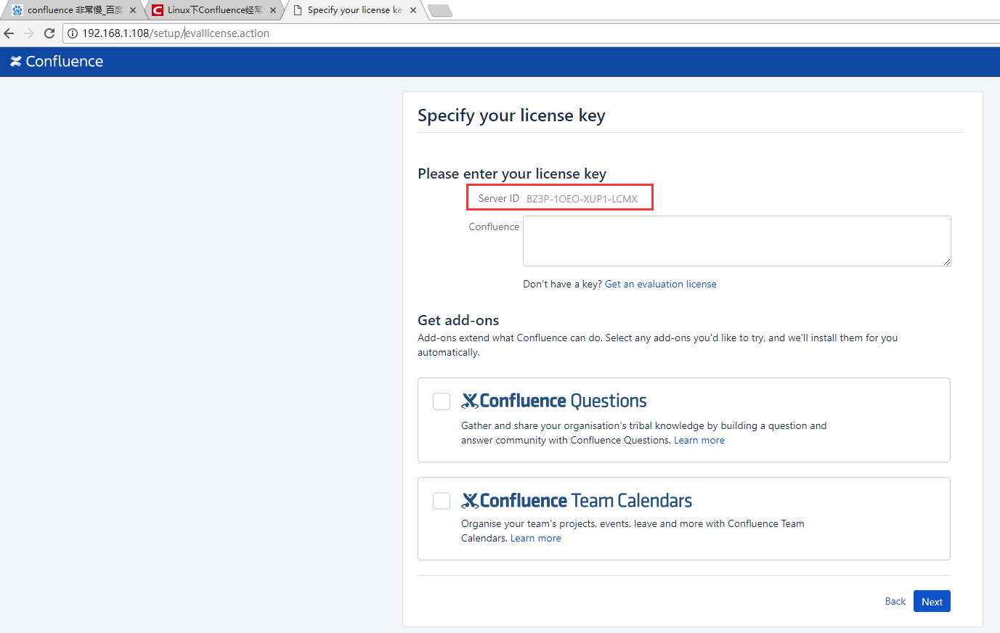

### 停止 confluence

```shell
docker stop confluence #停止 confluence 容器
```

### 进入confluence 容器, 查找decoder.jar文件

```shell
docker exec -it confluence /bin/bash # 进入docker容器 confluence
su - # 切换到root账户
find -name "*decoder*" # 查找名称中包括 decoder 的文件
```

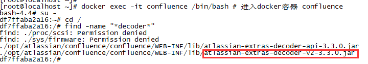

将decoder.jar文件从容器中复制出来，其中 “confluence:” 是Wiki confluence容器名称，atlassian-extras-decoder-v2-3.3.0.jar 是安装版本wiki的decode文件

```shell
docker cp  confluence:/opt/atlassian/confluence/confluence/WEB-INF/lib/atlassian-extras-decoder-v2-3.3.0.jar .
```

### 破解

1. 1. 下载 atlassian-extras-decoder-v2-3.3.0.jar 文件到windows上

   2. 将文件名改为 “atlassian-extras-2.4.jar” 破解工具只识别这个文件名

   3. 下载破解文件 [http://wiki.wuyijun.cn/download/attachments/2327034/51CTO%E4%B8%8B%E8%BD%BD-Confluence.zip](http://wiki.wuyijun.cn/download/attachments/2327034/51CTO下载-Confluence.zip)

   4. 解压缩此文件夹，dos命令行进入此文件夹，目录需根据你的实际情况修改 C:\Users\lrs\Desktop\wiki\51CTO下载-Confluence\confluence5.1-crack\confluence5.1-crack\iNViSiBLE

   5. 执行 java -jar confluence_keygen.jar 运行破解文件

   6. 填入 name ，server id 处输入步骤1中得到的id，点击 “gen” 生成key

      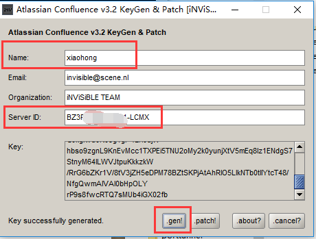

   7. 点击 patch，选择刚才改名为  “atlassian-extras-2.4.jar” 的jar包，显示 “jar success fully patched” 则破解成功

      注意：path前先删除atlassian-extras-2.4.bak文件否则path失败

      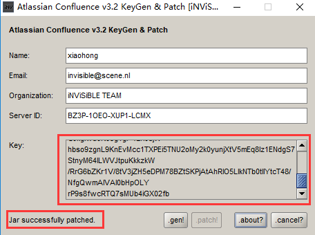

   8. 将 “atlassian-extras-2.4.jar” 文件名改回原来的 “atlassian-extras-decoder-v2-3.3.0.jar”

   9. 复制key中的内容备用

   10. 将 “atlassian-extras-decoder-v2-3.3.0.jar” 文件上传回服务器

### 将破解后的文件复制回 confluence 容器

```shell
docker cp atlassian-extras-decoder-v2-3.3.0.jar  confluence:/opt/atlassian/confluence/confluence/WEB-INF/lib/atlassian-extras-decoder-v2-3.3.0.jar
```

### 启动 confluence 容器

```shell
docker start confluence
```

### 再次访问页面

```shell
http://ip
```

## 平台配置

### 输入之前复制的key后点击下一步

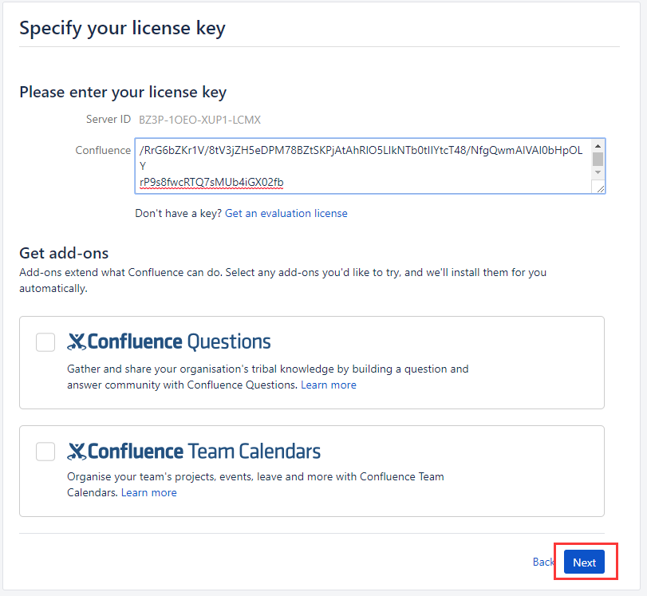

### 点击 ”My own database“ 后点击 next


### 输入数据库连接信息，用户名密码是之前创建数据库中的用户名和密码

注意：用户名为 postgres没有db

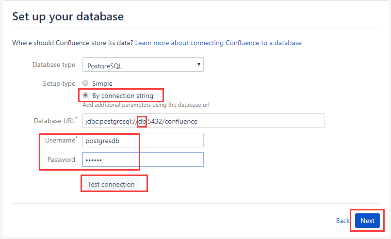

### 单击 ”Empty Site“

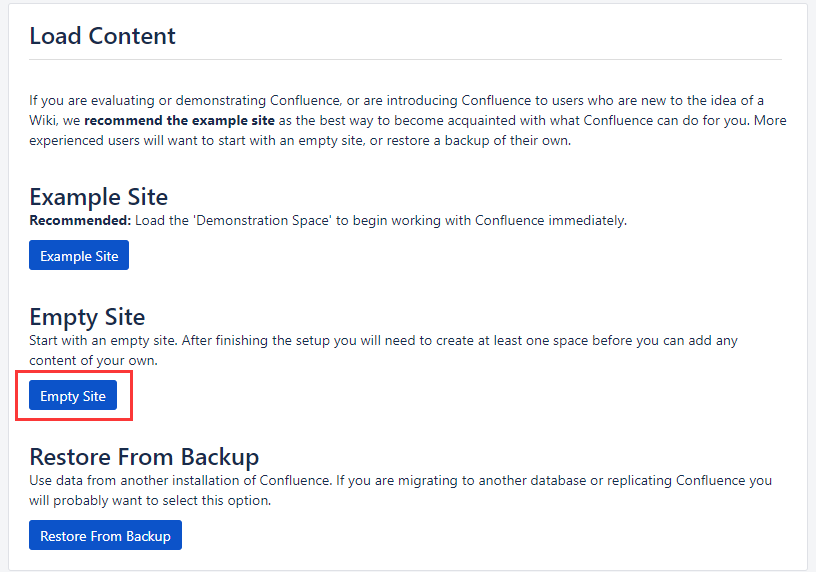

### 点击 “Manage users and groups within Confluence”

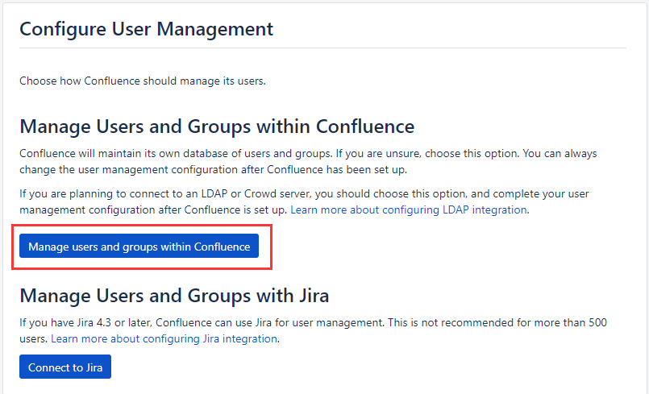

### 填入管理员信息后点击 “next”

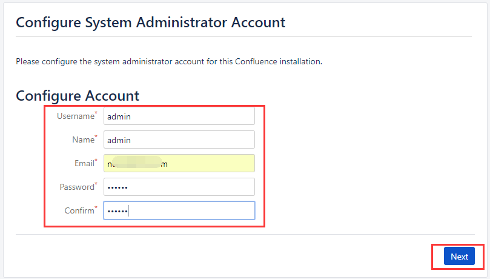

### 点击 ”start“

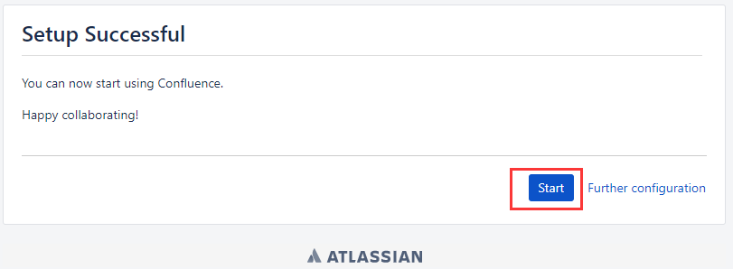

### 设置一些信息后就完成了

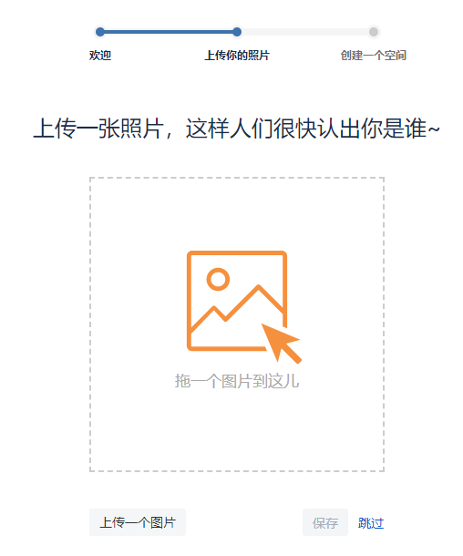

### 查看授权信息，使用管理员用户登录

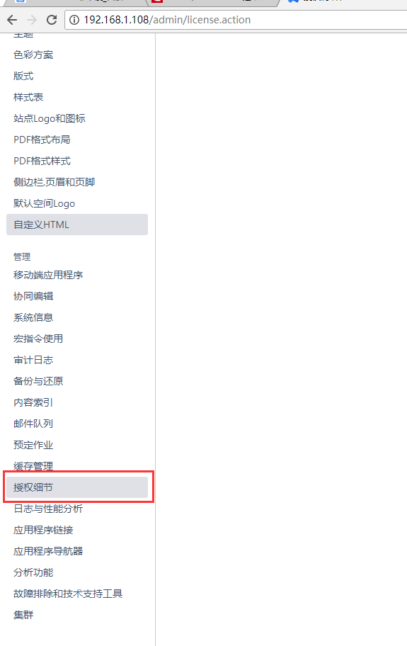

### 可以看到是评估版本，但过期时间是3千多个月后

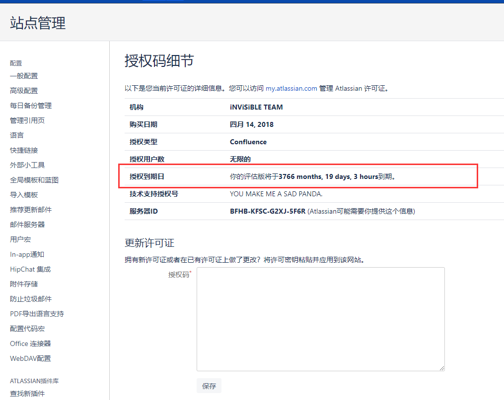

## 解决慢时长gc的问题

默认java配置为1G内存使用一段时间后回经常gc造成卡顿，单击“系统信息”可以看到jvm使用情况

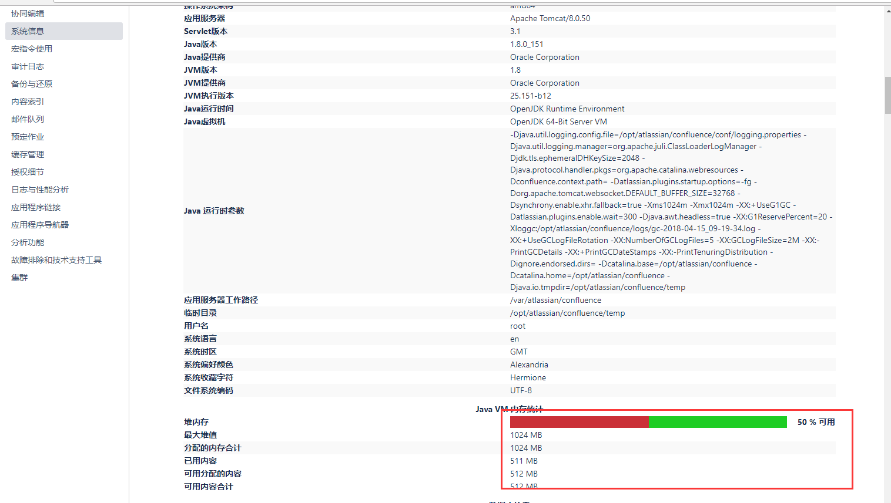

进入docker容器

```shell
docker exec -it confluence /bin/bash # 进入docker容器 confluence
```

修改java配置

```shell
vi /opt/atlassian/confluence/bin/catalina.sh
```

在 “cygwin=false” 上面添加如下内容，最大内存为2G

```shell
JAVA_OPTS="-Xms256m -Xmx2048m -XX:PermSize=128m -XX:MaxPermSize=512m"
或
CATALINA_OPTS="-Xms256m -Xmx2048m -XX:PermSize=128m -XX:MaxPermSize=512m"
```

重启 wiki confluence

```shell
docker stop confluence # 停止
docker start confluence # 启动`
```

这时候可以看到内存为 2G 可用为 73%

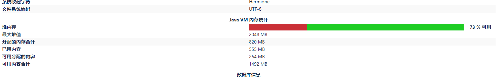