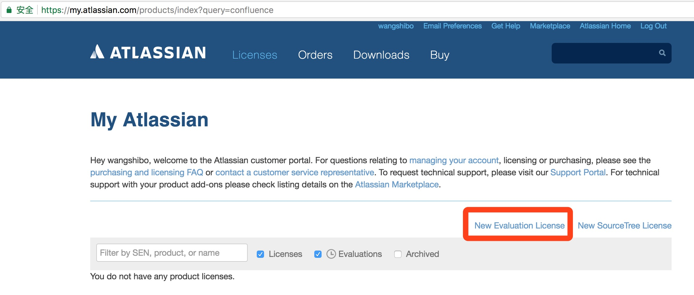

## 背景

confluence是一个专业的企业知识管理与协同软件，可以用于构建企业wiki。通过它可以实现团队成员之间的协作和知识共享。现在大多数公司都会部署一套confluence，用作内部wiki。现在confluence已收费，那么下面将介绍下Docker安装破解confluence的操作记录。

<!--more-->

## 环境版本

Docker ：17.12.0-ce

MySQL：5.7


## 安装MySQL

Docker安装MySQL详见https://my.oschina.net/u/2289161/blog/1647061


## 安装Confluence

下载镜像：https://hub.docker.com/r/cptactionhank/atlassian-confluence/

启动一个confluence容器

```shell
docker run -d --name confluence -p 8090:8090  --link mysql5.7:db --user root:root cptactionhank/atlassian-confluence:latest
```

可以用以下命令检查confluence是否启动

```shell
docker ps  
docker inspect confluence
```

访问[http://ip:8090/](http://host-to-server:8090/) 就可以看到Confluence的初始化和配置页面。


选择中文。


选择产品安装并点击下一步，继续安装。


**通过上图可以看出需要输入授权码，下面介绍下破解confluence授权码的操作。**


## **破解confluence**

下载破解confluence文件：

atlassian-universal-plugin-manager-plugin-2.22.jar

```shell
wget http://cdn-blog.oss-cn-beijing.aliyuncs.com/k2p-frp/atlassian-universal-plugin-manager-plugin-2.22.jar
```

atlassian-extras-decoder-v2-3.2.jar

```shell
wget http://cdn-blog.oss-cn-beijing.aliyuncs.com/k2p-frp/atlassian-extras-decoder-v2-3.2.jar
```

进入confluence容器命令：

```shell
docker exec -it confluence /bin/sh
```

用下载的文件替换atlassian-extras-decoder-v2-3.x.jar/atlassian-universal-plugin-manager-plugin-2.22.x.jar文件（该文件下载到`/opt``下，替换前必须做之前的文件备份，方便回退）`

```shell
#备份要替换的文件
mv /opt/atlassian/confluence/confluence/WEB-INF/lib/atlassian-extras-decoder-v2-3.3.0.jar   /mnt/
mv /opt/atlassian/confluence/confluence/WEB-INF/atlassian-bundled-plugins/atlassian-universal-plugin-manager-plugin-2.22.5.jar /mnt
```

备份好文件后，退出confluence容器。拷贝下载的文件到confluence容器中。

```shell
#将下载的破解文件替换对应的jar
docker cp atlassian-extras-decoder-v2-3.2.jar confluence:/opt/atlassian/confluence/confluence/WEB-INF/lib/
docker cp atlassian-universal-plugin-manager-plugin-2.22.jar  confluence:/opt/atlassian/confluence/confluence/WEB-INF/atlassian-bundled-plugins/
```

重新启动confluence容器。

然后继续访问[http://ip:8090](http://172.16.220.129:8090/)，接着注册confluence的key


下面的操作需要在翻墙的前提下进行，使用google邮箱注册。


 


 





**稍微等一会儿，就会自动弹出下面的信息，点击"Yes"**


再连接数据库时，需要修改数据库的隔离级别。操作详见：https://blog.csdn.net/taylor_tao/article/details/7063639


**下面说下confluence邮箱功能（不多赘述，直接看截图）：**

****

****

****

****

****

****

****


**有上面配置后，就已经配置好了confluence的邮件功能了。下面说下在管理员账号下创建或邀请其他用户的做法：**

****

**一般要禁止用户注册自己注册，要在管理员账号下创建新用户或邀请新用户（通过邮件的方式）**

****

**如下在管理员账号下"添加用户",添加后给用户设置一个初始密码，用户收到邮件后，可以登陆修改密码。**

****

****

**-----------------------------------------------------------------------------------------------------------**
**也可以通过"邀请用户"的方式来创建新用户，用户收到邮件后，按照邮件提示进行用户创建**

****

**-----------------------------------------------------------------------------------------------------------**
**邮件功能设置后，在分享文章的时候，可以以邮件的方式分享到用户的邮箱里。**


注意：在创建文章时 ，左边的页面或子页面的创建时，可以点击左下角的"空间管理"-"配置侧边栏"
**到此，confluence的安装破解已经完全搞定！后续再介绍下confluence跟jira接连、及其它们对接LDAP的做法！**