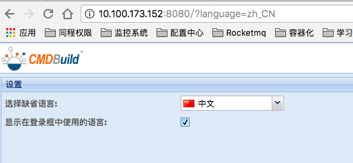
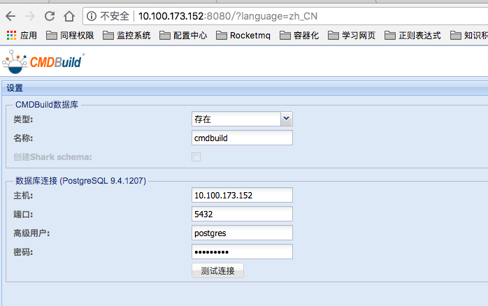
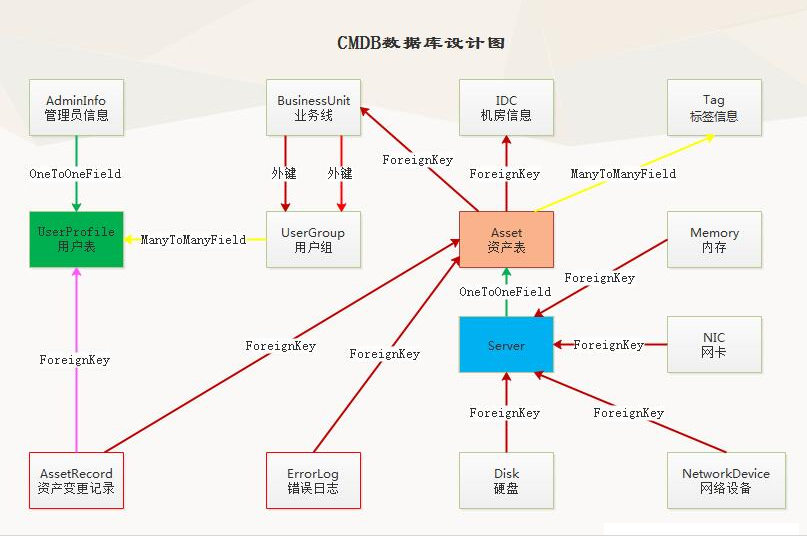

## 介绍

CMDB --Configuration Management Database 配置管理数据库, CMDB存储与管理企业IT架构中设备的各种配置信息，它与所有服务支持和服务交付流程都紧密相联，支持这些流程的运转、发挥配置信息的价值，同时依赖于相关流程保证数据的准确性。

CMDB，几乎是每个运维人都绕不过去的字眼，但又是很多运维人的痛，因为基本上所有的互联网公司都在搞，都在想着把尽可能多信息都收集汇总过来，然后实现自动化,智能化，但是CMDB很少有成功的，因此它也被称为运维人的耻辱。

我们运维人不要再为了KPI，绩效等东东重复造轮子，并且造出来的轮子只能自己用。我们运维人工作中共同的迫切需求点是什么呢？

1，中文的web页面即使丑点也可以接受。日常查看导入导出，新增等等操作方便，而且防止语言不通误操作。

2，数据库模型和业务逻辑是分离开的。只需要建业务逻辑字段就能自动映射为数据库模型。

3，动态实现表间关系。随着收集数据的完善，表与表之间关系越来越复杂，不要因后续业务需要，对表做出改动，而影响以前的关系和调用，可以动态扩展。想想一下，增加个关系字段，原来的代码都要改的酸爽。

4，自定义表。可以自定义根据业务需求建表和逻辑关系。

5，动态API接口。根据表逻辑改动API动态自动更改，弱化业务和数据关系的实现，并且能够和外部系统做联动，支持API接口调用，方便扩展和自动化。

以上需求是最迫切的，本人工作多年，自己用django写过cmdb系统，但到后来维护成本会越来越大，考察了国内外开源的软件，最终找到cmdbuild，基本上可以满足上面全部需求，下面就来介绍下用docker容器快速安装cmdbuild，因cmdbuild是国外的软件，所以国内文档很少。

<!--more-->

## 参考

[官方文档](http://www.cmdbuild.org/en/documentazione)


## 环境

镜像版本：
quentinv/cmdbuild:t7-2.1.4 
postgres     9.4


## 安装

### 环境调整

关闭防火墙

```shell
systemctl stop firewalld.service
```


### PostgreSQL的安装

cmdbuild数据存储是在PostgreSQL中的，生产环境建议建立PostgreSQL数据库集群，这里为单点。

```shell
#拉取最新镜像
docker pull postgres
#启动容器
docker run --name pgsql -p 5432:5432 -e POSTGRES_PASSWORD=sunxu123 -v /data/postgres:/var/lib/postgresql/data -d postgres:latest
```

如做迁移，需要导入数据。如新建可跳过这步。

```shell
#复制备份文件到容器中
docker cp ./cmdbuild_db_dump_2018-07-13.sql pgsql:/tmp/
# 进入容器后操作
docker exec -it pgsql /bin/bash
# 进Postgresql账号
su postgres
# 建库
createdb -O postgres cmdbuild
# 导数据
psql -U postgres -d cmdbuild < /tmp/cmdbuild_db_dump_2018-07-13.sql
# 退出容器
```

### Cmdbuild安装

```shell
#拉取镜像
docker pull quentinv/cmdbuild
#启动容器
docker run --name cmdbuild -p 8080:8080 -d quentinv/cmdbuild
```

## 配置使用

登录设置语言和配置PostgreSQL





完成后登录。因为登录时需要读取数据库中的用户数据，默认导入进去的用户名/密码:admin/123456


## 填坑

**PostgreSQL 数据导入和导出**

```sql
pg_dump -U root cmdbuild > cmdb_db_dump_2016-12-05.sql
pg_dump -U root cmdbuild < cmdb_db_dump_2016-12-06.sql
```

如果导入数据出错，需删除数据库，重新导入

```sql
#登录
psql -U user
#删除数据库
drop database cmdbuild
#创建数据库
create database cmdbuild
#导入
```

删除数据库时，删除失败，报错：

```
ERROR: database "mctest" is being accessed by other users  详细：There are 2 other sessions using the database.
```

```sql
#断开所有连这个数据库的连接
select pg_terminate_backend(pid) from  (select pid from pg_stat_activity where datname = '数据库名'  ) a;
#删除数据库
drop database db_name
```

## 科普

```sql
psql -U user -d dbname

切换数据库,相当于mysql的use dbname
\c dbname
列举数据库，相当于mysql的show databases
\l
列举表，相当于mysql的show tables
\dt
查看表结构，相当于desc tblname,show columns from tbname
\d tblname

\di 查看索引 

创建数据库： 
create database [数据库名]; 
删除数据库： 
drop database [数据库名];  
*重命名一个表： 
alter table [表名A] rename to [表名B]; 
*删除一个表： 
drop table [表名]; 

*在已有的表里添加字段： 
alter table [表名] add column [字段名] [类型]; 

删除表中的字段： 

alter table [表名] drop column [字段名]; 

修改数据库列属性

alter table 表名 alter 列名 type 类型名(350)

重命名一个字段：  
alter table [表名] rename column [字段名A] to [字段名B]; 

*给一个字段设置缺省值：  
alter table [表名] alter column [字段名] set default [新的默认值];
*去除缺省值：  
alter table [表名] alter column [字段名] drop default; 
在表中插入数据： 
insert into 表名 ([字段名m],[字段名n],......) values ([列m的值],[列n的值],......); 
修改表中的某行某列的数据： 
update [表名] set [目标字段名]=[目标值] where [该行特征]; 
删除表中某行数据： 
delete from [表名] where [该行特征]; 
delete from [表名];--删空整个表 
创建表： 
create table ([字段名1] [类型1] ;,[字段名2] [类型2],......<,primary key (字段名m,字段名n,...)>;); 

\copyright     显示 PostgreSQL 的使用和发行条款
\encoding [字元编码名称]
                 显示或设定用户端字元编码
\h [名称]      SQL 命令语法上的说明，用 * 显示全部命令
\prompt [文本] 名称
                 提示用户设定内部变数
\password [USERNAME]
                 securely change the password for a user
\q             退出 psql


导入整个数据库
psql -U postgres(用户名)  数据库名(缺省时同用户名) < /data/dum.sql

导出整个数据库
pg_dump -h localhost -U postgres(用户名) 数据库名(缺省时同用户名)   >/data/dum.sql

导出某个表
pg_dump -h localhost -U postgres(用户名) 数据库名(缺省时同用户名)  -t table(表名) >/data/dum.sql

压缩方法
一般用dump导出数据会比较大，推荐使用xz压缩
压缩方法  xz dum.sql 会生成 dum.sql.xz 的文件
xz压缩数据倒数数据库方法
xzcat /data/dum.sql.xz | psql -h localhost -U postgres(用户名) 数据库名(缺省时同用户名)
```

连接ldap

```shell
#进入cmdb容器
docker exec -it db9235d3b86c /bin/bash
#进入配置目录
cd  /usr/local/tomcat/webapps/ROOT/WEB-INF/conf
#修改配置
auth.conf

## Authentication method chain (the first match stops the auth chain)
#auth.methods=HeaderAuthenticator,CasAuthenticator,LdapAuthenticator,DBAuthenticator
auth.methods=LdapAuthenticator
#force.ws.password.digest=true
##
## HEADER
##
#header.attribute.name=username
##
## CAS
##
#cas.server.url=https://casserver/cas
#cas.login.page=/login
#cas.service.param=service
#cas.ticket.param=ticket
##
## LDAP
##
ldap.server.address=xxxxx // 测试ldap地址，请根据实际替换
ldap.server.port=389
ldap.use.ssl=false
ldap.basedn=dc=xx,dc=xx,dc=com
ldap.bind.attribute=cn
#ldap.search.filter=(&(objectClass=myclass1)(objectClass=myclass2))
##Accept only none (anonymous bind) and simple (simple bind)
#ldap.search.auth.method=none
##This section is only for simple bind
ldap.search.auth.method=simple
ldap.search.auth.principal=cn=admin,dc=xx,dc=xxx,dc=com
ldap.search.auth.password=******* // 密码
```

这里贴一张本人以前用django写cmdb系统时的数据库设计图，仅供参考：

