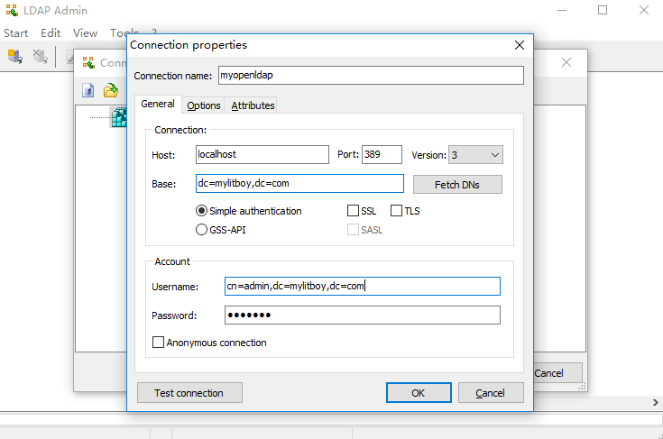
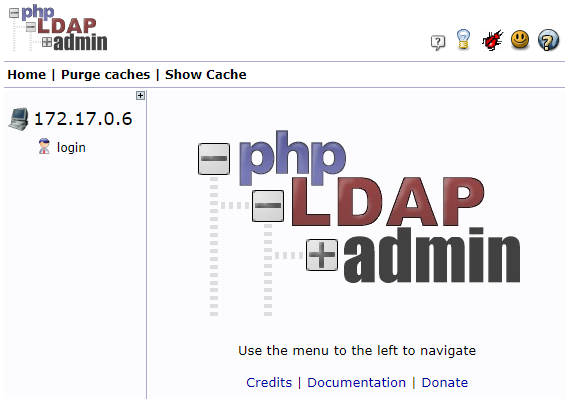
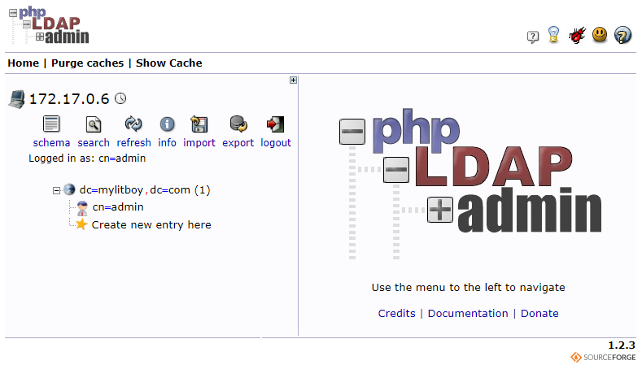

## 目的

互联网公司中，会开发很多平台系统，有开源的有自演的，但是每个平台或系统在用户认证方面都需要做，而且处于安全等因素考虑还必须做，统一的用户管理机制可以解决这一痛点。openldap就是这么一个工具。本文，通过docker快速搭建起来，让你体会到它的魅力。

<!--more-->

## 参考文档

[官网](http://www.openldap.org)

[镜像文档](https://github.com/osixia/docker-openldap)

<!--more-->

## 步骤

### **拉取镜像**

```
docker pull osixia/openldap
```

### **运行镜像**

```bash
#存放数据库
mkdir -p /data/openldap/ldap
#存放配置
mkdir -p /data/openldap/slapd.d

docker run -p 389:389 --name openldap -v /data/openldap/ldap:/var/lib/ldap -v /data/openldap/slapd.d:/etc/openldap/slapd.d --network bridge --hostname openldap-host --env LDAP_ORGANISATION="wandouduoduo" --env LDAP_DOMAIN="wandouduoduo.com" --env LDAP_ADMIN_PASSWORD="Sun123456" --detach osixia/openldap
```

配置LDAP域：`--env LDAP_DOMAIN="wandouduoduo.com"`

配置LDAP密码：`--env LDAP_ADMIN_PASSWORD="Sun123456"`

默认登录用户名：`admin`

## 客户端

### LDAP Admin客户端

Ldap Admin是一个用于LDAP目录管理的免费Windows LDAP客户端和管理工具。此应用程序允许您在LDAP服务器上浏览，搜索，修改，创建和删除对象。它还支持更复杂的操作，例如目录复制和在远程服务器之间移动，并扩展常用编辑功能以支持特定对象类型（例如组和帐户）。

支持系统：`Winndows&Linux`

[官网](http://www.ldapadmin.org/)

下载安装LDAP Admin客户端，新增连接如下：



连接成功即表明OpenLDAP安装成功。

### PHPLdapAdmin客户端

phpLDAPadmin（也称为PLA）是一个基于Web的LDAP客户端。它为LDAP服务器提供简单，随处可访问的多语言管理。

其分层树查看器和高级搜索功能使您可以直观地浏览和管理LDAP目录。由于它是一个Web应用程序，因此该LDAP浏览器可在许多平台上运行，使您可以从任何位置轻松管理LDAP服务器。

phpLDAPadmin是LDAP专业人员和新手的完美LDAP浏览器。其用户群主要由LDAP管理专业人员组成。


[官网](http://phpldapadmin.sourceforge.net/wiki/index.php/Main_Page)

### 使用docker 安装 PHPLdapAdmin

https://github.com/osixia/docker-phpLDAPadmin

```bash
docker run -d --privileged -p 10004:80 --name myphpldapadmin --env PHPLDAPADMIN_HTTPS=false --env PHPLDAPADMIN_LDAP_HOSTS=172.17.0.6 --detach osixia/phpldapadmin
```

配置的Ldap地址：`--env PHPLDAPADMIN_LDAP_HOSTS=172.17.0.6`

配置不开启HTTPS：`--env PHPLDAPADMIN_HTTPS=false`（默认是true）

如果开启HTTPS，需要配置443端口映射：`-p 8443:443`，并采用https访问

**通过访问http://localhost:10004 来管理，登陆界面**



**点击login进行登录**

**Login DN：**`cn=admin,dc=wandouduoduo,dc=com`

**Password：**`ldap123`

**登录成功后如下：**



## 总结

通过本文可以快速搭建和使用openldap, 但是默认openldap是没有打开memerof功能的，如有兴趣，请参考

[OpenLDAP启用MemberOf](https://wandouduoduo.github.io/articles/53f92c3c.html)

[ldapsearch用法](https://blog.csdn.net/Michaelwubo/article/details/80525284)

