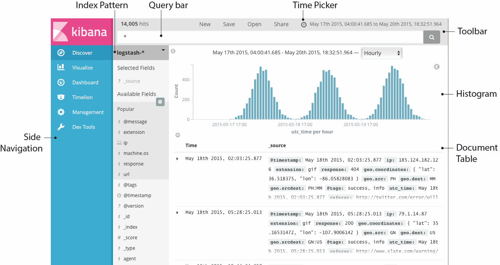
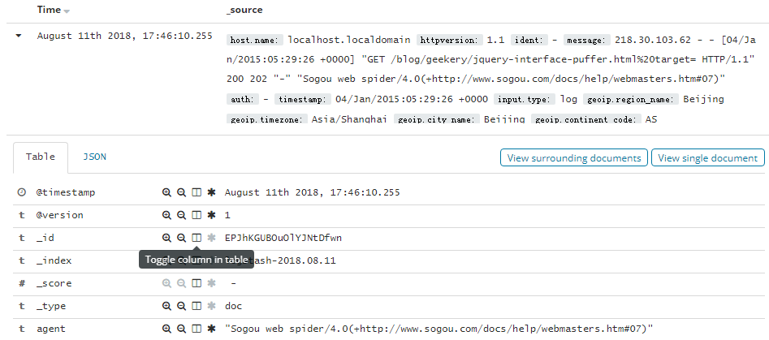
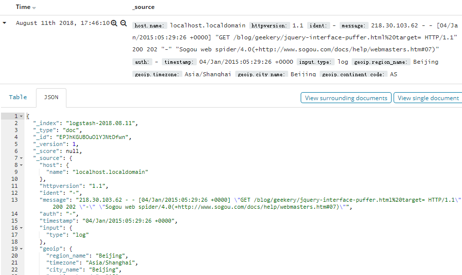
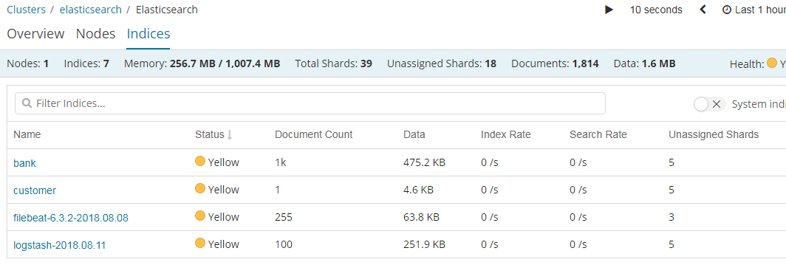

## 目的

为什么要做日志分析平台？

随着业务量的增长，每天业务服务器将会产生上亿条的日志，单个日志文件达几个GB，这时我们发现用Linux自带工具，cat grep awk 分析越来越力不从心了，而且除了服务器日志，还有程序报错日志，分布在不同的服务器，查阅繁琐。


**待解决的痛点:**

1、大量不同种类的日志成为了运维人员的负担，不方便管理;

2、单个日志文件巨大，无法使用常用的文本工具分析，检索困难;

3、日志分布在多台不同的服务器上，业务一旦出现故障，需要一台台查看日志。

为了解决以上困扰: 接下来我们要一步步构建这个日志分析平台，架构图如下:

<!--more-->

架构图的构建考虑：

1，考虑既能收集日志，又是轻量级的，所耗服务器资源和负载较低。选用filebeat

2,   考虑到高可用和日志数据的安全，加入缓存中间件集群。选用kafka和zookeeper

3,   在kafka集群前面加入logstash进行导入，是为了横向扩展kafka的broker。试想下，添加或减少kafka broker集群节点，需要每台机器上更改filebeat的配置，那就头疼了。

4，在kafka集群后面添加logstash转发层，是为了可以根据kafka集群topic的使用情况横向扩展，负载较高的topic可以适当增加logstash进行处理。

5，es集群负责存储，kibana前端展示和搜索。


## 架构图：


**架构解读 : （整个架构从左到右，总共分为5层）**


**第一层、数据采集层**

最左边的是业务服务器集群，上面安装了filebeat做日志采集，同时把采集的日志分别发送给两个logstash服务。


**第二层、数据处理层，数据缓存层**

logstash服务把接受到的日志经过格式处理，转存到本地的kafka broker+zookeeper 集群中。


**第三层、数据转发层**

这个单独的Logstash节点会实时去kafka broker集群拉数据，转发至ES DataNode。


**第四层、数据持久化存储**

ES DataNode 会把收到的数据，写磁盘，建索引库。


**第五层、数据检索，数据展示**

ES Master + Kibana 主要协调ES集群，处理数据检索请求，数据展示。


## 环境

操作系统环境 : CentOS 7.2


各服务器角色分配 :

3台服务器：

IP : 10.10.0.193

IP : 10.10.0.194

IP : 10.10.0.195

| **IP**                  | **角色**                      | **所属集群**       |
| ----------------------- | ----------------------------- | ------------------ |
| 10.10.0.193 10.10.0.194 | nginx+filebeat nginx+filebeat | 业务服务器集群     |
| 10.10.0.193             | Logstash+Kafka+ZooKeeper      | 缓存集群           |
| 10.10.0.194             | Logstash+Kafka+ZooKeeper      |                    |
| 10.10.0.195             | Kafka+ZooKeeper               |                    |
| 10.10.0.195             | Logstash                      | 数据转发           |
| 10.10.0.193             | ES DataNode                   | Elasticsearch 集群 |
| 10.10.0.194             | ES DataNode                   |                    |
| 10.10.0.195             | ES Master+Kibana              |                    |


## 软件包版本和下载网站:

jdk-8u161-linux-x64.rpm

node-v8.10.0-linux-x64.tar.xz

nginx-1.12.2.tar.gz

logstash-6.2.2.tar.gz

filebeat-6.2.2-x86_64.rpm

kafka_2.11-1.0.1.tgz

zookeeper-3.4.10.tar.gz

elasticsearch-6.2.2.tar.gz 

kibana-6.2.2-linux-x86_64.tar.gz


jdk下载：[http://www.oracle.com/technetwork/java/javase/downloads/jdk8-downloads-2133151.html](http://www.oracle.com/technetwork/java/javase/downloads/jdk8-downloads-2133151.html) 

nodejs下载：https://nodejs.org/en/download/

nginx下载：[http://nginx.org/en/download.html](http://nginx.org/en/download.html) 

filebeat,logstash,elasticsearch,kibana下载：https://www.elastic.co/cn/downloads 

kafka下载：[http://kafka.apache.org/downloads](http://kafka.apache.org/downloads) 

zookeeper下载：[http://zookeeper.apache.org/releases.html#download](http://zookeeper.apache.org/releases.html#download) 


## **安装部署Elasticsearch集群**

ES Master节点 10.10.0.195

### 安装jdk1.8，elasticsearch

```shell
# 安装命令
yum install jdk-8u161-linux-x64.rpm -y
# 创建es用户（从5.0后root不能启动被限制）
groupadd es 
useradd es 
passwd es
更改用户 es 的密码 。  
新的 密码：  
重新输入新的 密码：  
passwd： 所有的身份验证令牌已经成功更新
#解压包
tar -xzvf elasticsearch-6.2.2.tar.gz -C /opt/
mv /opt/elasticsearch-6.2.2  /opt/elasticsearch
#更改权限
chown -R es:es /opt/elasticsearch
```

验证jdk：


### **系统调优，JVM调优**

```shell
# 配置系统最大打开文件描述符数
vim /etc/sysctl.conf
vm.max_map_count=262144
#配置生效
sysctl -p
# 配置进程最大打开文件描述符
vim /etc/security/limits.conf
# End of file
* soft nofile 65536
* hard nofile 131072
* soft nproc 2048
* hard nproc 4096
#更改配置
vim /etc/security/limits.d/20-nproc.conf
*          soft    nproc     4096
root       soft    nproc     unlimited
```

### **编写ES Master节点配置文件**

```shell
vim /opt/elasticsearch/config/elasticsearch.yml
 
# ---------------------------------- Cluster -----------------------------------
# Use a descriptive name for your cluster:
 
cluster.name: sunelk
 
# ------------------------------------ Node ------------------------------------
node.name: node-195
node.master: true
node.data: false
node.ingest: false   
search.remote.connect: false
 
# ----------------------------------- Paths ------------------------------------
path.data: /home/es/elasticsearch/data/
path.logs: /home/es/elasticsearch/logs/
 
# ----------------------------------- Memory -----------------------------------
bootstrap.memory_lock: false
bootstrap.system_call_filter: false

#------------------------------------ Network And HTTP --------------------------
network.host: 0.0.0.0
http.port: 9200
  
# --------------------------------- Discovery ------------------------------------
discovery.zen.ping.unicast.hosts: ["10.10.0.193", "10.10.0.194","10.10.0.195"] 
discovery.zen.minimum_master_nodes: 2   

#下面两行配置为haad插件配置，三台服务器一致。      
http.cors.enabled: true                                                                                                                                                                                                   
http.cors.allow-origin: "*"
```

注: path.data、path.logs 这两个参数指定的路径，如果没有需要自己创建，还要赋予权限给es用户。（后面的ES DataNode也同样）

### **安装head开源插件**

从es6.x后要自己手动编译安装

```shell
#安装node
tar -xvf node-v8.10.0-linux-x64.tar.xz -C /opt/
mv /opt/node-v8.10.0-linux-x64 /opt/node
#更改环境变量
vim /etc/profile

export NODEJS_HOME=/opt/node
export PATH=$PATH:$NODEJS_HOME/bin

source /etc/profile
#下载源码
cd /opt/
git clone https://github.com/mobz/elasticsearch-head.git
chown -R es:es elasticsearch-head
su es 
cd  elasticsearch-head
npm install -g cnpm --registry=https://registry.npm.taobao.org
npm install -g grunt-cli
npm install
npm run start
open http://localhost:9100/
```

访问,检测插件是否安装成功

http://10.10.0.195:9100

**这时，ES Master已经配置好了。**

### 部署ES DataNode节点

ES DataNode节点 是10.10.0.193和10.10.0.194

安装和系统调优方法同上，插件不用安装，只是配置文件不同。

**编写配置文件**

```shell
vim /opt/elasticsearch/config/elasticsearch.yml
 
# ---------------------------------- Cluster -----------------------------------
# Use a descriptive name for your cluster:
 
cluster.name: sunelk
 
# ------------------------------------ Node ------------------------------------
node.name: node-193
node.master: true
node.data: true
node.ingest: false   
search.remote.connect: false
 
# ----------------------------------- Paths ------------------------------------
path.data: /home/es/elasticsearch/data/
path.logs: /home/es/elasticsearch/logs/
 
# ----------------------------------- Memory -----------------------------------
bootstrap.memory_lock: false
bootstrap.system_call_filter: false

#------------------------------------ Network And HTTP --------------------------
network.host: 0.0.0.0
http.port: 9200
  
# --------------------------------- Discovery ------------------------------------
discovery.zen.ping.unicast.hosts: ["10.10.0.193", "10.10.0.194","10.10.0.195"] 
discovery.zen.minimum_master_nodes: 2   

#下面两行配置为haad插件配置，三台服务器一致。      
http.cors.enabled: true                                                                                                                                                                                                   
http.cors.allow-origin: "*
```

**10.10.0.193 也准备好了,10.10.0.194和193配置一样，只需改下node.name**

### 启动服务

```shell
# 10.10.0.195
nohup /opt/elasticsearch/bin/elasticsearch &
# 10.10.0.193
nohup /opt/elasticsearch/bin/elasticsearch &
# 10.10.0.194
nohup /opt/elasticsearch/bin/elasticsearch &
```

### **访问head插件，查看集群状态**

**此时 Elasticsearch 集群已经准备完成**


## **配置ZooKeeper集群**


配置 10.10.0.193 节点

### **安装，配置 zookeeper**

```shell
# zookeeper 依赖 java，如果之前没安装过JDK，则需要安装.
rpm -ivh jdk-8u161-linux-x64.rpm
 
# 解压程序
tar -xzvf zookeeper-3.4.10.tar.gz  -C /opt/
mv /opt/zookeeper-3.4.10 /opt/zookeeper
```

### **编写配置文件**

```shell
vim /opt/zookeeper/conf/zoo.cfg

# The number of milliseconds of each tick
tickTime=2000
# The number of ticks that the initial 
# synchronization phase can take
initLimit=10
# The number of ticks that can pass between 
# sending a request and getting an acknowledgement
syncLimit=5
# the directory where the snapshot is stored.
# do not use /tmp for storage, /tmp here is just 
# example sakes.
dataDir=/tmp/zookeeper
# the port at which the clients will connect
clientPort=2181
# the maximum number of client connections.
# increase this if you need to handle more clients
#maxClientCnxns=60
#
# Be sure to read the maintenance section of the 
# administrator guide before turning on autopurge.
#
# http://zookeeper.apache.org/doc/current/zookeeperAdmin.html#sc_maintenance
#
# The number of snapshots to retain in dataDir
#autopurge.snapRetainCount=3
# Purge task interval in hours
# Set to "0" to disable auto purge feature
#autopurge.purgeInterval=1
server.1=10.10.0.193:2888:3888
server.2=10.10.0.194:2888:3888
server.3=10.10.0.195:2888:3888
```

**同步配置文件到其他两台节点**

注: zookeeper 集群，每个节点的配置文件都是一样的。所以直接同步过去，不需要做任何修改。

```shell
scp zoo.cfg 10.10.0.193:/opt/zookeeper/conf/
scp zoo.cfg 10.10.0.194:/opt/zookeeper/conf/
```

### **创建myid文件**

```shell
# 10.10.0.193
echo 1 >/tmp/zookeeper/myid
 
# 10.10.0.194
echo 2 >/tmp/zookeeper/myid
 
# 10.10.0.195
echo 3 >/tmp/zookeeper/myid
```

### **启动服务 & 查看节点状态**

```shell
# 10.10.0.193
/opt/zookeeper/bin/zkServer.sh start
/opt/zookeeper/bin/zkServer.sh status
 
ZooKeeper JMX enabled by default
Using config: /usr/local/zookeeper/zookeeper-3.4.9/bin/../conf/zoo.cfg
Mode: leader
 
# 10.10.0.194
/opt/zookeeper/bin/zkServer.sh start
/opt/zookeeper/bin/zkServer.sh status
  
ZooKeeper JMX enabled by default
Using config: /usr/local/zookeeper/zookeeper-3.4.9/bin/../conf/zoo.cfg
Mode: follower
 
# 10.10.0.195
/opt/zookeeper/bin/zkServer.sh start 
/opt/zookeeper/bin/zkServer.sh status
 
ZooKeeper JMX enabled by default
Using config: /usr/local/zookeeper/zookeeper-3.4.9/bin/../conf/zoo.cfg
Mode: follower
```

**此时zookeeper集群配置完成**


## **配置Kafka Broker集群**


Kafka官网: http://kafka.apache.org/


配置 10.10.0.193 节点

### **安装，配置 kafka**

```shell
# 解压程序
tar -xzvf kafka_2.11-1.0.1.tgz -C /opt/
mv /opt/kafka_2.11-1.0.1 /opt/kafka
```

### **编写配置文件**

```shell
vim /opt/kafka/conf/server.properties

############################# Server Basics #############################
broker.id=1
############################# Socket Server Settings #############################
num.network.threads=3
# The number of threads doing disk I/O
num.io.threads=8
# The send buffer (SO_SNDBUF) used by the socket server
socket.send.buffer.bytes=102400
# The receive buffer (SO_RCVBUF) used by the socket server
socket.receive.buffer.bytes=102400
# The maximum size of a request that the socket server will accept (protection against OOM)
socket.request.max.bytes=104857600
############################# Log Basics #############################
log.dirs=/opt/kafka/data
num.partitions=6
num.recovery.threads.per.data.dir=1
############################# Log Flush Policy #############################
# The number of messages to accept before forcing a flush of data to disk
#log.flush.interval.messages=10000
# The maximum amount of time a message can sit in a log before we force a flush
#log.flush.interval.ms=1000
############################# Log Retention Policy #############################
log.retention.hours=60
log.segment.bytes=1073741824
log.retention.check.interval.ms=300000
############################# Zookeeper #############################
zookeeper.connect=10.10.0.193:2181,10.10.0.194:2181,10.10.0.195:2181
zookeeper.connection.timeout.ms=6000
```

### **同步配置文件到其他两台节点**

```shell
scp server.properties 10.10.0.194:/opt/kafka/config/
scp server.properties 10.10.0.195:/opt/kafka/config/
 
# 修改 broker.id
# 10.10.0.194
broker.id=2
 
# 10.10.0.195
broker.id=3
```

**注: 其他两个节点的配置文件也基本相同，只有一个参数需要修改 broker.id 。 它用于唯一标识节点，所以绝对不能相同，不然会节点冲突。**


### **配置主机名对应IP的解析**

```shel
vim /etc/hosts
 
10.10.0.193 elk-01
10.10.0.194 elk-02
10.10.0.195 elk-03
 
# 记得同步到其他两台节点
```

### **启动服务** 

```shell
nohup /opt/kafka/bin/kafka-server-start.sh /opt/kafka/config/server.properties &
# 其他两台节点启动方式相同

在kafka中创建topic
/opt/kafka/bin/kafka-topics.sh --create --zookeeper localhost:2181 --replication-factor 1 --partitions 1 --topic nginxlog

#可以增加topic分区,当然也可在创建时把--partitions增大
/opt/kafka/bin/kafka-topics.sh --zookeeper localhost:2181  --alter --topic nginxlog --partitions 10
```

**Kafka+ZooKeeper集群配置完成**


## **配置位于架构图中第二层的Logstash服务**


配置 10.10.0.193节点

### **安装，配置 logstash**

```shell
# 解压程序
tar -xzvf logstash-6.2.2.tar.gz -C /opt/
mv /opt/logstash-6.2.2 /opt/logstash
```

### **编写配置文件**

```shell
vim /opt/logstash/config/logstash_in_kafka.conf

input {
    beats {
    port => 5044
    codec => "json"
    } 
}

output {
  kafka {
    bootstrap_servers => "10.10.0.193:9092,10.10.0.194:9092,10.10.0.195:9092"
    topic_id => "nginxlog"
    }  
 # stdout {codec => json}  调试时打开
}
```

### **启动服务**

```shell
nohup /opt/logstash/bin/logstash -f /opt/logstash/config/logstash_in_kafka.conf &
```

10.10.0.194 节点的这块配置，与上述完全相同。（略）

**位于第二层、数据处理层的 Logstash 配置完成**


## **配置数据采集层，业务服务器+Filebeat**


### **定制Nginx日志格式**

```
log_format json '{"@timestamp":"$time_iso8601",'
                 '"slbip":"$remote_addr",'
                 '"clientip":"$http_x_forwarded_for",'
                 '"serverip":"$server_addr",'
                 '"size":$body_bytes_sent,'
                 '"responsetime":$request_time,'
                 '"domain":"$host",'
                 '"method":"$request_method",'
                 '"requesturi":"$request_uri",'
                 '"url":"$uri",'
                 '"appversion":"$HTTP_APP_VERSION",'
                 '"referer":"$http_referer",'
                 '"agent":"$http_user_agent",'
                 '"status":"$status",'
                 '"devicecode":"$HTTP_HA"}';
                  
# 在虚拟主机配置中调用
access_log  /var/log/nginx/access.log json;
```


### **安装 Filebeat**

Filebeat 也是 Elasticsearch 公司的产品，在官网可以下载。

```shell
# rpm 包安装
yum install filebeat-6.2.2-x86_64.rpm -y
```


### **编写 Filebeat 配置文件**

```shell
vim  /etc/filebeat/filebeat.yml

###################### Filebeat Configuration Example #########################

# This file is an example configuration file highlighting only the most common
# options. The filebeat.reference.yml file from the same directory contains all the
# supported options with more comments. You can use it as a reference.
#
# You can find the full configuration reference here:
# https://www.elastic.co/guide/en/beats/filebeat/index.html

# For more available modules and options, please see the filebeat.reference.yml sample
# configuration file.

#=========================== Filebeat prospectors =============================

filebeat.prospectors:

# Each - is a prospector. Most options can be set at the prospector level, so
# you can use different prospectors for various configurations.
# Below are the prospector specific configurations.

- type: log

  # Change to true to enable this prospector configuration.
  enabled: true

  # Paths that should be crawled and fetched. Glob based paths.
  paths:
    - /var/log/nginx/access.log
    #- c:\programdata\elasticsearch\logs\*

  # Exclude lines. A list of regular expressions to match. It drops the lines that are
  # matching any regular expression from the list.
  #exclude_lines: ['^DBG']

  # Include lines. A list of regular expressions to match. It exports the lines that are
  # matching any regular expression from the list.
  #include_lines: ['^ERR', '^WARN']

  # Exclude files. A list of regular expressions to match. Filebeat drops the files that
  # are matching any regular expression from the list. By default, no files are dropped.
  #exclude_files: ['.gz$']

  # Optional additional fields. These fields can be freely picked
  # to add additional information to the crawled log files for filtering
  #fields:
  #  level: debug
  #  review: 1

  ### Multiline options

  # Mutiline can be used for log messages spanning multiple lines. This is common
  # for Java Stack Traces or C-Line Continuation

  # The regexp Pattern that has to be matched. The example pattern matches all lines starting with [
  #multiline.pattern: ^\[

  # Defines if the pattern set under pattern should be negated or not. Default is false.
  #multiline.negate: false

  # Match can be set to "after" or "before". It is used to define if lines should be append to a pattern
  # that was (not) matched before or after or as long as a pattern is not matched based on negate.
  # Note: After is the equivalent to previous and before is the equivalent to to next in Logstash
  #multiline.match: after


#============================= Filebeat modules ===============================

filebeat.config.modules:
  # Glob pattern for configuration loading
  path: ${path.config}/modules.d/*.yml

  # Set to true to enable config reloading
  reload.enabled: false

  # Period on which files under path should be checked for changes
  #reload.period: 10s

#==================== Elasticsearch template setting ==========================

setup.template.settings:
  index.number_of_shards: 3
  #index.codec: best_compression
  #_source.enabled: false

#================================ General =====================================

# The name of the shipper that publishes the network data. It can be used to group
# all the transactions sent by a single shipper in the web interface.
#name:

# The tags of the shipper are included in their own field with each
# transaction published.
#tags: ["service-X", "web-tier"]

# Optional fields that you can specify to add additional information to the
# output.
#fields:
#  env: staging


#============================== Dashboards =====================================
# These settings control loading the sample dashboards to the Kibana index. Loading
# the dashboards is disabled by default and can be enabled either by setting the
# options here, or by using the `-setup` CLI flag or the `setup` command.
#setup.dashboards.enabled: false

# The URL from where to download the dashboards archive. By default this URL
# has a value which is computed based on the Beat name and version. For released
# versions, this URL points to the dashboard archive on the artifacts.elastic.co
# website.
#setup.dashboards.url:

#============================== Kibana =====================================

# Starting with Beats version 6.0.0, the dashboards are loaded via the Kibana API.
# This requires a Kibana endpoint configuration.
setup.kibana:

  # Kibana Host
  # Scheme and port can be left out and will be set to the default (http and 5601)
  # In case you specify and additional path, the scheme is required: http://localhost:5601/path
  # IPv6 addresses should always be defined as: https://[2001:db8::1]:5601
  #host: "localhost:5601"

#============================= Elastic Cloud ==================================

# These settings simplify using filebeat with the Elastic Cloud (https://cloud.elastic.co/).

# The cloud.id setting overwrites the `output.elasticsearch.hosts` and
# `setup.kibana.host` options.
# You can find the `cloud.id` in the Elastic Cloud web UI.
#cloud.id:

# The cloud.auth setting overwrites the `output.elasticsearch.username` and
# `output.elasticsearch.password` settings. The format is `<user>:<pass>`.
#cloud.auth:

#================================ Outputs =====================================

# Configure what output to use when sending the data collected by the beat.
#output:
#  console:
#    pretty: true
#-------------------------- Elasticsearch output ------------------------------
#output.elasticsearch:
  # Array of hosts to connect to.
  #hosts: ["elk-01:9200"]

  # Optional protocol and basic auth credentials.
  #protocol: "https"
  #username: "elastic"
  #password: "changeme"

#----------------------------- Logstash output --------------------------------
output.logstash:
  # The Logstash hosts
  hosts: ["elk-01:5044"]

  # Optional SSL. By default is off.
  # List of root certificates for HTTPS server verifications
  #ssl.certificate_authorities: ["/etc/pki/root/ca.pem"]

  # Certificate for SSL client authentication
  #ssl.certificate: "/etc/pki/client/cert.pem"

  # Client Certificate Key
  #ssl.key: "/etc/pki/client/cert.key"

#================================ Logging =====================================

# Sets log level. The default log level is info.
# Available log levels are: error, warning, info, debug
#logging.level: debug

# At debug level, you can selectively enable logging only for some components.
# To enable all selectors use ["*"]. Examples of other selectors are "beat",
# "publish", "service".
#logging.selectors: ["*"]

#============================== Xpack Monitoring ===============================
# filebeat can export internal metrics to a central Elasticsearch monitoring
# cluster.  This requires xpack monitoring to be enabled in Elasticsearch.  The
# reporting is disabled by default.

# Set to true to enable the monitoring reporter.
#xpack.monitoring.enabled: false

# Uncomment to send the metrics to Elasticsearch. Most settings from the
# Elasticsearch output are accepted here as well. Any setting that is not set is
# automatically inherited from the Elasticsearch output configuration, so if you
# have the Elasticsearch output configured, you can simply uncomment the
# following line.
#xpack.monitoring.elasticsearch:

```

### **启动服务**

```shell
/etc/init.d/filebeat start
```

**数据采集层，Filebeat配置完成。**

现在业务服务器上的日志数据已经在源源不断的写入缓存了。


## **配置位于架构图中的第三层，数据转发层**


10.10.0.195    logstash 安装过程和193/194一样，参考上面步骤。

### **编写Logstash配置文件**

```shell
vim /opt/logstash/config/kafka_to_es.conf

input {
        kafka {
            bootstrap_servers => "10.10.0.193:9092,10.10.0.194:9092"
            auto_offset_reset => "latest"
            group_id => "logstash"
            consumer_threads => 3
            decorate_events => true
            topics => ["nginxlog"]
        }
}

filter {
         if [type] == "nginxlog" {
                mutate {
                remove_field =>
["slbip","kafka","domain","serverip","url","@version","offset","input_type","count","sourc
e","fields","beat.hostname","host","tags"]
                        } 
        }
}

output {
#       stdout {codec => json}
        elasticsearch {
            hosts => ["10.10.0.193:9200","10.10.0.194:9200"]
            timeout => 300
            index => "nginxlog"
        }
}
```

### **启动服务**

```shell
nohup /opt/logstash/bin/logstash -f /opt/logstash/config/kafka_to_es.conf &
```

**数据转发层已经配置完成**


## **修改ES的索引模版配置**

为什么要做这一步呢？ 因为logstash写入数据到ES时，会自动选用一个索引模版。 我们可以看一下


这个模版其实也挺好，不过有一个参数，我标记出来了。 "refresh_interval":"5s"  这个参数用于控制，索引的刷新频率。 索引的刷新频率越快，你搜索到的数据就实时。  这里是5秒。 一般我们日志场景不需要这么高的实时性。 可以适当降低该参数，提高ES 索引库的写入速度。  


**上传自定义模版**

```shell
curl -XPUT http://10.10.0.195:9200/_template/logstash2 -d '
{
        "order":1,
        "template":"logstash-*",
        "settings":{
            "index":{
                "refresh_interval":"120s"
            }
        },
        "mappings":{
            "_default_":{
                "_all":{
                    "enabled":false
                }
            }
    }
}'
```

由于这个自定义模版，我把优先级 order 定义的比logstash模版高，而模版的匹配规则又一样，所以这个自定义模版的配置会覆盖原logstash模版。

我这里只是简单描述。 如果要详细理解其中道理，请查看我的 ES 调优篇。


## **配置 Kibana 数据展示层**


10.10.0.195 节点

Kibana是ELK套件中的一员，也属于elasticsearch 公司，在官网提供下载。

### **安装**

```shell
tar -xzvf kibana-6.2.2-linux-x86_64.tar.gz -C /opt/
mv /opt/kibana-6.2.2-linux-x86_64 /opt/kibana
```


### **修改配置文件**

```shell
# vim /opt/kibana/config/kibana.yml
 
server.port: 5601
server.host: 0.0.0.0
elasticsearch.url: "http://10.10.0.195:9200"
 
# 修改这三个参数就好了
```

### **启动服务**


打开浏览器访问: http://10.10.0.195:5601/


## **kibana**

Kibana是一个开源的分析和可视化平台，设计用于和Elasticsearch一起工作。

你用Kibana来搜索，查看，并和存储在Elasticsearch索引中的数据进行交互。

你可以轻松地执行高级数据分析，并且以各种图标、表格和地图的形式可视化数据。

Kibana使得理解大量数据变得很容易。它简单的、基于浏览器的界面使你能够快速创建和共享动态仪表板，实时显示Elasticsearch查询的变化。


### **安装Kibana**

------

 


 

### **Kibana配置**

------

 [官网文档](https://www.elastic.co/guide/en/kibana/current/settings.html)

 **访问Kibana**

------

 Kibana是一个Web应用程序，你可以通过5601来访问它。例如：localhost:5601 或者 http://YOURDOMAIN.com:5601

当访问Kibana时，默认情况下，Discover页面加载时选择了默认索引模式。时间过滤器设置为最近15分钟，搜索查询设置为match-all(\*)

 

### **检查Kibana状态**

http://localhost:5601/status


或者 http://192.168.101.5:5601/api/status 返回JSON格式状态信息

 

### **用Elasticsearch连接到Kibana**

------

 在你开始用Kibana之前，你需要告诉Kibana你想探索哪个Elasticsearch索引。第一次访问Kibana是，系统会提示你定义一个索引模式以匹配一个或多个索引的名字。

（提示：默认情况下，Kibana连接允许在localhost上的Elasticsearch实例。为了连接到一个不同的Elasticsearch实例，修改kabana.yml中Elasticsearch的URL，然后重启Kibana。）

为了配置你想要用Kibana访问的Elasticsearch索引：

　　1、访问Kibana UI。例如，localhost:56011 或者 http://YOURDOMAIN.com:5601

　　2、指定一个索引模式来匹配一个或多个你的Elasticsearch索引。当你指定了你的索引模式以后，任何匹配到的索引都将被展示出来。

　　（画外音：*匹配0个或多个字符；  指定索引默认是为了匹配索引，确切的说是匹配索引名字）

　　3、点击“**Next Step**”以选择你想要用来执行基于时间比较的包含timestamp字段的索引。如果你的索引没有基于时间的数据，那么选择“**I don’t want to use the Time Filter**”选项。

　　4、点击“**Create index pattern**”按钮来添加索引模式。第一个索引模式自动配置为默认的索引默认，以后当你有多个索引模式的时候，你就可以选择将哪一个设为默认。（提示：Management > Index Patterns）


现在，Kibana已经连接到你的Elasticsearch数据。Kibana展示了一个只读的字段列表，这些字段是匹配到的这个索引配置的字段。

 

## 使用说明之Discover

------

你可以从Discover页面交互式的探索你的数据。你可以访问与所选择的索引默认匹配的每个索引中的每个文档。你可以提交查询请求，过滤搜索结构，并查看文档数据。你也可以看到匹配查询请求的文档数量，以及字段值统计信息。如果你选择的索引模式配置了time字段，则文档随时间的分布将显示在页面顶部的直方图中。




 

### **设置时间过滤**


### 搜索数据

你可以在搜索框中输入查询条件来查询当前索引模式匹配的索引。在查询的时候，你可以使用Kibana标准的查询语言（基于Lucene的查询语法）或者完全基于JSON的Elasticsearch查询语言DSL。Kibana查询语言可以使用自动完成和简化的查询语法作为实验特性，您可以在查询栏的“选项”菜单下进行选择。

当你提交一个查询请求时，直方图、文档表和字段列表都会更新，以反映搜索结果。命中（匹配到的文档）总数会显示在工具栏中。文档表格中显示了前500个命中。默认情况下，按时间倒序排列，首先显示最新的文档。你可以通过点击“Time”列来逆转排序顺序。


 

### **Lucene查询语法**

Kibana查询语言基于Lucene查询语法。下面是一些提示，可能会帮到你：

- 为了执行一个文本搜索，可以简单的输入一个文本字符串。例如，如果你想搜索web服务器的日志，你可以输入关键字"**safari**"，这样你就可以搜索到所有有关"safari"的字段
- 为了搜索一个特定字段的特定值，可以用字段的名称作为前缀。例如，你输入"**status:200**"，将会找到所有status字段的值是200的文档
- 为了搜索一个范围值，你可以用括号范围语法，**[START_VALUE TO END_VALUE]**。例如，为了找到状态码是4xx的文档，你可以输入**status:[400 TO 499]**
- 为了指定更改复杂的查询条件，你可以用布尔操作符 **AND** , **OR** , 和 **NOT**。例如，为了找到状态码是4xx并且extension字段是php或者html的文档，你可以输入**status:[400 TO 499] AND (extension:php OR extension:html)**


### **Kibana查询语法增强**

**新的更简单的语法**

如果你熟悉Kibana的旧Lucene查询语法，那么你应该对这种新的语法也不会陌生。基本原理保持不变，我们只是简单地改进了一些东西，使查询语言更易于使用。

response:200 将匹配response字段的值是200的文档

用引号引起来的一段字符串叫短语搜索。例如，message:"Quick brown fox"  将在message字段中搜索"quick brown fox"这个短语。如果没有引号，将会匹配到包含这些词的所有文档，而不管它们的顺序如何。这就意味着，会匹配到"Quick brown fox"，而不会匹配"quick fox brown"。（画外音：引号引起来作为一个整体）

查询解析器将不再基于空格进行分割。多个搜索项必须由明确的布尔运算符分隔。注意，布尔运算符不区分大小写。

在Lucene中，response:200 extension:php 等价于 response:200 and extension:php。这将匹配response字段值匹配200并且extenion字段值匹配php的文档。

如果我们把中间换成or，那么response:200 or extension:php将匹配response字段匹配200 或者 extension字段匹配php的文档。

默认情况下，and 比 or 具有更高优先级。

response:200 and extension:php or extension:css 将匹配response是200并且extension是php，或者匹配extension是css而response任意

括号可以改变这种优先级

response:200 and (extension:php or extension:css) 将匹配response是200并且extension是php或者css的文档

还有一种简写的方式：

response:(200 or 404) 将匹配response字段是200或404的文档。字符值也可以是多个，比如：tags:(success and info and security)

还可以用not

not response:200 将匹配response不是200的文档

response:200 and not (extension:php or extension:css) 将匹配response是200并且extension不是php也不是css的文档

范围检索和Lucene有一点点不同

代替 byte:>1000，我们用byte > 1000

\>, >=, <, <= 都是有效的操作符

response:*  将匹配所有存在response字段的文档

通配符查询也是可以的。machine.os:win* 将匹配machine.os字段以win开头的文档，像"windows 7"和"windows 10"这样的值都会被匹配到。

通配符也允许我们一次搜索多个字段，例如，假设我们有machine.os和machine.os.keyword两个字段，我们想要搜索这两个字段都有"windows 10"，那么我们可以这样写"machine.os*:windows 10"

### **刷新搜索结果**


###  **按字段过滤**


以上是控制列表显示哪些字段，还有一种方式是在查看文档数据的时候点那个像书一样的小图标


 

删除也是可以的


我们还可以编辑一个DSL查询语句，用于过滤筛选，例如


 

### **查看文档数据**





 

### **查看文档上下文**


 

### **查看字段数据统计**


 

## **使用说明之Visualize**

------

 Visualize使得你可以创建在你的Elasticsearch索引中的数据的可视化效果。然后，你可以构建dashboard来展示相关可视化。

Kibana可视化是基于Elasticsearch查询的。通过用一系列的Elasticsearch聚集来提取并处理你的数据，你可以创建图片来线上你需要了解的趋势、峰值和低点。

### **创建一个可视化**

为了创建一个可视化的视图：

第1步：点击左侧导航条中的“**Visualize**”按钮

第2步：点击“Create new visualization”按钮或者**加号(+)**按钮

第3步：选择一个可视化类型

第4步：指定一个搜索查询来检索可视化数据

第5步：在可视化的构建器中选择Y轴的聚合操作。例如，sum，average，count等等

第6步：设置X轴

例如：


 

更多请看这里

https://www.elastic.co/guide/en/kibana/current/createvis.html

https://www.elastic.co/guide/en/kibana/current/xy-chart.html

https://www.elastic.co/guide/en/kibana/current/visualize.html

 

## **使用说明之Dashboard**

------

 Kibana仪表板显示可视化和搜索的集合。你可以安排、调整和编辑仪表板内容，然后保存仪表板以便共享它。

### **构建一个Dashboard**

第1步：在导航条上点击“**Dashboard**”

第2步：点击“Create new dashboard”或者“加号(+)”按钮

第3步：点击“Add”按钮

第4步：为了添加一个可视化，从可视化列表中选择一个，或者点击“Add new visualization”按钮新创建一个

第5步：为了添加一个已保存的查询，点击“Saved Search”选项卡，然后从列表中选择一个

第6步：当你完成添加并且调整了dashboard的内容后，去顶部菜单栏，点击“Save”，然后输入一个名字。

默认情况下，Kibana仪表板使用浅色主题。要使用深色主题，单击“选项”并选择“使用深色主题”。要将dark主题设置为默认，请转到管理>Management > Advanced ，并将dashboard:defaultDarkTheme设置为On。


 

## **使用说明之Monitoring**

```shell
Elasticsearch控制台打印日志
[2018-08-15T14:48:26,874][INFO ][o.e.c.m.MetaDataCreateIndexService] [Px524Ts] [.monitoring-kibana-6-2018.08.15] creating index, cause [auto(bulk api)], templates [.monitoring-kibana], shards [1]/[0], mappings [doc]

Kibana控制台打印日志
log   [03:26:53.605] [info][license][xpack] Imported license information from Elasticsearch for the [monitoring] cluster: mode: basic | status: active
```





https://www.elastic.co/guide/en/kibana/current/elasticsearch-metrics.html

 

## **数据展示**


##  经验心得

### **验证filebeat是否取得数据**

把配置中，output配置打开，根据启动日志，看是否有数据进入


### **验证logstash是否取得数据**

把配置中，output 中stdout注释打开，并暂时把kafka或es注释掉，重启logstash，根据启动日志，看是否有数据进入


### **验证kafka是否取得数据**

```shell
#查看kafka  topic列表
/opt/kafka/bin/kafka-topics.sh --list --zookeeper localhost:2181
#根据topic列表检查是否有数据流入
/opt/kafka/bin/kafka-console-consumer.sh  --zookeeper localhost:2181 --topic nginxlog --from-beginning
```


### **验证es是否有数据存入数据**

**通过web页面或命令查看集群状态：**

```shell
#常用命令
curl -XGET 'localhost:9200/_cat/indices?v&pretty' #查看索引
curl -XGET 'localhost:9200/_cat/nodes?v&pretty' #查看节点状态
curl -XGET http://localhost:9200/_cluster/health?pretty   #查看集群状态
curl -XGET http://localhost:9200/_all  #查看所有索引信息
curl -XDELETE 'http://localhost:9200/twitter,fgfg,ghjg/' #删除一个或多个索引 中间用，隔开 _all表示删除所有，并支持通配符*
curl -XGET 'http://localhost:9200/twitter/_settings,_mappings' #支持参数 The available features are _settings, _mappings, _warmers and _aliases.

es增删改查
创建一个新的索引test，设置分片数为1，通过mapping初始化一个type1,type1有一个属性field1
curl -XPUT http://localhost:9200/test -d'
{
    "settings" : {
        "number_of_shards" : 1
    },
    "mappings" : {
        "type1" : {
            "properties" : {
                "field1" : { "type" : "text" }
            }
        }
    }
}'
删除索引twitter
curl -XDELETE 'http://localhost:9200/twitter

查看索引
curl -XGET 'localhost:9200/_cat/indices?v&pretty'

更新索引
可以局部更新，新增字段等等
curl -XPOST localhost:9200/索引名称/字段名/id/_update -d
'{
  "doc": { "name": "Jane Doe",'age':'30' }
}'

curl -u username:password -XGET '172.18.238.3:9200/_cat/indices?v&pretty'
```

