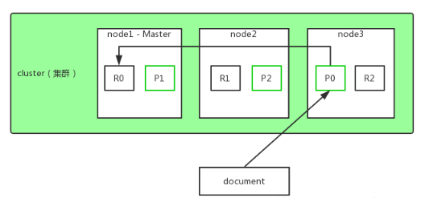
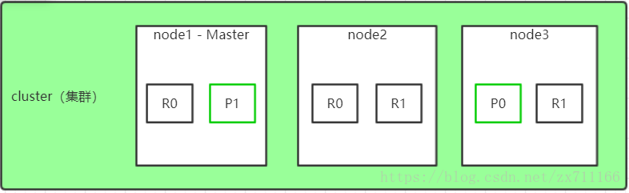
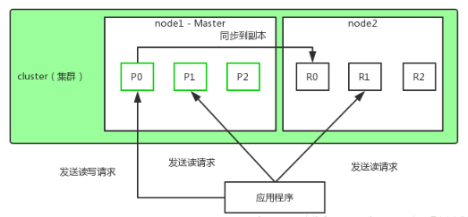

## 背景

日常运维工作中，保证系统服务的稳定是第一优先级的。做好高可用方案是关键。在用Elasticsearch作为存储的服务中，保证Elasticsearch数据的高可用，数据的安全性和一致性至关重要。本文就针对这一问题详细介绍了Elasticsearch的分片和副本机制。

<!--more-->


## 分片和副本机制

1. index(索引) 包含多个 shard(分片)，创建 index 时可以在settings中设置分片数，不设置时默认是5个。

2. 每个 shard 都是一个最小工作单元，承载部分数据；每个 shard 都是一个 lucene 实例，并且具有完整的建立索引和处理能力。

3. 增减节点时，shard 会自动在 nodes 中负载均衡。

4. primary shard（主分片） 和 replica shard（副本分片），每个 document 肯定只存在于某一个 primary shard 以及对应的 replica shard 中，不可能存在于多个 primary shard 。

   

5. replica shard 是 primary shard 的副本，负责容错，以及承担读请求负载。

6. primary shard 的数量在创建索引的时候就固定了，不可更改；replica shard 的数量可以随时修改。

7. primary shard 的默认数量是5，replica 默认是1，默认有10个 shard，5个 primary shard ，5个 replica shard 。

8. primary shard 不能和自己的 replica shard 放在同一个节点上，否则节点宕机，primary shard 和副本都丢失，容错机制将失效；但是可以和其他 primary shard 的 replica shard 放在同一个节点上。

   

## 实践

Shards分片个数:  3

Replica副本个数：3


#### 单节点环境下

```
PUT /myindex
{
    "settings": {
        "number_of_shards": 3,
        "number_of_replica": 1
    }
}
# 查看集群健康状态 --- 将返回yellow，说明集群状态不健康
GET _cat/health
```

此时，因为是单节点环境，3个 primary shard 只能分配到这个仅有的 node 上，另外3个 replica shard 是无法分配的（一个 shard 的副本 replica，两个是不能在同一个节点），集群可以正常工作；但出现宕机，数据全部丢失，而且集群不可用，无法接受任何请求。


#### 两个节点环境下

将3个 primary shard 分配到一个 node 上，另外3个 replica shard 分配到另一个节点上；
primary shard 和 replica shard 保持同步；
primary shard 和 replica shard 都可以处理客户端的读请求。



#### 三个节点环境下

将3个 primary shard 分别分配到一个 node 上，另外3个 replica shard 也交叉分配到另一个节点上；


这样3个节点都可以负载均衡增大访问量，同时如果一台服务器宕机后，数据也不会丢失，还可以对外正常提供服务。保证了服务的高可用和数据的安全。


## 总结

建议:  primary shard的个数和集群节点数一致，replica shard 数可以根据业务需求量决定，需求量大可以设定多个replica shard，来增加读取操作。但是至少每个primary shard设置1个replica shard，来保证高可用和数据的安全性。