# Glusterfs逻辑卷创建与使用

volume是brick的组合，并且大部分glusterfs文件系统的操作都在volume上。

glusterfs支持4种基本卷，并可以根据需求对4种基本卷进行组合形成多种扩展卷（得益于glusterfs的模块化堆栈架构设计）。

以下主要展示各类型逻辑卷的功能性，未对性能做测试验证。

<!--more-->

## 分布式卷

分布式卷（Distributed Glusterfs Volume，又称DHT），glusterfs创建volume不指定卷类型时，默认即分布式卷，特点如下：

1. 根据hash算法，将多个文件分布到卷中的多个brick server上，类似（不是）raid0，但文件无分片；
2. 方便扩展空间，但无冗余保护；
3. 由于使用本地文件系统进行存储（brick server 的本地文件系统），存取效率不高；
4. 受限于本地文件系统对单文件容量的限制，支持超大型文件系统有问题。

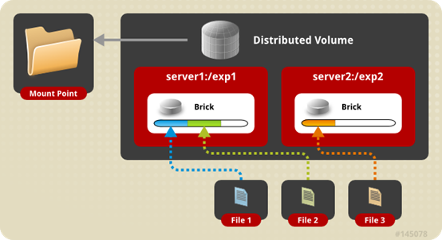

#### 创建存储目录（optional）

```bash
# 在brick server节点创建存储目录，即brick所在；
# 以glusterfs01节点为例，注意各brick server挂载磁盘的目录名的不同
[root@glusterfs01 ~]# mkdir -p /brick1/dis_volume
```

#### 创建分布式卷

```bash
# 命令：gluster volume create NEW-VOLNAME [transport [tcp | rdma | tcp,rdma]] NEW-BRICK...
# 以上命令在任意server节点操作均可，以glusterfs01节点为例；
# 演示分布式卷的创建，两个server节点即可，创建名为”distributed-volume”的逻辑卷
[root@glusterfs01 ~]# gluster volume create distributed-volume glusterfs01:/brick1/dis_volume glusterfs02:/brick2/dis_volume
```

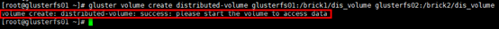

#### 卷信息/状态

```bash
# 命令”gluster volume list”可列出已创建的卷；
# 命令”gluster volume info”可不指定具体的卷，即列出所有卷信息；
# info中给出除卷名外，还有卷类型，状态，brick组成等信息；
# 其中状态为“Created”，需要通过命令启动后才可被挂载使用，在创建成功后的提示信息中有提到”please start the volume to access data”
[root@glusterfs01 ~]# gluster volume info distributed-volume
```

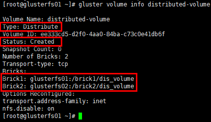

```bash
# 查看卷状态；
# 展示卷中每个brick的状态，以及每个brick服务的监听端口
[root@glusterfs01 ~]# gluster volume status distributed-volume
```

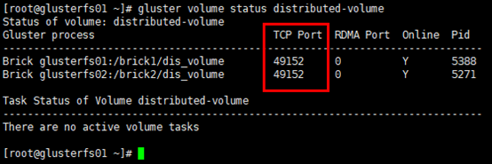

#### 启动卷

```bash
[root@glusterfs01 ~]# gluster volume start distributed-volume
```

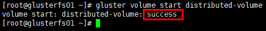

```bash
# 再次查看卷信息，状态变为"Started"
[root@glusterfs01 ~]# gluster volume info distributed-volume
```

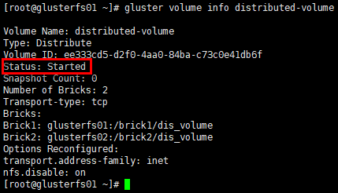

#### client挂载

```bash
# 在客户端创建挂载目录
[root@glusterfs-client ~]# mkdir /mnt/distributed

# 挂载时，可使用任意1台已加入可信存储池并已创建对应卷类型的server节点；
# brick以”SERVER:EXPORT”的形式标识
[root@glusterfs-client ~]# mount.glusterfs 172.30.200.51:distributed-volume /mnt/distributed/
```

#### 查看挂载情况

```bash
# 通过“df -Th”命令可查看被挂载的volume，被挂载的文件系统，已经挂载卷的容量是2个brick容量之和
[root@glusterfs-client ~]# df -Th
```

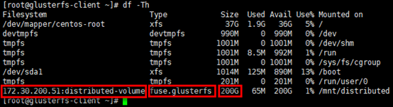

#### 查看brick的监听端口

```bash
# server节点上每启动1个brick，即启动1个brick服务，具备相应的服务监听端口，起始端口号是tcp49152
[root@glusterfs01 ~]# netstat -tunlp | grep gluster
```

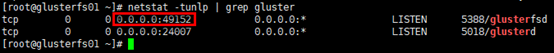

```bash
# 另外，client连接的即brick服务的监听端口
[root@glusterfs01 ~]# netstat -nt
```

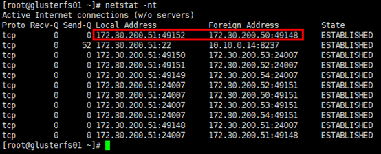

#### 存储测试

```bash
# 在client的挂载目录下创建若干文件
[root@glusterfs-client ~]# cd /mnt/distributed/
[root@glusterfs-client distributed]# touch distributed{1..4}.txt

# glusterfs01节点
[root@glusterfs01 ~]# tree /brick1/dis_volume/
```

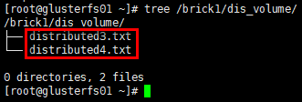

```bash
# glusterfs02节点
[root@glusterfs02 ~]# tree /brick2/dis_volume/
```

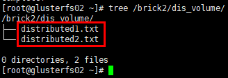

**结论：分布式卷将多个文件分布存储在多个brick server，但并无副本。** 

## 条带卷（Deprecated）

条带卷（Striped Glusterfs Volume），特点如下：

1. 每个文件被分片成等同于brick数量的chunks，然后以round robin的方式将每个chunk存储到1个brick，相当于raid0；
2. 单一超大容量文件可被分片，不受brick server本地文件系统的限制；
3. 文件分片后，并发粒度是chunks，分布式读写性能较高，但分片随机读写可能会导致硬盘iops较高；
4. 无冗余，1个server节点故障会导致所有数据丢失。

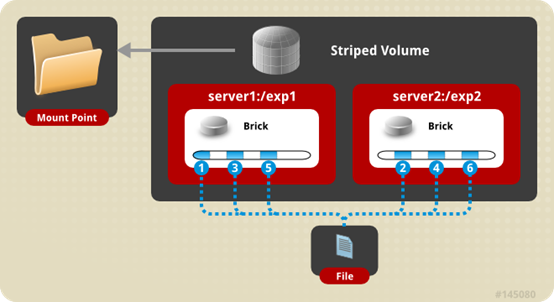

#### 创建条带卷

```bash
# 命令：gluster volume create NEW-VOLNAME [stripe COUNT] [transport [tcp | dma | tcp,rdma]] NEW-BRICK...
# 以上命令在任意server节点操作均可，以glusterfs01节点为例；
# 创建名为”strsipe-volume”的逻辑卷；
# 必须指定卷类型（默认为分布式卷）与对应的条带数量，数量需要与后续使用brick server数量对等；
# “transport tcp”指定集群通信方式
[root@glusterfs01 ~]# gluster volume create stripe-volume stripe 3 transport tcp glusterfs01:/brick1/str_volume glusterfs02:/brick2/str_volume glusterfs03:/brick3/str_volume
```

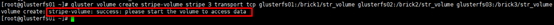

#### 启动卷

```bash
[root@glusterfs01 ~]# gluster volume start stripe-volume
```

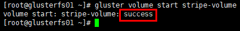

#### client挂载

```bash
[root@glusterfs-client ~]# mkdir /mnt/stripe
[root@glusterfs-client ~]# mount.glusterfs 172.30.200.51:stripe-volume /mnt/stripe/
```

#### 查看挂载情况

```bash
# 已挂载卷的容量是3个brick容量之和
[root@glusterfs-client ~]# df -Th
```

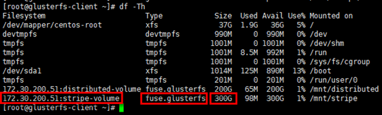

#### 存储测试

```bash
# 在client的挂载目录下创建若干文件
[root@glusterfs-client ~]# cd /mnt/stripe/
[root@glusterfs-client stripe]# touch stripe{1..6}.txt

# 向strip1.txt文件写入内容
[root@glusterfs-client stripe]# echo "this is stripe1.txt" >> strip1.txt

# glusterfs01节点
[root@glusterfs01 ~]# tree /brick1/str_volume/
[root@glusterfs01 ~]# cat /brick1/str_volume/strip1.txt 
```

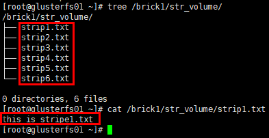

```bash
# glusterfs02节点
[root@glusterfs02 ~]# tree /brick2/str_volume/
[root@glusterfs02 ~]# cat /brick2/str_volume/strip1.txt
```

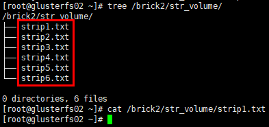

```bash
# glusterfs03节点
[root@glusterfs03 ~]# tree /brick3/str_volume/
[root@glusterfs03 ~]# cat /brick3/str_volume/strip1.txt
```

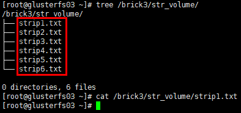

**结论：条带卷将1个文件分片存储在多个brick server，但并无副本。**

## 复制卷

复制卷（Replicated Glusterfs Volume，又称AFR（Auto File Replication）），特点如下：

1. 每个文件同步复制镜像到多个brick，相当于文件级raid1；
2. 副本数量通常设置为2或3，设置的副本数量需要是brick数量（至少为2）的倍数（如2台brick server，可设置副本数为2/4/6/…；如3台brick server，可设置副本数为3/6/9/…；依次类推），且每个brick的容量相等；
3. 读性能提升，写性能下降，因为**glusterfs的复制是同步事务操作，即写文件时，先把这个文件锁住，然后同时写两个或多个副本，写完后解锁，操作结束**（ceph采用异步写副本，即写到一个主OSD便返回，这个OSD再通过内部网络异步写到其余OSD）；
4. 通常与分布式卷或条带卷组合使用，解决前两者的冗余问题；
5. 提升数据可靠性，但磁盘利用率低；
6. 副本数设置为2时，可能会有脑裂（Split-brain）的风险（风险提示，但可配置），主要因在两个副本不一致时，无法仲裁以哪个副本为准，解决方案是加入仲裁或者设置3副本。

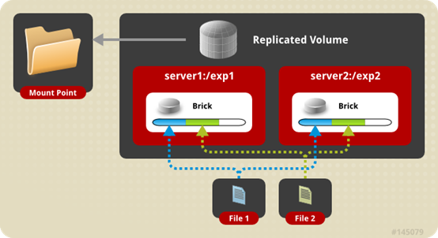

#### 创建复制卷

```bash
# 命令：gluster volume create NEW-VOLNAME [replica COUNT] [transport [tcp | rdma | tcp,rdma]] NEW-BRICK...
# 以上命令在任意server节点操作均可，以glusterfs01节点为例；
# 创建名为”replica-volume”的逻辑卷；
# 必须指定卷类型（默认为分布式卷）与对应的副本数量，数量需要与后续使用brick server数量对等；
# “transport tcp”指定集群通信方式；
# 副本数为2时，有脑裂风险提示，提示采用3副本或仲裁机制，验证环境略过即可
[root@glusterfs01 ~]# gluster volume create replica-volume replica 2 transport tcp glusterfs01:/brick1/repl_volume glusterfs02:/brick2/repl_volume 
```

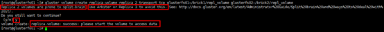

#### 启动卷

```bash
[root@glusterfs01 ~]# gluster volume start replica-volume
[root@glusterfs01 ~]# gluster volume info replica-volume
```

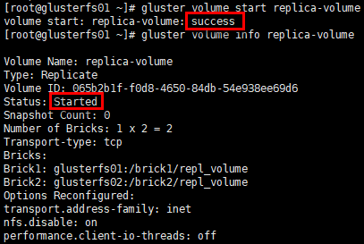

#### client挂载

```bash
[root@glusterfs-client ~]# mkdir /mnt/replica
[root@glusterfs-client ~]# mount.glusterfs 172.30.200.51:replica-volume /mnt/replica/
```

#### 查看挂载情况

```bash
# 已挂载卷的容量是1个brick的容量
[root@glusterfs-client ~]# df -Th
```

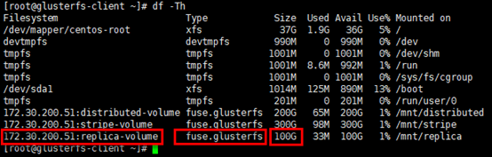

#### 存储测试

```bash
# 在client的挂载目录下创建若干文件
[root@glusterfs-client ~]# cd /mnt/replica/
[root@glusterfs-client replica]# touch replica{1..4}.txt

# 向replica1.txt文件写入内容
[root@glusterfs-client replica]# echo "this is replica1.txt" >> replica1.txt
# glusterfs01节点
[root@glusterfs01 ~]# tree /brick1/repl_volume/
[root@glusterfs01 ~]# cat /brick1/repl_volume/replica1.txt
```

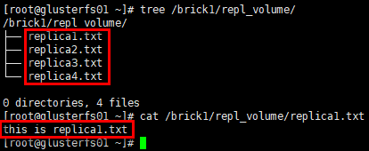

```bash
# glusterfs02节点
[root@glusterfs02 ~]# tree /brick2/repl_volume/
[root@glusterfs02 ~]# cat /brick2/repl_volume/replica1.txt
```

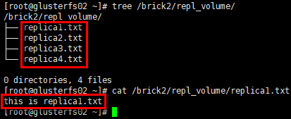

**结论：复制卷将1个文件同步镜像到多个brick server，数据有冗余备份。**

#### AFR恢复原理

数据恢复只针对复制卷，AFR数据修复主要涉及三个方面：ENTRY，META，DATA。

记录描述副本状态的称之为**ChangeLog**，记录在每个副本文件扩展属性里，读入内存后以矩阵形式判断是否需要修复以及要以哪个副本为Source进行修复；初始值以及正常值为0（注：ENTRY和META,DATA分布对应着一个数值）。

以冗余度为2，即含有2个副本A和B的DATA修复为例，write的步骤分解为：

1. 下发Write操作；
2. 加锁Lock；
3. 向A，B副本的ChangeLog分别加1，记录到各副本的扩展属性中；
4. 对A，B副本进行写操作；
5. 若副本写成功则ChangeLog减1，若该副本写失败则ChangLog值不变，记录到各个副本的扩展属性中；
6. 解锁UnLock；
7. 向上层返回，只要有一个副本写成功就返回成功。 

上述操作在AFR中是完整的一个transaction动作，根据两个副本记录的ChangeLog的数值确定了副本的几种状态：

1. WISE：智慧的，即该副本的ChangeLog中对应的值是0，而另一副本对应的数值大于0；
2. INNOCENT：无辜的，即两副本的ChangeLog对应的值都是0；
3. FOOL：愚蠢的，即该副本的ChangeLog对应的值大于是0，而另一副本对应的数值是0；
4. IGNORANT，忽略的，即该副本的ChangeLog丢失。

恢复分以下场景：

1. 1个节点changelog状态为WISE，其余节点为FOOL或其他非WISE状态，以WISE节点去恢复其他节点；

2. 所有节点是IGNORANT状态，手动触发heal，通过命令以UID最小的文件作为source，去恢复大小为0的其他文件；

3. 多个状态是WISE时，即出现脑裂状态，脑裂的文件通常读不出来，报"Input/Output error"，可查看日志/var/log/glusterfs/glustershd.log。

   脑裂原理及解决方案：[https://docs.gluster.org/en/latest/Administrator%20Guide/Split%20brain%20and%20ways%20to%20deal%20with%20it/](https://docs.gluster.org/en/latest/Administrator Guide/Split brain and ways to deal with it/)

```bash
# 通过命令查看副本文件的扩展属性：getfattr -m . -d -e hex [filename]
# “trusted.afr.xxx”部分即扩展属性，值是24bit，分3部分，依次标识DATA ，META， ENTRY 3者的changelog
[root@glusterfs01 ~]# getfattr -m . -d -e hex /brick1/repl_volume/replica1.txt 
```

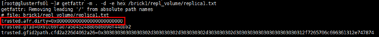

## 分布式复制卷

分布式复制卷（Distributed Replicated Glusterfs Volume），是分布式卷与复制卷的组合，兼具两者的功能，特点如下：

1. 若干brick组成1个复制卷，另外若干brick组成其他复制卷；单个文件在复制卷内数据保持副本，不同文件在不同复制卷之间进行哈希分布；即分布式卷跨复制卷集（replicated sets ）；
2. brick server数量是副本数量的倍数，且>=2倍，即最少需要4台brick server，同时组建复制卷集的brick容量相等。

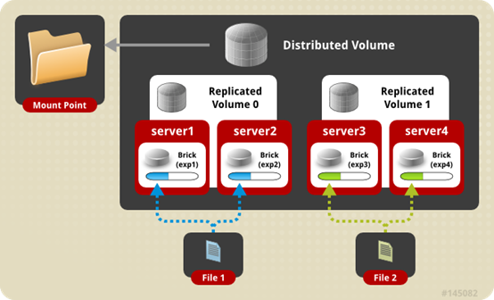

#### 创建分布式复制卷

```bash
# 命令：gluster volume create NEW-VOLNAME [replica COUNT] [transport [tcp | rdma | tcp,rdma]] NEW-BRICK...
# 以上命令在任意server节点操作均可，以glusterfs01节点为例；
# 创建名为”distributed-replica-volume”的逻辑卷；
# 必须指定卷类型（默认为分布式卷）与对应的副本数量，brick server数量是副本数量的倍数，且>=2倍；
# 不需要指出分布式卷类型，只要副本数量与brick server数量不等且符合倍数关系，即是分布式复制卷；
# “transport tcp”指定集群通信方式；
# 副本数为2时，有脑裂风险提示，提示采用3副本或仲裁机制，验证环境略过即可
[root@glusterfs01 ~]# gluster volume create distributed-replica-volume replica 2 transport tcp \
 glusterfs01:/brick1/dis_repl_volume \
 glusterfs02:/brick2/dis_repl_volume \
 glusterfs03:/brick3/dis_repl_volume \
 glusterfs04:/brick4/dis_repl_volume 
```

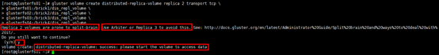

#### 启动卷

```bash
# 卷类型：分布式复制卷
# “Number of Bricks”：2副本，2个副本集（replicated sets ），4个brick server
[root@glusterfs01 ~]# gluster volume start distributed-replica-volume
[root@glusterfs01 ~]# gluster volume info distributed-replica-volume
```

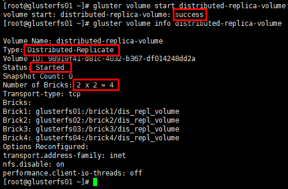

#### client挂载

```bash
[root@glusterfs-client ~]# mkdir /mnt/distributed-replica
[root@glusterfs-client ~]# mount.glusterfs 172.30.200.51:distributed-replica-volume /mnt/distributed-replica/
```

#### 查看挂载情况

```bash
# 已挂载卷的容量是2个副本集（replicated sets ）容量之和
[root@glusterfs-client ~]# df -Th
```

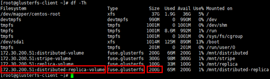

#### 存储测试

```bash
# 在client的挂载目录下创建若干文件
[root@glusterfs-client ~]# cd /mnt/distributed-replica/
[root@glusterfs-client distributed-replica]# touch distributed-replica{1..6}.txt

# 向distributed-replica1.txt文件写入内容
[root@glusterfs-client distributed-replica]# echo "this is distributed-replica1.txt" >> distributed-replica1.txt

# glusterfs01节点
[root@glusterfs01 ~]# tree /brick1/dis_repl_volume/
```

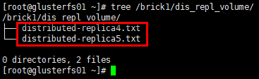

```bash
# glusterfs02节点
[root@glusterfs02 ~]# tree /brick2/dis_repl_volume/
```

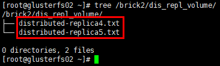

```bash
# glusterfs03节点
[root@glusterfs03 ~]# tree /brick3/dis_repl_volume/
[root@glusterfs03 ~]# cat /brick3/dis_repl_volume/distributed-replica1.txt
```

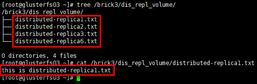

```bash
# glusterfs04节点
[root@glusterfs04 ~]# tree /brick4/dis_repl_volume/
[root@glusterfs04 ~]# cat /brick4/dis_repl_volume/distributed-replica1.txt
```

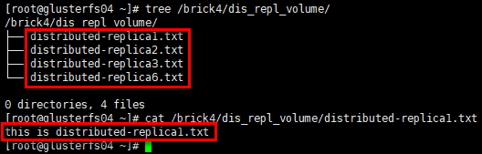

**结论：分布式复制卷将数据文件分布在多个复制集（replicated sets ）中，每个复制集中数据有镜像冗余。**

## 分布式条带卷（Deprecated）

分布式条带卷（Distributed Striped Glusterfs Volume），是分布式卷与条带卷的组合，兼具两者的功能，特点如下：

1. 若干brick组成1个条带卷，另外若干brick组成其他条带卷；单个文件在条带卷内数据以条带的形式存储，不同文件在不同条带卷之间进行哈希分布；即分布式卷跨条带卷；
2. brick server数量是条带数的倍数，且>=2倍，即最少需要4台brick server。

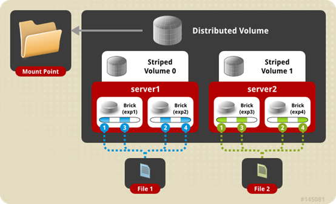

#### 创建分布式条带卷

```bash
# 命令：gluster volume create NEW-VOLNAME [stripe COUNT] [transport [tcp | rdma | tcp,rdma]] NEW-BRICK...
# 以上命令在任意server节点操作均可，以glusterfs01节点为例；
# 创建名为”distributed-stripe-volume”的逻辑卷；
# 必须指定卷类型（默认为分布式卷）与对应的条带数，brick server数量是条带数量的倍数，且>=2倍；
# 不需要指出分布式卷类型，只要条带数量与brick server数量不等且符合倍数关系，即是分布式复制卷；
# “transport tcp”指定集群通信方式；
[root@glusterfs01 ~]# gluster volume create distributed-stripe-volume stripe 2 transport tcp \
 glusterfs01:/brick1/dis_str_volume \
 glusterfs02:/brick2/dis_str_volume \
 glusterfs03:/brick3/dis_str_volume \
 glusterfs04:/brick4/dis_str_volume
```

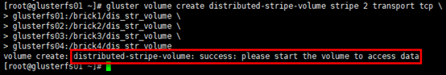

#### 启动卷

```bash
# 卷类型：分布式条带卷
# “Number of Bricks”：2分布集，2条带集（replicated sets ），4个brick server
[root@glusterfs01 ~]# gluster volume start distributed-stripe-volume
[root@glusterfs01 ~]# gluster volume info distributed-stripe-volume
```

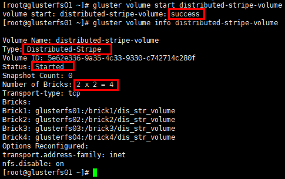

#### client挂载

```bash
[root@glusterfs-client ~]# mkdir /mnt/distributed-stripe
[root@glusterfs-client ~]# mount.glusterfs 172.30.200.51:distributed-stripe-volume /mnt/distributed-stripe/
```

#### 查看挂载情况

```bash
# 已挂载卷的容量是4个brick容量之和
[root@glusterfs-client ~]# df -Th
```

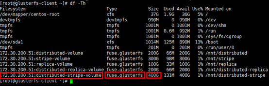

#### 存储测试

```bash
# 在client的挂载目录下创建若干文件
[root@glusterfs-client ~]# cd /mnt/distributed-stripe/
[root@glusterfs-client distributed-stripe]# touch distributed-stripe{1..6}.txt

# 向distributed-stripe1.txt文件写入内容
[root@glusterfs-client distributed-stripe]# echo "this is distributed-stripe1.txt" >> distributed-stripe1.txt

# glusterfs01节点
[root@glusterfs01 ~]# tree /brick1/dis_str_volume/
```

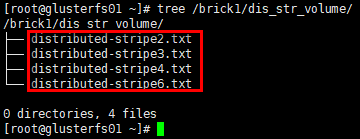

```bash
# glusterfs02节点
[root@glusterfs02 ~]# tree /brick2/dis_str_volume/
```

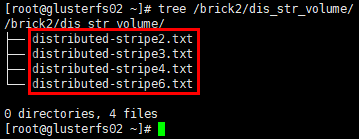

```bash
# glusterfs03节点
[root@glusterfs03 ~]# tree /brick3/dis_str_volume/
[root@glusterfs03 ~]# cat /brick3/dis_str_volume/distributed-stripe1.txt
```

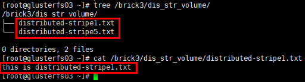

```bash
# glusterfs04节点
[root@glusterfs04 ~]# tree /brick4/dis_str_volume/
[root@glusterfs04 ~]# cat /brick4/dis_str_volume/distributed-stripe1.txt
```

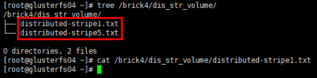

**结论：分布式条带卷将数据文件分布在多个条带集中，每个条带集中数据再以条带的形式存储在对应条带集中的全部brick上，数据无冗余备份。**

## 条带镜像卷（Deprecated）

条带复制卷（STRIPE REPLICA Volume），是条带与复制卷的组合，兼具两者的功能，特点如下：

1. 若干brick组成1个复制卷，另外若干brick组成其他复制卷；单个文件以条带的形式存储在2个或多个复制集（replicated sets ），复制集内文件分片以副本的形式保存；相当于文件级raid01；
2. brick server数量是副本数的倍数，且>=2倍，即最少需要4台brick server。

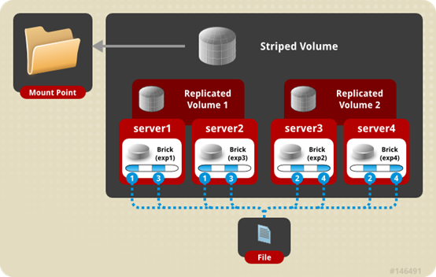

## 分布式条带镜像卷（Deprecated）

分布式条带复制卷（DISTRIBUTE STRIPE REPLICA VOLUME），是分布式卷，条带与复制卷的组合，兼具三者的功能，特点如下：

1. 多个文件哈希分布到到多个条带集中，单个文件在条带集中以条带的形式存储在2个或多个复制集（replicated sets ），复制集内文件分片以副本的形式保存；
2. brick server数量是副本数的倍数，且>=2倍，即最少需要4台brick server。

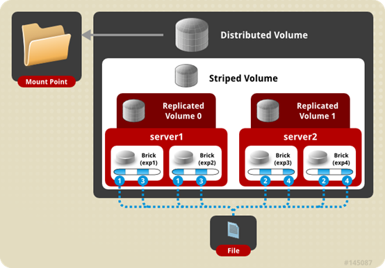

## 纠删卷

纠删卷（Dispersed Volumes）是v3.6版本后发布的一种volume特点如下：

1. 基于纠删码（erasure codes， EC）实现，类似于raid5/6（取决于redundancy等级）；
2. 通过配置redundancy（冗余）级别提高可靠性，在保证较高的可靠性同时，可以提升物理存储空间的利用率；
3. 文件被分割成大小相同的chunk(块)，每个chunk又被分割成fragment，冗余信息的fragment随之生成，且同一个fragment只会保存一个brick上；
4. redundancy均匀分布存储在所有的brick，逻辑卷的有效空间是<usable size> = <brick size> * (#bricks - redundancy)；
5. 在数据恢复时，只要(#bricks - redundancy)个fragment（数据或冗余信息）可用，就能正常恢复数据；
6. 卷中所有brick容量需要相同，否则最小的brick满容量时，数据无法写入；
7. 实际部署时，redundancy < #bricks / 2 (or equivalently, redundancy * 2 < #bricks)，即brick至少是3个；redundancy设置为0时，DispersedVolume等同于分布式卷；若redundancy设置为brick/2时，DispersedVolume等同于复制卷。

#### 创建纠删卷

```bash
# 命令：gluster volume create [disperse [<count>]] [redundancy <count>] [transport tcp | rdma | tcp,rdma]
# 以上命令在任意server节点操作均可，以glusterfs01节点为例；
# 创建名为”disperse-volume”的逻辑卷；
# 必须指定卷类型（默认为分布式卷）与对应的brick server数量；
# 冗余等级”redundancy”需要根据使用brick server数量(“disperse conunt”)，并结合期望的冗余度数综合考量；
# 也可不设置冗余等级”redundancy”，系统会根据brick server数量(“disperse conunt”)自动计算最优值，确认即可；如disperse conunt=3，则redundancy=1（无“warning message”）；disperse conunt=6，则redundancy=2（有“warning message”）；但disperse conunt=4，则无最优值，此时使用默认redundancy=1（有“warning message”）；
# “transport tcp”指定集群通信方式，默认即tcp；
[root@glusterfs01 ~]# gluster volume create disperse-volume disperse 3 transport tcp \
 glusterfs01:/brick1/disperse_volume \
 glusterfs02:/brick2/disperse_volume \
 glusterfs03:/brick3/disperse_volume 
```

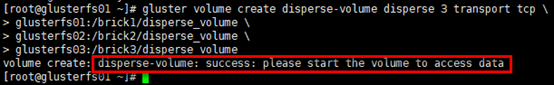

#### 启动卷

```bash
# 卷类型：disperse卷
# “Number of Bricks”：rudundancy=1，3个brick server
[root@glusterfs01 ~]# gluster volume start disperse-volume
[root@glusterfs01 ~]# gluster volume info disperse-volume
```

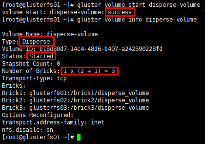

#### client挂载

```bash
[root@glusterfs-client ~]# mkdir /mnt/disperse
[root@glusterfs-client ~]# mount.glusterfs 172.30.200.51:disperse-volume /mnt/disperse/
```

#### 查看挂载情况

```bash
# 已挂载卷的容量是2个brick容量之和，<usable size> = <brick size> * (#bricks - redundancy)
[root@glusterfs-client ~]# df -Th
```

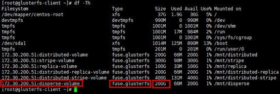

#### 存储测试

```bash
# 在client的挂载目录下创建若干文件
[root@glusterfs-client ~]# cd /mnt/disperse/
[root@glusterfs-client disperse]# touch disperse{1..4}.txt

# 向distributed-replica1.txt文件写入内容
[root@glusterfs-client disperse]# echo "this is disperse1.txt" >> disperse1.txt

# glusterfs01节点
[root@glusterfs01 ~]# tree /brick1/disperse_volume/
[root@glusterfs01 ~]# cat /brick1/disperse_volume/disperse1.txt
```

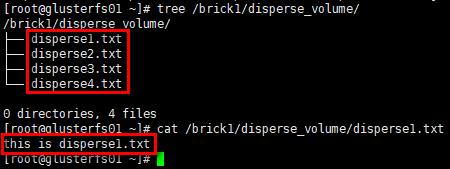

```bash
# glusterfs02节点
[root@glusterfs02 ~]# tree /brick2/disperse_volume/
[root@glusterfs02 ~]# cat /brick2/disperse_volume/disperse1.txt
```

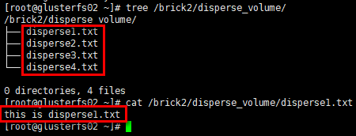

```bash
# glusterfs03节点
[root@glusterfs03 ~]# tree /brick3/disperse_volume/
[root@glusterfs03 ~]# cat /brick3/disperse_volume/disperse1.txt
```

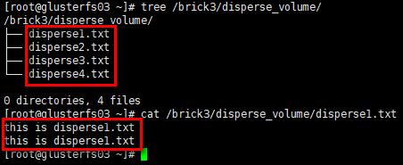

**结论：纠删卷将数据文件（含冗余信息）分布在多个brick中，数据有冗余。**

## 分布式纠删卷

分布式纠删卷（Distributed Dispersed Volumes）等效于分布式复制卷，但使用的是纠删子卷，而非复制子卷。

# Glusterfs管理

## 均衡卷

```bash
# 不迁移数据
gluster volume VOLNAME rebalance [fix-layout start | start | startforce | status | stop]

# 修复卷（只针对复制卷）
gluster volume heal REPLICATE-VOLNAME/DISPERSE-VOLNAME       #只修复有问题的文件  
gluster volume heal REPLICATE-VOLNAME/DISPERSE-VOLNAME full    #修复所有文件  
gluster volume heal REPLICATE-VOLNAME/DISPERSE-VOLNAME info    #查看自愈详情  
gluster volume heal REPLICATE-VOLNAME/DISPERSE-VOLNAME info healed|heal-failed|split-brain

# 设置卷
gluster volume set options
```

## 删除卷

```bash
# 删除卷操作，必须先停用卷；
# 最后可清空brick server节点对应目录下的内容
gluster volume stop distributed-volume
gluster volume delete distributed-volume
rm -f /brick1/dis_volume
```

## brick管理

```bash
# 添加brick
gluster volume add-brick VOLNAME NEW-BRICK

# 移除brick
gluster volume remove-brick VOLNAME BRICK [start | status | commit]

# 替换brick
gluster volume replace-brick VOLNAME BRICKNEW-BRICK [start | pause | sbortstatus | commit]
```

## 日志

相关日志，在/var/log/glusterfs/目录下，可根据需要查看；

如/var/log/glusterfs/brick/下是各brick创建的日志；

如/var/log/glusterfs/cmd_history.log是命令执行记录日志；

如/var/log/glusterfs/glusterd.log是glusterd守护进程日志。