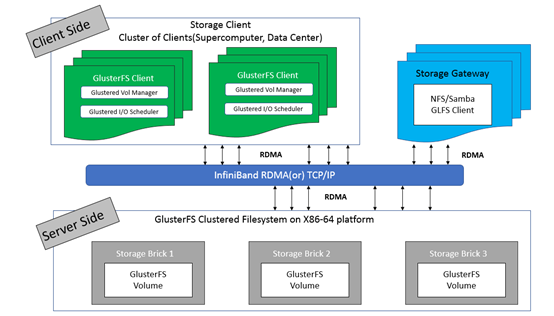
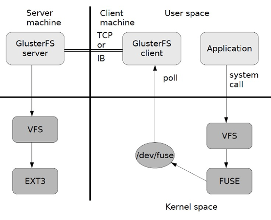
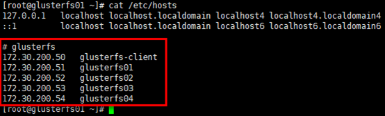
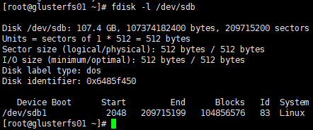
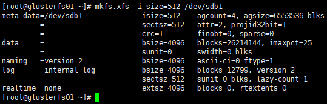
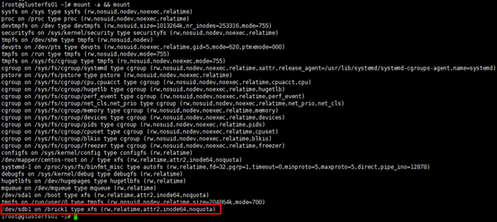
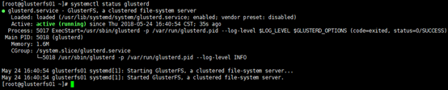
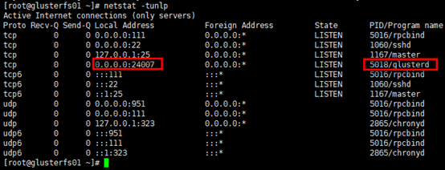
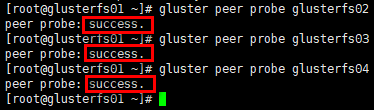
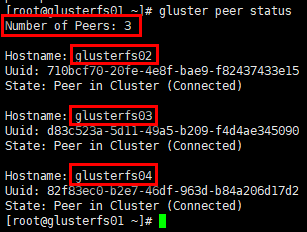

# Glusterfs框架

Glusterfs（Gluster file system）是开源的，具有强大横向扩展能力的（scale-out）,分布式的，可将来自多个服务器的存储资源通过tcp/ip或infiniBand RDMA 网络整合到一个统一的全局命名空间中的文件系统。

## 框架



1. GlusterFS主要由存储服务器（Brick Server）、客户端以及 NFS/Samba 存储网关组成；
2. 架构中无元数据服务器组件，无对于提升整个系统的性单点故障和性能瓶颈问题，可提高系统扩展性、性能、可靠性和稳定性；
3. GlusterFS支持 TCP/IP 和 InfiniBand RDMA 高速网络互联；
4. 客户端可通过原生 GlusterFS 协议访问数据，其他没有运行 GlusterFS 客户端的终端可通过 NFS/CIFS 标准协议通过存储网关访问数据（存储网关提供弹性卷管理和访问代理功能）；
5. 存储服务器主要提供基本的数据存储功能，客户端弥补了没有元数据服务器的问题，承担了更多的功能，包括数据卷管理、I/O 调度、文件定位、数据缓存等功能，利用 FUSE（File system in User Space）模块将 GlusterFS 挂载到本地文件系统之上，实现 POSIX 兼容的方式来访问系统数据。

## 常见术语

1. Brick：GlusterFS中最基本的存储单元，表示为受信存储池（trusted storage pool）中输出的目录，供客户端挂载用，可以通过主机名与目录名来标识，如'SERVER:EXPORT'；
2. Volume：卷，逻辑上由N个brick组成；
3. FUSE：Unix-like OS上的可动态加载的模块，允许用户不用修改内核即可创建自己的文件系统；
4. Glusterd：Gluster management daemon，在trusted storage pool中所有的服务器上运行；
5. Volfile：Glusterfs进程的配置文件，通常是位于/var/lib/glusterd/vols/目录下的{volname}文件；
6. Self-heal：用于后台运行检测复本卷中文件与目录的不一致性并解决这些不一致；
7. Split-brain：脑裂；
8. GFID：GlusterFS卷中的每个文件或目录都有一个唯一的128位的数据相关联，用于模拟inode；
9. Namespace：每个Gluster卷都导出单个ns作为POSIX的挂载点。

##  数据访问流程



1. 在客户端,用户通过 glusterfs的mount point读写数据；
2. 用户的这个操作被递交给本地 Linux 系统的VFS 来处理；
3. VFS 将数据递交给 FUSE 内核文件系统（在启动 glusterfs 客户端以前,需要向系统注册一个实际的文件系统 FUSE），该文件系统与 ext3 在同一个层次， ext3 是对实际的磁盘进行处理，而 fuse 文件系统则是将数据通过 /dev/fuse 这个设备文件递交给了glusterfs client 端，可以将 fuse 文件系统理解为一个代理；
4. 数据被 fuse 递交给 Glusterfs client 后， client 对数据进行一些指定的处理（即按 client 配置文件来进行的一系列处理）；
5. 在 glusterfs client 的处理末端,通过网络将数据递交给 Glusterfs Server, 并且将数据写入到服务器所控制的存储设备上。

<!--more-->

# 参考文档

1. Quick Start Guide：http://gluster.readthedocs.io/en/latest/Quick-Start-Guide/Quickstart/

2. Install-Guide：https://docs.gluster.org/en/latest/Install-Guide/Install/

3. CentOS gluster-Quickstart：https://wiki.centos.org/SpecialInterestGroup/Storage/gluster-Quickstart

4. Type of Volumes：https://docs.gluster.org/en/latest/Quick-Start-Guide/Architecture/#types-of-volumes

5. Setting up GlusterFS Volumes：[https://docs.gluster.org/en/latest/Administrator%20Guide/Setting%20Up%20Volumes/](https://docs.gluster.org/en/latest/Administrator Guide/Setting Up Volumes/)

6. 脑裂：[https://docs.gluster.org/en/latest/Administrator%20Guide/Split%20brain%20and%20ways%20to%20deal%20with%20it/](https://docs.gluster.org/en/latest/Administrator Guide/Split brain and ways to deal with it/)

7. Glusterfs技术详解（推荐）：https://czero000.github.io/2016/04/05/glusterfs-technical-explanation.html

   

# 环境

## 环境规划

| **Hostname**     | **IP**        | **Service**                                             | **Remark** |
| ---------------- | ------------- | ------------------------------------------------------- | ---------- |
| glusterfs-client | 172.30.200.50 | glusterfs(3.12.9)glusterfs-fuse                         | 客户端     |
| glusterfs01      | 172.30.200.51 | glusterfs(3.12.9)glusterfs-server(3.12.9)glusterfs-fuse | 服务器端   |
| glusterfs02      | 172.30.200.52 | glusterfs(3.12.9)glusterfs-server(3.12.9)glusterfs-fuse | 服务器端   |
| glusterfs03      | 172.30.200.53 | glusterfs(3.12.9)glusterfs-server(3.12.9)glusterfs-fuse | 服务器端   |
| glusterfs04      | 172.30.200.54 | glusterfs(3.12.9)glusterfs-server(3.12.9)glusterfs-fuse | 服务器端   |

## 设置hosts

```bash
# 所有节点保持一致的hosts即可，以gluster01节点为例；
# 绑定hosts不是必须的，后续组建受信存储池也可使用ip的形式
[root@glusterfs01 ~]# vim /etc/hosts 
# glusterfs
172.30.200.50   glusterfs-client
172.30.200.51   glusterfs01
172.30.200.52   glusterfs02
172.30.200.53   glusterfs03
172.30.200.54   glusterfs04

[root@glusterfs01 ~]# cat /etc/hosts
```



## 设置ntp

```bash
# 至少4个Brick Server节点需要保持时钟同步（重要），以glusterfs01节点为例
[root@glusterfs01 ~]# yum install chrony -y 

# 编辑/etc/chrony.conf文件，设置”172.20.0.252”为时钟源；
[root@glusterfs01 ~]# egrep -v "^$|^#" /etc/chrony.conf 
server 172.20.0.252 iburst
driftfile /var/lib/chrony/drift
makestep 1.0 3
rtcsync
logdir /var/log/chrony

# 设置开机启动，并重启
[root@glusterfs01 ~]# systemctl enable chronyd.service
[root@glusterfs01 ~]# systemctl restart chronyd.service

# 查看状态
[root@glusterfs01 ~]# systemctl status chronyd.service
[root@glusterfs01 ~]# chronyc sources -v
```

## 设置glusterfs packages

```bash
# 全部节点安装glusterfs yum源
[root@glusterfs01 ~]# yum install -y centos-release-gluster 

# 查看
[root@glusterfs01 ~]# yum repolist
```

## 设置iptables

```bash
# 提前统一设置iptables（至少4个Brick Server节点），以glusterfs01节点为例；
# 初始环境已使用iptables替代centos7.x自带的firewalld，同时关闭selinux；
[root@glusterfs01 ~]# vim /etc/sysconfig/iptables
# tcp24007:24008：glusterfsd daemon management服务监听端口；
# tcp49152:49160：3.4版本之后（之前的版本的起始端口是24009），启动1个brick，即启动1个监听端口，起始端口为49152，依次类推，如这里设置49152:49160，可开启9个brick；
# 另如果启动nfs server，需要开启38465:38467，111等端口
-A INPUT -p tcp -m state --state NEW -m tcp --dport 24007:24008 -j ACCEPT
-A INPUT -p tcp -m state --state NEW -m tcp --dport 49152:49160 -j ACCEPT

[root@glusterfs01 ~]# service iptables restart
```

# 设置glusterfs

## mount brick

#### 创建分区

```bash
# 各brick server的磁盘挂载前需要创建分区并格式化，以glusterfs01节点为例；
# 将整个/dev/sdb磁盘设置为1个分区，分区设置默认即可
[root@glusterfs01 ~]# fdisk /dev/sdb
Command (m for help): n
Select (default p): 
Partition number (1-4, default 1): 
First sector (2048-209715199, default 2048): 
Last sector, +sectors or +size{K,M,G} (2048-209715199, default 209715199): 
Command (m for help): w

# 查看
[root@glusterfs01 ~]# fdisk -l /dev/sdb 
```



#### 格式化分区

```bash
[root@glusterfs01 ~]# mkfs.xfs -i size=512 /dev/sdb1
```



#### 挂载分区

```bash
# 创建挂载目录，目录名自定义；
# 这里为区分，可以将4个server节点的目录名按顺序命名（非必须）
[root@glusterfs01 ~]# mkdir -p /brick1
[root@glusterfs02 ~]# mkdir -p /brick2
[root@glusterfs03 ~]# mkdir -p /brick3
[root@glusterfs04 ~]# mkdir -p /brick4

# 修改/etc/fstab文件，以glusterfs01节点为例，注意其余3各节点挂载点目录名不同；
# 第一栏：设备装置名；
# 第二栏：挂载点；
# 第三栏：文件系统；
# 第四栏：文件系统参数，默认情况使用 defaults 即可，同时具有 rw, suid, dev, exec, auto, nouser, async 等参数；
# 第五栏：是否被 dump 备份命令作用，"0"代表不做 dump 备份； "1"代表要每天进行 dump； "2"代表其他不定日期的 dump； 通常设置"0" 或者"1"；
# 第六栏：是否以 fsck 检验扇区，启动过程中，系统默认会以 fsck 检验 filesystem 是否完整 (clean)， 但某些 filesystem 是不需要检验的，如swap；"0"是不要检验，"1"表示最早检验(一般只有根目录会配置为 "1")，"2"是检验，但晚于"1"；通常根目录配置为"1" ，其余需要要检验的 filesystem 都配置为"2"；
[root@glusterfs01 ~]# echo "/dev/sdb1 /brick1                               xfs     defaults        1 2" >> /etc/fstab

# 挂载并展示
[root@glusterfs01 ~]# mount -a && mount
```



## 启动glusterfs-server

#### 安装glusterfs-server

```bash
# 在4个brick server节点安装glusterfs-server，以glusterfs01节点为例
[root@glusterfs01 ~]# yum install -y glusterfs-server
```

#### 启动glusterfs-server

```bash
[root@glusterfs01 ~]# systemctl enable glusterd
[root@glusterfs01 ~]# systemctl restart glusterd

# 查看状态
[root@glusterfs01 ~]# systemctl status glusterd
```



```bash
# 查看服务监听端口
[root@glusterfs01 ~]# netstat -tunlp
```



## 组建受信存储池

受信存储池（trusted storage pools），是1个可信的网络存储服务器，为卷提供brick，可以理解为集群。 

```bash
# 在任意一个server节点组建受信存储池均可，即由任意节点邀请其他节点组建存储池；
# 组建时，做为”邀请者”，不需要再加入本节点；
# 使用ip或dns主机名解析都可以，这里已在hosts文件绑定主机，采用主机名；
# 从集群移除节点：gluster peer detach <ip or hostname>
[root@glusterfs01 ~]# gluster peer probe glusterfs02
[root@glusterfs01 ~]# gluster peer probe glusterfs03
[root@glusterfs01 ~]# gluster peer probe glusterfs04
```



```bash
# 查看受信存储池状态；
# 在glusterfs01节点查看集群状态，不会list出本节点，只展示peers
[root@glusterfs01 ~]# gluster peer status
```



## 设置glusterfs-client

```bash
# 客户端主要安装两个组件，glusterfs与glusterfs-fuse；
# glusterfs-client具备如数据卷管理、I/O 调度、文件定位、数据缓存等功能；
# glusterfs-fuse将远端glusterfs挂载到本地文件系统，可通过”modinfo fuse”，“ll /dev/fuse”等命令查看
[root@glusterfs-client ~]# yum install -y glusterfs glusterfs-fuse
```