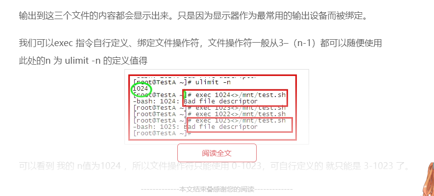
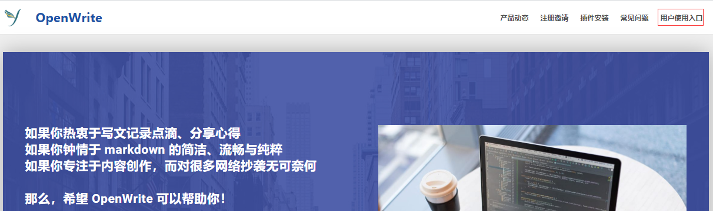
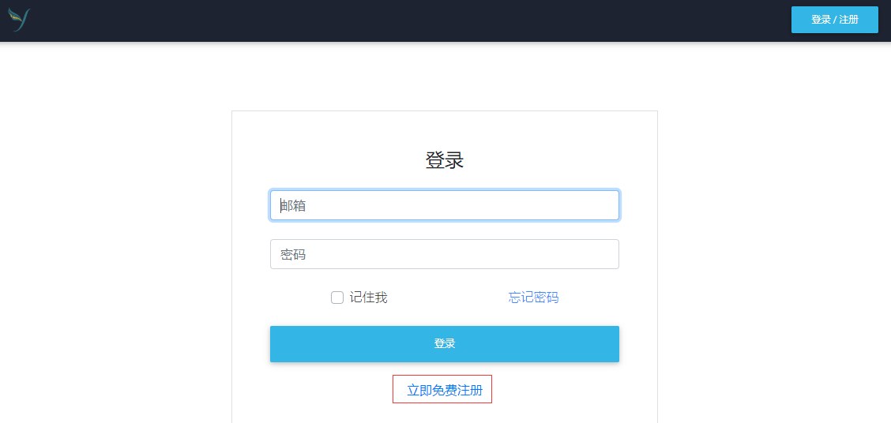
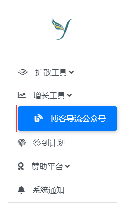
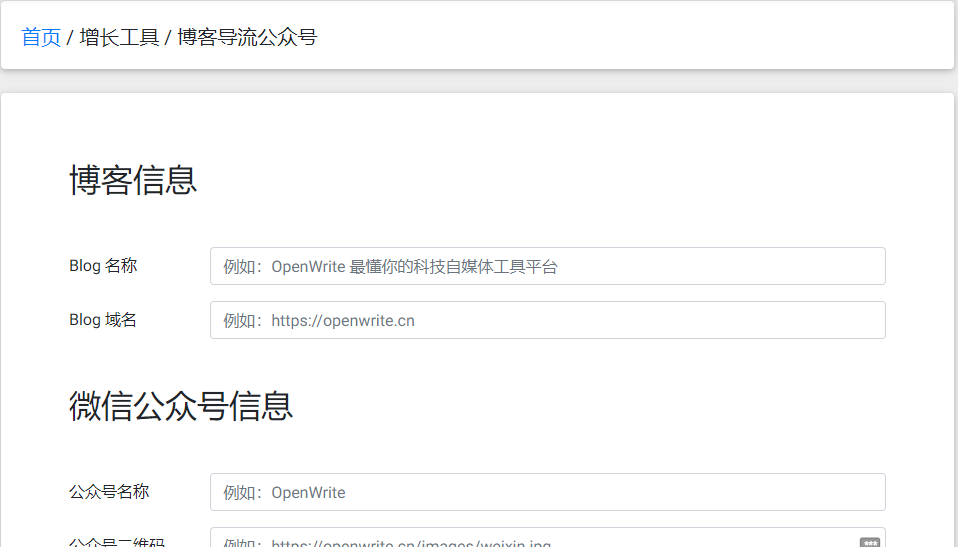
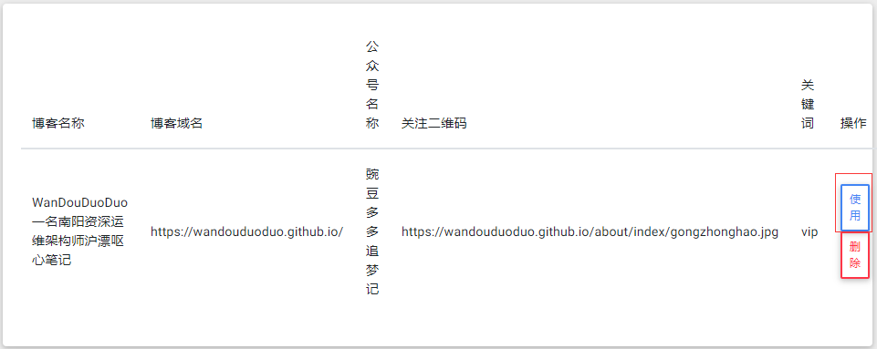
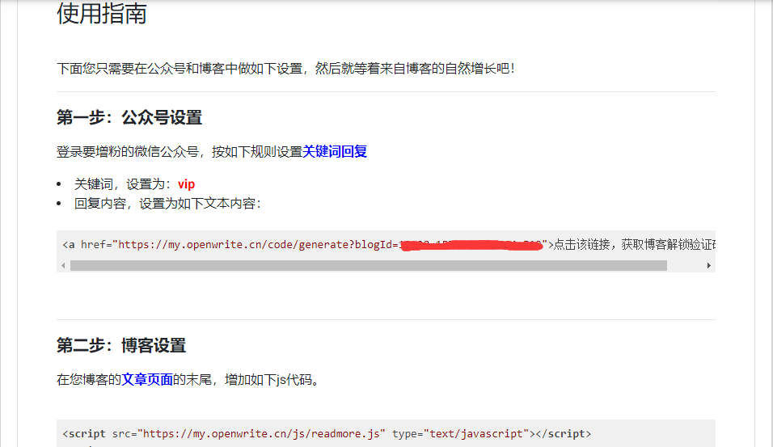

## 背景

随着互联网的高速发展，我们身边的一切都发生了翻天覆地的变化，互联网真真正正改变了我们的生活方式。足不出户买东西，点点手机叫外卖，一部手机走天下等等。古有文人墨客怀才不遇，积愤难平。但现在互联网放大了每个人的能力，知识变现，粉丝导流，人气带货等等已很常见。这时很多技术博主或站长，就想技术文档笔记积累的人气导流到微信公众号。本文就是讲解Hexo博客导流到微信公众号的流程。一句话概括：就是Hexo 整合 OpenWrite 平台的 readmore 插件,实现博客的每一篇文章自动增加阅读更多效果,关注公众号后方可解锁全站文章,从而实现博客流量导流到微信公众号粉丝目的。


有些同学，会有如下疑问：

- 为什么要讲Hexo博客，而不是其他如简书，博客园等？
- 导流后效果是怎样的呢？
- 配置会不会很麻烦呢？
- 需要用到哪些工具呢？
- 具体流程是怎样的呢？

针对这些问题，下面就一一解答。

<!--more-->


## 博客

为什么要讲Hexo博客，而不是其他如简书，博客园等，或者自己建站呢？归根结底，还是因为Money问题。Hexo是github的静态pages博客，搭建好后不需要域名和服务器空间（这些虽然不贵，但是都是要钱的), 并且所有博客内的源码自己可控的。而且国内的云服务商都有静态pages功能，如码云和腾讯云等。重要的是需求就是：做个笔记，记录工作中遇到的技术，对自己做个总结，后面忘记时可以快速查询回忆起来。需求简单，源码可控等造成了hexo静态博客用处很广。


## 效果




## 流程

hexo配置导流很简单的，主要用到工具就是[OpenWrite](https://openwrite.cn/)。

#### 注册

web页面填写邮箱和密码注册openwrite。





#### 导流公众号设定

增长工具-->添加-->填写信息-->保存





注意：保存好后，需要再次到增长工具-->博客导流公众号-->使用



然后会展示使用指南



#### Hexo配置

在hexo `_config.yml` 配置文件中,添加配置 `readmore` 插件相关信息

```yaml
# readmore
plugins:
  readmore:
    blogId: 19128-1577246103864-519
    name: 豌豆多多追梦记
    qrcode: https://wandouduoduo.github.io/about/index/gongzhonghao.jpg
    keyword: vip
```

其中,配置参数含义如下:

- `blogId` : [必选]OpenWrite 后台申请的博客唯一标识,例如:119128-1577246103864-519
- `name` : [必选]OpenWrite 后台申请的博客名称,例如:豌豆多多追梦记
- `qrcode` : [必选]OpenWrite 后台申请的微信公众号二维码图片地址。
- `keyword` : [必选]OpenWrite 后台申请的微信公众号后台回复关键字,例如:vip

注意: **一定要替换成自己的在使用指南中显示的相关配置**!

#### Hexo安装组件

开通readmore功能，原本需要手动更改主题的配置文件，但现在有牛人进行了封装。有兴趣可以看下

[hexo-plugin-readmore](https://github.com/snowdreams1006/hexo-plugin-readmore)。所以我们现在只需要安装即可

```bash
npm install hexo-plugin-readmore --save
或
cnpm install hexo-plugin-readmore --save
```

#### 构建发布

插件安装完成后，保存配置，构建发布即可。

```bash
hexo g && hexo d
```

## 验证

打开hexo博客，随便打开一篇文档，查看是否有效果。Good   Luck!!!

