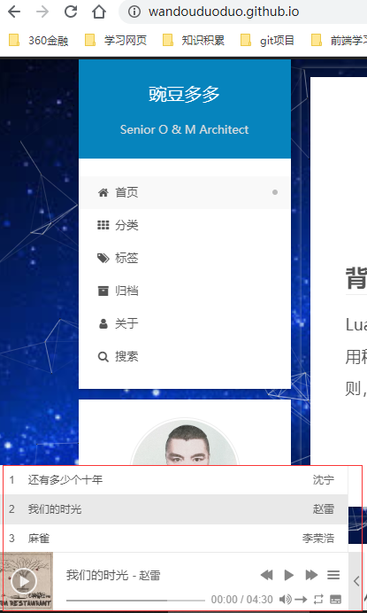
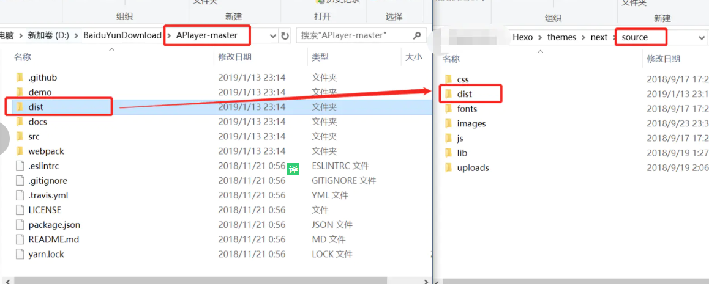
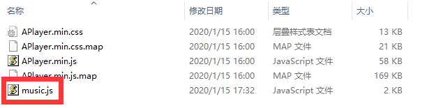
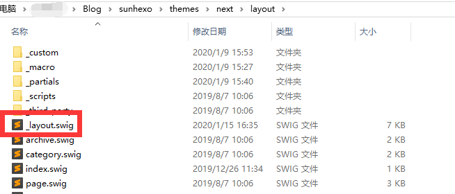
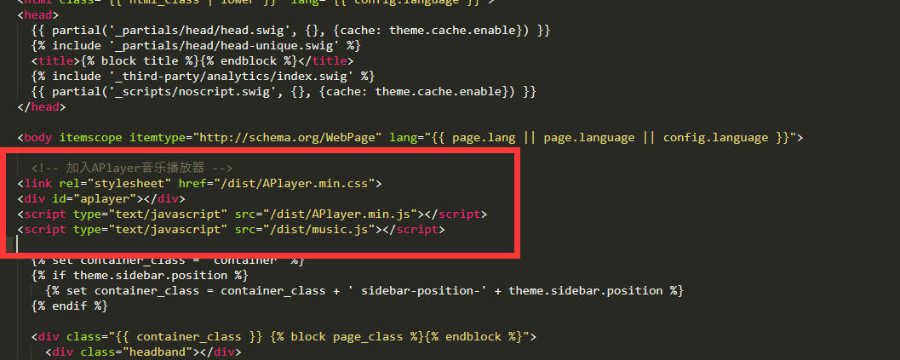
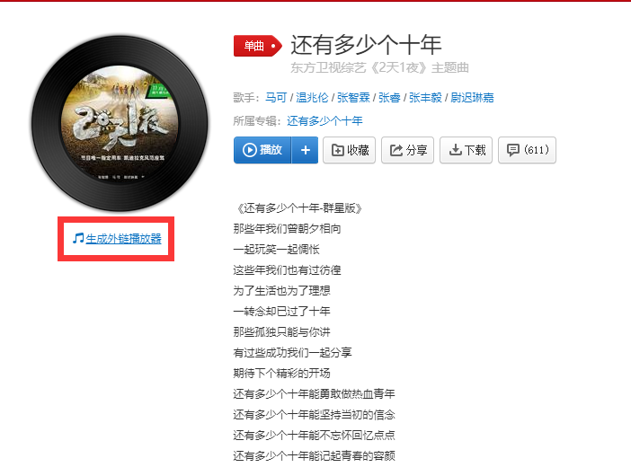
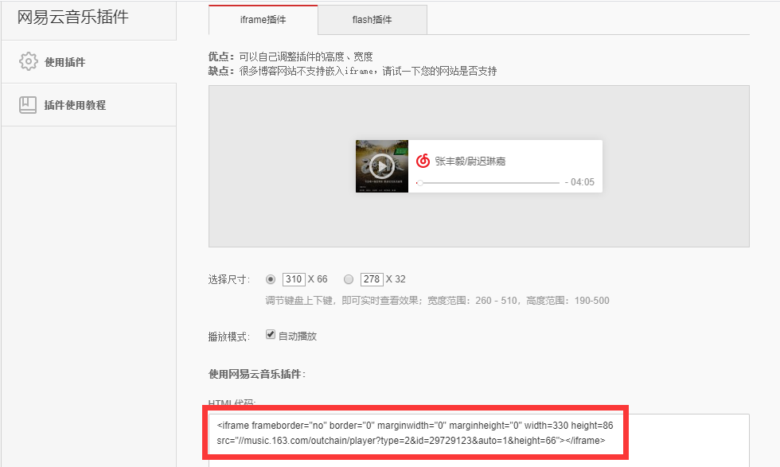
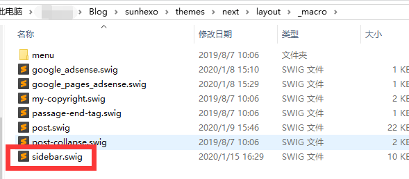
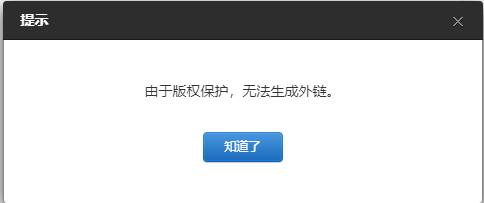

## 目的

hexo搭建完静态博客后，有同学只看技术文档比较枯燥，会犯困。那么如果有音乐播放的功能，就可以一遍阅读文章，一边欣赏音乐了，岂不是一件很愉快的事。那么下面就以本站点为例，分享怎么在自己的hexo网站增加音乐播放功能。

<!--more-->


## 效果图

先上张效果图，如果有兴趣再接着往下看。



## 方法一

### 播放器安装

[APlayer](https://github.com/MoePlayer/APlayer)，下载github压缩包，解压后把dist文件夹复制到\themes\next\source目录中。



### 播放列表配置

在dist目录里，新建music.js文件，并把如下代码粘贴进去。

```js
const ap = new APlayer({
    container: document.getElementById('aplayer'),
    fixed: true,
    autoplay: false,
    audio: [
	  {
        name: "还有多少个十年",
        artist: '沈宁',
        url: 'http://m10.music.126.net/20200115174104/d1ca54236f9cb5d1b1e618b3063fca0f/ymusic/1266/9dd9/a0a5/ff5eb332cbd8f36891c9a8e0e68e47a1.mp3',
        cover: 'http://p2.music.126.net/W0iLDEeY8bjpYVcNT0Mr2g==/17787899114524329.jpg?param=130y130',
      },
	  {
        name: '我们的时光',
        artist: '赵雷',
        url: 'http://m10.music.126.net/20200115175106/6b976e394b71ccde0f2dae06b6c48e75/ymusic/12ca/05c1/e5b7/c58c9f85a602e16983271f86f565f2e4.mp3',
        cover: 'http://p1.music.126.net/PJNV84mjt_mDXEkxtjzB4w==/18957779486268444.jpg?param=130y130',
      },
    {
        name: '麻雀',
        artist: '李荣浩',
        url: 'http://m10.music.126.net/20200115175331/17567a992819334ab2fa2cd84ca03270/ymusic/555b/0f58/0609/b1e0b087cb826dde13b21cbaa504f963.mp3',
        cover: 'http://p2.music.126.net/TzlSVBiNtpRD2b7MT2Hi-w==/109951164527590793.jpg?param=130y130',
      }  
    ]
});
```



### 播放器引入

播放器和列表准备好后，需要在网站中引入后，才可以正常使用。

在\themes\next\layout\_layout.swig文件中，<body>标签里新增如下代码：



```js
  <!-- 加入APlayer音乐播放器 -->
<link rel="stylesheet" href="/dist/APlayer.min.css">
<div id="aplayer"></div>
<script type="text/javascript" src="/dist/APlayer.min.js"></script>
<script type="text/javascript" src="/dist/music.js"></script>
```



### 部署网站

播放器加入完成，网站需重新部署

```bash
hexo cl && hexo g && gulp && hexo d
```


## 方法二

是直接嵌入外链播放器即可，以网易云为例。具体步骤如下：

### 生成外链播放器代码





### 嵌入网站

在themes\next\layout\_macro\sidebar.swig文件中找到合适位置，把上面生成的外链播放器代码加入即可。



### 部署网站

播放器加入完成，网站需重新部署

```bash
hexo cl && hexo g && gulp && hexo d
```


## 总结

方法一比较自由和可定制化，可以根据自己喜好做各种配置。

方法二配置比较简单，但现在国内版权意识越来越强，很可能点击生成外链代码时，因为版权原因，生成不了。



所以可以根据自己喜好选择用那种方法。