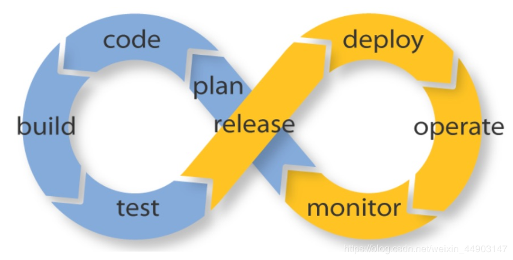
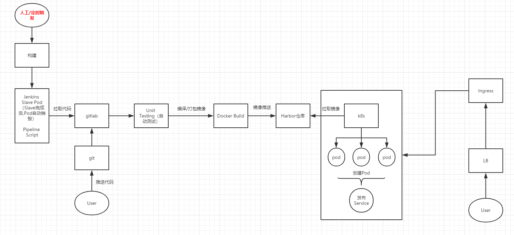
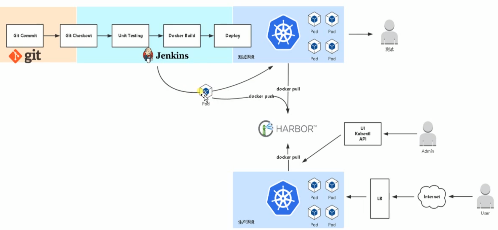

## 简介

CICD 是 持续集成（Continuous Integration）和持续部署（Continuous Deployment）简称。指在开发过程中自动执行一系列脚本来减低开发引入 bug 的概率，在新代码从开发到部署的过程中，尽量减少人工的介入。

<!--more-->

## 部署流程

#### 流程图

大致的部署流程是这样的：开发人员把做好的项目代码通过git推送到gitlab，然后Jenkins通过 gitlab  webhook ，自动从拉取gitlab上面拉取代码下来，然后进行build，编译、生成镜像。然后把镜像推送到Harbor仓库；然后在部署的时候通过k8s拉取Harbor上面的镜像进行创建容器和服务，最终发布完成，然后可以用外网访问。

当然啦，上面只是粗略的，请看下图才更加形象。

未完待续！！！