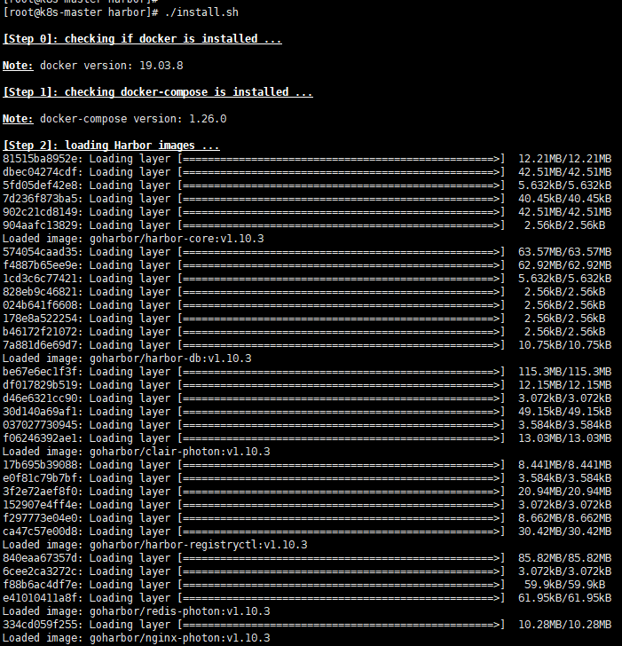
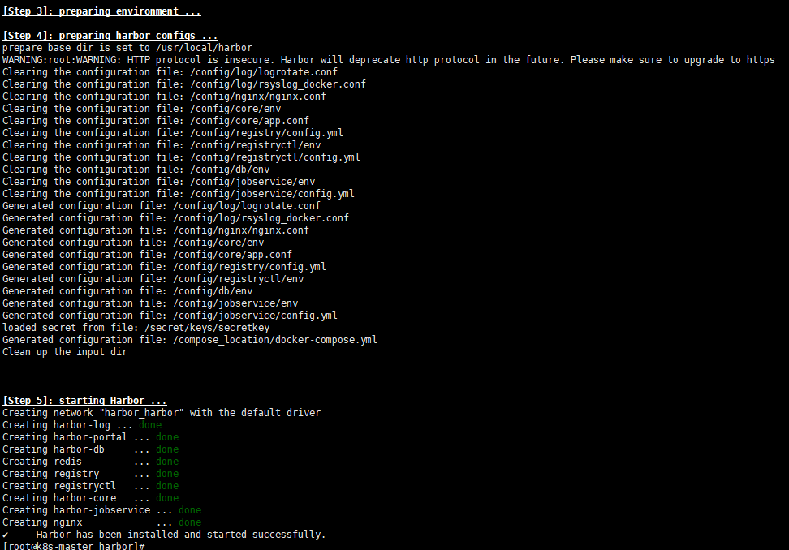
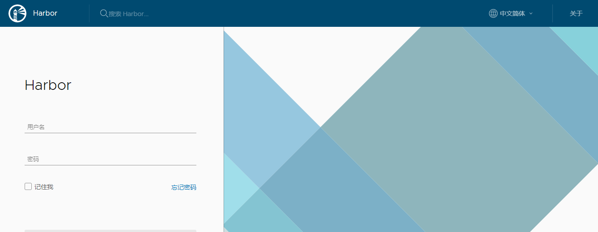
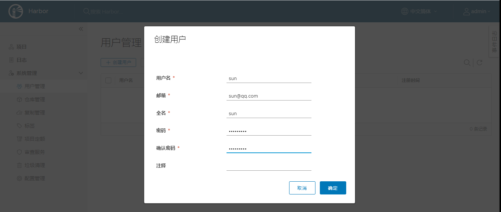
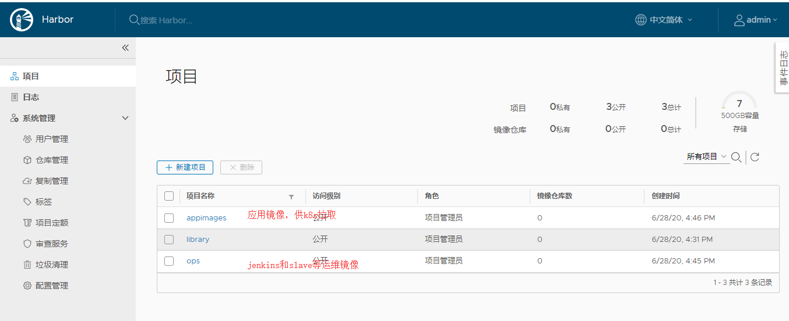
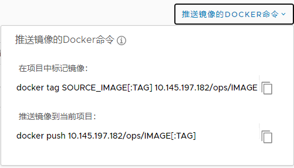

## 简介

Harbor是构建企业级私有docker镜像的仓库的开源解决方案，它是Docker Registry的更高级封装，它除了提供友好的Web UI界面，角色和用户权限管理，用户操作审计等功能外，它还整合了K8s的插件(Add-ons)仓库，即Helm通过chart方式下载，管理，安装K8s插件，而chartmuseum可以提供存储chart数据的仓库【注:helm就相当于k8s的yum】。另外它还整合了两个开源的安全组件，一个是Notary，另一个是Clair，Notary类似于私有CA中心，而Clair则是容器安全扫描工具，它通过各大厂商提供的CVE漏洞库来获取最新漏洞信息，并扫描用户上传的容器是否存在已知的漏洞信息，这两个安全功能对于企业级私有仓库来说是非常具有意义的。


<!--more-->

## 部署

### 安装docker

```bash
# 安装必要软件包
yum install -y yum-utils device-mapper-persistent-data lvm2
 
# 设置docker镜像源
yum-config-manager --add-repo \
  http://mirrors.aliyun.com/docker-ce/linux/centos/docker-ce.repo
 
# 安装docker-ce
yum update -y && yum install -y \
  containerd.io-1.2.13 \
  docker-ce-19.03.8 \
  docker-ce-cli-19.03.8
 
# 启动docker，并设置开机自启
systemctl enable docker && systemctl start docker
 
# 配置docker镜像加速
cat <<EOF >  /etc/docker/daemon.json
{
  "exec-opts": ["native.cgroupdriver=systemd"],
  "registry-mirrors": [ "https://gcr.azk8s.cn", "https://docker.mirrors.ustc.edu.cn", "http://hub-mirror.c.163.com", "https://registry.docker-cn.com"]
}
EOF
 
# 重启docker
systemctl daemon-reload
systemctl restart docker
```


### 下载harbor软件包

从[官方下载地址](https://github.com/goharbor/harbor/releases)下载稳定软件包，这里用   harbor-offline-installer-v1.10.3.tgz。可以参考[官方安装文档](https://github.com/goharbor/harbor/blob/master/docs/install-config/_index.md)


### Docker-compose安装

[官方文档](https://docs.docker.com/compose/install/)

**方法一**

```bash
# 下载
curl -L "https://github.com/docker/compose/releases/download/1.26.0/docker-compose-$(uname -s)-$(uname -m)" -o /usr/local/bin/docker-compose

# 授权
chmod +x /usr/local/bin/docker-compose

# 验证
docker-compose --version

# 如有报错，可能为路径没有包含/usr/local/bin/
ln -s /usr/local/bin/docker-compose /usr/bin/docker-compose
```

**方法二**

```bash
# 安装python-pip
yum -y install epel-release
yum -y install python-pip

# 安装docker-compose
pip install docker-compose

# 验证
docker-compose --version
```

### 安装

```bash
# 将下载好的Harbor二进制包上传到服务器上面，然后解压出来
tar -xzvf harbor-offline-installer-v1.10.3.tgz -C /usr/local
```

### 配置

```bash
# 进入解压出来的文件夹harbor中，查看
cd /usr/local/harbor
ls 

common.sh  harbor.v1.10.3.tar.gz  harbor.yml  install.sh  LICENSE  prepare

# 修改配置
vim harbor.yml

# 设置为外网ip
hostname: 10.145.197.182

# 关闭https
# https related config
#https:
  #https port for harbor, default is 443
  #port: 443
  #The path of cert and key files for nginx
  #certificate: /your/certificate/path
  #private_key: /your/private/key/path
  
# 修改harbor的登录密码：为了方便起见，我修改为123456,大家可自行修改
harbor_admin_password: 123456

# 预执行
./prepare

# 安装
./install.sh
```





### 查看状态

```
docker-compose ps
```


### 访问

用浏览器访问，方式为：http://ip，用户名：admin/自行配置的密码



## 使用

### 创建用户

进入到里面后，在用户管理中创建了一个用户  sun 。大家自行创建，为了后期需要把一些依赖镜像先推送到harbor仓库中。



### 项目规划

创建项目，并且在每个项目中都加入了刚才所创建的用户，方便后期登录并推送镜像



ops主要是用来存放的jenkins和slave等运维镜像；appimages 主要存放应用镜像，供k8s拉取发布。

至此，harbor部署完成。

### 镜像操作

##### 配置私有库

docker 默认是按 https 请求的，由于搭建的私有库是 http 的，所以需要修改 docker 配置，将信任的库的地址写上修改文件 `/etc/docker/daemon.json`

```json
vim /etc/docker/daemon.json

{
  "registry-mirrors": [ "https://gcr.azk8s.cn", "https://docker.mirrors.ustc.edu.cn", "http://hub-mirror.c.163.com", "https://registry.docker-cn.com"],
  "insecure-registries": ["10.145.197.182"]
}
```

##### 重启docker

```
systemctl restart docker
```

##### 配置验证

执行 docker info,  看一下IP地址是否生效，发现已加入。再试一下登录，发现登录成功，然后开始推送把。


##### 登录harbor仓库

```bash
docker login 10.145.197.182
```


##### 制作镜像和上传

```bash
# 拉取镜像
docker pull jenkins
# 重新打tag
docker tag jenkins:latest 10.145.197.182/ops/jenkins
# 推送
docker push 10.145.197.182/ops/jenkins
```



##### 上传验证

web页面查看


## 管理

### 修改端口号

```bash

#对于http发布方式，Harbor默认使用80端口
#需要修改端口按照如下方法： 修改docker-compose.yml中nginx的配置，将80:80的第一个80改为自定义的端口号。 修改common/templates/registry/config.yml，在auth部分#ui_url后面加上自定义的端口号 修改完成后，运行下面的命令重新配置Harbor

docker-compose down
./install.sh
#对于第一次安装，直接修改完所有配置文件后执行install.sh就可以。
```

### 停止/启动

```bash
docker-compose stop
docker-compose start
```

### 卸载Harbor

```bash
#执行如下步骤彻底删除Harbor，以便重新安装：
sudo docker-compose down
rm -rf /data/database
rm -rf /data/registry
```

### 修改Harbor配置

```bash
#首先删除container，修改配置，然后运行install.sh重新启动container，命令如下：
docker-compose down
vim harbor.cfg
./install.sh
```

### 部署镜像服Registry

```bash
# 由于Harbor已经包含了registry的镜像,这里就将就使用这个镜像来部署。

#创建一个存储registery配置的文件夹:
mkdir registry
#拷贝harbor内registry的配置文件
cp harbor/common/config/registry/* registry/

#向config.yml追加代理配置
cat>>registry/config.yml<<'EOF'
proxy:
  remoteurl: https://registry-1.docker.io
EOF
#创建一个docker-compose.yml文件,内容如下:
version: '2'
services:
  registry:
    image: vmware/registry-photon:v2.6.2-v1.4.0
    container_name: registry-mirror
    restart: always
    volumes:
      - /data/registry:/storage:z
      - ../registry/:/etc/registry/:z
    networks:
      - harbor
    ports:
      - '5000:5000'
    environment:
      - GODEBUG=netdns=cgo
    command:
      ["serve", "/etc/registry/config.yml"]
networks:
  harbor:
    external: false

# 启动
cd registry && docker-compose start# 
#停止
cd registry && docker-compose stop
# 使用
# 同阿里云设置,地址改一下就可以。 这里地址根据配置文件是：
http://192.168.0.65:5000
```

