# LDAP部署

## 介绍

可以通过以下三句话快速的认识一下LDAP：

1. LDAP：Lightweight Directory Access Protocol，轻量目录访问协议。
2. LDAP服务是一个为只读（查询、浏览、搜索）访问而优化的非关系型数据库，呈树状结构组织数据。
3. LDAP主要用做用户信息查询（如邮箱、电话等）或对各种服务访问做后台认证以及用户数据权限管控。

#### 名词解释

- DC：domain component一般为公司名，例如：dc=163,dc=com
- OU：organization unit为组织单元，最多可以有四级，每级最长32个字符，可以为中文
- CN：common name为用户名或者服务器名，最长可以到80个字符，可以为中文
- DN：distinguished name为一条LDAP记录项的名字，有唯一性，例如：dc:"cn=admin,ou=developer,dc=163,dc=com"

#### 图形示例

上边来了一堆的名词解释，看的云里雾里，还不是很明白，怎么跟自己的组织架构对应起来呢？看看下边的图是不是清晰明了

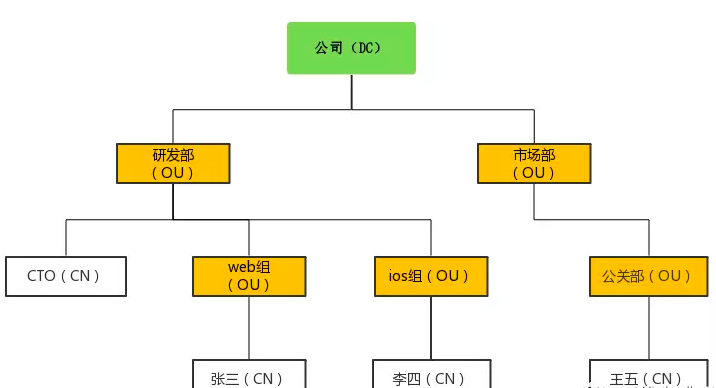

<!--more-->

## 部署

部署环境：Debian 8.4

1.安装OpenLDAP,OpenLDAP服务端程序叫slapd

```shell
# apt-get install -y slapd
```

2.安装完成之后，会自动生成一个OpenLDAP的系统账号

```shell
# cat /etc/passwd
openldap:x:110:115:OpenLDAP Server Account,,,:/var/lib/ldap:/bin/false
```

3.生成OpenLDAP管理员账号的密码（后边修改配置文件需要使用）

```shell
# slappasswd
New password: 
Re-enter new password: 
{SSHA}EcAoXeGab5g8y2Y03EmH3+Zc3hJaHp7F
```

4.新建OpenLDAP配置文件

```shell
# cp /usr/share/slapd/slapd.conf /etc/ldap/
# 配置文件中有很多@xxx@的配置替换为真实配置

# slaptest -f /etc/ldap/slapd.conf 
5ad9b19d /etc/ldap/slapd.conf: line 105: rootdn is always granted unlimited privileges.
5ad9b19d /etc/ldap/slapd.conf: line 122: rootdn is always granted unlimited privileges.
config file testing succeeded
```

配置文件重要参数说明（需要自己修改的，其他未提到的可以不修改）：

- `database bdb`：定义使用的后端数据存储格式，数据库默认采用了berkeley db，其后可以跟的值有bdb、ldbm、passwd、shell。bdb指使用Berkley DB 4数据库
- `suffix "dc=163,dc=com"`：suffix是"LDAP基准名"，它是LDAP名字空间在这里的根。设置想要创建的子树的根DN
- `rootdn "cn=admin,dc=163,dc=com"`：设置管理LDAP目录的超级用户的DN。这个用户名不要出现在/etc/passwd文件里
- `rootpw {SSHA}EcAoXeGab5g8y2Y03EmH3+Zc3hJaHp7F`：设置这个数据库的超级用户的口令验证方式。也就是上边rootdn设置的用户的密码。一定要用加密的口令存储，可以使用的加密方式有：CRYPT、MD5、SMD5、SHA和SSHA，**就是我们第三步生成的密码**
- `directory /var/lib/ldap`：设置LDAP数据库和索引文件所在的目录
- `access to`：权限配置下边详细说明

5.删除原配置，生成新配置

```shell
# rm -rf /etc/ldap/slapd.d/*
# slaptest -f /etc/ldap/slapd.conf -F /etc/ldap/slapd.d/

# 给新生成的配置文件赋予OpenLdap的权限
# chown -R openldap.openldap /etc/ldap/slapd.d/
```

6.重启OpenLdap

```shell
# /etc/init.d/slapd restart
```

## ACL权限控制

ACL访问指令的格式：

```shell
access to [what]
    by [who] [control]
```

简单解释：通过access to约束我们访问的范围（what），通过by设定哪个用户（who）有什么权限（control）

ACL的详细配置还是比较复杂的，可以看下下边参考文档的第三篇，写的比较详细，这里都不再赘述。

### 线上ACL控制配置解析

为了用户能够自主修改密码，部署了lam给用户使用（见下文lam介绍）。希望能达到的效果是：

1. 管理员能够有全部权限，包含新建用户，修改用户属性，充值用户密码等
2. 普通用户只能修改自己的密码，别的权限都没有

配置如下：

```shell
# access to attrs=userPassword通过属性找到访问范围密码,
# 超级管理员也就是我们ldap配置文件里写的rootdn："cn=admin,dc=163,dc=com"有写(write)权限；
# 由于管理员可能不止一个，我创建了个管理员组"ou=Admin,dc=163,dc=com"把管理员统一都放到这个组下，管理员组下的所有用户（dn.children）有写权限；
# 匿名用户(anonymous)要通过验证(auth);
# 自己(self)有对自己密码的写（write）权限，其他人(*)都没有权限(none).
access to attrs=userPassword,shadowLastChange
        by dn="cn=admin,dc=163,dc=com" write
        by dn.children="ou=Admin,dc=163,dc=com" write
        by anonymous auth
        by self write
        by * none

# access to * 所有其他属性，
# 超级管理员rootdn："cn=admin,dc=163,dc=com"有写(write)权限；
# 管理员"ou=Admin,dc=163,dc=com"成员有写(write)权限；
# 其他人(*)只有读(read)权限
access to *
        by dn="cn=admin,dc=163,dc=com" write
        by dn.children="ou=Admin,dc=163,dc=com" write
        by * read
```

## 备份和还原

### 备份

```shell
# ldapsearch -x -b "dc=163,dc=com" -D "uid=authz,ou=Public,dc=163,dc=com" -w "CzfdX629K7" > ldap.20180626.ldif
```

参数说明：

- `-x`：进行简单的验证
- `-D`：用来绑定服务器的DN
- `-w`：绑定DN的密码
- `-b`：要查询的根节点
  authz账号要有`"dc=163,dc=com"`的查询权限

### 还原

```shell
# ldapadd -x -c -D "cn=admin,dc=163,dc=com" -w "smile" -f ldap.20180626.ldif
```

参数说明：

- `-c`：出错后继续执行程序不终止，默认出错即停止
- `-f`：从文件内读取信息还原，而不是标准输入
  还原的DN最好为管理员账号，至少也要有要LDAP的写入权限

## web管理工具

### 安装

1.安装ldap-account-management

```shell
# apt-get install ldap-account-manager
```

2.浏览器访问

```shell
http://ip/lam
```

### 配置

lam的所有配置都可以在web端配置，不需要去服务器上修改一行代码，这个太好用了。

1. 浏览器访问后进入登录页面，我们点击右上角"LAM configuratrion"来在线编辑配置文件

   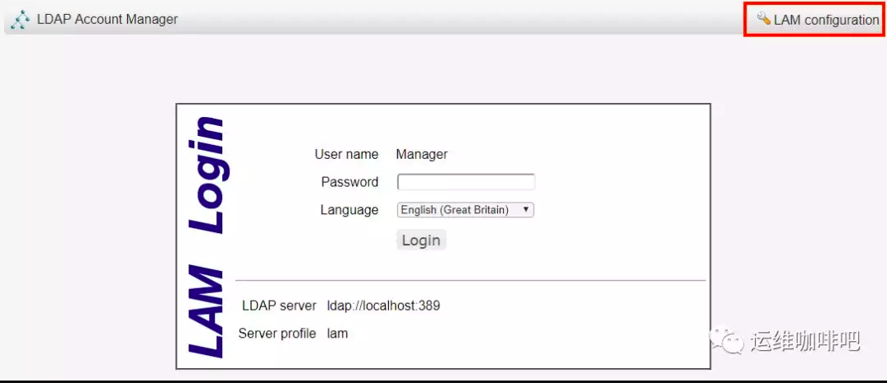

2. 看到如下页面有两个选项："Edit general settings"来编辑通用配置，默认密码lam，进入之后能配置密码策略、日志、管理员密码，最重要的是更新掉管理员密码，这个在后边"Manage server profiles"管理的时候需要提供；"Edit server profiles"来编辑服务器配置，我们先来编辑服务器配置

   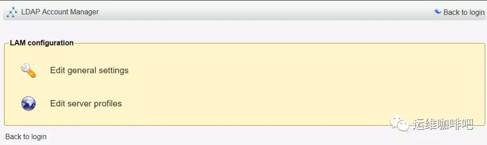

3. 进入如下页面，输入默认密码lam即可编辑配置，这里要说明一下的是红框标注的"Manage server profiles"可以对服务器的配置文件进行配置，例如增加、删除配置文件、配置文件重命名，最重要的是可以设置配置文件密码（也就是我们刚输入的密码lam，但修改密码需要管理员密码，后边配置）

   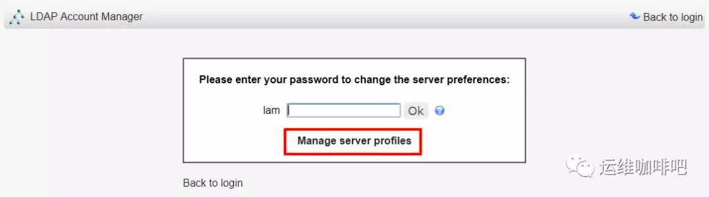

4. 输入密码lam后就正式进入服务器配置页，看到第一个标签"General setting"，（可以先改下语言简体中文保存，整站就给汉化啦，英文渣渣看起来就非常方便了），基本配置都看的很清晰了，主要是Tree suffix配置为自己的DC可以了

   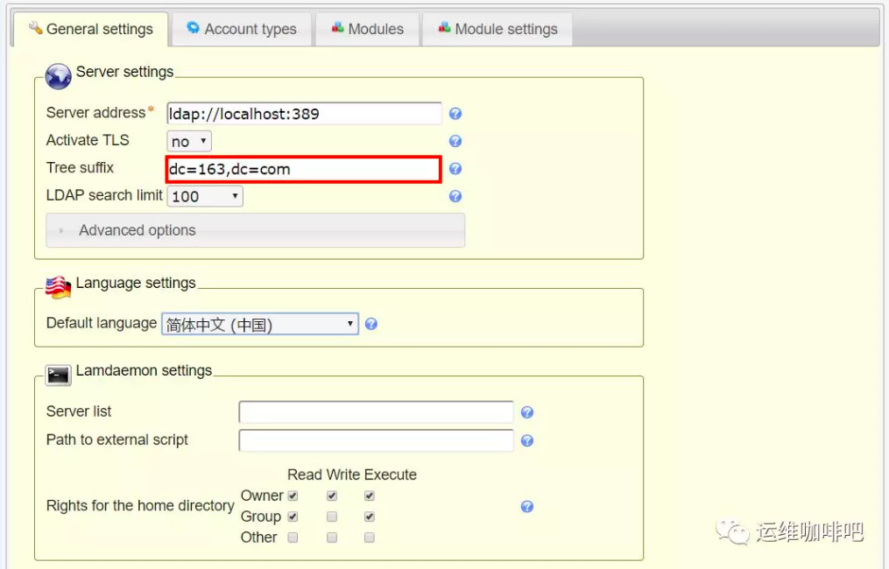

5. 接着来看这个页面，"security settings"非常重要，配置以何种方式登录web控制台，默认为Fixed list模式，就是下边列表里配置的dn可以登录，我们LDAP里还没有任何一个账号（当我们创建了账号之后可以选择"LDAP serch"的模式，让普通账号也能登录以修改自己的密码），这里要选择fixed list模式并配置为我们LDAP的rootdn，设置一个密码登录之后创建账号等操作

   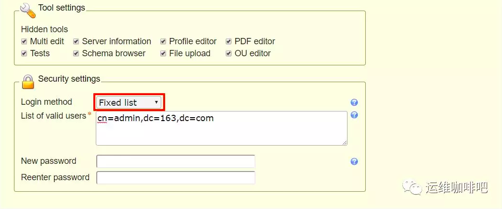

6. 接下来就是"Account types"标签页的配置，这里配置我们登录web控制显示的标签，我这里只需要他显示用户，就把Group之类的都删除了，保留了User

   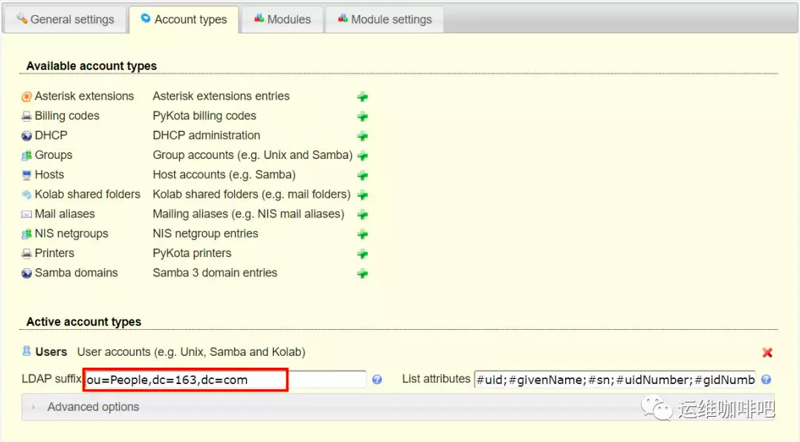

7. "Modules"页面配置上一个具体每个account type显示的模块

   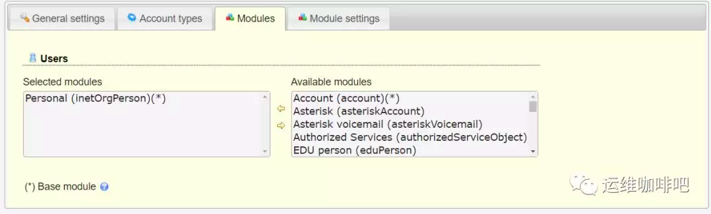

8. "Models setting"页面配置models具体要显示的内容，不得不说配置非常详细

   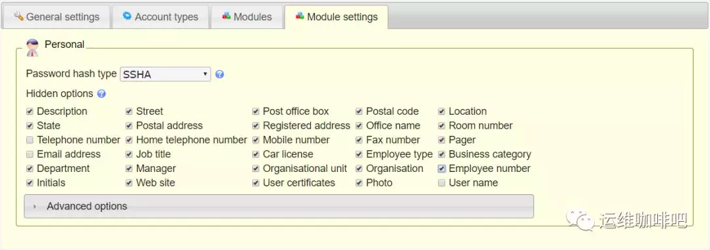

9. 经过上边的配置就可以进入控制台新建账号了，新建账号之前一个有用的操作是修改用户的默认RDN标致为uid，更高位置在登录web控制台后右上角配置文件编辑器里边

   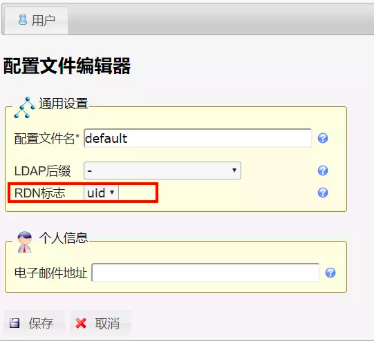

10. 基本配置完成，可以开始使用了，中文界面比较清晰，无需过多解释啦。

# SVN集成OpenLDAP认证

- 系统环境：Debian8.4
- svn部署环境：Apache2.4 + Subversion

1. Apache开启LDAP相关模块

```shell
# a2enmod ldap
Enabling module ldap.
To activate the new configuration, you need to run:
  service apache2 restart
# a2enmod authnz_ldap
Considering dependency ldap for authnz_ldap:
Module ldap already enabled
Enabling module authnz_ldap.
To activate the new configuration, you need to run:
  service apache2 restart
```

1. 修改vhost配置文件，添加对ldap的支持

```
<Virtualhost *:8088>
    DocumentRoot /home/svn/repos/
    ServerName svn.domain.com

    <Location /ne/>
        DAV svn
        SVNListParentPath on
        SVNParentPath "/home/svn/repos"

        AuthType Basic
        AuthName "Private Subversion Repository"

        #AuthUserFile "/etc/subversion/dav_svn.passwd"
        AuthzSVNAccessFile "/etc/subversion/dav_svn.authz"

        # use LDAP auth
        AuthBasicProvider ldap
        AuthLDAPBindAuthoritative on
        AuthLDAPURL "ldap://ldap.domain.com/dc=domain,dc=com?uid?sub?(objectclass=*)"
        AuthLDAPBindDN "uid=authz,ou=Public,dc=domain,dc=com"
        AuthLDAPBindPassword "CzfdX629K7"

        Require ldap-user

    </Location>
</Virtualhost>
```

## 主要LDAP配置文件详解：

**AuthType**：验证类型，Basic使用账号密码验证

**AuthName**：提示字符串

**AuthBasicProvider**：使用ldap验证

**AuthLDAPBindAuthoritative**：on表示只要求验证ldap用户，别的不认，off则可以使用svn的账号和ldap混合账号登录

- apache2.2中配置是`AuthzLDAPAuthoritative`，到2.4中改为了`AuthLDAPBindAuthoritative`
- 但在实际应用中发现并么有什么用，设置为off后ldap认证失败也不会去找AuthzSVNAccessFile，或许是我姿势不对，有知道原因的烦请告知

**Require**：ldap-user或valid-user

**AuthLDAPURL | AuthLDAPBindDN | AuthLDAPBindPassword**： 用于查找用户的账号密码，一般设置个只读账号即可

- AuthLDAPURL：[协议名称]://[ip地址或者域名]:[端口号]/[baseDN]?[attr]?[scope]?[filter]

- - baseDN：指定开始搜索的节点的名称
  - attr：就是用户输入的属性键，默认是“uid”
  - scope: one,sub,base，默认是sub
  - filter：过滤器，默认是objectclass=*

## LDAP服务器认证过程

可能只看配置文件不能了解LDAP认证的原理，接下来我们详细讨论下LDAP是如何认证的

客户端(httpd)使用提供的URL(AuthLDAPURL)进行验证的时候，并不是直接验证输入的账号密码，因为LDAP服务器在验证的时候要使用DN(每个节点用户的唯一标识)和密码来进行登陆验证的，但是DN一般来说比较长，诸如:“cn=xxx,ou=xxx,ou=xxx,dc=xxx,dc=xxx”，这种光输入的时候就烦死了，所以要想使用简短的用户名来登陆的时候，一般的做法是在某个节点用户上添加一个属性，比如mobile(手机号),Email(邮箱),user name或者uid(用户名),然后使用这个属性的值来登陆（大部分情况下都用uid，我们也是这么使用的）。

当用户输入这个属性值（一般uid）和密码的时候，客户端(httpd服务器)先使用AuthLDAPBindDN和AuthLDAPBindPassword作为用户名和密码登陆，根据AuthLDAPURL指定的查询规则来查找用户输入的属性的值有没有，如果查找的条数为0或者大于1，则返回错误，如果查找的条数等于1，则使用查找到的这个条目的DN和用户输入的密码进行登陆验证，成功则成功，失败则失败。

总结一下LDAP的认证过程分为两部：

1. 搜索用户是否存在LDAP服务器中：配置文件中配置的AuthLDAPBindDN和AuthLDAPBindPassword两个属性主要目的就是为了登陆LDAP服务器搜索属性(uid)是否只有一条，如果服务器允许匿名访问则这两个配置可以不需要，但一般为了安全性都会关闭LDAP的匿名访问，新建一个只读权限的账号配置到这里即可
2. 使用用户输入的属性值（uid）和密码进行登陆验证

# GitLab集成OpenLDAP认证

## GitLab配置

1. 修改配置文件gitlab.yml

```yml
ldap:
enabled: true
servers:
  main: 
    label: 'LDAP'

    host: 'ldap.domain.com'
    port: 389
    uid: 'uid'
    method: 'plain'
    bind_dn: 'uid=authz,ou=Public,dc=domain,dc=com'
    password: 'CzfdX629K7'

    timeout: 10

    active_directory: false
    allow_username_or_email_login: false

    block_auto_created_users: false

    base: 'dc=domain,dc=com'
    user_filter: ''
```

1. 重启GitLab服务，看到页面已经有LDAP的登录选项了

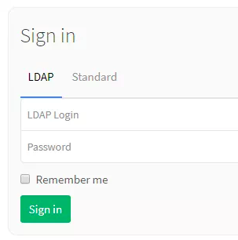

## 重要配置参数解释

仔细阅读上一篇svn集成LDAP认证的文章这些参数会更好理解

- **host**：LDAP服务器地址
- **port**：LDAP服务端口
- **uid**：以哪个属性作为验证属性，可以为uid、cn等，我们使用uid
- **method**：如果开启了tls或ssl则填写对应的tls或ssl，都没有就填写plain
- **bind_dn**：search搜索账号信息的用户完整bind（需要一个有read权限的账号验证通过后搜索用户输入的用户名是否存在）
- **password**：bind_dn用户的密码，`bind_dn`和`password`两个参数登录LDAP服务器搜索用户
- **active_directory**：LDAP服务是否是windows的AD，我们是用的OpenLDAP，这里写false
- **allow_username_or_email_login**：是否允许用户名或者邮箱认证，如果是则用户输入用户名或邮箱都可
- **base**：从哪个位置搜索用户，例如允许登录GitLab的用户都在ou gitlab里，name这里可以写`ou=gitlab,dc=domain,dc=com`
- **filter**：添加过滤属性，例如只过滤employeeType为developer的用户进行认证，可以设置`employeeType=developer`

# Jenkins集成OpenLDAP认证

## 安装LDAP插件

使用LDAP认证需要安装LDAP插件，安装插件有两种方法：

### 方法一：后台插件管理里直接安装

- 优点：简单方便，不需要考虑插件依赖问题
- 缺点：因为网络等各种问题安装不成功

安装方法：登录Jenkins --> 系统管理 --> 插件管理 --> 可选插件 --> 搜索LDAP --> 选中 --> 直接安装 --> 安装完成重启

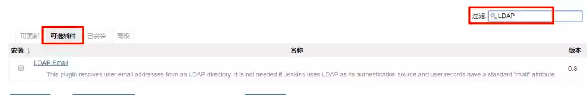

因我们已经安装过了LDAP插件，所有这里搜索不到LDAP插件，只有LDAP Email插件

如果安装失败，网上也有说在插件管理 --> 高级 --> 升级站点里替换URL为`https://mirrors.tuna.tsinghua.edu.cn/jenkins/updates/update-center.json`的，但是我替换了之后依然没有成功，最后还是使用方法二安装成功的

### 方法二：官网下载安装文件后台上传

- 优点：一定可以安装成功的
- 缺点：麻烦，要去官网找插件并解决依赖

插件下载地址：https://updates.jenkins-ci.org/download/plugins/

安装方法：官网下载插件 --> 登录Jenkins --> 系统管理 --> 插件管理 --> 高级 --> 上传插件 --> 选择文件 --> 上传 --> 安装完成后重启


上传插件安装可能会失败，大部分都是提示你当前插件依赖某些插件，只需要下载全部依赖插件，按照顺序上传安装即可，LDAP插件安装完成后，所有依赖的插件如下：

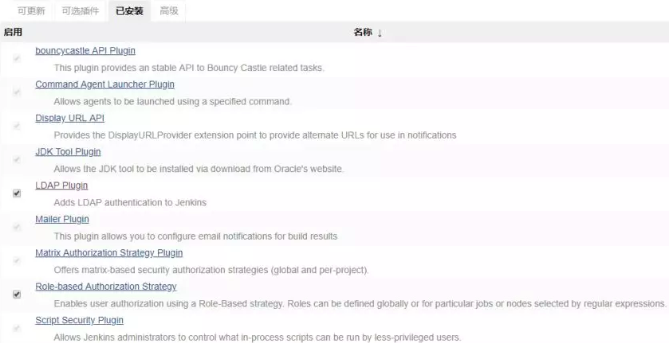

## 配置LDAP认证

登录Jenkins --> 系统管理 --> 全局安全配置

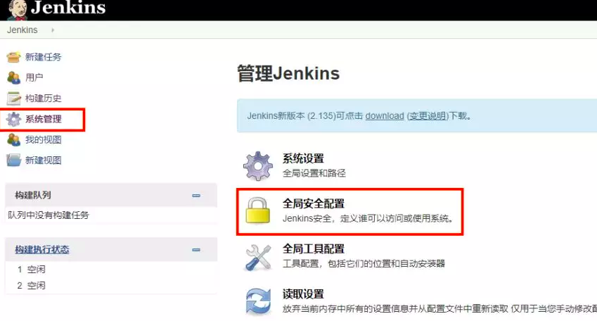

访问控制选择“LDAP”，Server输入LDAP服务器地址，有其他配置可以点击“Advanced Server Configuration…”

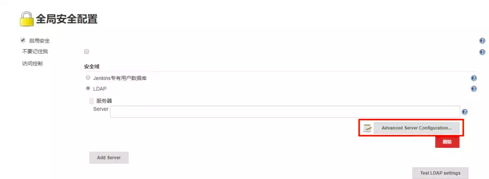

**Server**：服务器地址，可以直接填写LDAP服务器的主机名或IP，例如`ldap.domain.com`（默认端口389），或者`ldap.domain.com:1389`，如果用了SSL，可以填写`ldaps://ldap.domain.com`（默认端口636），或者`ldaps://ldap.domain.com:1636`

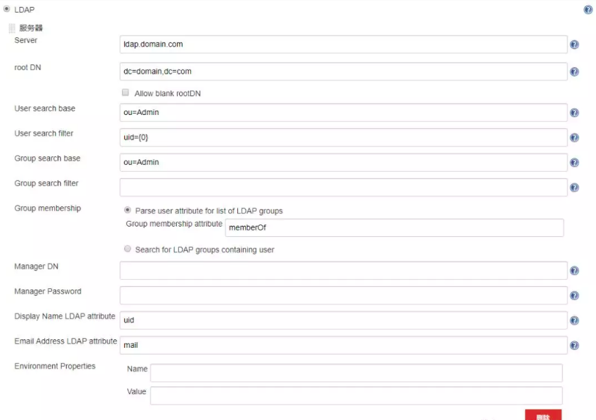

**root DN**：这里的root DN只是指搜索的根，并非LDAP服务器的root dn。由于LDAP数据库的数据组织结构类似一颗大树，而搜索是递归执行的，理论上，我们如果从子节点（而不是根节点）开始搜索，因为缩小了搜索范围那么就可以获得更高的性能。这里的root DN指的就是这个子节点的DN，当然也可以不填，表示从LDAP的根节点开始搜索

**User search base**：这个配置也是为了缩小LDAP搜索的范围，例如Jenkins系统只允许ou为Admin下的用户才能登陆，那么你这里可以填写`ou=Admin`，这是一个相对的值，相对于上边的root DN，例如你上边的root DN填写的是`dc=domain,dc=com`，那么user search base这里填写了`ou=Admin`，那么登陆用户去LDAP搜索时就只会搜索`ou=Admin,dc=domain,dc=com`下的用户了

**User search filter**：这个配置定义登陆的“用户名”对应LDAP中的哪个字段，如果你想用LDAP中的uid作为用户名来登录，那么这里可以配置为`uid={0}`（{0}会自动的替换为用户提交的用户名），如果你想用LDAP中的mail作为用户名来登录，那么这里就需要改为`mail={0}`。在测试的时候如果提示你`user xxx does not exist`，而你确定密码输入正确时，就要考虑下输入的用户名是不是这里定义的这个值了

**Group search base**：参考上边`User search base`解释

**Group search filter**：这个配置允许你将过滤器限制为所需的objectClass来提高搜索性能，也就是说可以只搜索用户属性中包含某个objectClass的用户，这就要求你对你的LDAP足够了解，一般我们也不配置

**Group membership**：没配置，没有详细研究

**Manager DN**：这个配置在你的LDAP服务器不允许匿名访问的情况下用来做认证（详细的认证过程参考文章LDAP落地实战（二）：SVN集成OpenLDAP认证中关于LDAP服务器认证过程的讲解），通常DN为`cn=admin,dc=domain,dc=com`这样

**Manager Password**：上边配置dn的密码

**Display Name LDAP attribute**：配置用户的显示名称，一般为显示名称就配置为uid，如果你想显示其他字段属性也可以这里配置，例如mail

**Email Address LDAP attribute**：配置用户Email对应的字段属性，一般没有修改过的话都是mail，除非你用其他的字段属性来标识用户邮箱，这里可以配置

下边还有一些配置如：环境变量Environment Properties、servlet容器代理等，很少用就不多解释了。有一个配置`Enable cache`可能会用得到，当你的LDAP数据量很大或者LDAP服务器性能较差时，可以开启缓存，配置缓存条数和过期时间，那么在过期时间内新请求优先查找本地缓存认证，认证通过则不会去LDAP服务器请求，以减轻LDAP服务器的压力

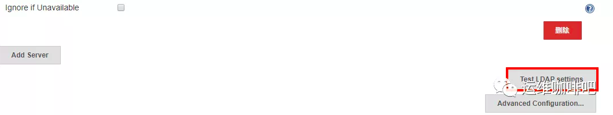

配置完成后可以点击下方的“Test LDAP sttings”来测试配置的准确性

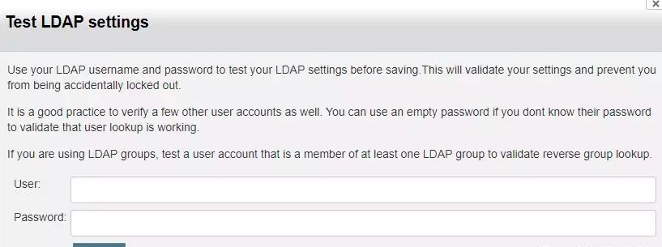

这里输入的用户名就是你上边配置的`User search filter`里定义的LDAP中的属性，密码就是LDAP的密码

## 登录

配置完成并测试通过后就可以用LDAP直接登录了，注意：启用了LDAP登录后将无法再用之前的登录方式（例如本地认证）登录

