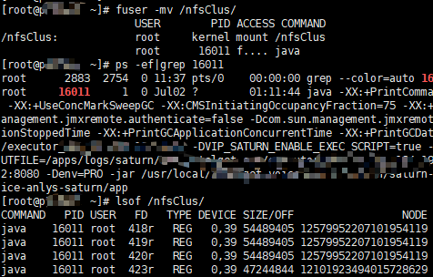
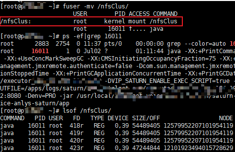

现在系统功能越来越丰富，那么响应的开发资源需要的越来越多，文件存储也越来越必要。无论是你用nfs、glusterfs等等，都需要在linux服务器中设置挂载点并执行挂载后才可使用，但如果fs文件系统有调整，那么可能就需要卸载umount,重新挂载，但是你真的可以顺顺利利的卸载吗？不见得，因为可能有应用在占用该磁盘或者系统在fstab中写入了磁盘自动挂载，本文就详细给你介绍个小技巧，帮你解决该烦恼。


<!--more-->

## 场景一：磁盘正有程序占用

但出现这种情况时，可以根据提示用lsof 或fuser来判断有哪些进程正在占用该磁盘，停掉改进程，重新挂载后再重新启动进程应用即可。



可以根据图上看到，找到了进程16011占用了该文件系统，并可以准确看到该进程是哪些应用，并占用了哪些文件等信息。

**科普**

```sh
fuser -m -v /mnt 
```

可以查看到当前占用/mnt目录的进程号，然后用kill杀死它。

也可以直接杀死这个进程

```sh
fuser -m -k /mnt 
```

如果你不是很明确是否要杀死所有霸占设备的程序，你还可以加一个 -i 参数，这样每杀死一个程序前，都会询问,加参数-i 

```sh
fuser -m -v -i -k /mnt
```

-m :  表明指定的路径是一个挂载点显示所有使用指定文件系统的进程。后面可以跟挂载点或dev设备

-v :    给出详细的输出。可以给出了占用磁盘程序的详细信息，如进程号等。

## 场景二：内核占用

应用程序占用可以根据场景一操作拿到进程id，你就可以对它为所欲为了。但是场景一图中有一个隐藏的信息，可能有同学已经发现



PID:  kernel这个是内核占用着该磁盘，要怎么去杀掉呢。这又是怎么造成的呢？

出现这种情况是因为在linux系统fstab中添加的文件磁盘，那么在系统启动时，内核自动挂载该磁盘，所有就是内核进程。


那有办法解决吗？答案是肯定的，要不就不会有本教程了。

**方法一**

既然内核占有，那么先把fstab中fs挂载点删掉，并重启服务器，那么重启时内核重新加载，就不会再占用了。

但是对于生产环境，业务应用在线上跑，有没有不用重启，还能解决挂载问题的呢？


**方法二**

lazy umount法，使用如下命令和参数：

```
umount -l /mnt
```

–l ：并不是马上umount，而是在该目录空闲后再umount。

**请注意，该方法并不是完全安全的，它主要完成如下操作：**

1，立即从目录结构中实现卸载，即新进程将无法通过/media/disk访问,该磁盘。

2，正在访问该文件系统的程序不受影响。即正在操作/media/disk的进程不会被打断，且仍可以读写磁盘中的所有文件。如果所有进程对/media/disk的操作都执行完，那么才真正地umount。

由此可知，lazy umount并没有真正实现umount，仅用于特殊需要的情况。


## 总结

被应用程序占用，找到进程号，停掉应用解除占用就可卸载。如果是内核占用，可以重启或用lazy  umount来解决。但都有优劣点，需要自行把握。