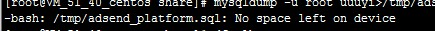
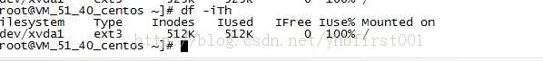

## 目的

根据自己多年的工作经历和经验，对日常中的细节技巧和用法进行归纳和总结。

持续更新中...

<!--more-->

## 技巧详解

### 指定特定用户执行命令

```shell
sudo -H -u www bash -c 'nohup /home/web/ke/upfileserver /home/web/ke/up/conf.json &'
```

### 统计机器中网络连接各个状态个数

```shell
netstat -an | awk '/^tcp/ {++S[$NF]}  END {for (a in S) print a,S[a]} '
```

### 删除乱码

```shell
find . ! -regex '.*\.jar\|.*\.war\|.*\.zip'|xargs rm
```

### 过滤IP

```SHELL
grep -E -o "172.18.[0-9]{1,3}[\.][0-9]{1,3}" filename
```

### 获取本机IP

```SHELL
ipaddr=$(ip addr | awk '/^[0-9]+: / {}; /inet.*global/ {print gensub(/(.*)\/(.*)/, "\\1", "g", $2)}')

echo $ipaddr
```

### **TIME_WAIT过多的解决办法**

```shell
查看当前状态
cat /proc/sys/net/ipv4/tcp_tw_reuse
cat /proc/sys/net/ipv4/tcp_tw_recycle
netstat -n | awk '/^tcp/ {++state[$NF]} END {for(key in state) print key,"/t",state[key]}'

修改内核参数
方法一：直接修改参数文件
echo "1" > /proc/sys/net/ipv4/tcp_tw_reuse
#让TIME_WAIT尽快回收，我也不知是多久，观察大概是一秒钟
echo "1" > /proc/sys/net/ipv4/tcp_tw_recycle
方法二：命名修改内核参数并生效
[root@aaa1 ~]# sysctl -a|grep net.ipv4.tcp_tw
net.ipv4.tcp_tw_reuse = 0
net.ipv4.tcp_tw_recycle = 0
[root@aaa1 ~]#

vi /etc/sysctl
增加或修改net.ipv4.tcp_tw值：
net.ipv4.tcp_tw_reuse = 1
net.ipv4.tcp_tw_recycle = 1

使内核参数生效：
[root@aaa1 ~]# sysctl -p

[root@aaa1 ~]# sysctl -a|grep net.ipv4.tcp_tw
net.ipv4.tcp_tw_reuse = 1
net.ipv4.tcp_tw_recycle = 1

用netstat再观察正常
```

### Linux Top命令 选择显示列及列排序

Top用于查看Linux系统下进程信息，有时候需要选择显示那些列，以及按照某一列进行排序。查询整理如下：

选择显示列：
执行top命令后，按 f 键，再按某一列的代表字母，即可选中或取消显示；

列显示位置调整：
执行top命令后，按 o 键，选择要调整位置的列（如K:CUP Usageage），按动一下大写K则显示位置往上调整，按动一下小写K则显示位置往下调整。

列排序：
执行top命令后，按 shift + f（小写），进入选择排序列页面，再按要排序的列的代表字母即可；

输入大写P，则结果按CPU占用降序排序。输入大写M，结果按内存占用降序排序。（注：大写P可以在capslock状态输入p，或者按Shift+p）


### no space left on device的解决方法(iNode满导致)

今天在腾讯云的服务器被攻击后，apache启动报错，查找原因发现是磁盘空间不够no space left on device，



诡异的是df命令磁盘占用仅55%


继续查找原因，发现是iNode已满，即没有索引空间



这就好办了，首先定位哪个目录占用iNode最多，命令如下：

```shell
find */ ! -type l | cut -d / -f 1 | uniq -c
```

定位完成，清理目录，整个世界都清净了

```shell
find /tmp -type f -exec rm {} \;

find /home -type f -size 0 -exec rm {} \; 
```


### 递归目录

```bash
#! /bin/bash

function read_dir(){
    for file in `ls $1`
    do
        if [ -d $1"/"$file ]  #注意此处之间一定要加上空格，否则会报错
        then
            read_dir $1"/"$file
        else
            echo $1"/"$file
        fi
    done
}

#测试目录 test
read_dir test
```

### 超时控制

```bash
#! /bin/bash
set -x

timeout()
{
        waitfor=3
        command=$*
        $command &
        commandpid=$!

        sleep $waitfor ; kill -9 $commandpid  > /dev/null 2>&1 &

        watchdog=$!
        sleeppid=$PPID
        wait $commandpid > /dev/null 2>&1

        kill $sleeppid > /dev/null 2>&1
}

#测试的动作函数
test123()
{
        sleep 20
}

timeout test123
```

### python查找list中含特定字符的元素

```
lst = ["123a", "456b", "789c"]
lst = list(filter(lambda x: x.find("a") >= 0, lst))
print(lst)
```

