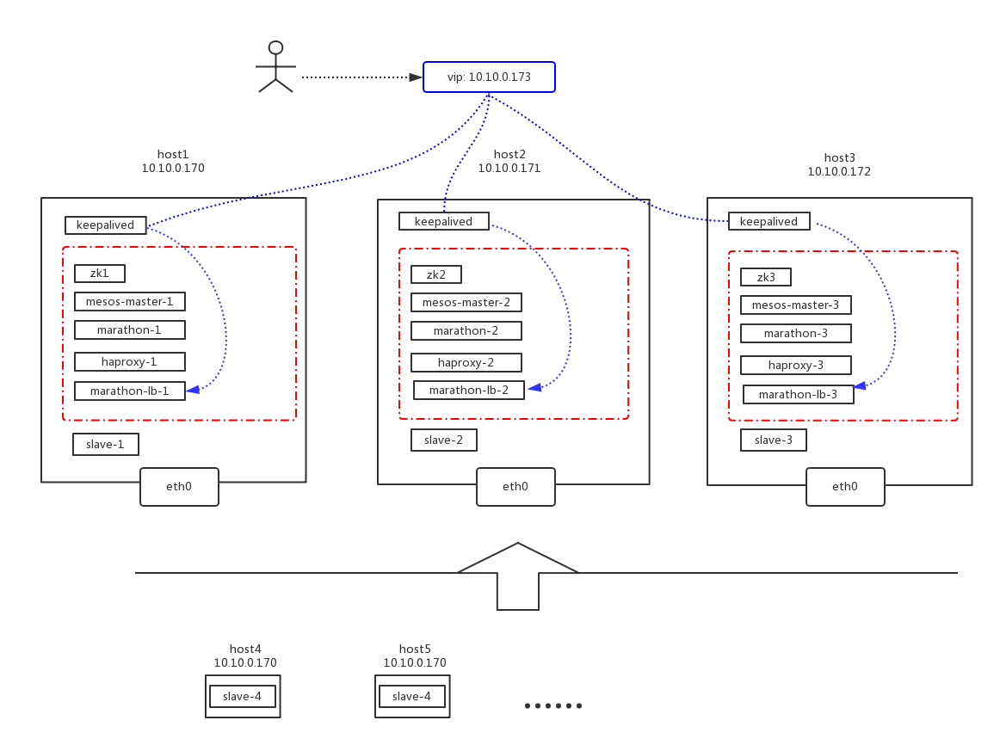

## 目的

通过本文构建mesos集群，用mesos+marathon把docker玩起来。

## 架构图



<!--more-->

## 环境

系统： Centos7.x + Docker环境

服务器：10.10.0.1，10.10.0.2，10.10.0.3

## 搭建

### 配置hosts解析:

```shell
#Mesos
10.10.0.1 mesos-node-1
10.10.0.2 mesos-node-2
10.10.0.3 mesos-node-3
```

### zookeeper集群

```shell
# 根据节点修改MYID,name

docker run -d \
-e MYID=1 \
-e SERVERS=mesos-node-1,mesos-node-2,mesos-node-3 \
--name mesos-zookeeper1 --net=host --restart=on-failure:5 mesoscloud/zookeeper:3.4.8-centos-7
```

### mesos-master集群

```shell
#根据节点修改ip.address, name

docker run -d \
-e MESOS_HOSTNAME=ip.address \
-e MESOS_IP=ip.address \
-e MESOS_QUORUM=1 \
-e MESOS_LOG_DIR=/var/log/mesos \
-e MESOS_WORK_DIR=/var/tmp/mesos \
-e MESOS_ZK=zk://mesos-node-1:2181,mesos-node-2:2181,mesos-node-3:2181/mesos \
--name mesos-master1 --net host --restart=on-failure:5 mesosphere/mesos-master:1.4.1
```

### marathon集群

```shell
# 根据节点修改ip.addresss, name

docker run -d \
-e MARATHON_HOSTNAME=ip.address \
-e MARATHON_HTTPS_ADDRESS=ip.address \
-e MARATHON_HTTP_ADDRESS=ip.address \
-e MARATHON_MASTER=zk://mesos-node-1:2181,mesos-node-2:2181,mesos-node-3:2181/mesos \
-e MARATHON_ZK=zk://mesos-node-1:2181,mesos-node-2:2181,mesos-node-3:2181/marathon \
--name mesos-marathon1 --net host --restart=on-failure:5 mesosphere/marathon:v1.5.2
```

### mesos-slave集群

```shell
# 根据节点修改ip.address, name

docker run -d \
-v /usr/bin/docker:/usr/bin/docker \
-v /var/run/docker.sock:/var/run/docker.sock \
-v /sys/fs/cgroup:/sys/fs/cgroup \
-e MESOS_PORT=5051 \
-e MESOS_HOSTNAME=ip.address \
-e MESOS_IP=ip.address \
-e MESOS_MASTER=zk://mesos-node-1:2181,mesos-node-2:2181,mesos-node-3:2181/mesos \
-e MESOS_CONTAINERIZERS=mesos,docker \
-e MESOS_SWITCH_USER=0 \
-e MESOS_LOG_DIR=/var/log/mesos \
-e MESOS_WORK_DIR=/var/tmp/mesos \
-e MESOS_ADVERTISE_IP=ip.address \
-e MESOS_ADVERTISE_PORT=5051 \
-e MESOS_LAUNCHER="posix" \
-e MESOS_SYSTEMD_ENABLE_SUPPORT=false \
-e GLOG_v=1 --name mesos-slave1 --privileged  --net host \
--restart=on-failure:5 \
mesosphere/mesos-slave:1.4.1

#如果需要限定slave提供的资源，请添加resource参数:  -e MESOS_RESOURCES="cpus:1;mem:300;" 
```

### marathon-lb

```shell
docker run -d --privileged --name mesos-marathon-lb1 -e PORTS=9090 \
--net=host --restart=on-failure:5  mesosphere/marathon-lb \
sse -m http://master1_ip:8080 -m http://master2_ip:8080 -m http://master3_ip:8080 \
--group external
```

