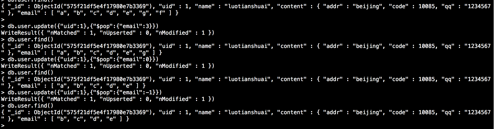
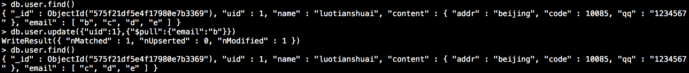
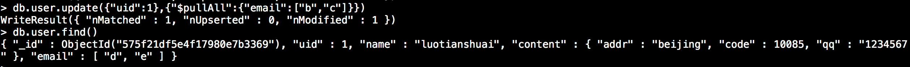

## 目的

本文介绍MongoDB的基本操作，包括文档的创建、删除、和更新。

<!--more-->

## 文档插入

**1、插入**

```
#查看当前都有哪些数据库
> show dbs;
local  0.000GB
tim    0.000GB
#使用 tim数据库
> use tim;
switched to db tim
#查看都有哪些集合
> show collections;
user
> db.user.in
db.user.initializeOrderedBulkOp(    db.user.insert(                     db.user.insertOne(
db.user.initializeUnorderedBulkOp(  db.user.insertMany(
#使用insert方法插入文档，以{}包注，文档是以键值对出现的，必须成对设置
> db.user.insert({"uid":1,"name":"luotianshuai","age":18,"salary":1})
WriteResult({ "nInserted" : 1 })
> 
```

**2、查询**

```
#通过find()方法进行查询
> db.user.find()
{ "_id" : ObjectId("575f039f0c73a5a96e8f7c8f"), "uid" : 1, "name" : "luotianshuai", "age" : 18, "salary" : 1 }
> 
```

**3、如何快速构造1万条文档呢？**

可以通过json的循环来实现

```
> for(i=2;i<=20;i++){
... db.user.insert({"uid":i,"name":"luotianshuai"+i,"salary":2000+Math.round(Math.random())*5000})
... }
WriteResult({ "nInserted" : 1 })
> 
```

**总结：**

插入一条文档使用insert方法

文档的规则是键值对，他们是成对出现的他们之间用逗号分隔，键和值通过冒号分隔。

## 删除文档

**1、查询所有**

```
#db.user.find() 如果括号内不加任何条件那么默认是显示所有的文档
```

**2、查询条件**

```
> db.user.find({"uid":1}) #这里指定条件
{ "_id" : ObjectId("575f039f0c73a5a96e8f7c8f"), "uid" : 1, "name" : "luotianshuai", "age" : 18, "salary" : 1 }
```

**3、删除文档**

```
> db.user.remove({"uid":1})
WriteResult({ "nRemoved" : 1 })  #当removed为1的时候说明删除成功
```

**4、清空集合**

```
> db.user.remove({})
WriteResult({ "nRemoved" : 19 })
```

**5、删除集合**

```
> db.user.drop()
true  #如果返回true说明删除成功
```

## 更新文档

先把之前删除掉饿文档创建一下：

```
for(i=2;i<=20;i++){ db.user.insert({"uid":i,"name":"luotianshuai"+i,"salary":2000+Math.round(Math.random())*5000}) }
```

**1、更新文档**

更新文档这里通过update方法括号内，第一个文档为查询的文档，第二个文档为修改为什么文档！

```
> db.user.update({"uid":2},{"name":"shuaige"})
WriteResult({ "nMatched" : 1, "nUpserted" : 0, "nModified" : 1 })
```

通过查看这种更新方式，后面的文档会覆盖我们要修改文档的整个内容，就变成下面的内容了。uid字段salary字段都被覆盖掉了

```
> db.user.find()
{ "_id" : ObjectId("575f068e0c73a5a96e8f7ca3"), "name" : "shuaige" }
```

所以用下面的方法可以

```
>  db.user.update({"uid":3},{"uid" : 3, "name" : "shuaige", "salary" : 2000 })
WriteResult({ "nMatched" : 1, "nUpserted" : 0, "nModified" : 1 })
> db.user.findOne({"uid":3})
{
        "_id" : ObjectId("575f068e0c73a5a96e8f7ca4"),
        "uid" : 3,
        "name" : "shuaige",
        "salary" : 2000
}
> 
```

可以看到这个更新结果是我们想要的结果，这种方式叫做文档的替换方式更新！

但是我们uid不需要变更，salary也不需要变更但是我们都要写出来！

**2、变量替换方式**

我们可以把取出来的值赋值给一个变量，然后通过变量去修改！

```
#把查询到的值赋值给a
> a = db.user.findOne({"uid":4})
{
        "_id" : ObjectId("575f068e0c73a5a96e8f7ca5"),
        "uid" : 4,
        "name" : "luotianshuai4",
        "salary" : 7000
}
> a.name
luotianshuai4
#通过变量.字段名去修改字段的内容
> a.name="dashuaige"
dashuaige
> db.user.findOne({"uid":4})
{
        "_id" : ObjectId("575f068e0c73a5a96e8f7ca5"),
        "uid" : 4,
        "name" : "luotianshuai4",
        "salary" : 7000
}
#然后在通过update更新
> db.user.update({"uid":4},a)
WriteResult({ "nMatched" : 1, "nUpserted" : 0, "nModified" : 1 })
> db.user.findOne({"uid":4})
{
        "_id" : ObjectId("575f068e0c73a5a96e8f7ca5"),
        "uid" : 4,
        "name" : "dashuaige",
        "salary" : 7000
}
```

他的本质还是替换的方式，只不过是方便了

**3、使用修改器$inc更新**

如何对uid为10的用户增加100块钱工资

```
#这里$inc遵循键值对的规则，他相当于键，要修改的内容为值
> db.user.update({"uid":10},{"$inc":{"salary":100}})
WriteResult({ "nMatched" : 1, "nUpserted" : 0, "nModified" : 1 })

#结果
{ "_id" : ObjectId("575f068e0c73a5a96e8f7cab"), "uid" : 10, "name" : "luotianshuai10", "salary" : 7100 }

#减100
> db.user.update({"uid":10},{"$inc":{"salary":-100}})
WriteResult({ "nMatched" : 1, "nUpserted" : 0, "nModified" : 1 })

#结果
{ "_id" : ObjectId("575f068e0c73a5a96e8f7cab"), "uid" : 10, "name" : "luotianshuai10", "salary" : 7000 }
```

**4、添加一个字段$set修改器**

有时候有需求要给某个文档添加一个字段，比如年龄。使用$set

```
#添加器$set
> db.user.update({"uid":10},{"$set":{"age":18}})
WriteResult({ "nMatched" : 1, "nUpserted" : 0, "nModified" : 1 })

#结果
{ "_id" : ObjectId("575f068e0c73a5a96e8f7cab"), "uid" : 10, "name" : "luotianshuai10", "salary" : 7000, "age" : 18 }
```

**5、删除一个字段$unset修改器**

有时候有需求要求给某个文档删除一个字段，比如年龄。使用$unset

```
#这里注意使用unset的时候他的值也是一个字典要删除的字段:1 这个1，是true的意思删除它，所以这个1是逻辑的true
> db.user.update({"uid":10},{"$unset":{"age":1}})
WriteResult({ "nMatched" : 1, "nUpserted" : 0, "nModified" : 1 })

#结果
{ "_id" : ObjectId("575f068e0c73a5a96e8f7cab"), "uid" : 10, "name" : "luotianshuai10", "salary" : 7000 }
```

看上面使用$unset的时候age的值为1说明为true那我们也可以通过值为true来删除它，那么我们来删除uid为10的salary字段

```
#例子
> db.user.update({"uid":10},{"$unset":{"salary":true}})
WriteResult({ "nMatched" : 1, "nUpserted" : 0, "nModified" : 1 })
结果：
{ "_id" : ObjectId("575f068e0c73a5a96e8f7cab"), "uid" : 10, "name" : "luotianshuai10" }
```

**6、更新文档的其他参数**

```
> db.user.update({arg1},{arg2},arg3,arg4)
'''
参数1:条件     #通过他来查找
参数2:需要操作的更新内容      #把找到的文档修改
参数3:
参宿4:
'''
#参数3是做什么呢？
咱们看下下面一种情况：
如果我现在想更新一条数据uid为100，我这里是没有这个uid为100的文档的
> db.user.find({"uid":100}) #为空
那么现在我修改他下那么会成功的修改吗？
> db.user.update({"uid":100},{"uid":100,"name":"luotianshuai100","salary":100})
WriteResult({ "nMatched" : 0, "nUpserted" : 0, "nModified" : 0 })
#看上面的提示找到0，修改0，说明没有更新，那么第3个参数的作用就来了，给他设置为true
> db.user.update({"uid":100},{"uid":100,"name":"luotianshuai100","salary":100},true)
WriteResult({
        "nMatched" : 0,
        "nUpserted" : 1, #当查找不到的时候，我们插入它
        "nModified" : 0,
        "_id" : ObjectId("575f12ee7732f402fffdf61b")
})
> 
#查看下,他更新成功了
{ "_id" : ObjectId("575f12ee7732f402fffdf61b"), "uid" : 100, "name" : "luotianshuai100", "salary" : 100 }

'''
so  那么第三个参数的含义就展现出来了，如果查找不到条件，那么就插入我们修改的内容
'''


#参数4的含义
现在有个需求我现在需要给所有的员工加10000块钱，来看下我的操作
> db.user.update({},{"$inc":{"salary":1000}})
WriteResult({ "nMatched" : 1, "nUpserted" : 0, "nModified" : 1 })

#可以看到他只更新了匹配到的第一条数据那么，第4个参数的作用就来了
> db.user.update({},{"$inc":{"salary":1000}},false,true)
WriteResult({ "nMatched" : 20, "nUpserted" : 0, "nModified" : 20 })
> 
'''
从上面可以看出，第四个参数的作用就是设置为true的时候就是匹配所有文档
'''
```

**总结：**

**第3个和第4个参数默认为false**

**第一个为查找的条件，第二个为修改内容，第三个是是否在查不到的时候添加修改内容，第四个是是否匹配所有。**

## 更新文档中的文档和更新文档中的数组

用Python理解的话就是字典中的字典和，字典中的列表~~！

先创建一个文档，然后通过修改他来实际看下如何修改文档中的文档和文档中的数组

```
> db.user.insert({"uid":1,"name":"luotianshuai","content":{"addr":"beijing","code":10085,"qq":"1234567"},"email":[]})
WriteResult({ "nInserted" : 1 })
> db.user.findOne()
{
        "_id" : ObjectId("575f19c45e4f17980e7b3366"),
        "uid" : 1,
        "name" : "luotianshuai",
        "content" : {
                "addr" : "beijing",
                "code" : 10085,
                "qq" : "1234567"
        },
        "email" : [ ]
}
> 
```

**一、数组的更新**

**1、数组增加元素$push**

```
> db.user.update({"uid":1},{"$push":{"email":"a"}})
WriteResult({ "nMatched" : 1, "nUpserted" : 0, "nModified" : 1 })
> db.user.findOne()
{
        "_id" : ObjectId("575f19c45e4f17980e7b3366"),
        "uid" : 1,
        "name" : "luotianshuai",
        "content" : {
                "addr" : "beijing",
                "code" : 10085,
                "qq" : "1234567"
        },
        "email" : [
                "a"
        ]
}
> 
```


$push 是在元组中增加一个元素,会在数组的最后追加元素

**2、$pushAll** 在元组中增加多个元素,但是他不检查元素是否存在

如下：b已经存在了，我再同时增加b,c,d看下是什么结果

```
> db.user.update({"uid":1},{"$push":{"email":"b"}})
WriteResult({ "nMatched" : 1, "nUpserted" : 0, "nModified" : 1 })
> db.user.findOne()
{
        "_id" : ObjectId("575f1b9a5e4f17980e7b3367"),
        "uid" : 1,
        "name" : "luotianshuai",
        "content" : {
                "addr" : "beijing",
                "code" : 10085,
                "qq" : "1234567"
        },
        "email" : [
                "a",
                "b"
        ]
}
> 
```

$pushAll

```
> db.user.update({"uid":1},{"$pushAll":{"email":["b","c","d"]}})
WriteResult({ "nMatched" : 1, "nUpserted" : 0, "nModified" : 1 })
> db.user.findOne()
{
        "_id" : ObjectId("575f1b9a5e4f17980e7b3367"),
        "uid" : 1,
        "name" : "luotianshuai",
        "content" : {
                "addr" : "beijing",
                "code" : 10085,
                "qq" : "1234567"
        },
        "email" : [
                "a",
                "b",
                "b",
                "c",
                "d"
        ]
}
> 
```

**3、$addToSet** **往数组中添加一个不重复的元素**

```
> db.user.update({"uid":1},{"$addToSet":{"email":"d"}})
WriteResult({ "nMatched" : 1, "nUpserted" : 0, "nModified" : 0 })
> 
#从上面的结果可以看出匹配到了一个，插入和修改了0个，说明他可以判断元素是否存在
```

添加一个元素

```
#如果不存在就创建
> db.user.update({"uid":1},{"$addToSet":{"email":"e"}})
WriteResult({ "nMatched" : 1, "nUpserted" : 0, "nModified" : 1 })
> 
```

添加多个不重复的元素，这时候就得需要用到**$eache**操作符了

```
#这里e,d都是存在的然后g，f是不存在的批量插入看下结果
> db.user.update({"uid":1},{"$addToSet":{"email":{"$each":["e","g","f","d"]}}})
WriteResult({ "nMatched" : 1, "nUpserted" : 0, "nModified" : 1 })

#结果
> db.user.findOne()
{
        "_id" : ObjectId("575f1b9a5e4f17980e7b3367"),
        "uid" : 1,
        "name" : "luotianshuai",
        "content" : {
                "addr" : "beijing",
                "code" : 10085,
                "qq" : "1234567"
        },
        "email" : [
                "a",
                "b",
                "b",
                "c",
                "d",
                "e",
                "g",
                "f"
        ]
}
> 
```

**总结：**

**db.user.update({"uid":1},{"$push":{"email":"a"}})  #在数组末尾添加一个元素**

**db.user.update({"uid":1},{"$pushAll":{"email":["b","c","d"]}}) #在数组末尾添加多个元素，且并不检查是否重复**

**db.user.update({"uid":1},{"$addToSet":{"email":"d"}}) #向数组添加一个不重复的元素**

\#在实际的生产中可能需要插入多个不重复的元素可以使用**$addToSet** 结合**$eache**操作符

**db.user.update({"uid":1},{"$addToSet":{"email":{"$each":["e","g","f","d"]}}})**

**二、删除数组元素**

**1、$pop 从数组中1个值，只能从开头和结尾取值**

$pop是从数组中的开头和结尾删除一个值



从上面的结果可以看出，$pop操作符的值中数组的值，为正数的时候从数组的右侧删值，为负数的时候从数组的左侧取值

**2、$pull删除指定的数组指定的一个元素**



**3、$pullAll 删除多个指定的数组元素**



**总结：**

**db.user.update({"uid":1},{"$pop":{"email":-1}}) #从左侧删除一个元素**

**db.user.update({"uid":1},{"$pop":{"email":1}})#从右侧删除一个元素**

**db.user.update({"uid":1},{"$pull":{"email":"b"}}) #删除数组内的指定一个元素**

**db.user.update({"uid":1},{"$pullAll":{"email":["b","c"]}}) #删除数组内指定的多个元素**

**三、数组元素的更新**

**1、通过变量调用下标修改**

```
> db.user.findOne()
{
        "_id" : ObjectId("575f21df5e4f17980e7b3369"),
        "uid" : 1,
        "name" : "luotianshuai",
        "content" : {
                "addr" : "beijing",
                "code" : 10085,
                "qq" : "1234567"
        },
        "email" : [
                "d",
                "e"
        ]
}
> a = db.user.findOne()
{
        "_id" : ObjectId("575f21df5e4f17980e7b3369"),
        "uid" : 1,
        "name" : "luotianshuai",
        "content" : {
                "addr" : "beijing",
                "code" : 10085,
                "qq" : "1234567"
        },
        "email" : [
                "d",
                "e"
        ]
}
> a.email
[ "d", "e" ]
> a.email[0]
d
> a.email[1]
e
> a.email[1] = "shuaige.qq.com"
shuaige.qq.com
> db.user.update({"uid":1},a)
WriteResult({ "nMatched" : 1, "nUpserted" : 0, "nModified" : 1 })
> db.user.findOne()
{
        "_id" : ObjectId("575f21df5e4f17980e7b3369"),
        "uid" : 1,
        "name" : "luotianshuai",
        "content" : {
                "addr" : "beijing",
                "code" : 10085,
                "qq" : "1234567"
        },
        "email" : [
                "d",
                "shuaige.qq.com"
        ]
}
> 
```

**2、通过数组.下标修改**

```
> db.user.findOne()
{
        "_id" : ObjectId("575f21df5e4f17980e7b3369"),
        "uid" : 1,
        "name" : "luotianshuai",
        "content" : {
                "addr" : "beijing",
                "code" : 10085,
                "qq" : "1234567"
        },
        "email" : [
                "d",
                "shuaige.qq.com"
        ]
}
> db.user.update({"uid":1},{"$set":{"email.0":"tim.qq.com"}})
WriteResult({ "nMatched" : 1, "nUpserted" : 0, "nModified" : 1 })
> db.user.findOne()
{
        "_id" : ObjectId("575f21df5e4f17980e7b3369"),
        "uid" : 1,
        "name" : "luotianshuai",
        "content" : {
                "addr" : "beijing",
                "code" : 10085,
                "qq" : "1234567"
        },
        "email" : [
                "tim.qq.com",
                "shuaige.qq.com"
        ]
}
> 
```

**上面的emil.0 相当于emil[0]  通过下标调用mongodb能识别它！**

**四、文档的文档修改**

看下面的例子说明，文档的文档可以通过“.”分法一级一级的嵌套下去修改他如下

**1、查询**

```
> b = db.user.findOne()
{
        "_id" : ObjectId("575f21df5e4f17980e7b3369"),
        "uid" : 1,
        "name" : "luotianshuai",
        "content" : {
                "addr" : "beijing",
                "code" : 10085,
                "qq" : "1234567"
        },
        "email" : [
                "tim.qq.com",
                "shuaige.qq.com"
        ]
}
> b.con
b.constructor  b.content
> b.content
{ "addr" : "beijing", "code" : 10085, "qq" : "1234567" }
> b.content.addr
beijing
> b.content.addr 
```

**2、修改**

```
> b.content.code = 123456789
123456789
> b
{
        "_id" : ObjectId("575f21df5e4f17980e7b3369"),
        "uid" : 1,
        "name" : "luotianshuai",
        "content" : {
                "addr" : "beijing",
                "code" : 123456789,
                "qq" : "1234567"
        },
        "email" : [
                "tim.qq.com",
                "shuaige.qq.com"
        ]
}
> db.user.update({"uid":1},b)
WriteResult({ "nMatched" : 1, "nUpserted" : 0, "nModified" : 1 })
> db.user.findOne()
{
        "_id" : ObjectId("575f21df5e4f17980e7b3369"),
        "uid" : 1,
        "name" : "luotianshuai",
        "content" : {
                "addr" : "beijing",
                "code" : 123456789,
                "qq" : "1234567"
        },
        "email" : [
                "tim.qq.com",
                "shuaige.qq.com"
        ]
}
> 
```

