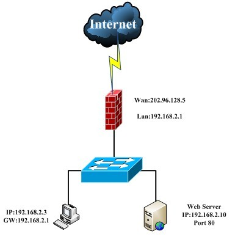
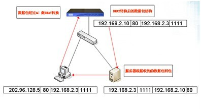
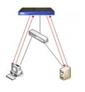
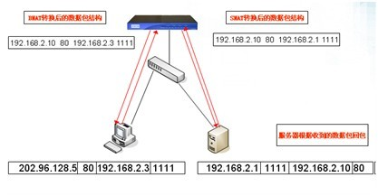
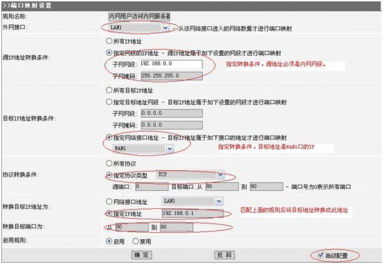
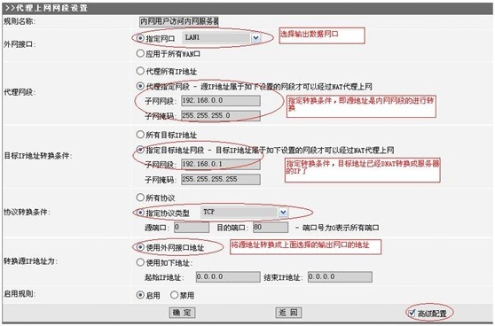
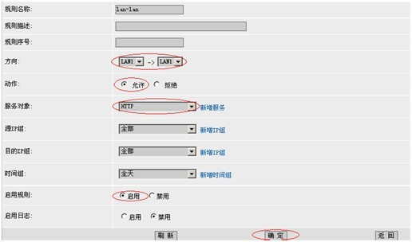

局域网内网有服务器对外发布，基于对服务器的保护，内网用户需通过域名或者公网ip来访问内网服务器。

如下图所示：

 

## 名词解释

DNAT：转换目标ip地址。

SNAT： 转换源ip地址。

<!--more-->

## 需求

将外网202.96.128.5的80端口映射至内网192.168.2.10的80端口，外网地址对应有域名，以对外服务。同时，内网无DNS服务器，内网用户通过公网DNS解析通过同样的公网域名访问内网web服务器，要求防火墙能将内网访问该域名80端口的请求再次定向到内网服务器，使得内部访问公网域名的数据直接返回给内网服务器，以节省互联网带宽。

 

## 数据流走向分析

内网服务器的真实ip和访问端口是192.168.2.10：80，要能够访问到这个服务器资源，必须需要把访问的目标ip 202.96.128.5转换成192.168.2.10，这样访问数据包才会转回内网，否则数据包交到公网上，将访问不到真实的服务器。那么需要在设备上做一次DNAT（对访问服务器的数据做目标ip的转换）。

 

如果只在设备上做一次DNAT上网转换的数据包和转发流程如下图所示:

文中所列的数据包的结构均为：**目标IP|目标端口|源IP|源端口**

第一步：封装访问到目标ip为202.96.128.5的数据由客户端发出

第二步：在设备的LAN口接受到数据包，匹配DNAT规则，对数据包进行目标IP的转换

第三步：经过设备转换的数据包从lan口发出，交给局域网的真实服务器192.168.2.10.

第四步：服务器对访问请求做回应，它收到数据包的源ip是192.168.2.3，成为封装回应的目标ip，那么数据包有内网服务器直接发给内网主机

第五步：内网主机收到一个源ip为192.168.2.10的回应，和它发给目标ip为202.96.128.5的请求不一致，所以数据包直接被丢弃。在客户端看来，访问服务器失败。

由以上的数据包流程可以看出，要保证内网客户端能访问到服务器，只做DNAT是不够的。

那么需要服务器将回应数据发回给网关设备，再由网关设备转回给客户端，客户端才会接受数据。流程图应该如下图所示：

那么要让服务器的数据发给网关，那么在服务器接收到的数据源IP是网关的IP，所以网关

发给服务器的数据包结构应该是：**192.168.2.10|80|192.168.2.1|1111**

这个数据包，和只做了一次DNAT从网关处发出的数据包：**192.168.2.10|80|192.168.2.3|1111**

相比，源IP 做了转换。所以才需要在网关设备处再做一次SNAT。

如果网关要代理内网上外网的话，那么也启用了SNAT，进行私有地址到公网地址的转换。

所以这里的SNAT，必须要设置条件，符合条件才转换，而且要比上网的SNAT优先匹配。否则会对上网产生影响。

先经过网关设备DNAT处理，再经过SNAT处理的数据包走向如下图：

由于在网关处做了DNAT和SNAT的转换，每做一次转换，设备都会记录一个链接，当服务器回应数据再经过网关时，网关会根据链接再做一次DNAT和SNAT，那么数据包发回给访问客户端的是: **192.168.2.3|1111|202.96.128.5|80**，对于客户端来说，它之前是发给202.96.128.5的访问请求，所以会接受数据包。

此外对于网关设备来说，数据包是由LAN传给LAN 的，所以还需放通防火墙的LAN--LAN规则。

 

 

## 应用举例

**用户需求：**

用户内网有一台服务器：192.168.0.1，WAN1 口使用光纤接入，有公网IP 地址（202.x.x.x），该公网IP 地址对应一个域名：www.xxx.com，已经使用DNAT 做端口映射把服务器发布至公网，并可以在公网访问www.xxx.com；现在要求在局域网（192.168.0.0/24 连接在LAN 口），也可以通过访问域名：www.xxx.com 达到访问web server：192.168.0.1，规则如下：

 

用一国内产品演示：

1）      做端口映射，注意外网接口选择LAN 口

 

2）  做SNAT：将源地址转换成LAN 口。

如果有Lan-Lan规则，放通规则。开放LAN1→LAN1 的防火墙规则：

注意事项：

a）如果服务器在DMZ 区，则第二步可以省略，但要注意放通LAN→DMZ 的防火墙规则。

b）上面的方法也适用于WAN 口为ADSL 拨号使用动态域名的情况。

