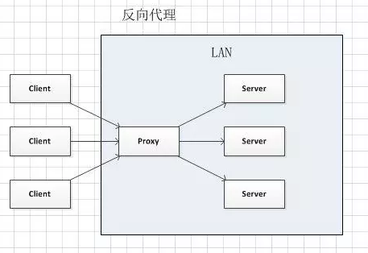
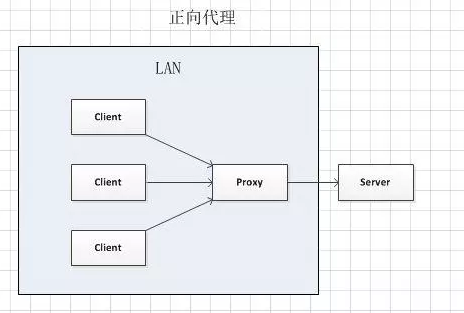
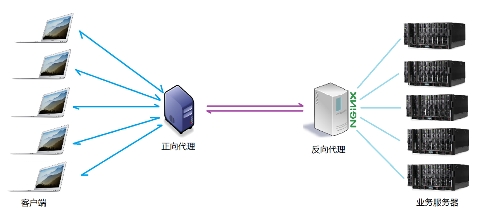
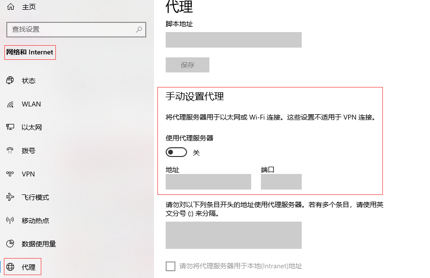

## 背景

在日常运维工作中，常常会用到反向代理，为了更安全同时为了负载均衡，分担压力。

那么，有小伙伴就会有疑问：

- 什么是反向代理？
- 负载均衡又是怎么实现的？
- 有反向代理那有正向代理吗？
- 正向代理的应用场景是怎样的？
- 反向代理和正向代理怎么配置实现呢？

带着这些疑问，就给大家详细解释下nginx的正反向代理。

<!--more-->


## 环境

Nginx（Nginx是一款自由的、开源的、高性能的HTTP服务器。功能优势等等这里就不再赘述了。度娘那里有很多信息。）


## 代理

说到代理，首先我们要明确一个概念，所谓代理就是一个代表、一个渠道；

此时就设计到两个角色，一个是被代理角色，一个是目标角色，被代理角色通过这个代理访问目标角色完成一些任务的过程称为代理操作过程；如同生活中的专卖店~客人到adidas专卖店买了一双鞋，这个专卖店就是代理，被代理角色就是adidas厂家，目标角色就是用户。


## 反向代理

我们在运维的日常工作中经常用到负载均衡，所以接触反向代理比较多，那么反向代理是怎样的呢？。例如人气比较高的网站，如淘宝，京东等等。每天访问人数的人很多，数以万计，此时单台服务器远远不能承载所有人的访问请求，这时作为资深运维人员就需要对web服务进行分布式部署；何为分布式部署呢？就是通过部署多台服务器组成web集群共同来处理访问请求，解决单台服务器不能承载的问题；分布式部署的web服务可以横行扩展。而实现web分布式部署通常要用到反向代理。apache或nginx都可以。本文以nginx为例，用nginx的反向代理实现的。国内公司通过把nginx和其他的组件进行封装，根据场景或侧重点不同，便于构建安装，就有了：Tengine或OpenResty等。有兴趣的朋友可以度娘搜索学习。那么反向代理具体是通过什么样的方式实现的分布式的集群操作呢，我们先看一个示意图：



通过上述的图解大家就可以看清楚了，多个客户端给服务器发送的请求，nginx服务器接收到之后，按照一定的规则分发给了后端的web服务器进行处理了。此时请求的来源也就是客户端是明确的，但是请求后具体由哪台服务器进行处理响应并不明确了，web服务（nginx）扮演的就是一个反向代理角色。

反向代理，主要用于服务器集群分布式部署负载均衡共同承载请求压力或安全需求等的情况下使用，反向代理可以隐藏了响应服务器的信息，能够过滤网络攻击，保证安全。


## 正向代理

阴阳两仪生万物，有阴就有阳，有反就有正。说完反向代理了，我们再来看看正向代理。正向代理可能在日常工作中用的不是很多，但是，相信大家经常听到：翻墙这个词，何为翻墙呢？翻墙是因为大陆对网络中攻击等等进行了屏蔽和过滤，相当于防火墙的墙一样，允许的我们才可以访问，屏蔽的我们就不能访问。这是我们做技术的如果需要在国外查询技术文档等就需要翻墙，通常我们需要购买vpn来实现，vpn的功能就是用的正向代理。那么vpn是怎么实现的呢？我们如果需要访问国外的某些网站，此时你会发现位于国外的某网站我们通过浏览器是没有办法访问的，被屏蔽过滤掉了。vpn的方式就是找一个可以正常访问国外网站的代理服务器，我们将请求发送给代理服务器，然后代理服务器去访问国外的网站，然后将访问到的数据传递给我们！

上述描述的代理模式称为正向代理，正向代理的特点是：客户端非常明确要访问的服务器地址；服务器只清楚请求来自哪个代理服务器，但是不清楚来自哪个具体的客户端；正向代理模式屏蔽或者隐藏了真实客户端信息。如下图




## 正反向代理共同使用

日常在实际项目操作中，正向代理和反向代理会搭配使用。正向代理代理客户端的请求去访问目标服务器，而目标服务器是又使用反向代理服务器，反向代理多台真实的业务处理服务器，进行负载均衡。具体的拓扑图如下：




## 负载均衡

我们知道了代理服务器，也一直说负载均衡，何为负载均衡呢？简单的说：web服务（nginx）作为反向代理服务器，依据一定的规则对请求进行分发，把请求平均让后端业务服务器进行响应，已达到分担压力的作用。负载就是客户端对业务发送的请求，分发到不同的服务器处理的规则，就是一种均衡规则。将服务器接收到的请求按照规则分发的过程，就是负载均衡。

负载均衡，有硬件负载均衡和软件负载均衡两种，硬件负载均衡也称为硬负载，如F5负载均衡，但是相对造价昂贵成本较高，但是数据的稳定性安全性等等有非常好的保障，如国有企业三大运营商这样的公司才会选择硬负载进行操作；通常公司都会考虑到成本问题，会选择使用软件负载均衡，软件负载均衡是利用现有的技术结合主机硬件实现的一种消息队列分发机制。软件负载均衡肯定和硬负载没发比较的，但是成本较低，稳定性和安全性在架构优化后在可接受范围，广为使用。

nginx的负载均衡规则如下：

- **weight轮询（默认**）：接收到的请求按照顺序逐一分配到不同的后端服务器，即使在使用过程中，某一台后端服务器宕机，nginx会自动将该服务器剔除出队列，请求受理情况不会受到任何影响。 这种方式下，可以给不同的后端服务器设置一个权重值（weight），用于调整不同的服务器上请求的分配率；权重数据越大，被分配到请求的几率越大；该权重值，主要是针对实际工作环境中不同的后端服务器硬件配置进行调整的。
- **ip_hash**：每个请求按照发起客户端的ip的hash结果进行匹配，这样的算法下一个固定ip地址的客户端总会访问到同一个后端服务器，这也在一定程度上解决了集群部署环境下session共享的问题。
- **fair**：智能调整调度算法，动态的根据后端服务器的请求处理到响应的时间进行均衡分配，响应时间短处理效率高的服务器分配到请求的概率高，响应时间长处理效率低的服务器分配到的请求少；结合了前两者的优点的一种调度算法。但是需要注意的是nginx默认不支持fair算法，如果要使用这种调度算法，请安装upstream_fair模块
- **url_hash**：按照访问的url的hash结果分配请求，每个请求的url会指向后端固定的某个服务器，可以在nginx作为静态服务器的情况下提高缓存效率。同样要注意nginx默认不支持这种调度算法，要使用的话需要安装nginx的hash软件包


## 具体实现

了解了正反向代理和负载均衡，那么要怎么实现呢？如何去配置。

### **正向代理配置**

现在我登录上代理服务器上, 打开/etc/nginx/conf.d/default.conf
添加`resolver`和`proxy_pass`,设置如下:

```conf
server {
    listen       80;
    server_name  localhost nginx.tangll.cn;

    resolver 8.8.8.8;
    location / {
        proxy_pass http://$http_host$request_uri;
    }

    error_page   500 502 503 504  /50x.html;
    location = /50x.html {
        root   /usr/share/nginx/html;
    }
}
```

`resolver`为DNS解析,这里填写的IP为Google提供的免费DNS服务器的IP地址。
`proxy_pass`配置代理转发。
至此便是配置了代理服务器，所有访问请求全部都通过代理服务器转发,`$http_host`就是我们要访问的主机名,`$request_uri`就是我们后面所加的参数。
简单的说至此就是相当于配置好了我们请求了代理服务器,代理服务器再去请求我们所请求的地址。

然后，只需要在本机系统或浏览器配置代理即可访问。

#### **windows配置**



#### **Linux系统**

**使用yum 的设置代理的方法**

如果只需要使用yum来更新包的，只需进行yum配置即可。

```bash
[root@localhost ~]# vim /etc/yum.conf 
proxy=http://192.168.99.99:80
#proxy=ftp://192.168.99.99:80
#proxy_username=username                 ####代理的用户名
#proxy_password=password                  ####代理的密码
#然后直接用yum安装即可
```

**wget设置代理的方法**

```bash
[root@localhost ~]# vim /etc/wgetrc
http_proxy=192.168.99.99:80
http_proxy=192.168.99.99:443
```

**curl访问代理设置的方法**

```bash
#如果访问HTTP网站，可以直接这样的方式: curl --proxy proxy_server:80 http://www.taobao.com/
#如果访问HTTPS网站，例如https://www.alipay.com，那么可以使用nginx的HTTPS转发的server：
curl --proxy proxy_server:443 http://www.alipay.com

[root@localhost ~]# curl -I --proxy 192.168.99.99:80 www.baidu.com    ###显示http访问的状态码
HTTP/1.1 200 OK
备注：上边有介绍，详见上边内容。
```

**使用设置全局代理的方法**

```bash
[root@localhost ~]# vim /etc/profile
http_proxy = http://192.168.99.99:80
http_proxy = http://192.168.99.99:443
ftp_proxy = http://192.168.99.99:80/
export http_proxy
export ftp_proxy
```


### 反向代理配置

反向代理的演示更为简单一些。
首先在/etc/nginx/conf.d/下新建一个default.conf:

```
server {
    listen       80;
    server_name  localhost nginx.tangll.cn;
    location / {
        root   /usr/share/nginx/html;
        index  index.html index.htm;
    }
  
    #设置代理
    location / {
        proxy_pass http://127.0.0.1:8080;
    }

    error_page   500 502 503 504 404  /50x.html;
    location = /50x.html {
        root   /usr/share/nginx/html;
    }
}
```

## 总结

代理服务器站在客户端那边就是正向代理，代理服务器站在原始服务器那边就是反向代理, Nginx通过`proxy_pass`可以设置代理服务。

