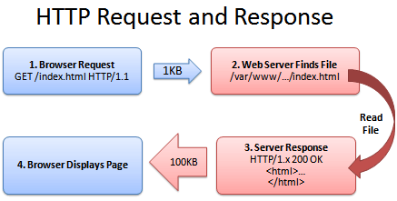

nginx作为web服务被广泛应用在网站中。怎么提高网站的响应速度，除了cdn加速外，合理的配置，也可达到提速目的。本文为达这一目的，配置中添加了gzip压缩配置。

<!--more-->

## 原理

Web服务器处理HTTP压缩的过程如下：

1. Web服务器接收到浏览器的HTTP请求后，检查浏览器是否支持HTTP压缩（Accept-Encoding 信息）；

2. 如果浏览器支持HTTP压缩，Web服务器检查请求文件的后缀名；

3. 如果请求文件是HTML、CSS等静态文件，Web服务器到压缩缓冲目录中检查是否已经存在请求文件的最新压缩文件；

4. 如果请求文件的压缩文件不存在，Web服务器向浏览器返回未压缩的请求文件，并在压缩缓冲目录中存放请求文件的压缩文件；

5. 如果请求文件的最新压缩文件已经存在，则直接返回请求文件的压缩文件；

6. 如果请求文件是动态文件，Web服务器动态压缩内容并返回浏览器，压缩内容不存放到压缩缓存目录中。

**下面是两个演示图：**

未使用Gzip：



开启使用Gzip后：


## 常用参数

```bash
gzip on|off;  #是否开启gzip
gzip_buffers 32 4K| 16 8K #缓冲(压缩在内存中缓冲几块? 每块多大?)
gzip_comp_level [1-9] #推荐6 压缩级别(级别越高,压的越小,越浪费CPU计算资源)
gzip_disable #正则匹配UA 什么样的Uri不进行gzip
gzip_min_length 200 # 开始压缩的最小长度(再小就不要压缩了,意义不在)
gzip_http_version 1.0|1.1 # 开始压缩的http协议版本(可以不设置,目前几乎全是1.1协议)
gzip_proxied          # 设置请求者代理服务器,该如何缓存内容
gzip_types text/plain application/xml # 对哪些类型的文件用压缩 如txt,xml,html ,css
gzip_vary on|off  # 是否传输gzip压缩标志
```

**注意**

图片/mp3这样的二进制文件不必压缩。因为压缩率比较小, 比如100->80字节,而且压缩也是耗费CPU资源的。比较小的文件也不必压缩。

## 范例

在nginx.conf配置文件中添加如下内容：

```bash
gzip on;
gzip_buffers 32 4K;
gzip_comp_level 6;
gzip_min_length 100;
gzip_types application/javascript text/css text/xml;
gzip_disable "MSIE [1-6]\."; #配置禁用gzip条件，支持正则。此处表示ie6及以下不启用gzip（因为ie低版本不支持）
gzip_vary on;
```


保存并重启nginx，刷新页面（为了避免缓存，请强制刷新）就能看到效果了。以谷歌浏览器为例，通过F12看请求的响应头部，如下图：


Content-Encoding:gzip   说明开启了gzip压缩

Transfet-Encoding:chunked  说明压缩后分块传输


在此我们看出这个js的传输大小68.3k，而这个js实际大小为282k 所以压缩生效成功。

