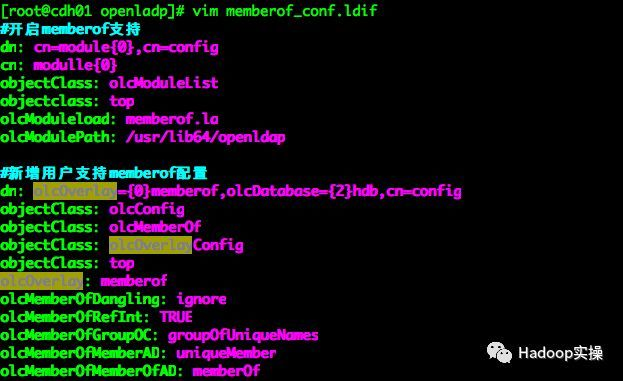
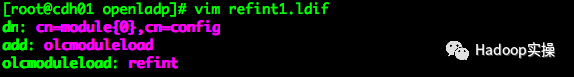
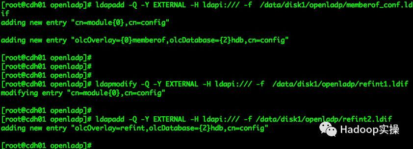
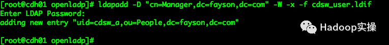
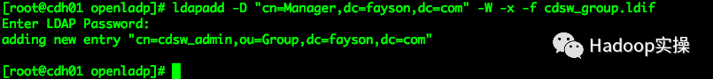
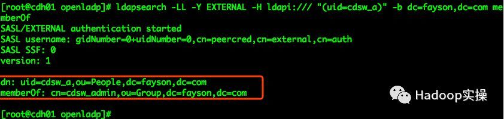
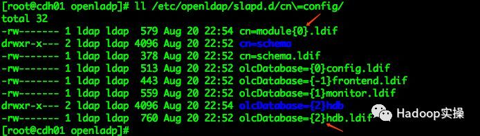

## 目的

默认情况下OpenLDAP的用户组属性是Posixgroup，Posixgroup用户组和用户没有实际的对应关系。如果需要把Posixgroup和user关联起来则需要将用户添加到对应的组中。 通过如上配置可以满足大部分业务场景，但是如果需要通过用户组来查找用户的话，Posixgroup用户组属性，是无法满足要求的。此时需要使用OpenLDAP的groupOfUniqueNames用户组属性。本篇文章Fayson主要介绍如何为OpenLDAP启用MemberOf。

<!--more-->


## 环境

OpenLDAP版本为2.4.44


## 步骤

#### 准备memberof_conf.ldif文件

```bash
vim memberof_conf.ldif

#开启memberof支持
dn: cn=module{0},cn=config
cn: modulle{0}
objectClass: olcModuleList
objectclass: top
olcModuleload: memberof.la
olcModulePath: /usr/lib64/openldap

#新增用户支持memberof配置
dn: olcOverlay={0}memberof,olcDatabase={2}hdb,cn=config
objectClass: olcConfig
objectClass: olcMemberOf
objectClass: olcOverlayConfig
objectClass: top
olcOverlay: memberof
olcMemberOfDangling: ignore
olcMemberOfRefInt: TRUE
olcMemberOfGroupOC: groupOfUniqueNames
olcMemberOfMemberAD: uniqueMember
olcMemberOfMemberOfAD: memberOf
```



#### 编辑refint1.ldif文件

```bash
vim refint1.ldif 

dn: cn=module{0},cn=config
add: olcmoduleload
olcmoduleload: refint
```



#### 编辑refint2.ldif文件

```bash
 vim refint2.ldif 
 
dn: olcOverlay=refint,olcDatabase={2}hdb,cn=config
objectClass: olcConfig
objectClass: olcOverlayConfig
objectClass: olcRefintConfig
objectClass: top
olcOverlay: refint
olcRefintAttribute: memberof uniqueMember  manager owner
```


#### 导入配置

```bash
ldapadd -Q -Y EXTERNAL -H ldapi:/// -f  /data/disk1/openladp/memberof_conf.ldif 
ldapmodify -Q -Y EXTERNAL -H ldapi:/// -f  /data/disk1/openladp/refint1.ldif 
ldapadd -Q -Y EXTERNAL -H ldapi:/// -f /data/disk1/openladp/refint2.ldif 
```



以上步骤就完成了OpenLDAP的MemberOf模块启用。

## 验证

**创建用户测试**

1, 创建一个测试用户cdsw_a,ldif文件内容如下：

```bash
vim cdsw_user.ldif

dn: uid=cdsw_a,ou=People,dc=fayson,dc=com
uid: cdsw_a
cn: cdsw_a
objectClass: account
objectClass: posixAccount
objectClass: top
objectClass: shadowAccount
userPassword: 123456
shadowLastChange: 17694
shadowMin: 0
shadowMax: 99999
shadowWarning: 7
loginShell: /bin/bash
uidNumber: 10001
gidNumber: 10001
homeDirectory: /home/cdsw_a
```

2, 执行如下命令将cdsw_a用户导入到OpenLDAP中

```
ldapadd -D "cn=Manager,dc=fayson,dc=com" -W -x -f cdsw_user.ldif 
```



3, 创建一个新的groupOfUniqueNames用户组，并把cdsw_a用户添加到该组

```bash
vim cdsw_group.ldif 

dn: cn=cdsw_admin,ou=Group,dc=fayson,dc=com
objectClass: groupOfUniqueNames
cn: cdsw_admin
uniqueMember: uid=cdsw_a,ou=People,dc=fayson,dc=com
```


4. 将cdsw_admin组添加到OpenLDAP中



5. 通过命令查看用户所属组，命令如下

```bash
ldapsearch -LL -Y EXTERNAL -H ldapi:/// "(uid=cdsw_a)" -b dc=fayson,dc=com memberOf
```



## **总结**

在OpenLDAP中配置启用MemberOf时需要注意配置文件的通配符{0}/{2},这个数字不是随意指定的而是根据当前的/etc/openldap/slapd.d/cn\=config/生成的内容得出

