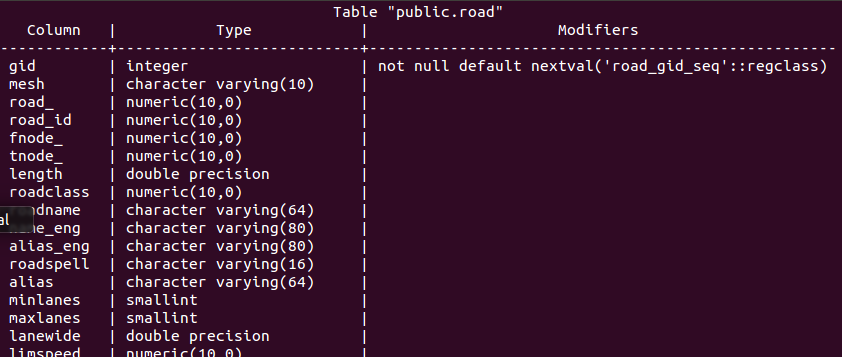
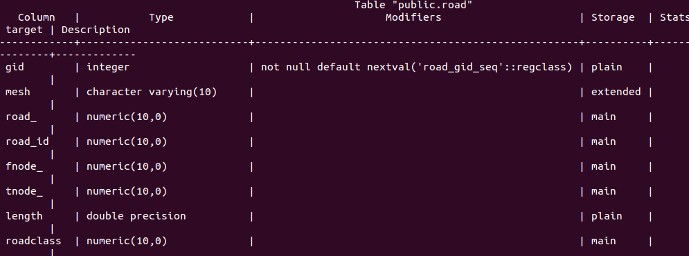

## 目的

本文介绍了Postgresql数据库的常用用法，方便你正确的用库。

<!--more-->

## 用法详解

### 启动pgsl数据库

```plsql
pg_ctl -D /xx/pgdata  start
```

### 查看pgsl版本

```plsql
pg_ctl --version
```

### 命令行登录数据库

```plsql
psql -U username -d dbname -h hostip -p port
```

### 列出所有数据库

```plsql
\l 
```

### 切换数据库

```plsql
\c dbname
```

### 列出当前数据库的所有表

```plsql
\d 
```

### 查看指定表的所有字段

```plsql
\d  tablename
```



### 查看指定表的基本情况

```plsql
\d+  tablename
```



### 退出操作

```plsql
q
```

### 新建表

例1（主键）

```plsql
create table TESTCASE(
id INTEGER, 
task_class INTEGER,
age TEXT,
PRIMARY KEY(id, task_class)
);
```

例2（自增SERIAL）

```plsql
create table CREATETASK_CHKID_N( 
id SERIAL PRIMARY KEY, 
chk_id TEXT, 
n INTEGER
);
```

其中SERIAL代表自增，默认从1开始增加，每次自增1。

### 删除表

```plsql
drop table REL_CROSS_NODE;
```

### 清空表

```plsql
delete from [表名]
```

or

```plsql
TRUNCATE TABLE  [表名]
```

区别：Truncate table 表名 (注:不带where语句) 速度快,而且效率高。

因为DELETE 语句每次删除一行，并在事务日志中为所删除的每行记录一项。TRUNCATE TABLE 通过释放存储表数据所用的数据页来删除数据，并且只在事务日志中记录页的释放

### 添加字段

```plsql
alter table [表名] add column [字段名] [类型];
```

### 更改字段

```plsql
alter table [表名] rename column [旧字段名] to [新字段名];

例：把表table_ex字段col_1限制非空去掉：ALTER TABLE table_eg ALTER col_1 drop not NULL
```

#### **更改字段属性，含空格**

如果把字段colname把属性Text转化为int，原来text里面存在空啥的，可以

```plsql
ALTER TABLE tablename ALTER COLUMN colname TYPE int USING (trim(colname)::integer);
```

#### **更改字段由int4-->int8**

```plsql
alter table test_data alter column task_id type bigint using task_id::bigint
```


### 删除字段

```plsql
alter table [表名] drop column [字段名];
```


### 表中插入一行数据

```plsql
insert into [表名] (字段 1 ,字段 2 ) values (值 1 ,值 2 );
```

例如：    

```plsql
insert into assist_info (id, maat_id, block_type) values ('F006', 'F7775', 1)  
```

**注**：

- 如果表中字段有大写的字段，则需要对应的加上双引号。例：insert into test (no, "Name") values ('123', 'jihite');
- 值用单引号引起来('')，不能用双引号（""）


### 表中删除一行数据

```plsql
delete from [表名] where [该行特征];
```


### 修改表中数据

```plsql
update [表名] set [目标字段名]=[目标值] where [该行特征]
```


### 删除表

```plsql
drop table [表名];
```


### 退出postgreSql

```plsql
\q
```


### 两个查询结果做差 except

```plsql
(select node_id from node where node_id=1 or node_id=2) except (select node_id from node where node_id=1); 
```

### 复制表

```plsql
CREATE TABLE test_a_copy AS SELECT * FROM test_a;
```


### 命令导入sql数据文件

```plsql
psql -h localhost  -d databaseName  -U username -f  filename
```


### 查询结果存储到输出文件

格式：

```plsql
\o file_path
```

这样就会把查询结果存储到输出文件中。例

```plsql
postgres=> \o /home/jihite/data/iu_data;
postgres=> select test_id from cdb_all_iu_data limit 10;
postgres=> select test_id from cdb_all_iu_data limit 5;
```

结果

```plsql
test_id
--------------
         2143
         2153
         2144
         2156
         2145
         2154
         2146
         2157
         2147
         2155
(10 rows)

test_id
--------------
         2143
         2153
         2144
         2156
         2145
(5 rows)
```

### 数据库的备份&恢复

导出到线下文件

```plsql
pg_dump --host hostname --port port --username username -t tablename -d dbname >/home/jihite/table.sql 
```

把线下文件导入到数据库

```plsql
psql -h 10.125.7.68 -p 5432 -d postgres -U postgres -W postgres -f 2.sql
```


### \x

```plsql
postgres=> \x
Expanded display is on.
postgres=> select *  from cdb_chk_items where chk_id = 'R000000335';
-[ RECORD 1 ]+------------------------------------------------------------------------------------------------
chk_id       | R000000335
chk_desc     | 道路属性与道路属性相关检查
chk_info     | {"FIELDS": {"TRAFFIC_SIGN": ["TYPE", "GEOM"], "ROAD_LINK": ["ROAD_CLASS", "FORM_WAY", "GEOM"]}}
err_desc     | {"ERR2": "roadclass取值错误", "ERR1": "formway取值错误"}
chk_level    | 1
is_opened    | 1
module_name  | TRAFFIC_SIGN
invalid_flag | 1
rel_mode     | MAIN_LAYER:TRAFFIC_SIGN
             :         TRAFFIC_SIGN|A,M|DIRECT
             :         ROAD_LINK|A,M,D|ATTR_REL
```

### 从表A中把符合条件的记录拷贝到表B

```plsql
insert into A select * from B where id  in ('a', 'b', 'c');
```

### 建立索引

单字段索引

```plsql
CREATE INDEX index_name ON table_name (field1);
```

多字段索引

```plsql
CREATE INDEX index_name ON table_name (field1,field2);
```

查看所有表的索引使用情况

```plsql
select 
    relname, indexrelname, idx_scan, idx_tup_read, idx_tup_fetch 
from 
    pg_stat_user_indexes 
order by 
    idx_scan asc, idx_tup_read asc, idx_tup_fetch asc;
```

查看某个表索引的使用情况

```plsql
select 
    relname, indexrelname, idx_scan, idx_tup_read, idx_tup_fetch 
from 
    pg_stat_user_indexes 
where
    relname = table_name 
order by 
    idx_scan asc, idx_tup_read asc, idx_tup_fetch asc;
```

### 超找数据库的连接信息

```plsql
select * from pg_stat_activity
```

包含：客户端user、ip、执行语句，状态、时间

### 删除数据库

```plsql
drop database cmdbuild;
```

如有报错：


请用下面命令先把连接停掉，再删除

```plsql
SELECT pg_terminate_backend(pg_stat_activity.pid) FROM pg_stat_activity WHERE datname='cmdbuild' AND pid<>pg_backend_pid();
```

### 创建数据库

```plsql
create database cmdbuild;
```