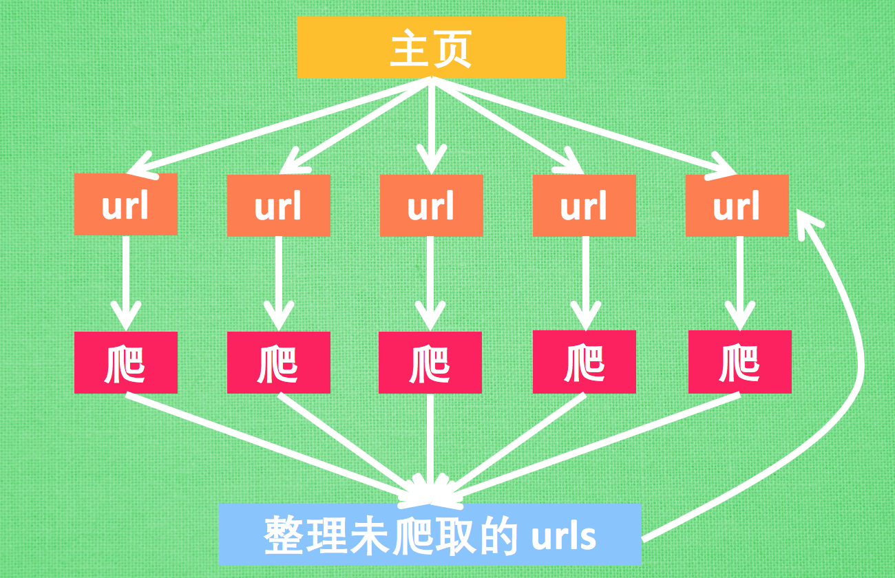

## 目的

Python中的multiprocess提供了Process类，实现进程相关的功能。但是它基于fork机制，因此不被windows平台支持。想要在windows中运行，必须使用 if **name** == ‘**main**: 的方式)。并且多进程就是开启多个进程，每个进程之间是不会互相通信互相干扰的，适用于密集计算。

<!--more-->

## 案例一 基础用法

多进程的使用方法和多线程使用方法基本一样，所以如果你会多线程用法多进程也就懂了，有一点要注意，定义多进程，然后传递参数的时候，如果是有一个参数就是用args=（i，）一定要加上逗号，如果有两个或者以上的参数就不用这样。

```
import sys
import multiprocessing
reload(sys)
sys.setdefaultencoding('utf-8')
def fun(i):
    print sys.path
    print sys.version_info
    print sys.platform
    print sys.long_info

if __name__ == '__main__':
    m = multiprocessing.Process(target=fun,args=(1,))
    m.start()
```

运行结果：

```
['E:\\python27\\python study', 'E:\\python27', 'C:\\windows\\SYSTEM32\\python27.zip', 'F:\\Python27\\DLLs', 'F:\\Python27\\lib', 'F:\\Python27\\lib\\plat-win', 'F:\\Python27\\lib\\lib-tk', 'F:\\Python27', 'F:\\Python27\\lib\\site-packages', 'F:\\Python27\\lib\\site-packages\\certifi-2017.7.27.1-py2.7.egg', 'F:\\Python27\\lib\\site-packages\\idna-2.6-py2.7.egg', 'F:\\Python27\\lib\\site-packages\\pypiwin32-219-py2.7-win-amd64.egg', 'F:\\Python27\\lib\\site-packages\\future-0.16.0-py2.7.egg', 'F:\\Python27\\lib\\site-packages\\dis3-0.1.1-py2.7.egg', 'F:\\Python27\\lib\\site-packages\\macholib-1.8-py2.7.egg', 'F:\\Python27\\lib\\site-packages\\pefile-2017.9.3-py2.7.egg', 'F:\\Python27\\lib\\site-packages\\altgraph-0.14-py2.7.egg', 'F:\\Python27\\lib\\site-packages\\beautifulsoup4-4.6.0-py2.7.egg', 'F:\\Python27\\lib\\site-packages\\chardet-3.0.4-py2.7.egg']
sys.version_info(major=2, minor=7, micro=14, releaselevel='final', serial=0)
win32
sys.long_info(bits_per_digit=30, sizeof_digit=4)
```

## 案例二 数据通信

ipc：就是进程间的通信模式，常用的一半是socke，rpc，pipe和消息队列等。

multiprocessing提供了threading包中没有的IPC(比如Pipe和Queue)，效率上更高。应优先考虑Pipe和Queue，避免使用Lock/Event/Semaphore/Condition等同步方式 (因为它们占据的不是用户进程的资源)。

#### 使用Array共享数据

对于Array数组类，括号内的“i”表示它内部的元素全部是int类型，而不是指字符“i”，数组内的元素可以预先指定，也可以只指定数组的长度。Array类在实例化的时候必须指定数组的数据类型和数组的大小，类似temp = Array(‘i’, 5)。对于数据类型有下面的对应关系：

```
'c': ctypes.c_char, 'u': ctypes.c_wchar,
'b': ctypes.c_byte, 'B': ctypes.c_ubyte,
'h': ctypes.c_short, 'H': ctypes.c_ushort,
'i': ctypes.c_int, 'I': ctypes.c_uint,
'l': ctypes.c_long, 'L': ctypes.c_ulong,
'f': ctypes.c_float, 'd': ctypes.c_double
```

代码实例：

```
from multiprocessing import Process
from multiprocessing import Array

def func(i,temp):
    temp[0] += 100
    print("进程%s " % i, ' 修改数组第一个元素后----->', temp[0])

if __name__ == '__main__':
    temp = Array('i', [1, 2, 3, 4])
    for i in range(10):
        p = Process(target=func, args=(i, temp))
        p.start()
```

运行结果：

```
进程2   修改数组第一个元素后-----> 101
进程4   修改数组第一个元素后-----> 201
进程5   修改数组第一个元素后-----> 301
进程3   修改数组第一个元素后-----> 401
进程1   修改数组第一个元素后-----> 501
进程6   修改数组第一个元素后-----> 601
进程9   修改数组第一个元素后-----> 701
进程8   修改数组第一个元素后-----> 801
进程0   修改数组第一个元素后-----> 901
进程7   修改数组第一个元素后-----> 1001
```

#### 使用Manager共享数据

通过Manager类也可以实现进程间数据的共享，主要用于线程池之间通信，Manager()返回的manager对象提供一个服务进程，使得其他进程可以通过代理的方式操作Python对象。manager对象支持 list, dict, Namespace, Lock, RLock, Semaphore, BoundedSemaphore, Condition, Event, Barrier, Queue, Value ,Array等多种格式。

代码实例：

```
from multiprocessing import Process
from multiprocessing import Manager

def func(i, dic):
    dic["num"] = 100+i
    print(dic.items())

if __name__ == '__main__':
    dic = Manager().dict()
    for i in range(10):
        p = Process(target=func, args=(i, dic))
        p.start()
        p.join()
```

#### 使用queues的Queue类共享数据

multiprocessing是一个包，它内部有一个queues模块，提供了一个Queue队列类，可以实现进程间的数据共享，如下例所示：

```
import multiprocessing
from multiprocessing import Process
from multiprocessing import queues

def func(i, q):
    ret = q.get()
    print("进程%s从队列里获取了一个%s，然后又向队列里放入了一个%s" % (i, ret, i))
    q.put(i)

if __name__ == "__main__":
    lis = queues.Queue(20, ctx=multiprocessing)
    lis.put(0)
    for i in range(10):
        p = Process(target=func, args=(i, lis,))
        p.start()
```

运行结果：

```
进程1从队列里获取了一个0，然后又向队列里放入了一个1
进程4从队列里获取了一个1，然后又向队列里放入了一个4
进程2从队列里获取了一个4，然后又向队列里放入了一个2
进程6从队列里获取了一个2，然后又向队列里放入了一个6
进程0从队列里获取了一个6，然后又向队列里放入了一个0
进程5从队列里获取了一个0，然后又向队列里放入了一个5
进程9从队列里获取了一个5，然后又向队列里放入了一个9
进程7从队列里获取了一个9，然后又向队列里放入了一个7
进程3从队列里获取了一个7，然后又向队列里放入了一个3
进程8从队列里获取了一个3，然后又向队列里放入了一个8
```

例如来跑多进程对一批IP列表进行运算，运算后的结果都存到Queue队列里面，这个就必须使用multiprocessing提供的Queue来实现

关于queue和Queue，在Python库中非常频繁的出现，很容易就搞混淆了。甚至是multiprocessing自己还有一个Queue类(大写的Q)和的Manager类中提供的Queue方法，一样能实现消息队列queues.Queue的功能，导入方式是from multiprocessing import Queue，前者Queue用于多个进程间通信，和queues.Queue()差不多，后者Manager().queue用于进程池之间通信。

#### 使用pipe实现进程间通信

pipe只能适用于两个进程间通信，queue则没这个限制，他有两个方法

```
receive_pi = Pipe()
# 定义变量，用来获取数据
send_pi = Pipe()
# 用来发送数据
```

具体例子如下：

```
from multiprocessing import Pipe,Process
import time
def produce(pipe):
    pipe.send('666')
    time.sleep(1)
def consumer(pipe):
    print(pipe.recv())
    # 有些类似socket的recv方法
if __name__ == '__main__':
    send_pi,recv_pi = Pipe()
    my_pro = Process(target=produce,args=(send_pi,))
    my_con = Process(target=consumer,args=(recv_pi,))
    my_pro.start()
    my_con.start()
    my_pro.join()
    my_con.join()
```

pipe相当于queue的一个子集，只能服务两个进程，pipe的性能高于queue。

## 案例三 进程锁

一般来说每个进程使用单独的空间，不必加进程锁的，但是如果你需要先实现进程数据共享，**使用案例二中的代码**，又害怕造成数据抢夺和脏数据的问题。就可以设置进程锁，与threading类似，在multiprocessing里也有同名的锁类RLock，Lock，Event，Condition和 Semaphore，连用法都是一样样的。

**如果有多个进程要上锁，使用multiprocessing.Manager().BoundedSemaphore(1)**

代码实例：

```
from multiprocessing import Process
from multiprocessing import Array
from multiprocessing import RLock, Lock, Event, Condition, Semaphore
import time

def func(i,lis,lc):
    lc.acquire()
    lis[0] = lis[0] - 1
    time.sleep(1)
    print('say hi', lis[0])
    lc.release()

if __name__ == "__main__":
    array = Array('i', 1)
    array[0] = 10
    lock = RLock()
    for i in range(10):
        p = Process(target=func, args=(i, array, lock))
        p.start()
```

运行结果：

```
say hi 9
say hi 8
say hi 7
say hi 6
say hi 5
say hi 4
say hi 3
say hi 2
say hi 1
say hi 0
```

## 案例四 进程池

from multiprocessing import Pool导入就行，非常容易使用的。进程池内部维护了一个进程序列，需要时就去进程池中拿取一个进程，如果进程池序列中没有可供使用的进程，那么程序就会等待，直到进程池中有可用进程为止。

1. apply() 同步执行（串行）
2. apply_async() 异步执行（并行）
3. terminate() 立刻关闭进程池
4. join() 主进程等待所有子进程执行完毕。必须在close或terminate()之后。
5. close() 等待所有进程结束后，才关闭进程池。

代码实例：

```
from multiprocessing import Pool
import time
def func(args):
    time.sleep(1)
    print("正在执行进程 ", args)
if __name__ == '__main__':
    p = Pool(5)     # 创建一个包含5个进程的进程池
    for i in range(30):
        # 有30个任务
        p.apply_async(func=func, args=(i,))
        # 异步执行，并发。这里不用target，要用func
    p.close()           # 等子进程执行完毕后关闭进程池
    # time.sleep(2)
    # p.terminate()     # 立刻关闭进程池
    p.join()
```

from multiprocessing.dummy import Pool as ThreadPool 是多线程进程池，绑定一个cpu核心。from multiprocessing import Pool多进程，运行于多个cpu核心。multiprocessing 是多进程模块， 而multiprocessing.dummy是以相同API实现的多线程模块。
没有绕过GIL情况下，多线程一定受GIL限制。

代码实例：

```
from multiprocessing.dummy import Pool as tp
def fun(i):
    print i+i+i+i

list_i=[range(100)]

px = tp(processes=8)
# 开启8个线程池
px.map(fun,list_i)
px.close()
px.join()
```

使用dummy方法可以不用__name__=’__main__‘，并且用法很简单，开启线程池用法一样，需要注意的是导入的参数，要在一个列表中导入。比如你有一批数据要放进这个线程池，就直接把这批数据放在一个列表中。

## 案例五 爬虫进程池

案例来自[莫凡](https://morvanzhou.github.io/tutorials/data-manipulation/scraping/4-01-distributed-scraping/)

#### 什么是分布式爬虫

分布式爬虫主要是为了非常有效率的抓取网页, 我们的程序一般是单线程跑的, 指令也是一条条处理的, 每执行完一条指令才能跳到下一条. 那么在爬虫的世界里, 这里存在着一个问题.

如果你已经顺利地执行过了前几节的爬虫代码, 你会发现, 有时候代码运行的时间大部分都花在了下载网页上. 有时候不到一秒能下载好一张网页的 HTML, 有时候却要几十秒. 而且非要等到 HTML 下载好了以后, 才能执行网页分析等步骤. 这非常浪费时间.

如果我们能合理利用计算资源, 在下载一部分网页的时候就已经开始分析另一部分网页了. 这将会大大节省整个程序的运行时间. 又或者, 我们能同时下载多个网页, 同时分析多个网页, 这样就有种事倍功半的效用. 分布式爬虫的体系有很多种, 处理优化的问题也是多样的. 这里有一篇博客可以当做扩展阅读, 来了解当今比较流行的分布式爬虫框架.

#### 我们的分布式爬虫

而今天我们想搭建的这一个爬虫, 就是同时下载, 同时分析的这一种类型的分布式爬虫. 虽然算不上特别优化的框架, 但是概念理解起来比较容易. 我有尝试过徒手写高级一点的分布式爬虫, 但是写起来非常麻烦. 我琢磨了一下, 打算给大家介绍的这种分布式爬虫代码也较好写, 而且效率比普通爬虫快了3.5倍. 我也特地画了张图给大家解释一下要搭建的分布式爬虫.



主要来说, 我们最开始有一个网页, 比如说是莫烦Python的首页, 然后首页中有很多 url, 我们使用多进程 (Python多进程教程) 同时开始下载这些 url, 得到这些 url 的 HTML 以后, 同时开始解析 (比如 BeautifulSoup) 网页内容. 在网页中寻找这个网站还没有爬过的链接. 最终爬完整个 莫烦 Python 网站所有页面.

有了这种思路, 我们就可以开始写代码了. 你可以在我的 Github 一次性观看全部代码.

首先 import 全部要用的模块, 并规定一个主页. 注意, 我用这份代码测试我内网的网站(速度不受外网影响) 所以使用的 base_url 是 “http://127.0.0.1:4000/”, 如果你要爬 莫烦Python, 你的 base_url 要是 “https://morvanzhou.github.io/” (下载速度会受外网影响).

```
import multiprocessing as mp
import time
from urllib.request import urlopen, urljoin
from bs4 import BeautifulSoup
import re

# base_url = "http://127.0.0.1:4000/"
base_url = 'https://morvanzhou.github.io/'
```

我们定义两个功能, 一个是用来爬取网页的(crawl), 一个是解析网页的(parse). 有了前几节内容的铺垫, 你应该能一言看懂下面的代码. crawl() 用 urlopen 来打开网页, 我用的内网测试, 所以为了体现下载网页的延迟, 添加了一个 time.sleep(0.1) 的下载延迟. 返回原始的 HTML 页面, parse() 就是在这个 HTML 页面中找到需要的信息, 我们用 BeautifulSoup 找 (BeautifulSoup 教程). 返回找到的信息.

```
def crawl(url):
    response = urlopen(url)
    # time.sleep(0.1)             # slightly delay for downloading
    return response.read().decode()


def parse(html):
    soup = BeautifulSoup(html, 'lxml')
    urls = soup.find_all('a', {"href": re.compile('^/.+?/$')})
    title = soup.find('h1').get_text().strip()
    page_urls = set([urljoin(base_url, url['href']) for url in urls])   # 去重
    url = soup.find('meta', {'property': "og:url"})['content']
    return title, page_urls, url
```

网页中爬取中, 肯定会爬到重复的网址, 为了去除掉这些重复, 我们使用 python 的 set 功能. 定义两个 set, 用来搜集爬过的网页和没爬过的.

```
unseen = set([base_url,])
seen = set()
```

#### 测试普通爬法

为了对比效果, 我们将在下面对比普通的爬虫和这种分布式的效果. 如果是普通爬虫, 我简化了一下接下来的代码, 将一些不影响的代码去除掉了, 如果你想看全部的代码, 请来到我的 Github. 我们用循环一个个 crawl unseen 里面的 url, 爬出来的 HTML 放到 parse 里面去分析得到结果. 接着就是更新 seen 和 unseen 这两个集合了.

特别注意: 任何网站都是有一个服务器压力的, 如果你爬的过于频繁, 特别是使用多进程爬取或异步爬取, 一次性提交请求给服务器太多次, 这将可能会使得服务器瘫痪, 你可能再也看不到莫烦 Python 了. 所以为了安全起见, 我限制了爬取数量(restricted_crawl=True). 因为我测试使用的是内网 “http://127.0.0.1:4000/” 所以不会有这种压力. 你在以后的爬网页中, 会经常遇到这样的爬取次数的限制 (甚至被封号). 我以前爬 github 时就被限制成一小时只能爬60页.

```
# DON'T OVER CRAWL THE WEBSITE OR YOU MAY NEVER VISIT AGAIN
if base_url != "http://127.0.0.1:4000/":
    restricted_crawl = True
else:
    restricted_crawl = False

while len(unseen) != 0:                 # still get some url to visit
    if restricted_crawl and len(seen) >= 20:
        break
    htmls = [crawl(url) for url in unseen]
    results = [parse(html) for html in htmls]

    seen.update(unseen)         # seen the crawled
    unseen.clear()              # nothing unseen

    for title, page_urls, url in results:
        unseen.update(page_urls - seen)     # get new url to crawl
```

使用这种单线程的方法, 在我的内网上面爬, 爬完整个 莫烦Python, 一共消耗 52.3秒. 接着我们把它改成多进程分布式.

#### 测试分布式爬法

还是上一个 while 循环, 首先我们创建一个进程池(Pool). 不太懂进程池的朋友看过来. 然后我们修改得到 htmls 和 results 的两句代码. 其他都不变, 只将这两个功能给并行了. 我在这里写的都是简化代码, 你可以在这里 看到完整代码.

```
pool = mp.Pool(4)
while len(unseen) != 0:
    # htmls = [crawl(url) for url in unseen]
    # --->
    crawl_jobs = [pool.apply_async(crawl, args=(url,)) for url in unseen]
    htmls = [j.get() for j in crawl_jobs]

    # results = [parse(html) for html in htmls]
    # --->
    parse_jobs = [pool.apply_async(parse, args=(html,)) for html in htmls]
    results = [j.get() for j in parse_jobs]
```

还是在内网测试, 只用了 16.3秒!! 这可比上面的单线程爬虫快了3.5倍. 而且我还不是在外网测试的. 如果在外网, 爬取一张网页的时间更长, 使用多进程会更加有效率, 节省的时间更多.

## 各模块作用

#### Process介绍

构造方法:

1. Process([group [, target [, name [, args [, kwargs]]]]])
2. group: 线程组，目前还没有实现，库引用中提示必须是None；
3. target: 要执行的方法；
4. name: 进程名；
5. args/kwargs: 要传入方法的参数。

实例方法:

1. is_alive()：返回进程是否在运行。
2. join([timeout])：阻塞当前上下文环境的进程程，直到调用此方法的进程终止或到达指定的3. timeout（可选参数）。
3. start()：进程准备就绪，等待CPU调度。
4. run()：strat()调用run方法，如果实例进程时未制定传入target，这star执行t默认run()方法。
5. terminate()：不管任务是否完成，立即停止工作进程。

属性：

1. authkey
2. daemon：和线程的setDeamon功能一样（将父进程设置为守护进程，当父进程结束时，子进程也结束）。
3. exitcode(进程在运行时为None、如果为–N，表示被信号N结束）。
4. name：进程名字。
5. pid：进程号。

#### Pool介绍

Multiprocessing.Pool可以提供指定数量的进程供用户调用，当有新的请求提交到pool中时，如果池还没有满，那么就会创建一个新的进程用来执行该请求；但如果池中的进程数已经达到规定最大值，那么该请求就会等待，直到池中有进程结束，才会创建新的进程来执行它。在共享资源时，只能使用Multiprocessing.Manager类，而不能使用Queue或者Array。Pool类用于需要执行的目标很多，而手动限制进程数量又太繁琐时，如果目标少且不用控制进程数量则可以用Process类。

构造方法：

1. Pool([processes[, initializer[, initargs[, maxtasksperchild[, context]]]]])
2. processes ：使用的工作进程的数量，如果processes是None那么使用 os.cpu_count()返回的数量。
3. initializer： 如果initializer是None，那么每一个工作进程在开始的时候会调用initializer(*initargs)。
4. maxtasksperchild：工作进程退出之前可以完成的任务数，完成后用一个新的工作进程来替代原进程，来让闲置的资源被释放。maxtasksperchild默认是None，意味着只要Pool存在工作进程就会一直存活。
5. context: 用在制定工作进程启动时的上下文，一般使用 multiprocessing.Pool() 或者一个context对象的Pool()方法来创建一个池，两种方法都适当的设置了context。

实例方法：

1. apply_async(func[, args[, kwds[, callback]]]) 它是非阻塞。
2. apply(func[, args[, kwds]])是阻塞的
3. close() 关闭pool，使其不在接受新的任务。
4. terminate() 关闭pool，结束工作进程，不在处理未完成的任务。
5. join() 主进程阻塞，等待子进程的退出， join方法要在close或terminate之后使用。

Pool使用方法

Pool+map函数

说明：此写法缺点在于只能通过map向函数传递一个参数。

```
from multiprocessing import Pool
def test(i):
    print i
if __name__=="__main__":
    lists=[1,2,3]
    pool=Pool(processes=2) #定义最大的进程数
    pool.map(test,lists)        #p必须是一个可迭代变量。
    pool.close()
    pool.join()
```

异步进程池（非阻塞）

```
from multiprocessing import Pool
def test(i):
    print i
if __name__=="__main__":
    pool = Pool(processes=10)
    for i  in xrange(500):
        '''
        For循环中执行步骤：
        （1）循环遍历，将500个子进程添加到进程池（相对父进程会阻塞）
        （2）每次执行10个子进程，等一个子进程执行完后，立马启动新的子进程。（相对父进程不阻塞）

        apply_async为异步进程池写法。
        异步指的是启动子进程的过程，与父进程本身的执行（print）是异步的，而For循环中往进程池添加子进程的过程，与父进程本身的执行却是同步的。
        '''
        pool.apply_async(test, args=(i,)) #维持执行的进程总数为10，当一个进程执行完后启动一个新进程.       
    print “test”
    pool.close()
    pool.join()
```

执行顺序：For循环内执行了2个步骤，第一步：将500个对象放入进程池（阻塞）。第二步：同时执行10个子进程（非阻塞），有结束的就立即添加，维持10个子进程运行。（apply_async方法的会在执行完for循环的添加步骤后，直接执行后面的print语句，而apply方法会等所有进程池中的子进程运行完以后再执行后面的print语句）

注意：调用join之前，先调用close或者terminate方法，否则会出错。执行完close后不会有新的进程加入到pool,join函数等待所有子进程结束。

同步进程池（阻塞）

```
from multiprocessing import Pool
def test(p):
       print p
       time.sleep(3)
if __name__=="__main__":
    pool = Pool(processes=10)
    for i  in xrange(500):
    '''
    实际测试发现，for循环内部执行步骤：
    （1）遍历500个可迭代对象，往进程池放一个子进程
    （2）执行这个子进程，等子进程执行完毕，再往进程池放一个子进程，再执行。（同时只执行一个子进程）
    for循环执行完毕，再执行print函数。
    '''
        pool.apply(test, args=(i,))   #维持执行的进程总数为10，当一个进程执行完后启动一个新进程.
    print “test”
    pool.close()
    pool.join()
```

说明：for循环内执行的步骤顺序，往进程池中添加一个子进程，执行子进程，等待执行完毕再添加一个子进程…..等500个子进程都执行完了，再执行print “test”。（从结果来看，并没有多进程并发）

#### 子进程返回值

在实际使用多进程的时候，可能需要获取到子进程运行的返回值。如果只是用来存储，则可以将返回值保存到一个数据结构中；如果需要判断此返回值，从而决定是否继续执行所有子进程，则会相对比较复杂。另外在Multiprocessing中，可以利用Process与Pool创建子进程，这两种用法在获取子进程返回值上的写法上也不相同。这篇中，我们直接上代码，分析多进程中获取子进程返回值的不同用法，以及优缺点。

初级用法（Pool）

目的：存储子进程返回值

说明：如果只是单纯的存储子进程返回值，则可以使用Pool的apply_async异步进程池；当然也可以使用Process，用法与threading中的相同，这里只介绍前者。

实例：当进程池中所有子进程执行完毕后，输出每个子进程的返回值。

```
from multiprocessing import Pool
def test(p):     
    return p
if __name__=="__main__":
    pool = Pool(processes=10)
    result=[]
    for i  in xrange(50000):
       '''
       for循环执行流程：
       （1）添加子进程到pool，并将这个对象（子进程）添加到result这个列表中。（此时子进程并没有运行）
       （2）执行子进程（同时执行10个）
       '''
       result.append(pool.apply_async(test, args=(i,)))#维持执行的进程总数为10，当一个进程执行完后添加新进程.       
    pool.join()
    '''
    遍历result列表，取出子进程对象，访问get()方法，获取返回值。（此时所有子进程已执行完毕）
    '''
    for i in result:
        print i.get()
```

错误写法：

```
for i  in xrange(50000):
   t=pool.apply_async(test, args=(i,)))
   print t.get()
```

说明：这样会造成阻塞，因为get()方法只能等子进程运行完毕后才能调用成功，否则会一直阻塞等待。如果写在for循环内容，相当于变成了同步，执行效率将会非常低。

高级用法（Pool）
目的：父进程实时获取子进程返回值，以此为标记结束所有进程。

实例（一）
执行子进程的过程中，不断获取返回值并校验，如果返回值为True则结果所有进程。

```
from multiprocessing import Pool
import Queue
import time
def test(p):
    time.sleep(0.001)
    if p==10000:
        return True
    else:
        return False
if __name__=="__main__":
    pool = Pool(processes=10)
    q=Queue.Queue()
    for i  in xrange(50000):
        '''
        将子进程对象存入队列中。
        '''
        q.put(pool.apply_async(test, args=(i,)))#维持执行的进程总数为10，当一个进程执行完后添加新进程.       
    '''
    因为这里使用的为pool.apply_async异步方法，因此子进程执行的过程中，父进程会执行while，获取返回值并校验。
    '''
    while 1:
        if q.get().get():
            pool.terminate() #结束进程池中的所有子进程。
            break
    pool.join()
```

说明：总共要执行50000个子进程（并发数量为10），当其中一个子进程返回True时，结束进程池。因为使用了apply_async为异步进程，因此在执行完for循环的添加子进程操作后（只是添加并没有执行完所有的子进程），可以直接执行while代码，实时判断子进程返回值是否有True，有的话结束所有进程。

优点：不必等到所有子进程结束再结束程序，只要得到想要的结果就可以提前结束，节省资源。

不足：当需要执行的子进程非常大时，不适用，因为for循环在添加子进程时，要花费很长的时间，虽然是异步，但是也需要等待for循环添加子进程操作结束才能执行while代码，因此会比较慢。

实例（二）

多线程+多进程，添加执行子进程的过程中，不断获取返回值并校验，如果返回值为True则结果所有进程。

```
from multiprocessing import Pool
import Queue
import threading
import time
def test(p):
    time.sleep(0.001)
    if p==10000:
        return True
    else:
        return False
if __name__=="__main__":
    result=Queue.Queue() #队列
    pool = Pool()
    def pool_th():
        for i  in xrange(50000000): ##这里需要创建执行的子进程非常多
            try:
                result.put(pool.apply_async(test, args=(i,)))
            except:
                break
    def result_th():
        while 1:
            a=result.get().get() #获取子进程返回值
            if a:
                pool.terminate() #结束所有子进程
                break
    '''
    利用多线程，同时运行Pool函数创建执行子进程，以及运行获取子进程返回值函数。
    '''
    t1=threading.Thread(target=pool_th)
    t2=threading.Thread(target=result_th)
    t1.start()
    t2.start()
    t1.join()
    t2.join()
    pool.join()
```

执行流程：利用多线程，创建一个执行pool_th函数线程，一个执行result_th函数线程，pool_th函数用来添加进程池，开启进程执行功能函数并将子进程对象存入队列，而result_th()函数用来不停地从队列中取子进程对象，调用get（）方法获取返回值。等发现其中存在子进程的返回值为True时，结束所有进程，最后结束线程。

优点：弥补了实例（一）的不足，即使for循环的子进程数量很多，也能提高性能，因为for循环与判断子进程返回值同时进行。