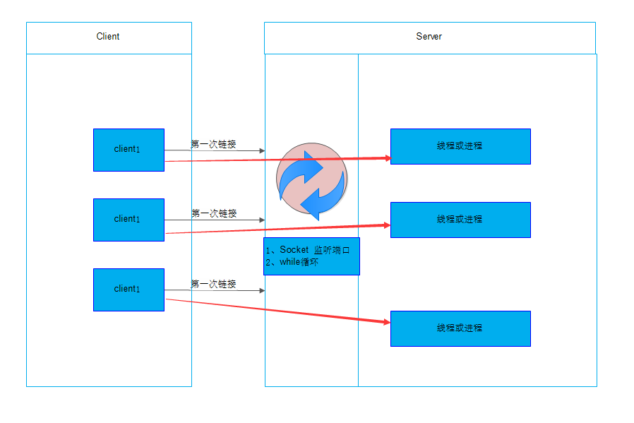
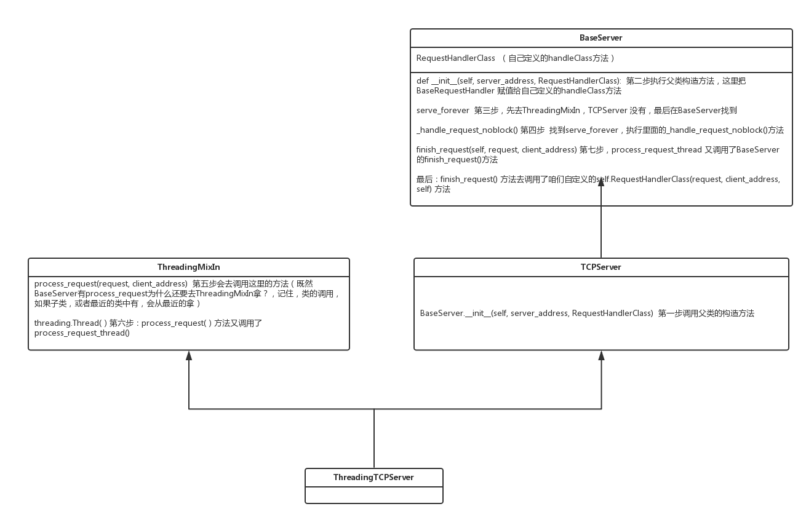
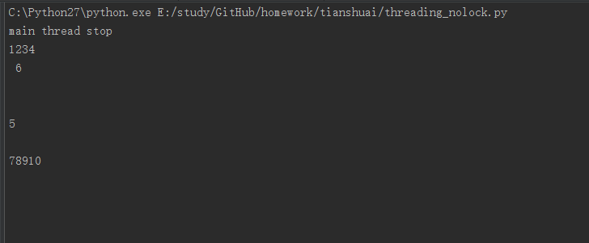

## Socket Server模块

SocketServer内部使用 IO多路复用 以及 “多线程” 和 “多进程” ，从而实现并发处理多个客户端请求的Socket服务端。即：每个客户端请求连接到服务器时，Socket服务端都会在服务器是创建一个“线程”或者“进程” 专门负责处理当前客户端的所有请求。

socket server和select & epoll 还是不太一样他的本质是：客户端第一次链接的时候，只要一进来，我服务端有个while循环为你创建一个
线程和进程，客户端就和服务端直接创建通信，以后传送数据什么的就不会通过server端了，直接他俩通过线程或者进程通信就可以了！

如果在多进程的时候，client1和client2他们同时传输10G的文件都是互相不影响！
如果在多线程的时候，python中的多线程，在同一时间只有一个线程在工作，他底层会自动进行上下文切换，client1传一点，client2传一点。

知识回顾：
python中的多线程，有一个GIL在同一时间只有一个线程在工作，他底层会自动进行上下文切换.
这样会导致python的多线程效率会很低，也就是人们经常说的python多线程问题

如下图：

第一次连接后，数据通讯就通过线程或进程进行数据交换（红色箭头）



## **ThreadingTCPServer**

ThreadingTCPServer实现的Socket服务器内部会为每个client创建一个 “**线程**”，该线程用来和客户端进行交互。

#### ThreadingTCPServer基础

使用ThreadingTCPServer:

- 创建一个继承自 SocketServer.BaseRequestHandler 的类
- 类中必须定义一个名称为 handle 的方法
- 启动ThreadingTCPServer

```python
#!/usr/bin/env python
# -*- coding:utf-8 -*-
import SocketServer

class MyServer(SocketServer.BaseRequestHandler):

    def handle(self): #定义handle方法
        # print self.request,self.client_address,self.server
        conn = self.request #如果连接请求过来，获取client端对象
        conn.sendall('欢迎致电 10086，请输入1xxx,0转人工服务.') #发送一个信息
        Flag = True #并把Flag设置为True
        while Flag:当Flag为True的时候执行
            data = conn.recv(1024) #接收client端数据
            if data == 'exit': #判断如果data  == 'exit' 退出
                Flag = False #并把Flag设置为Flase
            elif data == '0': #如果为 == ‘0’ 
                conn.sendall('通过可能会被录音.balabala一大推') #发送数据
            else:#上面的都没匹配上，发送请重新输入
                conn.sendall('请重新输入.') 


if __name__ == '__main__':
    server = SocketServer.ThreadingTCPServer(('127.0.0.1',8009),MyServer) #实例化对象，设置启动的IP/PORT并把自己定义的类写上作为SocketServer.ThreadingTCPServer的构造函数
    server.serve_forever() #调用对象中的启动方法
```

```python
#!/usr/bin/env python
# -*- coding:utf-8 -*-

import socket


ip_port = ('127.0.0.1',8009)
sk = socket.socket()
sk.connect(ip_port)
sk.settimeout(5)

while True:
    data = sk.recv(1024)
    print 'receive:',data
    inp = raw_input('please input:')
    sk.sendall(inp)
    if inp == 'exit':
        break

sk.close()
```

#### ThreadingTCPServer源码剖析

 

学会看源码非常重要！不能仅仅光会用！大赞~ 知道他的过程和实现~ 怎么学会看源码呢？多看然后画类图，如上图！！！

在理解的时候可以把他们想象为，把所有需要用的方法，都抓到ThreadingTCPServer中

内部调用流程为：

- 启动服务端程序
- 执行 TCPServer.__init__ 方法，创建服务端Socket对象并绑定 IP 和 端口
- 执行 BaseServer.__init__ 方法，将自定义的继承自SocketServer.BaseRequestHandler 的类 MyRequestHandle赋值给 self.RequestHandlerClass
- 执行 BaseServer.server_forever 方法，While 循环一直监听是否有客户端请求到达 ...
- 当客户端连接到达服务器
- 执行 ThreadingMixIn.process_request 方法，创建一个 “线程” 用来处理请求
- 执行 ThreadingMixIn.process_request_thread 方法
- 执行 BaseServer.finish_request 方法，执行 self.RequestHandlerClass()  即：执行 自定义 MyRequestHandler 的构造方法（自动调用基类BaseRequestHandler的构造方法，在该构造方法中又会调用 MyRequestHandler的handle方法）

精简源码：

模拟Socekt Server的简化版本：

```python
import socket
import threading
import select


def process(request, client_address): #模拟定义的handle()方法，这个方法内的代码是socket server与Client端交互代码
    print request,client_address
    conn = request
    conn.sendall('欢迎致电 10086，请输入1xxx,0转人工服务.')
    flag = True
    while flag:
        data = conn.recv(1024)
        if data == 'exit':
            flag = False
        elif data == '0':
            conn.sendall('通过可能会被录音.balabala一大推')
        else:
            conn.sendall('请重新输入.')

sk = socket.socket(socket.AF_INET, socket.SOCK_STREAM)
sk.bind(('127.0.0.1',8002))
sk.listen(5)

while True:  #这里一个while循环循环监控sk文件句柄
    r, w, e = select.select([sk,],[],[],1)
    print 'looping'
    if sk in r: #当sk文件句柄发生变化的时候说明是新的客户端连接过来了
        print 'get request'
        request, client_address = sk.accept()
        t = threading.Thread(target=process, args=(request, client_address)) #创建一个线程，并调用自己定义的process方法执行~然后样客户端与之交互
        t.daemon = False
        t.start()

sk.close()
```

如精简代码可以看出，SocketServer的ThreadingTCPServer之所以可以同时处理请求得益于 **select** 和 **Threading** 两个东西，其实本质上就是在服务器端为每一个客户端创建一个线程，当前线程用来处理对应客户端的请求，所以，可以支持同时n个客户端链接（长连接）。

**ForkingTCPServer**

ForkingTCPServer和ThreadingTCPServer的使用和执行流程基本一致，只不过在内部分别为请求者建立 “线程”  和 “进程”。

```python
#!/usr/bin/env python
# -*- coding:utf-8 -*-
import SocketServer

class MyServer(SocketServer.BaseRequestHandler):

    def handle(self):
        # print self.request,self.client_address,self.server
        conn = self.request
        conn.sendall('欢迎致电 10086，请输入1xxx,0转人工服务.')
        Flag = True
        while Flag:
            data = conn.recv(1024)
            if data == 'exit':
                Flag = False
            elif data == '0':
                conn.sendall('通过可能会被录音.balabala一大推')
            else:
                conn.sendall('请重新输入.')


if __name__ == '__main__':
    server = SocketServer.ForkingTCPServer(('127.0.0.1',8009),MyServer)
    server.serve_forever()
```

```python
#!/usr/bin/env python
# -*- coding:utf-8 -*-

import socket


ip_port = ('127.0.0.1',8009)
sk = socket.socket()
sk.connect(ip_port)
sk.settimeout(5)

while True:
    data = sk.recv(1024)
    print 'receive:',data
    inp = raw_input('please input:')
    sk.sendall(inp)
    if inp == 'exit':
        break

sk.close()
```

以上ForkingTCPServer只是将 ThreadingTCPServer 实例中的代码：

```python
server = SocketServer.ThreadingTCPServer(('127.0.0.1',8009),MyRequestHandler)
变更为：
server = SocketServer.ForkingTCPServer(('127.0.0.1',8009),MyRequestHandler)
```

##  Python线程

Threading用于提供线程相关的操作，线程是应用程序中工作的最小单元。

```python
#!/usr/bin/env python
# -*- coding:utf-8 -*-
import threading
import time
  
def show(arg):
    time.sleep(2)
    print 'thread'+str(arg)
  
for i in range(10):
    t = threading.Thread(target=show, args=(i,))  #这里实例化对象的时候传的两个参数第一个参数是，线程需要执行的方法，第二个参数方法的参数
    t.start()
  
print 'main thread stop'
```

上述代码创建了10个“前台”线程，然后控制器就交给了CPU，CPU根据指定算法进行调度，分片执行指令。

再次回顾：这里为什么是分片执行？

python中的多线程，有一个GIL（Global Interpreter Lock 全局解释器锁 ）在同一时间只有一个线程在工作，他底层会自动进行上下文切换.这个线程执行点，那个线程执行点！

**更多方法：**

- start       线程准备就绪，等待CPU调度
- setName     为线程设置名称
- getName     获取线程名称
- setDaemon   设置为后台线程或前台线程（默认）
- ​            如果是后台线程，主线程执行过程中，后台线程也在进行，主线程执行完毕后，后台线程不论成功与否，均停止
- ​            如果是前台线程，主线程执行过程中，前台线程也在进行，主线程执行完毕后，等待前台线程也执行完成后，程序停止
- join        逐个执行每个线程，执行完毕后继续往下执行，该方法使得多线程变得无意义
- run         线程被cpu调度后执行Thread类对象的run方法

**线程锁**

由于线程之间是进行随机调度，并且每个线程可能只执行n条执行之后，CPU接着执行其他线程。所以，可能出现如下问题：



```python
#!/usr/bin/env python
# -*- coding:utf-8 -*-
import threading
import time

gl_num = 0

def show(arg):
    global gl_num
    time.sleep(1)
    gl_num +=1
    print gl_num

for i in range(10):
    t = threading.Thread(target=show, args=(i,))
    t.start()

print 'main thread stop'
```

**设置线程锁**

```python
#!/usr/bin/env python
#coding:utf-8
   
import threading
import time
   
gl_num = 0
   
lock = threading.RLock() #实例化调用线程锁
   
def Func():
    lock.acquire() #获取线程锁
    global gl_num
    gl_num +=1
    time.sleep(1)
    print gl_num
    lock.release() #释放线程锁，这里注意，在使用线程锁的时候不能把锁，写在代码中，否则会造成阻塞，看起来“像”单线程
       
for i in range(10):
    t = threading.Thread(target=Func)
    t.start()
```

**event**

他的作用就是：用主线程控制子线程合适执行，他可以让子线程停下来，也可以让线程继续！
他实现的机制就是：标志位“Flag”

事件处理的机制：全局定义了一个“Flag”，如果“Flag”值为 False，那么当程序执行 event.wait 方法时就会阻塞，如果“Flag”值为True，那么event.wait 方法时便不再阻塞。

- clear：将“Flag”设置为False
- set：将“Flag”设置为True

```python
#!/usr/bin/env python
# -*- coding:utf-8 -*-
 
import threading
 
 
def do(event):
    print 'start'
    event.wait() #执行对象weit方法，然后他们停下来，等待“Flag”为True
    print 'execute'
 
 
event_obj = threading.Event() #创建事件的对象

for i in range(10):
    t = threading.Thread(target=do, args=(event_obj,)) #吧对象传到每个线程里面了~
    t.start()
 
event_obj.clear()  #设置"Flag"为Flase

inp = raw_input('input:')
if inp == 'true':
    event_obj.set()
    
#thread enent 就是这个3个方法的使用
```

## Python进程

```python
from multiprocessing import Process
import threading
import time
  
def foo(i):
    print 'say hi',i
  
for i in range(10):
    p = Process(target=foo,args=(i,))
    p.start()
```

**注意：由于进程之间的数据需要各自持有一份，所以创建进程需要的非常大的开销。并且python不能再Windows下创建进程！**

并且在使用多进程的时候，最好是创建多少个进程？：和CPU核数相等

默认的进程之间相互是独立，如果想让进程之间数据共享，就得有个特殊的数据结构，这个数据结构就可以理解为他有穿墙的功能
如果你能穿墙的话两边就都可以使用了
使用了3种方法


**默认的进程无法进行数据共享：**

```python
#!/usr/bin/env python
#coding:utf-8
 
from multiprocessing import Process
from multiprocessing import Manager
 
import time
 
li = []
 
def foo(i):
    li.append(i)
    print 'say hi',li
  
for i in range(10):
    p = Process(target=foo,args=(i,))
    p.start()
     
print 'ending',li
```

**使用特殊的数据类型，来进行穿墙：**

```python
默认的进程之间相互是独立，如果想让进程之间数据共享，就得有个特殊的数据结构，这个数据结构就可以理解为他有穿墙的功能
如果你能穿墙的话两边就都可以使用了
使用了3种方法


第一种方法：

#通过特殊的数据结构：数组（Array）

from multiprocessing import Process,Array

#创建一个只包含数字类型的数组（python中叫列表）
#并且数组是不可变的，在C，或其他语言中，数组是不可变的，之后再python中数组（列表）是可以变得
#当然其他语言中也提供可变的数组
#在C语言中数组和字符串是一样的，如果定义一个列表，如果可以增加，那么我需要在你内存地址后面再开辟一块空间，那我给你预留多少呢？
#在python中的list可能用链表来做的，我记录了你前面和后面是谁。   列表不是连续的，数组是连续的

'''
上面不是列表是“数组"数组是不可变的，附加内容是为了更好的理解数组！
'''

temp = Array('i', [11,22,33,44]) #这里的i是C语言中的数据结构，通过他来定义你要共享的内容的类型！点进去看~
 
def Foo(i):
    temp[i] = 100+i
    for item in temp:
        print i,'----->',item
 
for i in range(2):
    p = Process(target=Foo,args=(i,))
    p.start()
    
第二种方法：
#方法二：manage.dict()共享数据
from multiprocessing import Process,Manager  #这个特殊的数据类型Manager
 
manage = Manager()
dic = manage.dict() #这里调用的时候，使用字典，这个字典和咱们python使用方法是一样的！
 
def Foo(i):
    dic[i] = 100+i
    print dic.values()
 
for i in range(2):
    p = Process(target=Foo,args=(i,))
    p.start()
    p.join()
```

**OK那么问题来了，既然进程之间可以进行共享数据，如果多个进程同时修改这个数据是不是就会造成脏数据？是不是就得需要锁！**

进程的锁和线程的锁使用方式是非常一样的知识他们是用的类是在不同地方的

```python
#!/usr/bin/env python
# -*- coding:utf-8 -*-

from multiprocessing import Process, Array, RLock

def Foo(lock,temp,i):
    """
    将第0个数加100
    """
    lock.acquire()
    temp[0] = 100+i
    for item in temp:
        print i,'----->',item
    lock.release()

lock = RLock()
temp = Array('i', [11, 22, 33, 44])

for i in range(20):
    p = Process(target=Foo,args=(lock,temp,i,))
    p.start()
```


 **进程池**

进程池内部维护一个进程序列，当使用时，则去进程池中获取一个进程，如果进程池序列中没有可供使用的进进程，那么程序就会等待，直到进程池中有可用进程为止。

进程池中有两个方法：

- apply
- apply_async

```python
#!/usr/bin/env python
# -*- coding:utf-8 -*-
from  multiprocessing import Process,Pool
import time
  
def Foo(i):
    time.sleep(2)
    return i+100
  
def Bar(arg):
    print arg
  
pool = Pool(5) #创建一个进程池
#print pool.apply(Foo,(1,))#去进程池里去申请一个进程去执行Foo方法
#print pool.apply_async(func =Foo, args=(1,)).get()
  
for i in range(10):
    pool.apply_async(func=Foo, args=(i,),callback=Bar)
  
print 'end'
pool.close()
pool.join()#进程池中进程执行完毕后再关闭，如果注释，那么程序直接关闭。

'''
apply 主动的去执行
pool.apply_async(func=Foo, args=(i,),callback=Bar) 相当于异步，当申请一个线程之后，执行FOO方法就不管了，执行完之后就在执行callback ，当你执行完之后，在执行一个方法告诉我执行完了
callback 有个函数，这个函数就是操作的Foo函数的返回值！
'''
```

## 协程

首先要明确，线程和进程都是系统帮咱们开辟的，不管是thread还是process他内部都是调用的系统的API
而对于协程来说它和系统毫无关系！
他就和程序员有关系，对于线程和进程来说，调度是由CPU来决定调度的！
对于协程来说，程序员就是上帝，你想让谁执行到哪里他就执行到哪里

协程存在的意义：对于多线程应用，CPU通过切片的方式来切换线程间的执行，线程切换时需要耗时（保存状态，下次继续）。协程，则只使用一个线程，在一个线程中规定某个代码块执行顺序。

适用场景：其实在其他语言中，协程的其实是意义不大的多线程即可已解决I/O的问题，但是在python因为他有GIL（Global Interpreter Lock 全局解释器锁 ）在同一时间只有一个线程在工作，所以：如果一个线程里面I/O操作特别多，协程就比较适用

**greenlet**

```python
收先要明确，线程和进程都是系统帮咱们开辟的，不管是thread还是process他内部都是调用的系统的API
而对于协程来说它和系统毫无关系！
他就和程序员有关系，对于线程和进程来说，是不是有CPU来决定调度的！
对于协程来说，程序员就是上帝，你想让谁执行到哪里他就执行到哪里

#!/usr/bin/env python
# -*- coding:utf-8 -*-
 
 
from greenlet import greenlet
 
 
def test1():
    print 12
    gr2.switch()#切换到协程2执行
    print 34 #2切回来之后，在这里和yield类似
    gr2.switch() 
 
 
def test2():
    print 56
    gr1.switch()#上面执行了一句，在切换到协程1里去了
    print 78
 
gr1 = greenlet(test1) #创建了一个协程
gr2 = greenlet(test2)

gr1.switch() #执行test1 

'''
比I/O操作，如果10个I/O，我程序从上往下执行，如果同时发出去了10个I/O操作，那么返回的结果如果同时回来了2个
，是不是就节省了很多时间？

如果一个线程里面I/O操作特别多，使用协程是不是就非常适用了！

如果一个线程访问URL通过协程来做，协程告诉它你去请求吧，然后继续执行，但是如果不用协程就得等待第一个请求完毕之后返回之后才
继续下一个请求。

协程：把一个线程分成了多个协程操作，每个协程做操作
多线程：是把每一个操作，分为多个线程做操作，但是python中，在同一时刻只能有一个线程操作，并且有上下文切换。但是如果上下文切换非常频繁的话
是非常耗时的，但对于协程切换就非常轻便了~
'''
```

协程就是对线程的分片，上面的例子需要手动操作可能用处不是很大了解原理，看下面的例子：

上面的**greenlet**是需要认为的制定调度顺序的，所以又出了一个**gevent**他是对greenlet功能进行封装

 遇到I/O自动切换

```python
from gevent import monkey; monkey.patch_all()
import gevent
import urllib2

def f(url):
    print('GET: %s' % url)
    resp = urllib2.urlopen(url) #当遇到I/O操作的时候就会调用协程操作，然后继续往下走，然后这个协程就卡在这里等待数据的返回
    data = resp.read()
    print('%d bytes received from %s.' % (len(data), url))

gevent.joinall([
        gevent.spawn(f, 'https://www.python.org/'),  #这里的f是调用这个方法，第二个是调用方的参数
        gevent.spawn(f, 'https://www.yahoo.com/'),
        gevent.spawn(f, 'https://github.com/'),
]) 

'''
gevent.spawn(f, 'https://www.python.org/'),  #这里的f是调用这个方法，第二个是调用方的参数

当函数f里的代码遇到I/O操作的时候，函数就卡在哪里等待数据的返回，但是协程不会等待而是继续操作!
'''
```