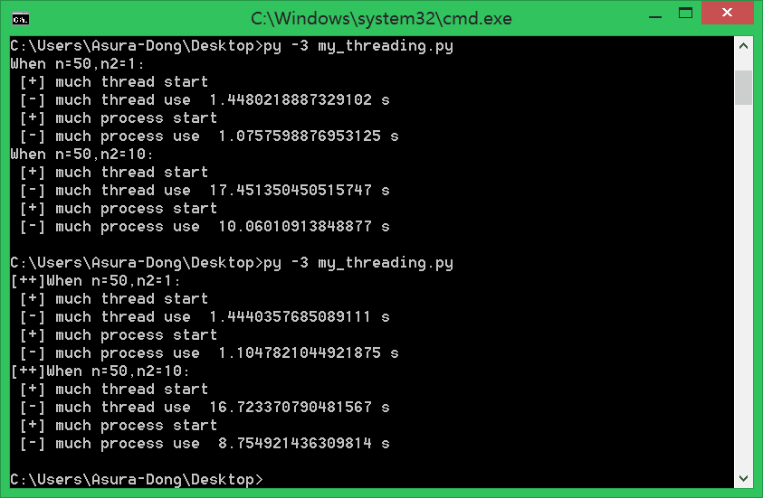
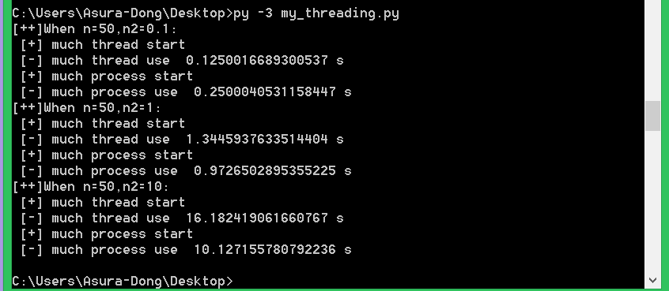

## 目的

通过实例实验，比较用多线程和多进程耗时情况，并进行总结归纳，选择效率最高的方法。


<!--more-->

## 多线程和多进程测试

####  环境

- python3.6
- threading和multiprocessing
- 四核+三星250G-850-SSD


自从用多进程和多线程进行编程,一致没搞懂到底谁更快。网上很多都说python多进程更快，因为GIL(全局解释器锁)。但是我在写代码的时候，测试时间却是多线程更快，所以这到底是怎么回事？最近再做分词工作，原来的代码速度太慢，想提速，所以来探求一下有效方法(文末有代码和效果图)

这里先来一张程序的结果图，说明线程和进程谁更快



#### 定义

```
并行是指两个或者多个事件在同一时刻发生。并发是指两个或多个事件在同一时间间隔内发生
```

```
线程是操作系统能够进行运算调度的最小单位。它被包含在进程之中，是进程中的实际运作单位。一个程序的执行实例就是一个进程。
```

#### 实现过程

而python里面的多线程显然得拿到GIL,执行code，最后释放GIL。所以由于GIL，多线程的时候拿不到，实际上，它是并发实现，即多个事件，在同一时间间隔内发生。

但进程有独立GIL，所以可以并行实现。因此，针对多核CPU，理论上采用多进程更能有效利用资源。

#### 现实问题

在网上的教程里面，经常能见到python多线程的身影。比如网络爬虫的教程、端口扫描的教程。

这里拿端口扫描来说，大家可以用多进程实现下面的脚本，会发现python多进程更快。那么不就是和我们分析相悖了吗？

```python
import sys,threading
from socket import *
 
host = "127.0.0.1" if len(sys.argv)==1 else sys.argv[1]
portList = [i for i in range(1,1000)]
scanList = []
lock = threading.Lock()
print('Please waiting... From ',host)
 
 
def scanPort(port):
    try:
        tcp = socket(AF_INET,SOCK_STREAM)
        tcp.connect((host,port))
    except:
        pass
    else:
        if lock.acquire():
            print('[+]port',port,'open')
            lock.release()
    finally:
        tcp.close()
 
for p in portList:
    t = threading.Thread(target=scanPort,args=(p,))
    scanList.append(t)
for i in range(len(portList)):
    scanList[i].start()
for i in range(len(portList)):
    scanList[i].join()
```

#### 谁更快

因为python锁的问题，线程进行锁竞争、切换线程，会消耗资源。所以，大胆猜测一下：

```
在CPU密集型任务下，多进程更快，或者说效果更好；而IO密集型，多线程能有效提高效率。
```


大家看一下下面的代码:

```python

import time
import threading
import multiprocessing
 
max_process = 4
max_thread = max_process
 
def fun(n,n2):
    #cpu密集型
    for  i in range(0,n):
        for j in range(0,(int)(n*n*n*n2)):
            t = i*j
 
def thread_main(n2):
    thread_list = []
    for i in range(0,max_thread):
        t = threading.Thread(target=fun,args=(50,n2))
        thread_list.append(t)
 
    start = time.time()
    print(' [+] much thread start')
    for i in thread_list:
        i.start()
    for i in thread_list:
        i.join()
    print(' [-] much thread use ',time.time()-start,'s')
 
def process_main(n2):
    p = multiprocessing.Pool(max_process)
    for i in range(0,max_process):
        p.apply_async(func = fun,args=(50,n2))
    start = time.time()
    print(' [+] much process start')
    p.close()#关闭进程池
    p.join()#等待所有子进程完毕
    print(' [-] much process use ',time.time()-start,'s')
 
if __name__=='__main__':
    print("[++]When n=50,n2=0.1:")
    thread_main(0.1)
    process_main(0.1)
    print("[++]When n=50,n2=1:")
    thread_main(1)
    process_main(1)
    print("[++]When n=50,n2=10:")
    thread_main(10)
    process_main(10)
```

结果如下：



可以看出来，当对cpu使用率越来越高的时候（代码循环越多的时候），差距越来越大。

**验证我们猜想(在CPU密集型任务下，多进程更快，或者说效果更好；而IO密集型，多线程能有效提高效率。**

## 结论

CPU密集型代码(如：各种循环处理、计数等等)，适合用多进程
IO密集型代码(如：文件处理、网络爬虫等)，适合用多线程

## 判断方法

1，直接看CPU占用率或硬盘IO读写速度
2，大致上归纳：计算较多为CPU密集型；时间等待较多(如网络爬虫)为IO密集型。


## 验证

对于IO密集型任务：

单进程单线程直接执行用时：10.0333秒
多线程执行用时：4.0156秒
多进程执行用时：5.0182秒
说明多线程适合IO密集型任务。

 

对于计算密集型任务

单进程单线程直接执行用时：10.0273秒
多线程执行用时：13.247秒
多进程执行用时：6.8377秒


**说明多进程适合计算密集型任务**

```python
#coding=utf-8
import sys
import multiprocessing
import time
import threading


# 定义全局变量Queue
g_queue = multiprocessing.Queue()

def init_queue():
    print("init g_queue start")
    while not g_queue.empty():
        g_queue.get()
        
    for _index in range(10):
        g_queue.put(_index)
    print("init g_queue end")
    return

# 定义一个IO密集型任务：利用time.sleep()

def task_io(task_id):
    print("IOTask[%s] start" % task_id)
    while not g_queue.empty():
        time.sleep(1)
        try:
            data = g_queue.get(block=True, timeout=1)
            print("IOTask[%s] get data: %s" % (task_id, data))
        except Exception as excep:
            print("IOTask[%s] error: %s" % (task_id, str(excep)))
    print("IOTask[%s] end" % task_id)
    return

g_search_list = list(range(10000))
# 定义一个计算密集型任务：利用一些复杂加减乘除、列表查找等
def task_cpu(task_id):
    print("CPUTask[%s] start" % task_id)
    while not g_queue.empty():
        count = 0
        for i in range(10000):
            count += pow(3*2, 3*2) if i in g_search_list else 0
        try:
            data = g_queue.get(block=True, timeout=1)
            print("CPUTask[%s] get data: %s" % (task_id, data))
        except Exception as excep:
            print("CPUTask[%s] error: %s" % (task_id, str(excep)))
    print("CPUTask[%s] end" % task_id)
    return task_id

if __name__ == '__main__':
    print("cpu count:", multiprocessing.cpu_count(), "\n")
    print(u"========== 直接执行IO密集型任务 ==========")
    init_queue()
    time_0 = time.time()
    task_io(0)
    print(u"结束：", time.time() - time_0, "\n")

    print("========== 多线程执行IO密集型任务 ==========")
    init_queue()
    time_0 = time.time()
    thread_list = [threading.Thread(target=task_io, args=(i,)) for i in range(10)]

    for t in thread_list:
        t.start()

    for t in thread_list:
        if t.is_alive():
            t.join()
    print("结束：", time.time() - time_0, "\n")

    print("========== 多进程执行IO密集型任务 ==========")
    init_queue()
    time_0 = time.time()
    process_list = [multiprocessing.Process(target=task_io, args=(i,)) for i in range(multiprocessing.cpu_count())]

    for p in process_list:
        p.start()

    for p in process_list:
        if p.is_alive():
            p.join()
    print("结束：", time.time() - time_0, "\n")

    print("========== 直接执行CPU密集型任务 ==========")
    init_queue()
    time_0 = time.time()
    task_cpu(0)
    print("结束：", time.time() - time_0, "\n")

    print("========== 多线程执行CPU密集型任务 ==========")
    init_queue()
    time_0 = time.time()
    thread_list = [threading.Thread(target=task_cpu, args=(i,)) for i in range(10)]

    for t in thread_list:
        t.start()

    for t in thread_list:
        if t.is_alive():
            t.join()

    print("结束：", time.time() - time_0, "\n")

    print("========== 多进程执行cpu密集型任务 ==========")
    init_queue()
    time_0 = time.time()
    process_list = [multiprocessing.Process(target=task_cpu, args=(i,)) for i in range(multiprocessing.cpu_count())]

    for p in process_list:
        p.start()

    for p in process_list:
        if p.is_alive():
            p.join()

    print("结束：", time.time() - time_0, "\n")
```

