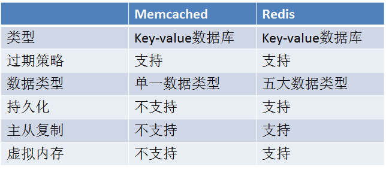

## Redis介绍：

### **介绍**

redis 是一个开源的、使用C语言编写的、支持网络交互的、可以基于内存也可以持久化的Key-Value数据库。

redis的源码非常简单，只要有时间看看谭浩强的C语言，在去看redis的源码能看懂50-60%。

redis目前最大的集群应该是新浪的应该。

redis目前是vmvaer来支持的，很多的开源软件都需要某些组织来支持的。如果一个开源软件没有金钱来支持的话很难走的持久

 

### **Redis和Memcache对比**



持久化：以电商举例，session用memcache来做的，购物车用redis来做的，当你退出的时候会提示你购物车里的物品会在你退出后继续保存。相对来说memcache存储更单一化！

主从复制：redis的主从复制类似mysql的主从复制但是原理是不同的！

虚拟内存：说白了就是把内存里一些不用的东西放在硬盘上，最好不要用，降低效率，现在内存来说比较便宜。

<!--more-->

## Redis安装&基本操作：

### **安装**

##### 检查配置环境

```shell
#检查gcc是否安装，如果没有安装：
yum -y install gcc
```

##### 下载安装Redis

```shell
cd /opt/
wget http://download.redis.io/releases/redis-3.0.4.tar.gz
#这里下载可以登录官网查看最新的Redis
tar -xvf redis-3.0.4.tar.gz
make
make install
cd /opt/redis-3.0.4/src/
make test

#安装中可能遇到的问题：
zmalloc.h:50:31: error: jemalloc/jemalloc.h: No such file or directory
zmalloc.h:55:2: error: #error "Newer version of jemalloc required"
 
Allocator
---------------------------------------------------------------------------------------------------------
Selecting a non-default memory allocator when building Redis is done by setting
the `MALLOC` environment variable. Redis is compiled and linked against libc
malloc by default, with the exception of jemalloc being the default on Linux
systems. This default was picked because jemalloc has proven to have fewer
fragmentation problems than libc malloc.
To force compiling against libc malloc, use:
% make MALLOC=libc
To compile against jemalloc on Mac OS X systems, use:
% make MALLOC=jemalloc
 
allocator（分配算符），如果有MALLOC这个环境变量，会有用这个环境变量的 去建立Redis。
而且libc 并不是默认的分配器，默认的是jemalloc！
因为jemalloc被证明有更少的fragmentation problems比libc。
 
但是如果你又没有jemalloc 而只有 libc 当然 make 出错。 所以加这么一个参数。
make MALLOC=libc
---------------------------------------------------------------------------------------------------------
```

##### 配置redis

```shell
#复制管理脚本
cp /opt/redis-3.0.4/utils/redis_init_script /etc/init.d/redis   
chmod +x /etc/init.d/redis
mkdir /etc/redis
cp /opt/redis-3.0.4/redis.conf /etc/redis/6379.conf
```

##### 修改redis启动模式

```shell
#默认Redis启动的时候是启动在前台的，把他改为启动在后台
vim /etc/redis/6379.conf
daemonize no  改为 daemonize yes
```

##### 开机启动

```shell
#首先修改Redis启动脚本：
vim /etc/init.d/redis
#chkconfig: 35 95 95  在第三行加上即可
 
#添加系统服务：
chkconfig --add redis
#设置开机启动：
chkconfig redis on
#检查服务状态：
chkconfig --list redis
```

##### 指定日志存放位置&PID文件&数据库文件存放位置（下一边写持久化）

```shell
vim /etc/redis/6379.conf
 
logfile "/var/log/redis.log"  #指定日志文件如果不指定就会在控制台输出
pidfile /var/run/redis_6379.pid
dir ./   #这个是指默认的持久化配置文件放在那里！建议修改下！
 
#pidfile如果不修改使用默认的话就会报错：
#原因是在/etc/init.d/redis里指定的默认PID是：PIDFILE=/var/run/redis_${REDISPORT}.pid 
#但是默认配置文件：/etc/redis/6379.conf（咱们自己从解压包里复制的里的默认是：pidfile /var/run/redis.pid）
```

 

###  **基本操作**

```shell
SET 设置Key
GET 判断Key的值
EXISTS 判断Key是否存在
KEYS * 显示所有的Key
DEL 删除指定Key
TYPE 获取Key类型
```

**注：Redis是不区分大小写的，命令最好使用大写这样能区分是命令还是参数！**

##### set的例子：

```shell
192.168.0.201:6379> SET hello hehe
OK
192.168.0.201:6379> GET hello
"hehe"
```

##### 设置多个key value 然后使用使用keys * 去查看所有

```shell
192.168.0.201:6379> SET hello1 hehe1
OK
192.168.0.201:6379> SET hello2 hehe2
OK
 
192.168.0.201:6379> KEYS  *
1) "hello1"
2) "hello"
3) "hello2"
 
#KEY匹配方式：
？匹配单个
 *匹配所有
```

##### 判断key是否存在

```shell
#判断Key是否存在使用：EXISTS   他返回的是整形：0不存在，1存在
192.168.0.201:6379> EXISTS hello
(integer) 1
192.168.0.201:6379> EXISTS hehe
(integer) 0
```

##### 删除KEY

```shell
192.168.0.201:6379> DEL hello
(integer) 1   #这里的1是数量
#删除多个测试下：
192.168.0.201:6379> DEL hello1 hello2
(integer) 2
```

##### 查看类型TYPE

```shell
#只要用set类型就是字符串。查看类型命令用TYPE
192.168.0.201:6379> TYPE hello
string
```

##### Keyspace

```shell
#redis是支持多个实例的默认最多16个，可以修改配置文件来支持更多！
#使用INFO命令查看！
# Keyspace
db0:keys=1,expires=0,avg_ttl=0
 
#db0 ：这个可以理解为命名空间。最多支持16个，使用SELECT 去切换
192.168.0.201:6379> SELECT 1
OK
#尝试添加一个key-value
SET db1 hehe
#然后在使用INFO看下
# Keyspace
db0:keys=1,expires=0,avg_ttl=0
db1:keys=1,expires=0,avg_ttl=0
```


## Redis数据类型：

他用不同的命令来区分你要操作什么数据类型
类型不能嵌套，不能混！ 但是有个王炸：set能把所有的类型都改为字符串类型！

### 字符串类型：

```shell
SET
GET
DEL
APPEND  在值的后面追加
set能重新设置但是要追加的话使用APPEND最好比如
192.168.0.201:6379> SET hehe hello
OK
192.168.0.201:6379> GET hehe
"hello"
192.168.0.201:6379> APPEND hehe ,world
(integer) 11
192.168.0.201:6379> GET hehe
"hello,world"
 
可以同时设置多个值和查询值用MSET 和MSET
192.168.0.201:6379> MSET key1 v1 key2 v2 key3 v3
OK
192.168.0.201:6379> MGET key1 key2 key3
1) "v1"
2) "v2"
3) "v3"
 
获取字符串长度
192.168.0.201:6379> STRLEN hehe
(integer) 11
如果字符串是中文的他会按照UTF-8格式的来输出1个字等3个字符串来算的  )
192.168.0.201:6379> SET key "呵呵"
OK
192.168.0.201:6379> GET key
"\xe5\x91\xb5\xe5\x91\xb5"
```


###  自增类型

```shell
#比如说投票点下+1 ，如果说用set每点一次修改set下那就不太现实。所有redis有个自增类型：INCR
192.168.0.201:6379> INCR num           #默认如果没有这个值的话，INCR就会自动创建一个值默认为零，当你没执行一次他就会+1
(integer) 1
192.168.0.201:6379> INCR num
(integer) 2
192.168.0.201:6379> INCR num
(integer) 3
192.168.0.201:6379> INCR num
(integer) 4
 
 
#如果想加多个呢：INCRBY
192.168.0.201:6379> INCRBY num 10
(integer) 57
192.168.0.201:6379> INCRBY num 10
(integer) 67
192.168.0.201:6379> INCRBY num 10
(integer) 77
 
 
#减呢？ DECR
192.168.0.201:6379> DECR num
(integer) 106
192.168.0.201:6379> DECR num
(integer) 105
192.168.0.201:6379> DECR num
(integer) 104
 
#如果要是减多个呢：DECRBY
192.168.0.201:6379> DECRBY num 5
(integer) 97
192.168.0.201:6379> DECRBY num 5
(integer) 92
192.168.0.201:6379> DECRBY num 5
(integer) 87
 
#想支持小数点：
INCRBYFLOAT key 0.1
192.168.0.201:6379> INCRBYFLOAT key 0.1
"0.1"
192.168.0.201:6379> INCRBYFLOAT key 0.1
"0.2"
192.168.0.201:6379> INCRBYFLOAT key 0.1
"0.3"
192.168.0.201:6379> INCRBYFLOAT key 0.1
"0.4"
```


###  散列类型（hash）

```shell
#和数据库存的表似的，表不是的有字段吧，可以给每个字段设置个值
HSET Key field value
HGET Key field
HMSET Key field value [field value....]
HMGET Key field [field ...]
HGETALL Key
HDEL
 
192.168.0.201:6379> HSET shouji name iphone
(integer) 1
192.168.0.201:6379> HSET shouji co red
(integer) 1
192.168.0.201:6379> HSET shouji price 8888
(integer) 1
 
192.168.0.201:6379> HGET shouji name
"iphone"
192.168.0.201:6379> HGET shouji co
"red"
192.168.0.201:6379> HGET shouji price
"8888"
192.168.0.201:6379> HGETALL shouji
1) "name"
2) "iphone"
3) "co"
4) "red"
5) "price"
6) "8888"
 
#其实现在看着不是好看的但是他通过一些API调用到网页上，通过排版取出来的值就好看了
192.168.0.201:6379> HMSET diannao name thinkpad co black price 30
OK
192.168.0.201:6379> HMGET diannao name co price
1) "thinkpad"
2) "black"
3) "30"
```


###  列表类型

```shell
#列表类型：他是存储一个有序的字符串列表   这个“有序”是什么时候进来的！
 
#列表你向左边添加和右边添加他的时间复杂度是一样的！O1（时间复杂度）
#可以理解为：我这个速度不随着数量的增加而增加！比如1000行和1万行他的时间开销是一样的！    大学数据结构里学的
 
#时间复杂度：
#同一问题可用不同算法解决，而一个算法的质量优劣将影响到算法乃至程序的效率。算法分析的目的在于选择合适算法和改进算法。
#计算机科学中，算法的时间复杂度是一个函数，它定量描述了该算法的运行时间。
 
#但是他有个缺点，比如说里面有1万个key你想找到第98个这就费老劲了他从1开始数数到98
#优点，你读前100个，卡直接读头部就非常快了
 
 
#命令：
LPUSH key value [value ...]
RPUSH key value [value ...]
               LPOP key
               RPOP key
     LRANGE key start stop
     LREM key count value
#从左边添加key
192.168.0.201:6379> LPUSH num 0
(integer) 1
192.168.0.201:6379> LPUSH num 1
(integer) 2
192.168.0.201:6379> LPUSH num 2
(integer) 3
 
#现在是从左边加
2  1   0
 
#从右边开始加
192.168.0.201:6379> RPUSH num 3
(integer) 4
2  1   0  3
 
192.168.0.201:6379> RPUSH num 5
(integer) 5
 
2  1  0  3  5  5
 
#如果想获取长度就使用LNE 吗！获取列表类型长度就是：LLEN
192.168.0.201:6379> LLEN num
(integer) 5
 
#从左边拿key
#从列表类型里拿出这个key来（拿出来就没有了），从左边拿左边第一个
192.168.0.201:6379> LPOP num
"2"
 
#左边第一个是2那么拿出来之后这个key这个key就变成
1  0  3  5
 
#从右边拿key，从右边拿右边第一个   （这个5就被拿出来了）
192.168.0.201:6379> RPOP num
"5"
 
#现在在看下这个key的长度
192.168.0.201:6379> LLEN num
(integer) 3
 
#获取列表的某一个范围：
#现在是这个值
1  0  3
 
192.168.0.201:6379> LRANGE num 0 1              #取0 - 1 的值
1) "1"
2) "0"
 
###这个列表和python中列表中差不多，0 -1 相当于列表中的下标。
 
192.168.0.201:6379> LPUSH num 2
(integer) 4
192.168.0.201:6379> RPUSH num 4
(integer) 5
 
 
192.168.0.201:6379> LRANGE num 0 -1     #这里的（-1）表示左边第一个
1) "2"
2) "1"
3) "0"
4) "3"
5) "4"
 
 
#获取指定元素的值
 
#获取右边的第一个值：
192.168.0.201:6379> LINDEX num -1
"4"
#获取左边边的第二个值：
192.168.0.201:6379> LINDEX num -2
"3"
 
#那-3呢？
192.168.0.201:6379> LINDEX num -3
"0"
#这个就是从右边数的第3个值！！！！！
 
#从左边获取值
192.168.0.201:6379> LINDEX num 0
"2"
192.168.0.201:6379> LINDEX num 1
"1"
 
#他是两边的第一次接触有点乱！他是两边的需要注意！！！
 
#只保留指定数据
 
#只保留0到2的数据
192.168.0.201:6379> LTRIM num 0 2
OK
#看下结果：
192.168.0.201:6379> LRANGE num 0 -1
1) "2"
2) "1"
3) "0"
 
#这个有什么用呢：
#写日志的时候，我这个缓冲区，只保留最近100条日志！
#比如：
192.168.0.201:6379> LPUSH logs newloghehe
(integer) 1
 
192.168.0.201:6379> LTRIM num 0 99
OK
 
这样的话我的列表永远只有100条，我只看最近100条的日志！！
```


###  集合类型

```shell
#集合是高一学的，第一个学期就是学的集合
#交集∩、并集∪、合集、等 0 0 ！
 
#集合的元素是没有类型的！
#用到集合类型的应用有：（新浪微博分享了很多的redis应用）
#比如：关注微博，比如咱俩是否共同关注了某一个人等。
 
#添加集合
192.168.0.201:6379> SADD jihe1 a b c
(integer) 3

#查看集合内容
192.168.0.201:6379> SMEMBERS jihe1
1) "c"
2) "a"
3) "b"
#判断集合元素是否存在
192.168.0.201:6379> SISMEMBER jihe1 d
(integer) 0
192.168.0.201:6379> SISMEMBER jihe1 a
(integer) 1
返回0 说明不存在返回1说明存存在
 
#集合间运算
#支持：交集、差集、并集
 
#差集运算：
192.168.0.201:6379> SDIFF jihe1 jihe2
1) "a"
jihe1abcjihe2b cd
 
jihe1 减去jihe2 减去相同的b c  ,  jihe1 还剩下a
 
同理：
jihe2 减去jihe1
192.168.0.201:6379> SDIFF jihe2 jihe1
1) "d"
 
#差集运算可以设置多个
 
#交集运算：
 192.168.0.201:6379> SINTER jihe1 jihe2
1) "c"
2) "b"
 
#交集可以设置多个：
#在添加一个jihe3
192.168.0.201:6379> SADD jihe3 d e f
(integer) 3
 
192.168.0.201:6379> SINTER jihe1 jihe2 jihe3
(empty list or set)
#这个是因为他是jihe1和jihe2先做交集运算，然后在和jihe3做交集运算
 
#并集运算
192.168.0.201:6379> SUNION jihe1 jihe2
1) "a"
2) "c"
3) "b"
4) "d"
#同样也可以设置多个
 
 
#以上的集合是无序的，redis支持有序的集合他的名如下
ZADD key score member 增加元素
ZSCORE key member 获取元素的分数
ZRANGE key start stop [WITHSCORES]
ZRANGEBYSCORE key min max
 
#添加有序集合
192.168.0.201:6379> ZSCORE youxu 80 a
(nil)
192.168.0.201:6379> ZADD youxu 81 b
(integer) 1
#可以添加多个
192.168.0.201:6379> ZADD youxu 82 c 83 d
(integer) 2
 
#获取分数
192.168.0.201:6379> ZSCORE youxu a
"80"
192.168.0.201:6379> ZSCORE youxu b
"81"
192.168.0.201:6379> ZSCORE youxu c
"82"
192.168.0.201:6379> ZSCORE youxu d
"83"
 
#获取有序集合范围
192.168.0.201:6379> ZRANGE youxu 0 3   #参考列表集合的0 3  从0到3的元素
1) "a"
2) "b"
3) "c"
4) "d"
 
#在举个例子：
192.168.0.201:6379> ZADD youxu 79 e
(integer) 1
 
192.168.0.201:6379> ZRANGE youxu 0 4
1) "e"
2) "a"
3) "b"
4) "c"
5) "d
```

