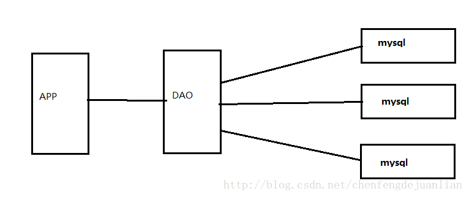
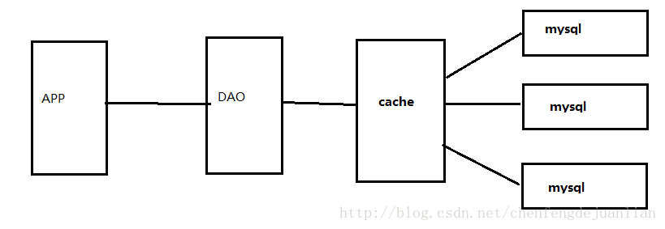
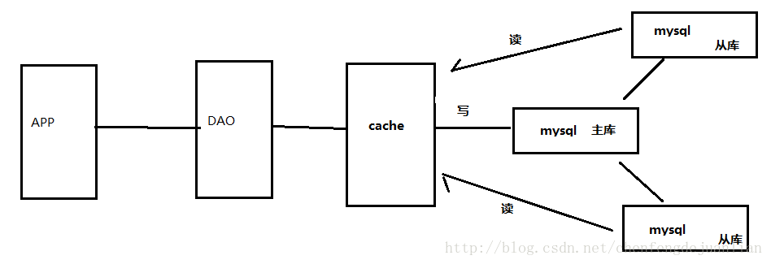
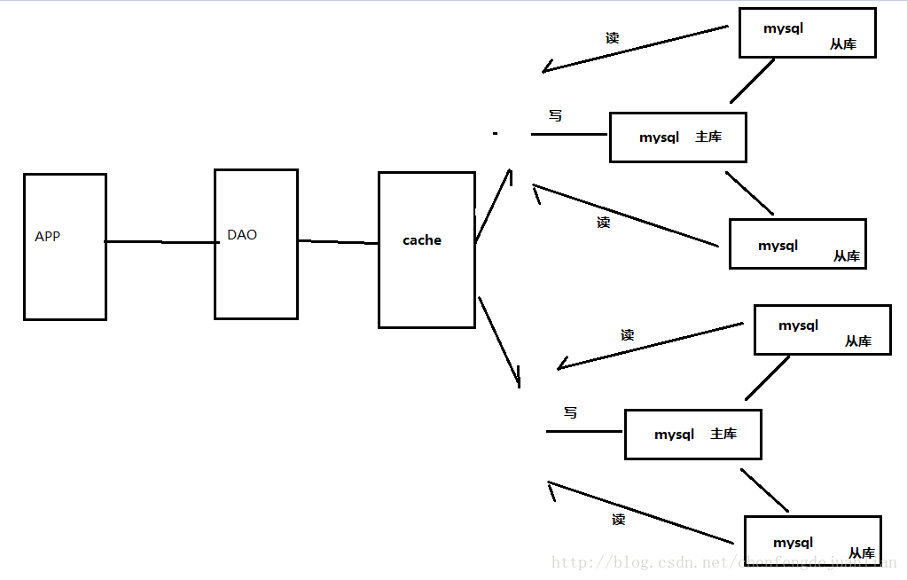
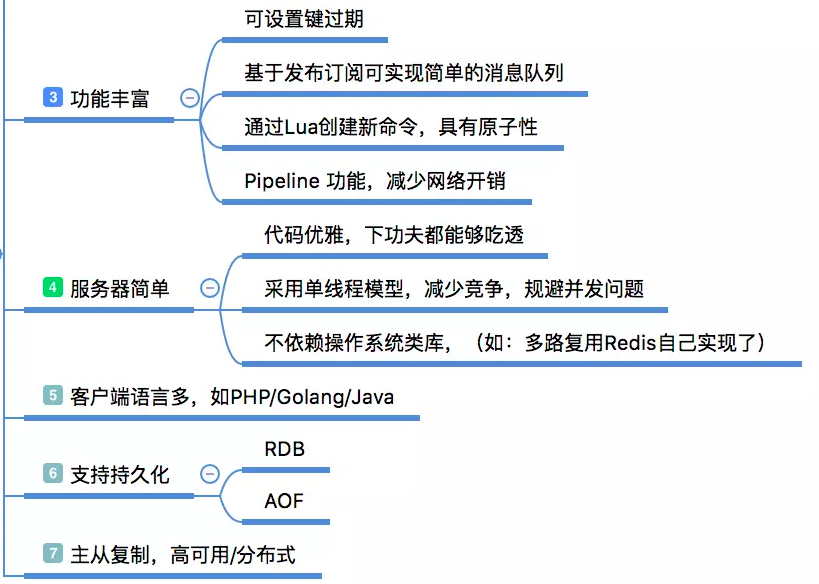

## redis简介 

redis是Nosql数据库中使用较为广泛的非关系型内存数据库。redis内部是一个key-value存储系统。它支持存储的value类型相对更多，包括string(字符串)、list(链表)、set(集合)、zset(sorted set –有序集合)和hash（哈希类型，类似于Java中的map）。Redis基于内存运行并支持持久化的NoSQL数据库，是当前最热门的NoSql数据库之一，也被人们称为数据结构服务器。 

<!--more-->

## 数据库瓶颈

传统的关系数据库存在哪些瓶颈或问题，让我们考虑类似redis这样的Nosql数据库呢？ 
1） 当数据量的总大小一个机器放不下时。 
2） 数据索引一个机器的内存放不下时。 
3） 访问量（读写混合）一个实例放不下时。

## 数据库模型演变

单机时代模型 

如果每次存储成千上万条数据，这样会导致mysql的性能很差，存储以及读取速度很慢，然后就演变成缓存+mysql+垂直拆分的方式。 

Cache作为中间缓存，将所有的数据先保存到缓存中，然后再存入mysql中，减小数据库压力，提高效率。 
但是当数据再次增加到又一个量级，上面的方式也不能满足需求，由于数据库的写入压力增加，Memcached只能缓解数据库的读取压力。读写集中在一个数据库上让数据库不堪重负，大部分网站开始使用主从复制技术来达到读写分离，以提高读写性能和读库的可扩展性。Mysql的master-slave模式成为这个时候的网站标配了。 

主从分离模式，在redis的高速缓存，MySQL的主从复制，读写分离的基础之上，这时MySQL主库的写压力开始出现瓶颈，而数据量的持续猛增，由于MyISAM使用表锁，在高并发下会出现严重的锁问题，大量的高并发MySQL应用开始使用InnoDB引擎代替MyISAM。 

分表分库模式 
将变化小的、业务相关的放在一个数据库，变化多的，不相关的数据放在一个数据库。 

## Nosql数据库的优势 

1）易扩展 
这些类型的数据存储不需要固定的模式，无需多余的操作就可以进行横向的扩展。相对于关系型数据库可以减少表和字段特别多的情况。也无型之间在架构的层面上带来了可扩展的能力 
2）大数据量提高性能 
3）多样灵活的数据模型 
在nosql中不仅可以存储String，hash，set、Zset等数据类型，还可以保存javaBean以及多种复杂的数据类型。

 

## Redis的应用场景

**缓存**：毫无疑问这是Redis当今最为人熟知的使用场景。再提升服务器性能方面非常有效；

**排行榜**：如果使用传统的关系型数据库来做这个事儿，非常的麻烦，而利用Redis的SortSet数据结构能够非常方便搞定；

**计算器/限速器**：利用Redis中原子性的自增操作，我们可以统计类似用户点赞数、用户访问数等，这类操作如果用MySQL，频繁的读写会带来相当大的压力；限速器比较典型的使用场景是限制某个用户访问某个API的频率，常用的有抢购时，防止用户疯狂点击带来不必要的压力；

**好友关系**：利用集合的一些命令，比如求交集、并集、差集等。可以方便搞定一些共同好友、共同爱好之类的功能；

**简单消息队列**：除了Redis自身的发布/订阅模式，我们也可以利用List来实现一个队列机制，比如：到货通知、邮件发送之类的需求，不需要高可靠，但是会带来非常大的DB压力，完全可以用List来完成异步解耦；

**Session共享**：以PHP为例，默认Session是保存在服务器的文件中，如果是集群服务，同一个用户过来可能落在不同机器上，这就会导致用户频繁登陆；采用Redis保存Session后，无论用户落在那台机器上都能够获取到对应的Session信息。

## Redis的局限性

Redis感觉能干的事情特别多，但它不是万能的，合适的地方用它事半功倍。如果滥用可能导致系统的不稳定、成本增高等问题。

比如，用Redis去保存用户的基本信息，虽然它能够支持持久化，但是它的持久化方案并不能保证数据绝对的落地，并且还可能带来Redis性能下降，因为持久化太过频繁会增大Redis服务的压力。

简单总结就是数据量太大、数据访问频率非常低的业务都不适合使用Redis，数据太大会增加成本，访问频率太低，保存在内存中纯属浪费资源。

## 选择理由

上面说了Redis的一些使用场景，那么这些场景的解决方案也有很多其它选择，比如缓存可以用Memcache，Session共享还能用MySql来实现，消息队列可以用RabbitMQ，我们为什么一定要用Redis呢？

**速度快:** 完全基于内存，使用C语言实现，网络层使用epoll解决高并发问题，单线程模型避免了不必要的上下文切换及竞争条件；

注意：单线程仅仅是说在网络请求这一模块上用一个线程处理客户端的请求，像持久化它就会重开一个线程/进程去进行处理

**丰富的数据类型:** Redis有8种数据类型，当然常用的主要是 String、Hash、List、Set、 SortSet 这5种类型，他们都是基于键值的方式组织数据。每一种数据类型提供了非常丰富的操作命令，可以满足绝大部分需求，如果有特殊需求还能自己通过 lua 脚本自己创建新的命令（具备原子性）；

除了提供的丰富的数据类型，Redis还提供了像慢查询分析、性能测试、Pipeline、事务、Lua自定义命令、Bitmaps、HyperLogLog、发布/订阅、Geo等个性化功能。

Redis的代码开源在GitHub，代码非常简单优雅，任何人都能够吃透它的源码；它的编译安装也是非常的简单，没有任何的系统依赖；有非常活跃的社区，各种客户端的语言支持也是非常完善。另外它还支持事务（没用过）、持久化、主从复制让高可用、分布式成为可能。

你还在等什么，和我一起用redis吧。