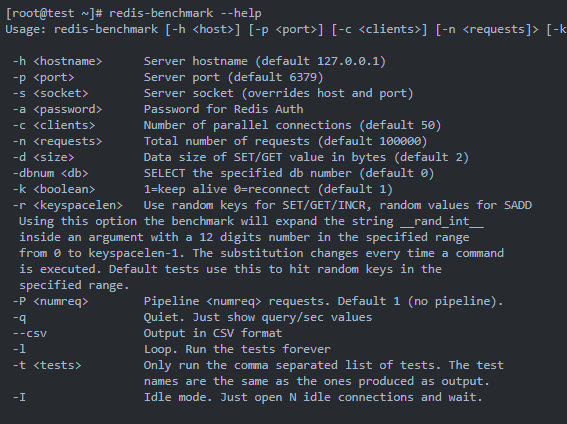

## 目的

Redis是一种支持Key-Value等多种数据结构的存储系统。可用于缓存，事件发布或订阅，高速队列等场景。该数据库使用ANSI C语言编写，支持网络，提供字符串，哈希，列表，队列，集合结构直接存取，基于内存，可持久化。本文介绍Redis的数据类型和相关操作。

<!--more-->

## **支持的语言**


## **Redis的应用场景**

1，会话缓存（最常用）

2，消息队列，比如支付

3，活动排行榜或计数

4，发布，订阅消息（消息通知）

5，商品列表，评论列表等


## 数据类型以及相关操作

**Redis**一共支持五种数据类：string（字符串），hash（哈希），list（列表），set（集合）和zset（sorted set有序集合）,在3.2版本以后新添加geo经纬度支持，以下将对其类型的常用操作做说明。

### 命令使用前言

通大多数据库一样，redis所有的命令提供了帮助，可以使用help +命令名称查看其使用方法，帮助信息中不仅有命令用法，还有命令始于版本信息，分组等。

为了友好的使用，redis还将所有命令都进行了分组,同时使用help+@+组名进行查看每个组中所有命令，以下是所有分组信息。

上面以及介绍如何查看命令使用方法，所以在以下数据类型操作时候，只举例常用的命令，更多命令参考https://redis.io/commands

注意：redis在3.2版本新增geo数据类型。

```shell
generic       #一般命令组，对大多数类型适用
string        #字符串类型命令组，使用所有字符串类型
list          #列表类型命令组
set           #集合类型命令组
sorted_set    #有序集合命令组
hash          #hash操作命令组
pubsub        #发布命令组
transactions  #事务操作命令组
connection    #连接相关命令组
server        #服务器相关命令组
scripting     #lua 脚本命令组
hyperloglog   #hyperloglog类型命令组，redis在 2.8.9 版本添加了 HyperLogLog 结构
cluster       #集群相关命令组
geo           #经纬度相关命令组，适用于3.2.0以后的版本
```

## 示例

### **服务操作**


```shell
slect＃选择数据库（数据库编号0-15）
退出＃退出连接
信息＃获得服务的信息与统计
monitor＃实时监控
config get＃获得服务配置
flushdb＃删除当前选择的数据库中的key
flushall＃删除所有数据库中的键
```

### 事务操作

```shell
DEL key #删除某个key
KEYS pattern  #查看符合正则的所有key
EXISTS key [key ...] #判断某个key是否存在，可支持多个，返回存在的个数
EXPIRE key seconds #刷新某个key过期时间
MOVE key db  #移动key到某个数据库
```

### string操作

它是redis的最基本的数据类型，一个键对应一个值，需要注意是一个键值最大存储512MB，redis中的整型也当作字符串处理。

```shell
SET key value [EX seconds] [PX milliseconds] [NX|XX]  #设置key为指定的字符串值。
#参数：
#EX seconds – 设置键key的过期时间，单位时秒
#PX milliseconds – 设置键key的过期时间，单位时毫秒
#NX – 只有键key不存在的时候才会设置key的值
#XX – 只有键key存在的时候才会设置key的值

APPEND key value  #如果 key 已经存在，并且值为字符串，那么这个命令会把 value 追加到原来值（value）的结尾。 如果 key 不存在，那么它将首先创建一个空字符串的key，再执行追加操作，这种情况 APPEND 将类似于 SET 操作。

GET key #获取key值，不存在则返回nil

GETRANGE key start end #获取指定key值的索引开始位置和结束位置所对应的值，索引从0开始

GETSET key value  #设置新的key值，并获取设置之前的值，如果key不存在则设置，并返回nil

MGET key [key ...]   #批量获取key的值

MSET key value [key value ...] #批量设置key的值

DECR key #数字类型的key自减操作，key类型不是数字则报错

INCR key  #数字类型key 自加操作，与DECR相反

DECRBY key decrement  #数字类型key指定减少数值

INCRBY key increment   #数字类型key指定增加数值，与DECRBY相反

STRLEN key  #获取key长度
```


### list操作

列表中的元素索引从0开始，倒数的元素可以用“-”+倒数位置表示，如-2，代表倒数第二个元素，-1则代表最后一个元素。

Redis列表是简单的字符串列表，按照插入顺序排序。你可以添加一个元素到列表的头部（左边）或者尾部（右边。

一个列表最多可以包含 2 32 - 1 个元素 (4294967295, 每个列表超过40亿个元素)。

```shell
LPUSH key value [value ...]  #从列表左边放入一个或者多个元素

LPUSHX key value  #当列表存在时，从左边放入一个元素

RPUSH key value [value ...]  #从列表右边放入一个或者多个元素

RPUSHX key value  #当列表存在时，从右边放入一个元素

LSET key index value  #根据索引设置列表中元素的值,当list不存在是报错

LINDEX key index  #根据列表索引获取元素值，索引从0开始

LINSERT key BEFORE|AFTER pivot value  #在列表中，基于某个基准点插入值，pivot代表基准点

LLEN key #获取列表长度

LRANGE key start stop  #根据索引获取列表中的元素，列表索引最后一个可以使用-1

LREM key count value  #从存于 key 的列表里移除前 count 次出现的值为 value 的元素
#count > 0: 从头往尾移除值为 value 的元素
#count < 0: 从尾往头移除值为 value 的元素
#count = 0: 移除所有值为 value 的元素

LPOP key  #从列表左边删除一个元素

RPOP key  #从列表右边删除一个元素

RPOPLPUSH source destination  #删除source列表中的删除最后一个元素将其追加到destination列表

LTRIM key start stop  #根据索引start和stop保留列表元素
```


### hash操作

hash操作所有命令都以H开头。

Redis hash 是一个string类型的field和value的映射表，hash特别适合用于存储对象。

Redis 中每个 hash 可以存储 2 32 - 1 键值对（40多亿）。

```shell
HDEL key field [field ...]  #删除hash表中一个或多个字段

HEXISTS key field  #判断hash表中字段是否存在

HGET key field  #获取hash表中字段的值

HGETALL key  #获取hash表中所有字段

HSET key field value  # 设置hash表中字段的值

HSETNX key field value  #只有当字段不存在时候才设置hash表中字段值，

HLEN key  #获取hash表中字段个数

HVALS key  #获取hash表中所有字段的值

HKEYS key  #获取hash表中所有的字段

HSTRLEN key field #获取hash表中指定字段的值的长度

HMSET key field value [field value ...]  #批量设置hash表中字段的值

HMGET key field [field ...]  #批量获取hash表中字段的值
```


### 集合set操作

Redis 的 Set 是 String 类型的无序集合。集合成员是唯一的，这就意味着集合中不能出现重复的数据。

Redis 中集合是通过哈希表实现的，所以添加，删除，查找的复杂度都是 O(1)。

集合中最大的成员数为 2 32 - 1 (4294967295, 每个集合可存储40多亿个成员)。

```shell
SADD key member [member ...]  #添加一个或多个元素到集合中

SREM key member [member ...]  #删除一个或多个集合中的元素

SCARD key  #获取集合中元素数量

SMEMBERS key  #返回集合中所有的元素

SINTER key [key ...] #获取两个或两个以上集合的交集

SUNION key [key ...]  #获取两个或两个以上集合的并集

SDIFF key [key ...]     #获取两个或者两个以上集合的差集

SISMEMBER key member  #判断元素是否是在指定集合中

SMOVE source destination member #移动一个集合中的元素到另一个集合

SPOP key [count]  #移除count个集合中元素，count可选参数，默认为1，即移除一个
```


### 有序集合操作

Redis 有序集合和集合一样也是string类型元素的集合,且不允许重复的成员。

不同的是每个元素都会关联一个double类型的分数。redis正是通过分数来为集合中的成员进行从小到大的排序。

有序集合的成员是唯一的,但分数(score)却可以重复。

集合是通过哈希表实现的，所以添加，删除，查找的复杂度都是O(1)。 集合中最大的成员数为 2 32 - 1 (4294967295, 每个集合可存储40多亿个成员)。

```shell
ZADD key [NX|XX] [CH] [INCR] score member [score member ...]  #向一个有序集合添加成员（元素）
#参数：
#XX: 仅仅更新存在的成员，不添加新成员。
#NX: 不更新存在的成员。只添加新成员。
#CH: 修改返回值为发生变化的成员总数，原始是返回新添加成员的总数 (CH 是 changed 的意思)。更改的元素是新添加的成员，已经存在的成员更新分数。 所以在命令中指定的成员有相同的分数将不被计算在内。注：在通常情况下，ZADD返回值只计算新添加成员的数量。
#INCR: 当ZADD指定这个选项时，成员的操作就等同ZINCRBY命令，对成员的分数进行递增操作。

ZCARD key  #获取有序集合中元素个数

ZCOUNT key min max  #指定分数范围的元素个数

ZINCRBY key increment member  #为有序集的元素的score值加上增加指定的increment

ZRANGE key start stop [WITHSCORES]  #根据有序集合中分数区间获取集合中的元素

ZRANGE key start stop [WITHSCORES]  #获取有序集合中元素的排名

ZREM key member [member ...]  #删除有序集合中一个或多个元素

ZSCORE key member  #设置元素在集合中的分数
```


### GEO类型操作

Redis的GEO是 3.2 版本的新特性，对GEO(地理位置)的支持。这个功能可以将用户给定的地理位置信息储存起来， 并对这些信息进行操作。

geo类型命令不多，总共6个所以这里全部列举出来了。

```shell
GEOADD key longitude latitude member [longitude latitude member ...]  #将指定的地理空间位置（纬度、经度、名称）添加到指定的key中

GEODIST key member1 member2 [unit]  #返回两个给定位置之间的距离。如果两个位置之间的其中一个不存在， 那么命令返回空值。指定单位的参数 unit 必须是以下单位的其中一个：

#m 表示单位为米
#km 表示单位为千米
#mi 表示单位为英里
#ft 表示单位为英尺

GEOPOS key member [member ...]  #从key里返回所有给定位置元素的位置（经度和纬度）

GEOHASH key member [member ...]  #返回一个或多个位置元素的 Geohash 表示。通常使用表示位置的元素使用不同的技术，使用Geohash位置52点整数编码。由于编码和解码过程中所使用的初始最小和最大坐标不同，编码的编码也不同于标准。此命令返回一个标准的Geohash

GEORADIUS key longitude latitude radius m|km|ft|mi [WITHCOORD] [WITHDIST] [WITHHASH] [COUNT count] [ASC|DESC] [STORE key] [STOREDIST key]  
#以给定的经纬度为中心， 返回键包含的位置元素当中， 与中心的距离不超过给定最大距离的所有位置元素。

#范围可以使用以下其中一个单位：

#m 表示单位为米。
#km 表示单位为千米。
#mi 表示单位为英里。
#ft 表示单位为英尺。
#在给定以下可选项时， 命令会返回额外的信息：

#WITHDIST: 在返回位置元素的同时， 将位置元素与中心之间的距离也一并返回。 距离的单位和用户给定的范围单位保持一致。
#WITHCOORD: 将位置元素的经度和维度也一并返回。
#WITHHASH: 以 52 位有符号整数的形式， 返回位置元素经过原始 geohash 编码的有序集合分值。 这个选项主要用于底层应用或者调试， 实际中的作用并不大。
#命令默认返回未排序的位置元素。 通过以下两个参数， 用户可以指定被返回位置元素的排序方式：

#ASC: 根据中心的位置， 按照从近到远的方式返回位置元素。
#DESC: 根据中心的位置， 按照从远到近的方式返回位置元素。
#在默认情况下， GEORADIUS 命令会返回所有匹配的位置元素。 虽然用户可以使用 COUNT <count> 选项去获取前 N 个匹配元素， 但是因为命令在内部可能会需要对所有被匹配的元素进行处理， 所以在对一个非常大的区域进行搜索时， 即使只使用 COUNT 选项去获取少量元素， 命令的执行速度也可能会非常慢。 但是从另一方面来说， 使用 COUNT 选项去减少需要返回的元素数量， 对于减少带宽来说仍然是非常有用的。

#返回值：
  #在没有给定任何 WITH 选项的情况下， 命令只会返回一个像 [“New York”,”Milan”,”Paris”] 这样的线性（linear）列表。
  #在指定了 WITHCOORD 、 WITHDIST 、 WITHHASH 等选项的情况下， 命令返回一个二层嵌套数组， 内层的每个子数组就表示一个元素

  #在返回嵌套数组时， 子数组的第一个元素总是位置元素的名字。 至于额外的信息， 则会作为子数组的后续元素， 按照以下顺序被返回：
    #以浮点数格式返回的中心与位置元素之间的距离， 单位与用户指定范围时的单位一致。
    #geohash 整数。
    #由两个元素组成的坐标，分别为经度和纬度。

GEORADIUSBYMEMBER key member radius m|km|ft|mi [WITHCOORD] [WITHDIST] [WITHHASH] [COUNT count] [ASC|DESC] [STORE key] [STOREDIST key]
#这个命令和 GEORADIUS 命令一样， 都可以找出位于指定范围内的元素， 但是 GEORADIUSBYMEMBER 的中心点是由给定的位置元素决定的。
```

## **Redis的发布与订阅**

Redis 发布订阅(pub/sub)是一种消息通信模式：发送者(pub)发送消息，订阅者(sub)接收消息。

Redis 客户端可以订阅任意数量的频道。

下图是三个客户端同时订阅同一个频道


下图是有新信息发送给频道1时，就会将消息发送给订阅它的三个客户端


### 运作原理

每个 Redis 服务器进程都维持着一个表示服务器状态的 `redis.h/redisServer` 结构， 结构的  `pubsub_channels` 属性是一个字典， 这个字典就用于保存订阅频道的信息：

```
struct redisServer {
    // ...
    dict *pubsub_channels;
    // ...
};
```

其中，字典的键为正在被订阅的频道， 而字典的值则是一个链表， 链表中保存了所有订阅这个频道的客户端。

比如说，在下图展示的这个 `pubsub_channels` 示例中，  `client1` 、  `client2` 和  `client3` 就订阅了  `channel1` ， 而client3也同时订阅了channel2。

当客户端调用 SUBSCRIBE 命令时， 程序就将客户端和要订阅的频道在 `pubsub_channels`字典中关联起来。


SUBSCRIBE 命令的行为可以用伪代码表示如下：

```
def SUBSCRIBE(client, channels):

    // 遍历所有输入频道
    for channel in channels:

        // 将客户端添加到链表的末尾
        redisServer.pubsub_channels[channel].append(client)
```

通过 `pubsub_channels` 字典， 程序只要检查某个频道是否为字典的键， 就可以知道该频道是否正在被客户端订阅； 只要取出某个键的值， 就可以得到所有订阅该频道的客户端的信息。

了解了 `pubsub_channels` 字典的结构之后， 解释 PUBLISH 命令的实现就非常简单了： 当调用  `PUBLISH channel message` 命令， 程序首先根据  `channel` 定位到字典的键， 然后将信息发送给字典值链表中的所有客户端。

### 订阅模式

redis的发布订阅不仅仅提供简单的订阅频道，还提供模式匹配订阅。模式订阅使用命令PSUBSCRIBE实现。

`redisServer.pubsub_patterns` 属性是一个链表，链表中保存着所有和模式相关的信息：

```
struct redisServer {
    // ...
    list *pubsub_patterns;
    // ...
};
```

链表中的每个节点都包含一个 `redis.h/pubsubPattern` 结构：

```
typedef struct pubsubPattern {
    redisClient *client;
    robj *pattern;
} pubsubPattern;
```

`client` 属性保存着订阅模式的客户端，而  `pattern` 属性则保存着被订阅的模式。

每当调用 `PSUBSCRIBE` 命令订阅一个模式时， 程序就创建一个包含客户端信息和被订阅模式的  `pubsubPattern` 结构， 并将该结构添加到  `redisServer.pubsub_patterns` 链表中。

作为例子，下图展示了一个包含两个模式的 `pubsub_patterns` 链表， 其中  `client123` 和  `client256` 都正在订阅  `tweet.shop.*` 模式：


通过遍历整个 `pubsub_patterns` 链表，程序可以检查所有正在被订阅的模式，以及订阅这些模式的客户端。

当执行PUBLISH进行命令向channel命令发送消息时，PUBLISH 除了将 `message` 发送到所有订阅  `channel` 的客户端之外， 它还会将  `channel` 和  `pubsub_patterns` 中的模式进行对比， 如果  `channel` 和某个模式匹配的话， 那么也将  `message` 发送到订阅那个模式的客户端，例如一个客户端订阅了aa.bb.*频道，那么他会收到来自所有aa.bb开头的所有频道消息。

### 相关命令

```shell
PSUBSCRIBE pattern [pattern ...]  #使用模式订阅一个或多个符合给定模式的频道

PUNSUBSCRIBE [pattern [pattern ...]]  #退订所有给定模式的频道

SUBSCRIBE channel [channel ...]   #订阅给定的一个或多个频道的信息

UNSUBSCRIBE [channel [channel ...]]   #指退订给定的频道

PUBSUB subcommand [argument [argument ...]]  #查看订阅与发布系统状态

PUBLISH channel message   #将信息发送到指定的频道
```

### 实践

在以下示例中，将分别用SUBSCRIBE命令订阅aa.bb和使用PSUBSCRIBE模式订阅频道aa.bb*。

SUBSCRIBE订阅：


PSUBSCRIBE订阅：


此时我们使用PUBSH向aa.bb发送消息，返回接受到的频道数，两个订阅者都能收到消息。


订阅者1:


模式订阅者：


### 小结

- 订阅信息由服务器进程维持的  `redisServer.pubsub_channels`  字典保存，字典的键为被订阅的频道，字典的值为订阅频道的所有客户端。
- 当有新消息发送到频道时，程序遍历频道（键）所对应的（值）所有客户端，然后将消息发送到所有订阅频道的客户端上。
- 订阅模式的信息由服务器进程维持的  `redisServer.pubsub_patterns`  链表保存，链表的每个节点都保存着一个  `pubsubPattern`  结构，结构中保存着被订阅的模式，以及订阅该模式的客户端。程序通过遍历链表来查找某个频道是否和某个模式匹配。
- 当有新消息发送到频道时，除了订阅频道的客户端会收到消息之外，所有订阅了匹配频道的模式的客户端，也同样会收到消息。
- 退订频道和退订模式分别是订阅频道和订阅模式的反操作。

## 事务

所谓事务应具有以下特效：原子性(Atomicity)， 一致性(Consistency)，隔离性(Isolation)，持久性(Durability)，简称ACID，但redis所提供的事务比较简单，它通过MULTI、EXEC、DISCARD和WATCH等命令实现事务。

而Redis只支持简单的事务，将执行命令放入队列缓存，当程序中有异常或命令出错，执行DISCARD清空缓存队列不执行队列中命令，其事务过程有以下特点：

- 事务是一个单独的隔离操作：事务中的所有命令都会序列化、按顺序地执行。事务在执行的过程中，不会被其他客户端发送来的命令请求所打断。
- 事务是一个 **泛原子** 操作（这里我以泛原子称呼，在某些情况redis的事务不是原子性的，后续会说明）：事务中的命令要么全部被执行，要么全部都不执行。

EXEC 命令负责触发并执行事务中的所有命令：

- 如果客户端在使用 MULTI 开启了一个事务之后，却因为断线而没有成功执行 EXEC ，那么事务中的所有命令都不会被执行。
- 另一方面，如果客户端成功在开启事务之后执行 EXEC ，那么事务中的所有命令都会被执行。

特别说明文中的 **泛原子操作** ：

- redis在开启事务以后，若执行命令具有显示的错误或者客户端中断则此次事务在执行EXEC命令时会调用DISCARD清空缓存队列不执行队列中的所有任务，此时是原子性的。
- 当执行命令过程中，命令没有显示的报错（例如LSET操作设置一个不存在的list），而是在EXEC调用时候某个命令出错，那么在这之前已经执行的命令将不会回滚，所以严格说来， redis并不支持原子性。

### 命令

```shell
MULTI  #用于标记事务块的开始。Redis会将后续的命令逐个放入队列中，然后才能使用EXEC命令执行缓存队列中的命令。

EXEC  #执行缓存队列中的命令

DISCARD  #清除所有先前在一个事务中放入队列的命令，然后恢复正常的连接状态，如果使用了WATCH命令，那么DISCARD命令就会将当前连接监控的所有键取消监控。

WATCH key [key ...]   #当某个事务需要按条件执行时，就要使用这个命令将给定的键设置为受监控的

UNWATCH  #清除所有先前为一个事务监控的键，如果你调用了EXEC或DISCARD命令，那么就不需要手动调用UNWATCH命令
```

### 乐观锁机制

乐观锁：总是认为不会产生并发问题，每次去取数据的时候总认为不会有其他线程对数据进行修改，因此不会上锁，但是在更新时会判断其他线程在这之前有没有对数据进行修改，一般会使用版本号机制或检查再设置(CAS)操作实现。

redis通过WATCH命令实现乐观锁，作为WATCH命令的参数的键会受到Redis的监控，Redis能够检测到它们的变化。在执行EXEC命令之前，如果Redis检测到至少有一个键被修改了，那么整个事务便会中止运行，然后EXEC命令会返回一个nil值，提醒用户事务运行失败。

注意：WATCH命令需要在MULTI之前执行，不然redis会将其一个命令放入缓存队列中。

示例：在以下示例中通过一个客户端开启事务监听name键，另一个客户端在执行EXEC之前修改name键，此次事务将不会执行，并返回nil，如下。


### 原子性实践

为演示redis严格意义上将不支持原子性，做了一些简单实践。


从上面的结果可以看出，在开启事务前name 值为Rose，在开启事务先后执行了SET命令和LSET命令，但是LSET命令是错误的，当我们调用EXEC执行事务完事务以后，在回头看事务中的SET命令已经生效，并未回滚，因为在次过程中该命令没有显示的报错，所以可以说redis的事务不支持原子性。


## **Redis的持久化**

redis持久有两种方式：快照（快照），仅附加文件（AOF).

### 快照

1，将存储在内存的数据以快照的方式写入二进制文件中，如默认dump.rdb中
2，保存900 1 

＃900秒内如果超过1个Key被修改，则启动快照保存
3，保存300 10 

＃300秒内如果超过10个Key被修改，则启动快照保存
4，保存60 10000 

＃60秒内如果超过10000个重点被修改，则启动快照保存


### 仅附加文件（AOF）

1，使用AOF持久时，服务会将每个收到的写命令通过写函数追加到文件中（appendonly.aof）
2，AOF持久化存储方式参数说明

```SHELL
appendonly yes  ＃开启AOF持久化存储方式 
appendfsync always ＃收到写命令后就立即写入磁盘，效率最差，效果最好
appendfsync everysec  ＃每秒写入磁盘一次，效率与效果居中
appendfsync no  ＃完全依赖操作系统，效率最佳，效果没法保证
```

## **Redis的性能测试**

自带相关测试工具




实际测试同时执行100万的请求

