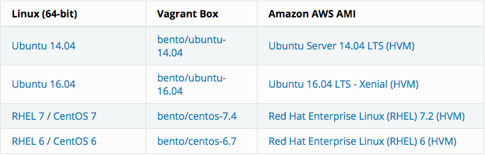
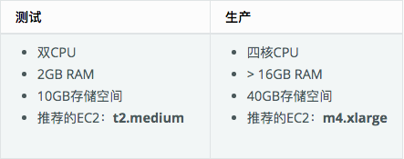

## 安装

StackStorm作为RPM和Debs分发用于RedHat / CentOS和Ubuntu Linux系统，以及Docker镜像。您可以使用脚本在单个系统上自动安装和配置所有组件，也可以按照操作系统的手动说明进行操作。

以下是选项概述：

- **一键安装：**运行我们的安装脚本，在单个系统上进行所有组件的固定安装。这是我们推荐的入门方式。有关详细信息，请参阅下面的“ [快速安装](https://docs.stackstorm.com/install/index.html#ref-one-line-install)

- **手动安装：**有定制需求吗？也许您的服务器无法访问Internet？或者只是不喜欢使用脚本安装？阅读适用于您的操作系统的手册安装说明（[Ubuntu 14 ](https://docs.stackstorm.com/install/deb.html)[/ ](https://docs.stackstorm.com/install/rhel6.html)[16](https://docs.stackstorm.com/install/deb.html)，[RHEL / CentOS 6](https://docs.stackstorm.com/install/rhel6.html)，[RHEL / CentOS 7](https://docs.stackstorm.com/install/rhel7.html)），并根据您的需要进行调整。以下是为StackStorm repos设置内部镜像的一些[其他指导](https://stackstorm.com/2017/02/10/installing-stackstorm-offline-systems/)。

- **Ansible Playbooks：**如果您是Ansible用户，请查看这些[Ansible Playbooks](https://docs.stackstorm.com/install/ansible.html)以安装StackStorm。非常适合StackStorm的可重复，一致，幂等安装。

- **高可用性将**业务关键自动化任务委托给像StackStorm这样的系统会对该系统产生更高的要求。StackStorm可以在HA模式下运行以确保满足这些需求。 [Kubernetes中的StackStorm HA集群 - BETA将](https://docs.stackstorm.com/install/k8s_ha.html)整个复杂的基础架构自动化为可重现的蓝图。

  <!--more-->

## 参考文档

[官方文档](https://docs.stackstorm.com/overview.html)


## 系统要求

StackStorm需要Ubuntu，RHEL或CentOS Linux。并且仅支持64位架构。



这是测试和部署StackStorm的建议最小大小：



## 安装

### 系统环境

RHEL 7 / CentOS 7


### 调整SELinux策略

如果您的系统在执行模式下具有SELinux，请按照这些说明调整SELinux策略。这是成功安装所必需的。如果您对这些政策不满意，可能需要根据您的安全措施进行调整

- 首先检查SELinux是否处于执行模式：

```shell
getenforce
```

- 如果上一个命令返回“Enforcing”，则运行以下命令：

```shell
# SELINUX management tools, not available for some minimal installations
sudo yum install -y policycoreutils-python

# Allow network access for nginx
sudo setsebool -P httpd_can_network_connect 1

# Allow RabbitMQ to use port '25672', otherwise it will fail to start
sudo semanage port --list | grep -q 25672 || sudo semanage port -a -t amqp_port_t -p tcp 25672
```

### 安装依赖项

**提示：目前支持的MongoDB版本是3.4。这是安装程序脚本安装的版本。MongoDB 3.6及更新版目前不支持StackStorm。将在StackStorm的未来版本中添加对4.0的支持**

安装MongoDB，RabbitMQ和PostgreSQL：

```shell
sudo yum -y install https://dl.fedoraproject.org/pub/epel/epel-release-latest-7.noarch.rpm

# Add key and repo for the latest stable MongoDB (3.4)
sudo rpm --import https://www.mongodb.org/static/pgp/server-3.4.asc
sudo sh -c "cat <<EOT > /etc/yum.repos.d/mongodb-org-3.4.repo
[mongodb-org-3.4]
name=MongoDB Repository
baseurl=https://repo.mongodb.org/yum/redhat/7/mongodb-org/3.4/x86_64/
gpgcheck=1
enabled=1
gpgkey=https://www.mongodb.org/static/pgp/server-3.4.asc
EOT"

sudo yum -y install crudini
sudo yum -y install mongodb-org
sudo yum -y install rabbitmq-server
sudo systemctl start mongod rabbitmq-server
sudo systemctl enable mongod rabbitmq-server

# Install and configure postgres
sudo yum -y install postgresql-server postgresql-contrib postgresql-devel

# Initialize PostgreSQL
sudo postgresql-setup initdb

# Make localhost connections to use an MD5-encrypted password for authentication
sudo sed -i "s/\(host.*all.*all.*127.0.0.1\/32.*\)ident/\1md5/" /var/lib/pgsql/data/pg_hba.conf
sudo sed -i "s/\(host.*all.*all.*::1\/128.*\)ident/\1md5/" /var/lib/pgsql/data/pg_hba.conf

# Start PostgreSQL service
sudo systemctl start postgresql
sudo systemctl enable postgresql
```

### 设置存储库

以下脚本将检测您的平台和体系结构，并设置相应的StackStorm存储库。它还将添加用于包签名的GPG密钥。

```shell
curl -s https://packagecloud.io/install/repositories/StackStorm/stable/script.rpm.sh | sudo bash
```

### 安装StackStorm组件

```shell
sudo yum install -y st2 st2mistral
```

如果您没有在同一系统上运行RabbitMQ，MongoDB或PostgreSQL，或者更改了默认值，请调整以下设置：

- RabbitMQ连接`/etc/st2/st2.conf`和`/etc/mistral/mistral.conf`

- MongoDB在 `/etc/st2/st2.conf`

- PostgreSQL在 `/etc/mistral/mistral.conf`

  

### 设置数据存储区加密

在[key-value存储](https://docs.stackstorm.com/datastore.html)，允许用户存储加密的值（秘密）。这些是使用对称加密（AES256）存储的。要生成加密密钥，请运行以下命令：

```shell
DATASTORE_ENCRYPTION_KEYS_DIRECTORY="/etc/st2/keys"
DATASTORE_ENCRYPTION_KEY_PATH="${DATASTORE_ENCRYPTION_KEYS_DIRECTORY}/datastore_key.json"

sudo mkdir -p ${DATASTORE_ENCRYPTION_KEYS_DIRECTORY}
sudo st2-generate-symmetric-crypto-key --key-path ${DATASTORE_ENCRYPTION_KEY_PATH}

# Make sure only st2 user can read the file
sudo chgrp st2 ${DATASTORE_ENCRYPTION_KEYS_DIRECTORY}
sudo chmod o-r ${DATASTORE_ENCRYPTION_KEYS_DIRECTORY}
sudo chgrp st2 ${DATASTORE_ENCRYPTION_KEY_PATH}
sudo chmod o-r ${DATASTORE_ENCRYPTION_KEY_PATH}

# set path to the key file in the config
sudo crudini --set /etc/st2/st2.conf keyvalue encryption_key_path ${DATASTORE_ENCRYPTION_KEY_PATH}

sudo st2ctl restart-component st2api
```

### 设置Mistral数据库

运行以下命令以设置Mistral PostgreSQL数据库

```shell
# Create Mistral DB in PostgreSQL
cat << EHD | sudo -u postgres psql
CREATE ROLE mistral WITH CREATEDB LOGIN ENCRYPTED PASSWORD 'StackStorm';
CREATE DATABASE mistral OWNER mistral;
EHD

# Setup Mistral DB tables, etc.
/opt/stackstorm/mistral/bin/mistral-db-manage --config-file /etc/mistral/mistral.conf upgrade head
# Register mistral actions
/opt/stackstorm/mistral/bin/mistral-db-manage --config-file /etc/mistral/mistral.conf populate | grep -v -e openstack -e keystone -e ironicclient
```

### 配置SSH和SUDO

要运行本地和远程shell操作，StackStorm使用特殊系统用户（默认情况下`stanley`）。对于远程Linux操作，使用SSH。我们建议在所有远程主机上配置基于公钥的SSH访问。我们还建议配置对localhost的SSH访问以运行示例和测试。

- 创建StackStorm系统用户，启用无密码sudo，并设置对“localhost”的ssh访问，以便可以在本地测试基于SSH的操作。您需要提升权限才能执行此操作：

```shell
# Create an SSH system user (default `stanley` user may already exist)
sudo useradd stanley
sudo mkdir -p /home/stanley/.ssh
sudo chmod 0700 /home/stanley/.ssh

# Generate ssh keys
sudo ssh-keygen -f /home/stanley/.ssh/stanley_rsa -P ""

# Authorize key-based access
sudo sh -c 'cat /home/stanley/.ssh/stanley_rsa.pub >> /home/stanley/.ssh/authorized_keys'
sudo chown -R stanley:stanley /home/stanley/.ssh

# Enable passwordless sudo
sudo sh -c 'echo "stanley    ALL=(ALL)       NOPASSWD: SETENV: ALL" >> /etc/sudoers.d/st2'
sudo chmod 0440 /etc/sudoers.d/st2

# Make sure `Defaults requiretty` is disabled in `/etc/sudoers`
sudo sed -i -r "s/^Defaults\s+\+?requiretty/# Defaults +requiretty/g" /etc/sudoers
```

- 在远程主机上配置SSH访问并启用无密码sudo，StackStorm将通过SSH运行远程操作。使用上一步中生成的公钥，按照[配置SSH中](https://docs.stackstorm.com/install/config/config.html#config-configure-ssh)的说明进行[操作](https://docs.stackstorm.com/install/config/config.html#config-configure-ssh)。要控制Windows框，请为[Windows运行程序](https://docs.stackstorm.com/install/config/winrm_runners.html)配置访问权限 。

- 如果您使用的是其他用户或SSH密钥的路径，则需要在以下位置更改此部分`/etc/st2/st2.conf`：

```shell
[system_user]
user = stanley
ssh_key_file = /home/stanley/.ssh/stanley_rsa
```

### 启动服务

- 启动服务：

```shell
sudo st2ctl start
```

- 注册传感器，规则和操作：

```shell
sudo st2ctl reload
```

### 校验

以下命令将测试StackStorm安装。他们都应该成功完成：

```shell
st2 --version

st2 -h

# List the actions from a 'core' pack
st2 action list --pack=core

# Run a local shell command
st2 run core.local -- date -R

# See the execution results
st2 execution list

# Fire a remote comand via SSH (Requires passwordless SSH)
st2 run core.remote hosts='localhost' -- uname -a

# Install a pack
st2 pack install st2
```

使用supervisor脚本管理StackStorm服务：

```shell
sudo st2ctl start|stop|status|restart|restart-component|reload|clean
```

以愉快地使用StackStorm了。

但没有Web UI就没有乐趣，没有SSL或身份验证就没有安全感，没有ChatOps就没有乐趣，没有Extreme Workflow Composer就没钱了。继续阅读！

## 配置验证

为简单起见，参考部署使用基于文件的身份验证提供程序。请参阅 [身份验证](https://docs.stackstorm.com/authentication.html)以配置和使用PAM或LDAP身份验证后端。

要使用基于文件的提供程序设置身份验证：

- 使用密码创建用户：

```shell
# Install htpasswd utility if you don't have it
sudo yum -y install httpd-tools
# Create a user record in a password file.
echo 'Ch@ngeMe' | sudo htpasswd -i /etc/st2/htpasswd st2admin
```

- 启用并配置身份验证`/etc/st2/st2.conf`：

```shell
[auth]
# ...
enable = True
backend = flat_file
backend_kwargs = {"file_path": "/etc/st2/htpasswd"}
# ...
```

- 重启st2api服务：

```shell
sudo st2ctl restart-component st2api
```

- 验证，并检查它是否有效：

```shell
# Login - you will be prompted for password (default 'Ch@ngeMe')
st2 login st2admin

# Check that it works
st2 action list
```

## 安装WebUI并设置SSL终止

[NGINX](http://nginx.org/)用于提供WebUI静态文件，将HTTP重定向到HTTPS，提供SSL终止，以及反向代理st2auth和st2api API端点。要进行设置：安装 `st2web`和`nginx`包，生成证书或放置现有证书`/etc/ssl/st2`，并使用StackStorm提供的[站点配置文件st2.conf](https://github.com/StackStorm/st2/tree/master/conf/nginx/st2.conf)配置nginx 

StackStorm依赖于Nginx版本> = 1.7.5。RHEL在软件包存储库中有一个旧版本，因此您需要添加官方Nginx存储库：

```shell
# Add key and repo for the latest stable nginx
sudo rpm --import http://nginx.org/keys/nginx_signing.key
sudo sh -c "cat <<EOT > /etc/yum.repos.d/nginx.repo
[nginx]
name=nginx repo
baseurl=http://nginx.org/packages/rhel/\\\$releasever/x86_64/
gpgcheck=1
enabled=1
EOT"

# Ensure that EPEL repo is not used for nginx
sudo sed -i 's/^\(enabled=1\)$/exclude=nginx\n\1/g' /etc/yum.repos.d/epel.repo

# Install nginx
sudo yum install -y nginx

# Install st2web
sudo yum install -y st2web

# Generate a self-signed certificate or place your existing certificate under /etc/ssl/st2
sudo mkdir -p /etc/ssl/st2
sudo openssl req -x509 -newkey rsa:2048 -keyout /etc/ssl/st2/st2.key -out /etc/ssl/st2/st2.crt \
-days 365 -nodes -subj "/C=US/ST=California/L=Palo Alto/O=StackStorm/OU=Information \
Technology/CN=$(hostname)"

# Copy and enable the supplied nginx config file
sudo cp /usr/share/doc/st2/conf/nginx/st2.conf /etc/nginx/conf.d/

# Disable default_server configuration in existing /etc/nginx/nginx.conf
sudo sed -i 's/default_server//g' /etc/nginx/nginx.conf

sudo systemctl restart nginx
sudo systemctl enable nginx
```

如果修改nginx配置中的ports或url路径，请在st2web配置中进行相应的更改`/opt/stackstorm/static/webui/config.js`

使用浏览器连接`https://${ST2_HOSTNAME}`并登录WebUI

如果您无法连接到Web浏览器，则可能需要更改默认防火墙设置。您可以使用以下命令执行此操作：

```shell
firewall-cmd --zone=public --add-service=http --add-service=https
firewall-cmd --zone=public --permanent --add-service=http --add-service=https
```

这将允许入站HTTP（端口80）和HTTPS（端口443）流量，并使这些更改在重新启动后继续存在。

如果您尝试从框外访问API并且已根据这些说明配置了nginx，请使用`https://${EXTERNAL_IP}/api/v1/${REST_ENDPOINT}`。

例如：

```shell
curl -X GET -H  'Connection: keep-alive' -H  'User-Agent: manual/curl' -H  'Accept-Encoding: gzip, deflate' -H  'Accept: */*' -H  'X-Auth-Token: <YOUR_TOKEN>' https://1.2.3.4/api/v1/actions
```

同样，您可以使用连接到auth REST端点`https://${EXTERNAL_IP}/auth/v1/${AUTH_ENDPOINT}`。

您可以通过向`--debug`CLI命令添加适当资源的选项来查看资源的实际REST端点。

例如，要查看获取操作的端点，请调用：

```shell
st2 --debug action list
```

## 设置ChatOps

如果您已经运行了Hubot实例，则可以安装[hubot-stackstorm插件](https://github.com/StackStorm/hubot-stackstorm)并配置StackStorm环境变量，如下所述。否则，启用[StackStorm ChatOps](https://docs.stackstorm.com/chatops/index.html)的最简单方法 是使用[st2chatops](https://github.com/stackstorm/st2chatops/)包。

- 验证`chatops`是否已安装该包，并启用了通知规则：

```shell
# Ensure chatops pack is in place
ls /opt/stackstorm/packs/chatops
# Create notification rule if not yet enabled
st2 rule get chatops.notify || st2 rule create /opt/stackstorm/packs/chatops/rules/notify_hubot.yaml
```

- 添加[NodeJS v10存储库](https://nodejs.org/en/download/package-manager/)：

```shell
curl -sL https://rpm.nodesource.com/setup_10.x | sudo -E bash -
```

- 安装`st2chatops`包：

```shell
sudo yum install -y st2chatops
```

- 查看并编辑`/opt/stackstorm/chatops/st2chatops.env`配置文件，将其指向StackStorm安装和您正在使用的聊天服务。您至少应该生成 [API密钥](https://docs.stackstorm.com/authentication.html#authentication-apikeys)并设置`ST2_API_KEY`变量。默认情况下`st2api`，`st2auth`预计它们位于同一主机上。如果不是这种情况，请更新`ST2_API`和`ST2_AUTH_URL`变量或只是指向正确的主机 `ST2_HOSTNAME`。

  示例配置使用Slack。要进行此设置，请转到Slack Web管理界面，创建一个Bot，然后将身份验证令牌复制到`HUBOT_SLACK_TOKEN`。

  如果您使用的是其他聊天服务，请在以下部分中设置相应的环境变量 ： [Slack](https://github.com/slackhq/hubot-slack)， [HipChat](https://github.com/hipchat/hubot-hipchat)，[Flowdock](https://github.com/flowdock/hubot-flowdock)， [IRC](https://github.com/nandub/hubot-irc)， [Mattermost](https://github.com/loafoe/hubot-matteruser)， [RocketChat](https://github.com/RocketChat/hubot-rocketchat)，[XMPP](https://github.com/markstory/hubot-xmpp)。`Chat service adapter settings``st2chatops.env`

- 启动服务：

```shell
sudo systemctl start st2chatops

# Start st2chatops on boot
sudo systemctl enable st2chatops
```

- 重新加载st2包以确保`chatops.notify`注册规则：

```shell
sudo st2ctl reload --register-all
```

开始聊天吧！！！

## 安全注意事项

默认情况下，安装MongoDB，RabbitMQ和PostgreSQL时，它们会禁用身份验证或使用默认静态密码。因此，在安装这些服务之后，您应该配置它们并使用强大的随机生成的密码启用身份验证。

**注意：**如果您使用StackStorm安装脚本，则会自动完成此操作。

为这些服务配置授权和密码超出了本文档的范围。有关更多信息，请参阅以下链接

- MongoDB的- https://docs.mongodb.com/manual/tutorial/enable-authentication/，https://docs.mongodb.com/manual/core/authorization/
- RabbitMQ - https://www.rabbitmq.com/authentication.html
- PostgreSQL - https://www.postgresql.org/docs/9.4/static/auth-methods.html

为这些组件启用身份验证后，还需要更新StackStorm服务以使用新设置。

这意味着编辑以下配置选项：

1. StackStorm - `/etc/st2/st2.conf`

> - `database.username` - MongoDB数据库用户名。
>
> - `database.password` - MongoDB数据库密码。
>
> - `messaging.url`- RabbitMQ传输网址（`amqp://<username>:<password>@<hostname>:5672`）
>
>   

2，mistral - `/etc/mistral/mistral.conf`

> - `database.connection`- PostgreSQL数据库连接字符串（`postgresql+psycopg2://<username>:<password>@<hostname>/mistral`）
> - `transport_url`- RabbitMQ传输网址（`rabbit://<username>:<password>@<hostname>:5672`）

此外，强烈建议您遵循以下最佳实践来运行网络服务：

- 确保服务之间的通信已加密。为MongoDB，RabbitMQ和PostgreSQL启用SSL / TLS。
- 将服务配置为仅侦听localhost，并在需要时侦听内部IP地址。通常不需要StackStorm（MongoDB，RabbitMQ，PostgreSQL）使用的大多数服务在公共IP地址上可用。
- 配置防火墙并设置白名单。防火墙应仅允许那些需要访问这些服务的用户和系统进行访问。API和auth服务通常需要您的用户可访问，但其他相关服务（如MongoDB，RabbitMQ和PostgreSQL）则不需要。这些不应该由用户直接访问，并且只允许StackStorm组件与它们通信。
- 在可能的情况下，您还应该使用其他基于网络的隔离和安全功能，例如DMZ。

上述步骤对于StackStorm组件在多个服务器上运行的分布式生产部署尤为重要。

## 升级到Extreme Workflow Composer

Extreme Workflow Composer将Workflow Designer（用于创建/编辑工作流的图形工具），RBAC和LDAP添加到StackStorm。它作为一组附加软件包部署在StackStorm之上。您将需要一个有效的Extreme Workflow Composer订阅和一个许可证密钥来访问Extreme Workflow Composer存储库。

要了解有关Extreme Workflow Composer的更多信息，请求报价或获取评估许可证，请访问[stackstorm.com/product](https://stackstorm.com/features/#ewc/)。

要安装Extreme Workflow Composer，请`${EWC_LICENSE_KEY}`在下面的命令中使用您在注册或购买时收到的密钥进行替换，然后运行以下命令：

```shell
# Set up Extreme Workflow Composer repository access
curl -s https://${EWC_LICENSE_KEY}:@packagecloud.io/install/repositories/StackStorm/enterprise/script.rpm.sh | sudo bash
# Install Extreme Workflow Composer
sudo yum install -y bwc-enterprise
sudo st2ctl restart
```

