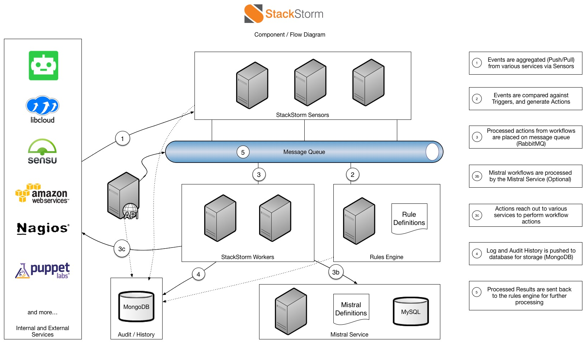

## 介绍

**一句话概况：stackstorm是一个事件驱动的自动化引擎。**

官方解释：StackStorm是一个功能强大的开源自动化平台，可将所有应用程序，服务和工作流程连接起来。 它具有可扩展性，灵活性, 设计中包含了对DevOps和ChatOps的热爱。它可以将您现有的基础架构和应用程序环境联系在一起，以便您可以更轻松地自动化操作该环境。它特别专注于针对事件采取行动。

主要用途：  

-  便利的故障排除 - 触发由Nagios，Sensu，New Relic和其他监控系统捕获的系统故障，在物理节点、OpenStack或Amazon实例和应用程序组件上运行一系列诊断检查，并将结果发布到共享通信环境中，如HipChat或JIRA。
- 自动修复 - 识别和验证OpenStack计算节点上的硬件故障，正确排空实例并向管理员发送关于潜在停机时间的电子邮件，但如果出现任何问题 - 冻结工作流程并呼叫PagerDuty唤醒人员。
- 持续部署 - 与Jenkins一起构建和测试，配置新的AWS群集，基于NewRelic的应用程序性能数据，打开负载均衡器的一些流量，以及前滚或回滚。

## 参考文档

[官网](https://stackstorm.com/)

<!--more-->

## 工作原理

主要组成角色：

- **传感器（Sensors）**是用于分别接收或监视事件的入站或出站集成的Python插件。 当来自外部系统的事件发生并由传感器处理时，StackStorm触发器将发射到系统中。
- **触发器（Triggers）**是外部事件的StackStorm表示形式。 有通用触发器（例如定时器，webhooks）和集成触发器（例如，Sensu告警，JIRA问题更新）。 通过编写传感器插件可以定义新的触发器类型。
- **动作（Actions）**是StackStorm出站集成。 有通用动作（ssh，REST调用），集成（OpenStack，Docker，Puppet）或自定义操作。 动作是Python插件或任何脚本，通过添加几行元数据将其消耗到StackStorm中。 动作可以由用户通过CLI或API直接调用，或者作为规则和工作流程的一部分使用和调用。
- **规则（Rules）**将触发器映射到动作（或工作流），应用匹配条件并将触发器加载到动作输入中。
- **工作流（Workflows）**将动作拼接成“超级动作”，定义顺序，转换条件以及传递数据。 大多数自动化不止一步，因此需要多个动作。 工作流就像“原子”动作一样，可在Action库中使用，并且可以手动调用或由规则触发。
- **包(Packs)**是内容部署的单位。 它们通过对集成（触发器和动作）和自动化（规则和工作流）进行分组，简化了StackStorm可插拔内容的管理和共享。 StackStorm Exchange上有越来越多的包可用。 用户可以创建自己的包，在Github上共享它们，或者提交给StackStorm Exchange.
- **审计跟踪（Audit Trail）**记录并存储手动或自动操作执行的审计跟踪，并存储触发上下文和执行结果的全部细节。 它还被记录在审计日志中，用于集成外部日志记录和分析工具：LogStash，Splunk，statsd，syslog

StackStorm是一种具有模块化架构的服务。它包括松散耦合的服务组件，这些组件通过消息总线进行通信，并且可以水平扩展以实现大规模自动化。StackStorm具有Web UI，CLI客户端，当然还有完整的REST API。我们还提供Python客户端绑定，以使开发人员的生活更轻松。

## 流程

StackStorm通过包含sensors和actions的可扩展套件插入环境中。

1. 从各个服务系统通过push或pull的方式把event传给sensors, sensors会产生一个trigger
2. 到规则配置中查询该trigger对应的动作或者工作流
3. 将来自工作流的Action发送到消息队列（内置rabbitmq）中
4. Actions到达外部的系统后就执行相应的动作
5. 日志和审计历史被推送到数据库进行存储（Mongodb）
6. 处理后的结果被发送回规则引擎进行进一步处理

备注：由于笔者是刚接触，未有实践经验，所以仅仅是根据官方文档直译，有不当之处欢迎大家一起纠正!