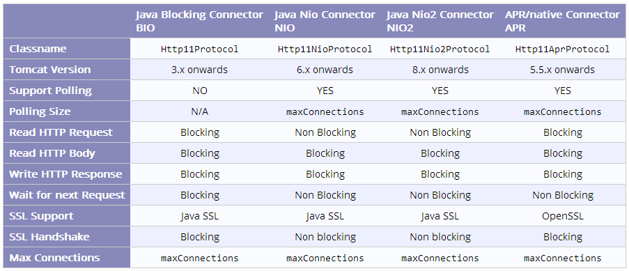
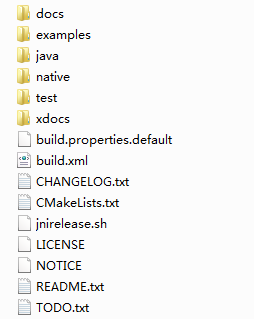
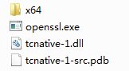
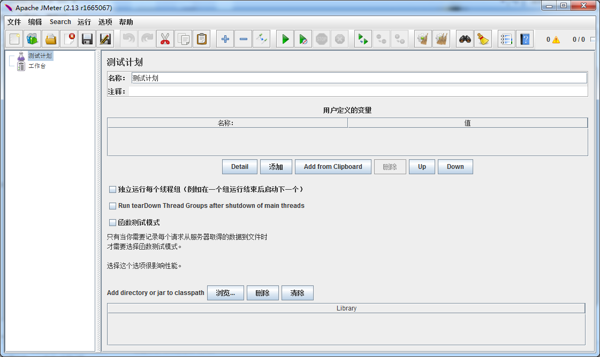
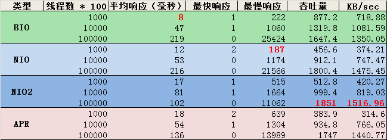

## 目的

Tomcat是我们经常使用的 servlet容器之一，甚至很多线上产品都使用 Tomcat充当服务器。而且优化后的Tomcat性能提升显著，本文从以下几方面进行分析优化。

<!--more-->


## 内存优化

默认情况下Tomcat的相关内存配置较低，这对于一些大型项目显然是不够用的，这些项目运行就已经耗费了大部分内存空间，何况大规模访问的情况。即使是本文中的这个只有一个页面的超小项目，在并发达到一定程度后也会抛出OOM（OutOfMemoryError）的异常报错。

OOM报错：说明Tomcat已经无力支持访问处理，内部GC也已经“无能无力”。所以一般情况下我们需要重新配置Tomcat的相关内存大小。

### **修改内存等 JVM相关配置**

Linux下修改TOMCAT_HOME/bin/catalina.sh，在其中加入，可以放在CLASSPATH=下面：

```shell
JAVA_OPTS="-server -XX:PermSize=512M -XX:MaxPermSize=1024m -Xms2048m -Xmx2048m" 
```

windows下修改TOMCAT_HOME/bin/catalina.bat，在其中加入，可以放在set CLASSPATH=下面：

```shell
set JAVA_OPTS=-server -XX:PermSize=512M -XX:MaxPermSize=1024m -Xms2048m -Xmx2048m 
```

 这些参数在我们学习JVM部分文章时已经都认识过了，不过这里还是简单介绍下:

```shell
-server：启用 JDK的 server 版本；
-Xms：Java虚拟机初始化时堆的最小内存,一般与Xmx配置为相同值,好处是GC不必再为扩展内存空间而消耗性能；
-Xmx：Java虚拟机可使用堆的最大内存；
-XX:PermSize：Java虚拟机永久代大小；
-XX:MaxPermSize：Java虚拟机永久代大小最大值；
```
除了这些参数外您还可以根据具体需要配置其他参数，参数的配置可以参考JVM参数的配置[JDK7](https://docs.oracle.com/javase/7/docs/technotes/tools/solaris/java.html)和[JDK8](https://docs.oracle.com/javase/8/docs/technotes/tools/unix/java.html)。

### **验证**

设置成功后我们可以利用JDK自带的工具进行验证，这些工具都在JAVA_HOME/bin目录下：

 1）jps：用来显示本地的java进程，以及进程号，进程启动的路径等。

 2）jmap：观察运行中的JVM 物理内存的占用情况，包括Heap size,Perm size等。

进入命令行模式后，进入JAVA_HOME/bin目录下，然后输入jps命令：

```shell
jps  
#显示以下结果  
2340 Bootstrap  
6696 Jps  
```

其中 Bootstrap进程就是我们启动了的 Tomcat，其进程号为2340.

然后我们利用 jmap工具查看其内存相关配置：

```shell
jmap -heap 2340  
#显示以下结果  
Attaching to process ID 2340, please wait...  
Debugger attached successfully.  
Server compiler detected.  
JVM version is 24.65-b04  
  
using thread-local object allocation.  
Parallel GC with 4 thread(s)  
  
Heap Configuration:  
   MinHeapFreeRatio = 0  
   MaxHeapFreeRatio = 100  
   MaxHeapSize      = 2147483648 (2048.0MB)    //最大堆内存  
   NewSize          = 1310720 (1.25MB)  
   MaxNewSize       = 17592186044415 MB  
   OldSize          = 5439488 (5.1875MB)  
   NewRatio         = 2  
   SurvivorRatio    = 8  
   PermSize         = 536870912 (512.0MB)      //永久代初始大小  
   MaxPermSize      = 1073741824 (1024.0MB)    //永久代最大大小  
   G1HeapRegionSize = 0 (0.0MB)  
Heap Usage:  
PS Young Generation  
Eden Space:  
   capacity = 537919488 (513.0MB)  
   used     = 247606720 (236.13616943359375MB)  
   free     = 290312768 (276.86383056640625MB)  
   46.03044238471613% used  
From Space:  
   capacity = 89128960 (85.0MB)  
   used     = 0 (0.0MB)  
   free     = 89128960 (85.0MB)  
   0.0% used  
To Space:  
   capacity = 89128960 (85.0MB)  
   used     = 0 (0.0MB)  
   free     = 89128960 (85.0MB)  
   0.0% used  
PS Old Generation  
   capacity = 1431830528 (1365.5MB)  
   used     = 0 (0.0MB)  
   free     = 1431830528 (1365.5MB)  
   0.0% used  
PS Perm Generation  
   capacity = 536870912 (512.0MB)  
   used     = 20770360 (19.80815887451172MB)  
   free     = 516100552 (492.1918411254883MB)  
   3.86878103017807% used  
  
12005 interned Strings occupying 1039352 bytes.  
```

从结果就可以看出我们的配置已经成功了。

## **配置优化**

我们知道TOMCAT_HOME/conf/server.xml可以配置端口，虚拟路径等等 Tomcat相关主要配置。

### **Connector 优化**

Connector是连接器，负责接收客户的请求，以及向客户端回送响应的消息。所以 Connector的优化是重要部分。默认情况下 Tomcat只支持200线程访问，超过这个数量的连接将被等待甚至超时放弃，所以我们需要提高这方面的处理能力。

修改这部分配置需要修改TOMCAT_HOME/conf/server.xml，打开server.xml找到Connector 标签项，默认配置如下：

```shell
<Connector port="8080" protocol="HTTP/1.1"  
           connectionTimeout="20000"  
           redirectPort="8443" />  
```

其中port代表服务接口；protocol代表协议类型；connectionTimeout代表连接超时时间，单位为毫秒；redirectPort代表安全通信（https）转发端口，一般配置成443。

可以看到除了这几个基本配置外并无特殊功能，所以我们需要对 Connector 进行扩展。

其中Connector 支持参数属性可以参考[Tomcat官方网站](https://tomcat.apache.org/tomcat-8.0-doc/config/http.html)非常多，所以本文就只介绍些常用的。

我们将 Connector 配置修改为如下：

```shell
<Connector port="8080"   
          protocol="HTTP/1.1"   
          maxThreads="1000"   
          minSpareThreads="100"   
          acceptCount="1000"  
          maxConnections="1000"  
          connectionTimeout="20000"   
          maxHttpHeaderSize="8192"  
          tcpNoDelay="true"  
          compression="on"  
          compressionMinSize="2048"  
          disableUploadTimeout="true"  
          redirectPort="8443"  
      	  enableLookups="false"  
          URIEncoding="UTF-8" />  
```

 **1）port：**代表Tomcat监听端口，也就是网站的访问端口，默认为8080，可以根据需要改成其他。

 **2）protocol：**协议类型，可选类型有四种，分别为BIO（阻塞型IO），NIO，NIO2和APR。

​		1）BIO：BIO(Blocking I/O)，顾名思义，即阻塞式I/O操作，表示Tomcat使用的是传统的Java I/O操作(即java.io包及其子包)。Tomcat在默认情况下，是以bio模式运行的。遗憾的是，就一般而言，bio模式是三种运行模式中性能最低的一种。BIO配置采用默认即可。

​	    2）NIO：NIO(New I/O)，是Java SE 1.4及后续版本提供的一种新的I/O操作方式(即java.nio包及其子包)。Java nio是一个基于缓冲区、并能提供非阻塞I/O操作的Java API，因此nio也被看成是non-blocking I/O的缩写。它拥有比传统I/O操作(bio)更好的并发运行性能。要让Tomcat以nio模式来运行也比较简单，我们只需要protocol类型修改如下即可：    

```shell
//NIO  
protocol="org.apache.coyote.http11.Http11NioProtocol"  
//NIO2  
protocol="org.apache.coyote.http11.Http11Nio2Protocol"  
```

​		3）APR：APR(Apache Portable Runtime/Apache可移植运行时)，是Apache HTTP服务器的支持库。你可以简单地理解为:Tomcat将以JNI的形式调用 Apache HTTP服务器的核心动态链接库来处理文件读取或网络传输操作，从而大大地提高 Tomcat对静态文件的处理性能。

与配置 NIO运行模式一样，也需要将对应的 Connector节点的 protocol属性值改为：

```shell
protocol="org.apache.coyote.http11.Http11AprProtocol"  
```

相关APR介绍及配置会在下面专门讲。

**3）maxThreads：**由该连接器创建的处理请求线程的最大数目，也就是可以处理的同时请求的最大数目。如果未配置默认值为200。如果一个执行器与此连接器关联，则忽略此属性，因为该属性将被忽略，所以该连接器将使用执行器而不是一个内部线程池来执行任务。

maxThreads是一个重要的配置属性，maxThreads配置的合理直接影响了Tomcat的相关性能，所以这里我们重点讨论下。

 maxThreads并不是配置的越大越好，事实上你即使配置成999999也是没有用的，因为这个最大值是受操作系统及相关硬件所制约的，并且最大值并不一定是最优值，所以我们追寻的应该是最优值而不是最大值。

QPS（Query Per Second）：每秒查询率QPS是对一个特定的查询服务器在规定时间内所处理流量多少的衡量标准。我们常常使用 QPS值来衡量一个服务器的性能。

```shell
QPS = 并发数 / 平均响应时间
或者
并发数 = QPS * 平均响应时间
```
一个系统吞吐量通常由QPS、并发数两个因素决定，每套系统的这两个值都有一个相对极限值，在应用场景访问压力下，只要某一项达到系统最高值，系统的吞吐量就上不去了，如果压力继续增大，系统的吞吐量反而会下降，原因是系统超负荷工作，上下文切换、内存等等其它消耗导致系统性能下降。所谓吞吐量这里可以理解为每秒能处理请求的次数。

所以选择一个合理的 maxThreads值，其实并不是那么容易的事。因为过多的线程只会造成，更多的内存开销，更多的CPU开销，但是对提升QPS确毫无帮助；找到最佳线程数后通过简单的设置，可以让web系统更加稳定，得到最高，最稳定的QPS输出。

我们可以通过以下几种方式来获取 maxThreads的最佳值：

1. 通过线上系统不断使用和用户的不断增长来进行性能测试，观察QPS，响应时间，这种方式会在爆发式增长时系统崩溃，如双12等。

2. 根据公式计算，服务器端最佳线程数量=((线程等待时间+线程cpu时间)/线程cpu时间) * cpu数量，这种方式有时会被误导，因为某些系统处理环节可能会耗时比较长，从而影响公式的结果。

3. 单、多用户压力测试，查看CPU的消耗，然后直接乘以百分比，再进行压测，一般这个值的附近应该就是最佳线程数量，这种方式理想场景比较适用，实际情况会比这个复杂的多。

4. 根据系统的自身情况调整，如硬件限制，系统限制，程序处理能力限制等。

5. 定期修改为不同的 maxThreads值，看服务器响应结果及用户反应。

   

**QPS和线程数的关系**

1）在最佳线程数量之前，QPS和线程是互相递增的关系，线程数量到了最佳线程之后，QPS持平，不在上升，甚至略有下降，同时相应时间持续上升。

2）同一个系统而言，支持的线程数越多（最佳线程数越多而不是配置的线程数越多），QPS越高


**QPS和响应时间的关系**

1）对于一般的web系统，响应时间一般有CPU执行时间+IO等待时间组成。

2）CPU的执行时间减少，对QPS有实质的提升，IO时间的减少，对QPS提升不明显。如果要想明显提升QPS，优化系统的时候要着重优化CPU消耗大户。

所以想要找出 maxThreads的最优值可并不容易，没有最好只有更好，更好的值只能通过时间来显现，如果你不想考虑那么多，一般情况下设置成1000即可。


 **4）minSpareThreads：**线程的最小运行数目，这些始终保持运行。如果未指定，默认值为10。

**5）acceptCount：**当所有可能的请求处理线程都在使用时传入连接请求的最大队列长度。如果未指定，默认值为100。一般是设置的跟 maxThreads一样或一半，此值设置的过大会导致排队的请求超时而未被处理。所以这个值应该是主要根据应用的访问峰值与平均值来权衡配置。

**6）maxConnections：**在任何给定的时间内，服务器将接受和处理的最大连接数。当这个数字已经达到时，服务器将接受但不处理，等待进一步连接。NIO与NIO2的默认值为10000，APR默认值为8192。

**7）connectionTimeout：**当请求已经被接受，但未被处理，也就是等待中的超时时间。单位为毫秒，默认值为60000。通常情况下设置为30000。

**8）maxHttpHeaderSize：**请求和响应的HTTP头的最大大小，以字节为单位指定。如果没有指定，这个属性被设置为8192（8 KB）。

**9）tcpNoDelay：**如果为true，服务器socket会设置TCP_NO_DELAY选项，在大多数情况下可以提高性能。缺省情况下设为true。

**10）compression：**是否启用gzip压缩，默认为关闭状态。这个参数的可接受值为“off”（不使用压缩），“on”（压缩文本数据），“force”（在所有的情况下强制压缩）。

**11）compressionMinSize：**如果compression="on"，则启用此项。被压缩前数据的最小值，也就是超过这个值后才被压缩。如果没有指定，这个属性默认为“2048”（2K），单位为byte。

**12）disableUploadTimeout：**这个标志允许servlet [Container](http://lib.csdn.net/base/4)在一个servlet执行的时候，使用一个不同的，更长的连接超时。最终的结果是给servlet更长的时间以便完成其执行，或者在数据上载的时候更长的超时时间。如果没有指定，设为false。

**13）enableLookups：**关闭DNS反向查询。

 **14）URIEncoding：**URL编码字符集。

Connector 还有很多其他参数，可以参考Tomcat官网，这里只介绍与性能相关的部分。

### **BIO、NIO、APR**

通过配置 protocol的类型可以使用不同的 Connector处理请求。

```shell
//BIO  
protocol="HTTP/1.1"  
//NIO  
protocol="org.apache.coyote.http11.Http11NioProtocol"  
//NIO2  
protocol="org.apache.coyote.http11.Http11Nio2Protocol"  
//APR  
protocol="org.apache.coyote.http11.Http11AprProtocol"  
```

 以下是几种类型 Connector的参数对比：



并不是说 BIO的性能就一定不如 NIO，这几种类型 Connector之间并没有明显的性能区别，它们之间实现流程和原理不同，所以它们的选择是需要根据应用的类型来决定的。

BIO更适合处理简单流程，如程序处理较快可以立即返回结果。简单项目及应用可以采用BIO。

NIO更适合后台需要耗时完成请求的操作，如程序接到了请求后需要比较耗时的处理这已请求，所以无法立即返回结果，这样如果采用BIO就会占用一个连接，而使用NIO后就可以将此连接转让给其他请求，直至程序处理完成返回为止。

APR可以大大提升Tomcat对静态文件的处理性能，同时如果你使用了HTTPS方式传输的话，也可以提升SSL的处理性能。

本文的最后会对几种 Connector进行对比测试。

### **线程池**

Executor代表了一个线程池，可以在Tomcat组件之间共享。使用线程池的好处在于减少了创建销毁线程的相关消耗，而且可以提高线程的使用效率。

要想使用线程池，首先需要在 Service标签中配置 Executor，如下：

```shell
<Service name="Catalina">  
  
  <Executor name="tomcatThreadPool"   
         namePrefix="catalina-exec-"   
         maxThreads="1000"   
         minSpareThreads="100"  
         maxIdleTime="60000"  
         maxQueueSize="Integer.MAX_VALUE"  
         prestartminSpareThreads="false"  
         threadPriority="5"  
         className="org.apache.catalina.core.StandardThreadExecutor"/>  
```

其中，
    name：线程池名称，用于 Connector中指定。

​    namePrefix：所创建的每个线程的名称前缀，一个单独的线程名称为 namePrefix+threadNumber。

​    maxThreads：池中最大线程数。

​    minSpareThreads：活跃线程数，也就是核心池线程数，这些线程不会被销毁，会一直存在。

​    maxIdleTime：线程空闲时间，超过该时间后，空闲线程会被销毁，默认值为6000（1分钟），单位毫秒。

​    maxQueueSize：在被执行前最大线程排队数目，默认为Int的最大值，也就是广义的无限。除非特殊情况，这个值不需要更改，否则会有请求不会被处理的情况发生。

​    prestartminSpareThreads：启动线程池时是否启动 minSpareThreads部分线程。默认值为false，即不启动。

​    threadPriority：线程池中线程优先级，默认值为5，值从1到10。

​    className：线程池实现类，未指定情况下，默认实现类为org.apache.catalina.core.StandardThreadExecutor。如果想使用自定义线程池首先需要实现 org.apache.catalina.Executor接口。

线程池配置完成后需要在 Connector中指定：

```shell
<Connector executor="tomcatThreadPool"  
...  
```

### **Listener**

另一个影响Tomcat 性能的因素是内存泄露。Server标签中可以配置多个Listener，其中 JreMemoryLeakPreventionListener是用来预防JRE内存泄漏。此Listener只需在Server标签中配置即可，默认情况下无需配置，已经添加在 Server中。

```shell
<Listener className="org.apache.catalina.core.JreMemoryLeakPreventionListener" />  
```

###  组件优化

####    APR

#####     **介绍**

​    之前一直都在说APR，那么APR到底能给我们带来什么？这节就开始学习APR相关知识。

​    APR(Apache Portable Runtime)是一个高可移植库，它是Apache HTTP Server 2.x的核心。APR有很多用途，包括访问高级 IO功能(例如sendfile,epoll和OpenSSL)，OS级别功能(随机数生成，系统状态等等)，本地进程管理(共享内存，NT管道和UNIX sockets)。这些功能可以使Tomcat作为一个通常的前台WEB服务器，能更好地和其它本地web技术集成，总体上让Java更有效率作为一个高性能web服务器平台而不是简单作为后台容器。

​    APR的目的如其名称一样，主要为上层的应用程序提供一个可以跨越多操作系统平台使用的底层支持接口库。在早期的Apache版本中，应用程序本身必须能够处理各种具体操作系统平台的细节，并针对不同的平台调用不同的处理函数。随着Apache的进一步开发，Apache组织决定将这些通用的函数独立出来并发展成为一个新的项目。这样，APR的开发就从Apache中独立出来，Apache仅仅是使用APR而已。目前APR主要还是由Apache使用，不过由于APR的较好的移植性，因此一些需要进行移植的C程序也开始使用APR。

​    APR使得平台细节的处理进行下移。对于应用程序而言，它们根本就不需要考虑具体的平台，不管是Unix、Linux还是Window，应用程序执行的接口基本都是统一一致的。因此对于APR而言，可移植性和统一的上层接口是其考虑的一个重点。而APR最早的目的并不是如此，它最早只是希望将Apache中用到的所有代码合并为一个通用的代码库，然而这不是一个正确的策略，因此后来APR改变了其目标。有的时候使用公共代码并不是一件好事，比如如何将一个请求映射到线程或者进程是平台相关的，因此仅仅一个公共的代码库并不能完成这种区分。APR的目标则是希望安全合并所有的能够合并的代码而不需要牺牲性能。

##### 下载

 APR没有二进制包可以下载，所以只能下载源代码版，下载后需要构建，需要下载的文件有：apr-1.5.2.tar.gz、apr-iconv-1.2.1.tar.gz、apr-util-1.5.4.tar.gz（Linux版为例）这三个。

 APR的官网为：http://apr.apache.org/

##### 安装

​    windows下构建源代码比较麻烦，需要Visual Studio支持。

​    Linux下构建就相对简单和熟悉了，只需要执行常规构建命令即可：

```shell
./configure --prefix=/usr/local/apr  
make  
make install  
```

​    安装成功后，APR会默认安装在 /usr/local/apr目录下，也可以指定安装目录。

​    **apr-iconv**安装时需要指定apr的安装位置：

```shell
./configure --prefix=/usr/local/apr-iconv --with-apr=/usr/local/apr   
make   
make install  
```

​    **apr-util**安装时需要指定apr的安装位置：

```shell
./configure --prefix=/usr/local/apr-util --with-apr=/usr/local/apr --with-apr-iconv=/usr/local/apr-iconv/bin/apriconv   
make   
make install   
```

​    安装完成后目录结构：


安装完成后其实是无法直接使用APR的，想使用APR还需要安装Tomcat Native，否则Tomcat启动时会报以下错误： 

```
16-May-2016 02:52:42.992 INFO [main] org.apache.catalina.core.AprLifecycleListener.lifecycleEvent The APR based Apache Tomcat Native library which allows optimal performance in production environments was not found on the java.library.path: /usr/local/apr/lib:/usr/java/packages/lib/amd64:/usr/lib64:/lib64:/lib:/usr/lib
```

####   Tomcat Native

​    Tomcat Native是 Tomcat可选组件，它可以让 Tomcat使用 Apache 的 APR包来处理包括文件和网络IO操作，从而提升性能及兼容性。

#####     下载

​    Tomcat Native可以选择Windows与Linux版本下载。

​    Tomcat Native下载地址为：http://tomcat.apache.org/download-native.cgi

#####     安装

  （1）**Linux/Unix下**

​    安装Tomcat Native前需要安装以下组件：

​    • APR library（我们已安装）

​    • OpenSSL libraries

​    • Java SE Development Kit (JDK)（也已安装）

​    OpenSSL libraries安装通过以下命令：

```shell
yum install apr-devel openssl-devel 
```


 安装成功后就可以安装Tomcat Native了，运行以下命令下载地址：

```shell
./configure --with-apr=/usr/local/apr/bin/apr-1-config \  
            --with-java-home=/usr/java/jdk1.7.0_79 \  
            --with-ssl=yes \  
            --prefix=/usr/local/tomcat 
```

注意，--prefix指向的是 Tomcat目录。

注意，下载后的 Tomcat Native解压后目录结构如下：



​    安装时需要进入native目录。
​    安装过程中还有可能产生依赖包版本不兼容的问题（一般为openssl版本过低），这时需要卸载旧的依赖，并安装最新版本

​    当安装完成后出现以下类似输出时，说明安装已经成功：

```
Libraries have been installed in:  
   /usr/local/tomcat/lib  

If you ever happen to want to link against installed libraries  
in a given directory, LIBDIR, you must either use libtool, and  
specify the full pathname of the library, or use the `-LLIBDIR'  
flag during linking and do at least one of the following:  

- add LIBDIR to the `LD_LIBRARY_PATH' environment variable  
  during execution  
- add LIBDIR to the `LD_RUN_PATH' environment variable  
  during linking  
- use the `-Wl,-rpath -Wl,LIBDIR' linker flag  
- have your system administrator add LIBDIR to `/etc/ld.so.conf'  

See any operating system documentation about shared libraries for  

more information, such as the ld(1) and ld.so(8) manual pages.  
```


  （2）**Windows下**

​    Windows下安装就异常简单了，只需要把bin目录下文件复制到tomcat/bin下即可，如果为64位，则复制x64中文件。



####     使用

   **环境变量配置**

​    使用前需要配置环境变量： 

```
vi /etc/profile 
```

​    打开配置文件后，添加以下内容： 

```
export LD_LIBRARY_PATH=/usr/local/apr/lib 
```

​     退出保存，然后执行：

```
source /etc/profile  
```

​       **修改Tomcat配置文件**

​    打开conf/server.xml文件，修改Connector 标志的protocol属性：  

```
protocol="org.apache.coyote.http11.Http11AprProtocol"  
```

​        然后添加Listener：

```
<Listener className="org.apache.catalina.core.AprLifecycleListener" SSLEngine="on" />  
```

​        保存配置文件后，启动Tomcat，从日志中看到以下输出时，说明全部功能都已配置成功：

```
16-May-2016 04:28:54.734 INFO [main] org.apache.catalina.core.AprLifecycleListener.lifecycleEvent Loaded APR based Apache Tomcat Native library 1.1.34 using APR version 1.5.2.  
16-May-2016 04:28:54.734 INFO [main] org.apache.catalina.core.AprLifecycleListener.lifecycleEvent APR capabilities: IPv6 [true], sendfile [true], accept filters [false], random [true].  
16-May-2016 04:28:54.739 INFO [main] org.apache.catalina.core.AprLifecycleListener.initializeSSL OpenSSL successfully initialized (OpenSSL 1.0.2h  3 May 2016)  
```

​        至此，APR与 Native都已安装完成，可以使用，对于 APR与 Native还有很多知识要学习，但不是本文的重点，所以以后有机会还会深入学习。

 

##   性能测试

​    Tomcat优化部分我们已经完成，接下来就需要比较一下优化前与优化后的性能对比。

###     **Jmeter介绍**

​    Apache JMeter是Apache组织开发的基于Java的压力测试工具。用于对软件做压力测试，它最初被设计用于Web应用测试，但后来扩展到其他测试领域。 它可以用于测试静态和动态资源，例如静态文件、Java 小服务程序、CGI 脚本、Java 对象、数据库、FTP 服务器， 等等。JMeter 可以用于对服务器、网络或对象模拟巨大的负载，来自不同压力类别下测试它们的强度和分析整体性能。另外，JMeter能够对应用程序做功能/回归测试，通过创建带有断言的脚本来验证你的程序返回了你期望的结果。为了最大限度的灵活性，JMeter允许使用正则表达式创建断言。

​    Apache jmeter 可以用于对静态的和动态的资源（文件，Servlet，Perl脚本，java 对象，数据库和查询，FTP服务器等等）的性能进行测试。它可以用于对服务器、网络或对象模拟繁重的负载来测试它们的强度或分析不同压力类型下的整体性能。你可以使用它做性能的图形分析或在大并发负载测试你的服务器/脚本/对象。

​    Jmeter官网：http://jmeter.apache.org/

​    1）JMeter的作用

   （1）能够对HTTP和FTP服务器进行压力和性能测试， 也可以对任何数据库进行同样的测试（通过JDBC），Jmeter支持以下服务器协议类型测试：

​    • Web - HTTP, HTTPS

​    • SOAP / REST

​    • FTP

​    • Database via JDBC

​    • LDAP

​    • Message-oriented middleware (MOM) via JMS

​    • Mail - SMTP(S), POP3(S) and IMAP(S)

​    • MongoDB (NoSQL)

​    • Native commands or shell scripts

​    • TCP

  （2）完全的可移植性和100% 纯java。

  （3）完全 Swing 和轻量组件支持（预编译的JAR使用 javax.swing.*)包。

  （4）完全多线程 框架允许通过多个线程并发取样和 通过单独的线程组对不同的功能同时取样。

  （5）精心的GUI设计允许快速操作和更精确的计时。

  （6）缓存和离线分析/回放测试结果。

###     JMeter特性

  （1）可链接的取样器允许无限制的测试能力。

  （2）各种负载统计表和可链接的计时器可供选择。

  （3）数据分析和可视化插件提供了很好的可扩展性以及个性化。

  （4）具有提供动态输入到测试的功能（包括JavaScript）。

  （5）支持脚本编程的取样器（在1.9.2及以上版本支持BeanShell）。

​    在设计阶段，JMeter能够充当HTTP PROXY（代理）来记录IE/NETSCAPE的HTTP请求，也可以记录apache等WebServer的log文件来重现HTTP流量。当这些HTTP客户端请求被记录以后，测试运行时可以方便的设置重复次数和并发度（线程数）来产生巨大的流量。JMeter还提供可视化组件以及报表工具把量服务器在不同压力下的性能展现出来。

​    相比其他HTTP测试工具,JMeter最主要的特点在于扩展性强。JMeter能够自动扫描其lib/ext子目录下.jar文件中的插件，并且将其装载到内存，让用户通过不同的菜单调用。

###     Jmeter使用

​    使用Jmeter非常简单，windows下进入bin目录直接双击jmeter.bat文件即可，Linux下类似，需要运行jmeter.sh文件，Jmeter运行后显示以下界面：



​     Jmeter使用起来比较简单，附件是一个简单的配置，直接导入即可使用。

###     测试条件

```
Tomcat版本：8.0.33
测试项目：新创建一个web项目也不用实现任何代码，只需要部署即可以使用，只有一个index.jsp文件。
JDK版本：jdk1.7.0.67
请求方式：POST
循环次数：100，1000
线程数：10,100,1000
总次数：总次数 = 线程数 * 循环次数
CPU：英特尔 第二代酷睿 i5-2450M（双核）
内存：8GB
附件时Jmeter的配置文件，可以直接导入使用。
```


###     测试结果

​    从部分结果来看优化过的Tomcat会比默认性能及并发处理能力上有提高，但至于参数的配置需要结合硬件及操作系统来不断调整，所以并不会有一个万能的参数来使用，需要各位不断的测试不断更改。

​    以下是一个简单的测试结果，循环100次，线程数分别为10,100,1000：

​    

各位估计已经发现了相同的应用下并不一定某种protocol就一定性能出色，因为Tomcat中的这个测试项目只有一个index.jsp页面，在较少线程数访问情况下BIO反应最快，而当线程数达到1000时NIO2性能最出色，而APR中规中矩，虽然这种测试的局限性很大，但也可以反映出：想要找出适合的配置及最佳性能需要结合实际，不断的测试与改进，最终才能达到一个相对稳定的性能，虽然此时的性能未必是最佳的，但却是能应对绝大多数情况的。

## 总结：

Tomcat相关优化也只是一个入门介绍，每一种技术之中还是有很多很深奥的知识要去学习，只有不断的去学习才能不断的提高。