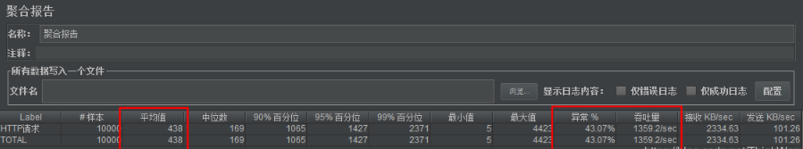
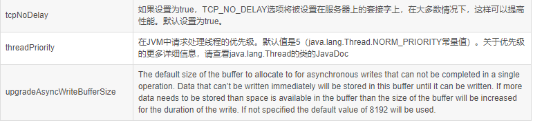

## 目的

本文不在于给出最佳配置，而是带领开发者，能够从实际情况出发，通过不断的调节tomcat和jvm参数，去发现吞吐量，平均响应时间和错误率等信息的变化，同时根据服务器的cpu和内存等信息，结合接口的业务逻辑，最好是测试使用率最高，并发最大，或者是最重要的接口(比如下单支付接口)，设置最优的tomcat和jvm配置参数。通过Tomcat性能优化可以提高网站的并发能力。Tomcat服务器在JavaEE项目中使用率非常高，所以在生产环境对Tomcat的优化也变得非常重要了。

<!--more-->


## 优化

对于Tomcat的优化，主要是从2个方面入手：

一是**Tomcat自身的配置**，另一个是**Tomcat所运行的jvm虚拟机的调优**。


## 硬件资源

服务器所能提供CPU、内存、硬盘的性能对处理能力有决定性影响。硬件我们不说了，这个方面是钱越多越好是吧。


## Tomcat配置优化

### 管理界面

Linux环境安装运行Tomcat8，具体的安装步骤省略 (官网下载，解压即可)。

[Tomcat官网](https://tomcat.apache.org/download-80.cgi)

如果需要登录系统，必须配置tomcat用户，在安装完Tomcat后，进行如下操作

在 **/conf/tomcat-users.xml**  文件中的 <tomcat-users> 标签里面添加如下内容

```conf
<!-- 修改配置文件，配置tomcat的管理用户 -->
<role rolename="manager"/>
<role rolename="manager-gui"/>
<role rolename="admin"/>
<role rolename="admin-gui"/>
<user username="tomcat" password="tomcat" roles="admin-gui,admin,manager-gui,manager"/>
```

如果是tomcat7，配置了tomcat用户就可以登录系统了，但是tomcat8中不行，还需要修改另一个配置文件，否则访问不了，提示403，打开 `webapps/manager/META-INF/context.xml`文件

启动Tomcat。(下图为默认配置启动)

```bash
bin/startup.sh
```


打开浏览器进行访问http://10.93.165.61:8080/,  点击“Server Status”，输入用户名/密码进行登陆tomcat/tomcat


登录之后可以看到服务器状态等信息，主要包括服务器信息，JVM，ajp和http信息


### AJP连接

在服务状态页面中可以看到，默认状态下会启用AJP服务，并且占用8009端口。


**什么是AJP**

AJP（Apache JServer Protocol）
AJPv13协议是面向包的。WEB服务器和Servlet容器通过TCP连接来交互；为了节省SOCKET创建的昂贵代价，WEB服务器会尝试维护一个永久TCP连接到servlet容器，并且在多个请求和响应周期过程会重用连接。


我们一般是使用Nginx+Tomcat的架构，所以用不着AJP协议，把AJP连接器禁用。

修改conf下的server.xml文件，将AJP服务禁用掉即可。

```
<!-- 禁用AJP连接 -->
<!-- <Connector port="8009" protocol="AJP/1.3" redirectPort="8443" /> -->
```


重启tomcat，查看效果。可以看到AJP服务已经不存在了。


### 执行器（线程池）

在tomcat中每一个用户请求都是一个线程，所以可以使用线程池提高性能。

修改server.xml文件：

```
<!--将注释打开-->
<Executor name="tomcatThreadPool" namePrefix="catalina-exec-"
        maxThreads="500" minSpareThreads="50" prestartminSpareThreads="true" maxQueueSize="100"/>

<!--
参数说明：
maxThreads：最大并发数，默认设置 200，一般建议在 500 ~ 1000，根据硬件设施和业务来判断
minSpareThreads：Tomcat 初始化时创建的线程数，默认设置 25
prestartminSpareThreads： 在 Tomcat 初始化的时候就初始化 minSpareThreads 的参数值，如果不等于 true，minSpareThreads 的值就没啥效果了
maxQueueSize，最大的等待队列数，超过则拒绝请求
-->

<!--在Connector中设置executor属性指向上面的执行器-->
<Connector executor="tomcatThreadPool" port="8080" protocol="HTTP/1.1"
               connectionTimeout="20000"
               redirectPort="8443" />
```

保存退出，重启tomcat，查看效果。


在页面中显示最大线程数为-1，这个是正常的，仅仅是显示的问题，实际使用的是指定的值。如果配置了一个Executor，则该属性的任何值将被正确记录，但是它将被显示为-1


### 运行模式

tomcat的运行模式有3种：

**bio**
性能非常低下，没有经过任何优化处理和支持。

**nio**
nio(new I/O)，是Java SE 1.4及后续版本提供的一种新的I/O操作方式(即java.nio包及其子包)。Java nio是一个基于缓冲区、并能提供非阻塞I/O操作的Java API，因此nio也被看成是non-blocking I/O的缩写。它拥有比传统I/O操作(bio)更好的并发运行性能。Tomcat8默认使用nio运行模式。

**apr**
安装起来最困难，但是从操作系统级别来解决异步的IO问题，大幅度的提高性能。

对于每种协议，Tomcat都提供了对应的I/O方式的实现，而且Tomcat官方还提供了在每种协议下每种I/O实现方案的差异， HTTP协议下的处理方式如下表，详情可查看[Tomcat官网说明](https://tomcat.apache.org/tomcat-8.5-doc/config/http.html)


推荐使用nio，在tomcat8中有最新的nio2，速度更快，建议使用nio2

设置nio2：

```
<Connector executor="tomcatThreadPool"  port="8080" protocol="org.apache.coyote.http11.Http11Nio2Protocol"
               connectionTimeout="20000"
               redirectPort="8443" />
```


可以看到已经设置为nio2了。

部署测试用的web项目
为了方便测试性能，我们将部署一个java web项目，这个项目本身和本博客没有什么关系，仅仅用于测试。

```
注意：这里在测试时，我们使用一个新的tomcat，进行测试，后面再对其进行优化调整，再测试。
```


## 查看服务器信息

说明一下我的测试服务器配置，不同的服务器配置对Tomcat的性能会有所影响。


CentOS7服务器环境信息查看命令

```
查看Linux版本：cat /etc/centos-release

查看CPU个数
查看逻辑cpu个数：cat /proc/cpuinfo | grep “processor” | wc -l
查看物理cpu个数：cat /proc/cpuinfo | grep “physical id” | sort | uniq | wc -l
查看每个物理cpu的核数cores：cat /proc/cpuinfo | grep “cpu cores”
如果所有物理cpu的cores个数加起来小于逻辑cpu的个数，则该cpu使用了超线程技术。查看每个物理cpu中逻辑cpu的个数：cat /proc/cpuinfo | grep “siblings”

查看内存使用情况
查看内存占用情况：free -m

参数说明
Mem：内存的使用情况总览表。
total：机器总的物理内存 单位为：M
used：用掉的内存。
free：空闲的物理内存。
```

## 部署web应用

上传war包到linux服务器，然后进行部署

我的web应用的名字叫tomcat-optimization，主要是提供了一个查询用户列表的接口，该接口会去阿里云数据库查询用户列表，没有任务业务逻辑的处理。

```bash
# 删除tomcat的/webapps/ROOT目录的所有文件
cd /webapps/ROOT
rm -rf *

# 上传war包到tomcat的/webapps/ROOT，然后解压
jar -xvf tomcat-optimization.war
rm -rf tomcat-optimization.war

# 进入tomcat的/bin目录重启tomcat
cd /bin
./shutdown.sh
./startup.sh
```


访问接口地址： http://10.93.165.61:8080/user/listUser


## 性能测试

Apache JMeter是Apache组织开发的基于Java的压力测试工具。 我们借助于此工具进行测试，将测试出tomcat的吞吐量等信息。

[官网下载地址](http://jmeter.apache.org/download_jmeter.cgi)


注意：这里需要先安装好jdk8及其以上版本的环境。

直接将下载好的zip压缩包进行解压, 进入bin目录，找到jmeter.bat文件，双机打开即可启动。


启动后，JMeter主页面如下


修改语言
默认的主题是黑色风格的主题并且语言是英语，这样不太方便使用，所以需要修改下语言。

设置语言为简体中文。


创建接口的测试用例
测试接口之前需要调整Windows环境配置，不然会报如下错误

```
JMeter java.net.BindException: Address already in use: connect
```

出现原因：
TCP/IP连接数不够或TIME_WAIT中存在很多链接，导致吞吐量低。

解决方案：
从问题的原因分析，有两种解决方案，一是增加预留给TCP/IP服务的临时端口的数量，二是加快被占用端口的释放速度。

解决办法：
1、打开注册表：regedit
2、HKEY_LOCAL_MACHINE\SYSTEM\CurrentControlSet\ Services\TCPIP\Parameters
3、新建 DWORD值，name：TCPTimedWaitDelay，value：30（十进制） –> 设置为30秒，默认是240秒
4、新建 DWORD值，name：MaxUserPort，value：65534（十进制） –> 设置最大连接数65534
5、重启系统

第一步：设置测试计划的名称

第二步：添加线程组，使用线程模拟用户的并发


1000个线程，每个线程循环10次，也就是tomcat会接收到10000个请求。

第三步：添加http请求


设置http请求


第四步：添加请求监控


启动与进行接口测试


查看测试报告
在聚合报告中，重点看吞吐量。


调整Tomcat参数进行优化
通过上面测试可以看出，tomcat在不做任何调整时，吞吐量为697次/秒。这个吞吐量跟接口的业务逻辑关系很大，如果业务逻辑复杂，需要比较长时间计算的，可能吞吐量只有几十次/秒，我这里测试的时候没有添加任务业务逻辑，才会出现吞吐量为697次/秒的情况。这里的吞吐量最好是经过多次测试取平均值，因为单次测试具有一定的随机性

禁用AJP连接
修改conf下的server.xml文件，将AJP服务禁用掉即可。

```
<!-- <Connector port="8009" protocol="AJP/1.3" redirectPort="8443" /> -->
```


这里经过9次测试，测试结果如下704 730 736 728 730 727 714 708 735 平均是723

可以看到，禁用AJP服务后，吞吐量会有所提升。

当然了，测试不一定准确，需要多测试几次才能看出是否有提升。

设置线程池
通过设置线程池，调整线程池相关的参数进行测试tomcat的性能。有关线程池更多更详细的配置参考Tomcat官网提供的配置详解

最大线程数为150，初始为4

```
<Executor name="tomcatThreadPool" namePrefix="catalina-exec-"
        maxThreads="150" minSpareThreads="4" prestartminSpareThreads="true"/>

<!--在Connector中设置executor属性指向上面的执行器-->
<Connector executor="tomcatThreadPool" port="8080" protocol="HTTP/1.1"
               connectionTimeout="20000"
               redirectPort="8443" />
```


经过9次测试，测试结果如下705 725 702 729 733 738 735 728 平均是724

**最大线程数为500，初始为50**

```
<Executor name="tomcatThreadPool" namePrefix="catalina-exec-"
        maxThreads="500" minSpareThreads="50" prestartminSpareThreads="true"/>

<!--在Connector中设置executor属性指向上面的执行器-->
<Connector executor="tomcatThreadPool" port="8080" protocol="HTTP/1.1"
               connectionTimeout="20000"
               redirectPort="8443" />
```


测试结果：733 724 718 728 734 721 720 723 平均725。吞吐量为725次/秒，性能有所提升。

**最大线程数为1000，初始为200**

```
<Executor name="tomcatThreadPool" namePrefix="catalina-exec-"
        maxThreads="1000" minSpareThreads="200" prestartminSpareThreads="true"/>

<!--在Connector中设置executor属性指向上面的执行器-->
<Connector executor="tomcatThreadPool" port="8080" protocol="HTTP/1.1"
               connectionTimeout="20000"
               redirectPort="8443" />
```


吞吐量为732，性能有所提升。测试结果 737 729 730 738 735 726 725 740 平均732

**最大线程数为5000，初始为1000**
是否是线程数最多，速度越快呢？ 我们来测试下。

```
<Executor name="tomcatThreadPool" namePrefix="catalina-exec-"
        maxThreads="5000" minSpareThreads="1000" prestartminSpareThreads="true"/>

<!--在Connector中设置executor属性指向上面的执行器-->
<Connector executor="tomcatThreadPool" port="8080" protocol="HTTP/1.1"
               connectionTimeout="20000"
               redirectPort="8443" />
```


测试结果 727 733 728 725 738 729 737 735 739 平均732

可以看到，虽然最大线程已经设置到5000，但是实际测试效果并不理想，并且平均的响应时间也边长了，所以单纯靠提升线程数量是不能一直得到性能提升的。

**设置最大等待队列数**
默认情况下，请求发送到tomcat，如果tomcat正忙，那么该请求会一直等待。这样虽然可以保证每个请求都能请求到，但是请求时间就会边长。

有些时候，我们也不一定要求请求一定等待，可以设置最大等待队列大小，如果超过就不等待了。这样虽然有些请求是失败的，但是请求时间会虽短。典型的应用：12306。

```
<!--最大等待数为100-->
<Executor name="tomcatThreadPool" namePrefix="catalina-exec-"
        maxThreads="500" minSpareThreads="100" prestartminSpareThreads="true" maxQueueSize="100"/>

<!--在Connector中设置executor属性指向上面的执行器-->
<Connector executor="tomcatThreadPool" port="8080" protocol="HTTP/1.1"
               connectionTimeout="20000"
               redirectPort="8443" />
```



测试结果：

- 平均响应时间：0.438秒，响应时间明显缩短

- 错误率：43.07%，错误率超过40%，也可以理解，最大线程为500，测试的并发为1000

- 吞吐量：1359次/秒，吞吐量明显提升

  结论：响应时间、吞吐量这2个指标需要找到平衡才能达到更好的性能。

**设置nio2的运行模式**
将最大线程设置为500进行测试：

```
<Executor name="tomcatThreadPool" namePrefix="catalina-exec-"
        maxThreads="500" minSpareThreads="100" prestartminSpareThreads="true"/>

<!-- 设置nio2 -->
<Connector executor="tomcatThreadPool" port="8080" protocol="org.apache.coyote.http11.Http11Nio2Protocol"
               connectionTimeout="20000"
               redirectPort="8443" />
```


从测试结果可以看到，平均响应时间有缩短，吞吐量有提升，可以得出结论：nio2的性能要高于nio。

参数说明与最佳实践
具体参数参考官网说明

执行器参数说明(加粗是重点)

执行器最佳实践
此最佳配置仅供参考

```
<Executor name="tomcatThreadPool" namePrefix="catalina-exec-"
        maxThreads="800" minSpareThreads="100" maxQueueSize="100"                                 prestartminSpareThreads="true"/>
```

连接器参数说明
可以看到除了这几个基本配置外并无特殊功能，所以我们需要对 Connector 进行扩展。

其中Connector 支持参数属性可以参考Tomcat官方网站，本文就只介绍些常用的。

通用属性(加粗是重点)


**标准实现(加粗是重点)**
除了上面列出的常见的连接器属性，标准的HTTP连接器（BIO，NIO和APR/native）都支持以下属性。




**连接器最佳实践**
此最佳配置仅供参考

```
<Connector executor="tomcatThreadPool" port="8080" 						                            protocol="org.apache.coyote.http11.Http11Nio2Protocol" 
           connectionTimeout="20000" redirectPort="8443" 
           enableLookups="false" maxPostSize="10485760" URIEncoding="UTF-8" 	                    acceptCount="100" acceptorThreadCount="2" disableUploadTimeout="true"                    maxConnections="10000" SSLEnabled="false"/>
```

**调整JVM参数进行优化**
接下来，通过设置jvm参数进行优化，为了测试一致性，依然将最大线程数设置为500，启用nio2运行模式

**设置并行垃圾回收器**
在/bin/catalina.sh文件第一行添加如下参数，gc日志输出到/logs/gc.log

```
#年轻代、老年代均使用并行收集器，初始堆内存64M，最大堆内存512M
JAVA_OPTS="-XX:+UseParallelGC -XX:+UseParallelOldGC -Xms64m -Xmx512m -XX:+PrintGCDetails -XX:+PrintGCTimeStamps -XX:+PrintGCDateStamps -XX:+PrintHeapAtGC -Xloggc:../logs/gc.log"
```


测试结果与默认的JVM参数结果接近。

查看gc日志文件
将gc.log文件上传到gceasy.io查看gc中是否存在问题。上传文件后需要等待一段时间，需要耐心等待。

问题一：**系统所消耗的时间大于用户时间**

如果在报告中显示System Time greater than User Time，系统所消耗的时间大于用户时间，这反应出的服务器的性能存在瓶颈，调度CPU等资源所消耗的时间要长一些。

问题二：**线程暂停时间有点长**

可以关键指标中可以看出，吞吐量表现不错，但是gc时，线程的暂停时间稍有点长。

问题三：**GC总次数过多**


通过GC的统计可以看出：

年轻代的gc有100次，次数有点多，说明年轻代设置的大小不合适，需要调整
FullGC有7次，说明堆内存的大小不合适，需要调整

问题四：**年轻代内存不足导致GC**


从GC原因的可以看出，年轻代大小设置不合理，导致了多次GC。

调整年轻代大小
调整jvm配置参数

```
JAVA_OPTS="-XX:+UseParallelGC -XX:+UseParallelOldGC -Xms128m -Xmx1024m -XX:NewSize=64m -XX:MaxNewSize=256m -XX:+PrintGCDetails -XX:+PrintGCTimeStamps -XX:+PrintGCDateStamps -XX:+PrintHeapAtGC -Xloggc:../logs/gc.log"
```


将初始堆大小设置为128m，最大为1024m，初始年轻代大小64m，年轻代最大256m


从测试结果来看，吞吐量以及响应时间均有提升。

查看gc日志


可以看到GC次数要明显减少，说明调整是有效的。


GC次数有所减少


设置G1垃圾回收器

```
#设置了最大停顿时间100毫秒，初始堆内存128m，最大堆内存1024m
JAVA_OPTS="-XX:+UseG1GC -XX:MaxGCPauseMillis=100 -Xms128m -Xmx1024m -XX:+PrintGCDetails -XX:+PrintGCTimeStamps -XX:+PrintGCDateStamps -XX:+PrintHeapAtGC -Xloggc:../logs/gc.log"
```

测试结果: 可以看到，吞吐量有所提升，评价响应时间也有所缩短。

JVM配置最佳实践
此最佳配置仅供参考

```
JAVA_OPTS="-Dfile.encoding=UTF-8-server -Xms1024m -Xmx2048m -XX:NewSize=512m -XX:MaxNewSize=1024m -XX:PermSize=256m -XX:MaxPermSize=256m -XX:MaxTenuringThreshold=10-XX:NewRatio=2 -XX:+DisableExplicitGC"
```


参数说明：

```
file.encoding 默认文件编码
-Xmx1024m 设置JVM最大可用内存为1024MB
-Xms1024m 设置JVM最小内存为1024m。此值可以设置与-Xmx相同，以避免每次垃圾回收完成后JVM重新分配内存。
-XX:NewSize 设置年轻代大小
-XX:MaxNewSize 设置最大的年轻代大小
-XX:PermSize 设置永久代大小
-XX:MaxPermSize 设置最大永久代大小
-XX:NewRatio=4 设置年轻代（包括Eden和两个Survivor区）与终身代的比值（除去永久代）。设置为4，则年轻代与终身代所占比值为1：4，年轻代占整个堆栈的1/5
-XX:MaxTenuringThreshold=0 设置垃圾最大年龄，默认为：15。如果设置为0的话，则年轻代对象不经过Survivor区，直接进入年老代。对于年老代比较多的应用，可以提高效率。如果将此值设置为一个较大值，则年轻代对象会在Survivor区进行多次复制，这样可以增加对象再年轻代的存活时间，增加在年轻代即被回收的概论。
-XX:+DisableExplicitGC 这个将会忽略手动调用GC的代码使得System.gc()的调用就会变成一个空调用，完全不会触发任何GC。
```

总结
通过上述的测试，可以总结出，对tomcat性能优化就是需要不断的进行调整参数，然后测试结果，可能会调优也可能会调差，这时就需要借助于gc的可视化工具来看gc的情况。再帮我我们做出决策应该调整哪些参数。

再次重申本博客的目的不在于给出最佳配置，而是带领开发者，能够从实际情况出发，通过不断的调节tomcat和jvm参数，去发现吞吐量，平均响应时间和错误率等信息的变化，同时根据服务器的cpu和内存等信息，结合接口的业务逻辑，最好是测试使用率最高，并发最大，或者是最重要的接口(比如下单支付接口)，设置最优的tomcat和jvm配置参数。