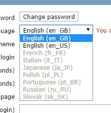
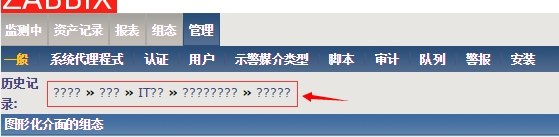
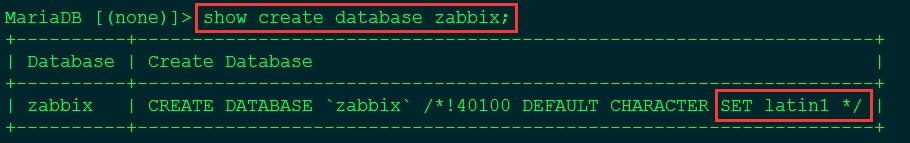
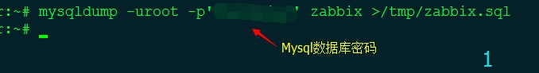
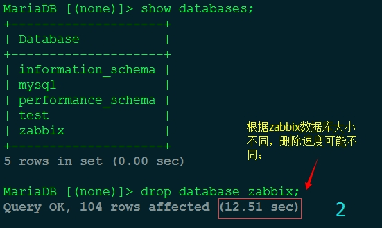
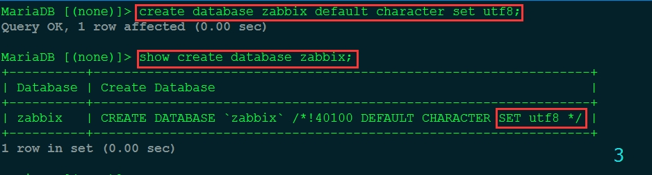
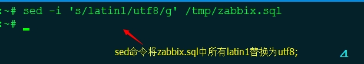
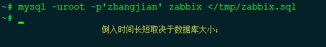
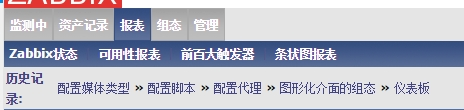

## 安装

安装Apache、Mysql、Php、zabbix

```
sudo apt-get update 
sudo apt-get install apache2 mysql-server libapache2-mod-php5 php5-gd php5-mysql  php5-common zabbix-server-mysql zabbix-frontend-php
```

<!--more-->

## 服务端配置

### 配置数据库连接

```
sudo vim /etc/zabbix/zabbix_server.conf
```

修改相关

```
DBName=zabbix
DBUser=zabbix
DBPassword=zabbix
#非必需，但推荐
StartDiscoverers=5
```

### 创建mysql账号

```
mysql -u root -p
mysql> create user 'zabbix'@'localhost' identified by 'zabbix';
mysql> create database zabbix default character set utf8;
mysql> grant all privileges on zabbix.* to 'zabbix'@'localhost';
mysql> flush privileges;
mysql> exit;
```

### 导入初始化数据

```
cd /usr/share/zabbix-server-mysql/
sudo gunzip *.gz
mysql -u zabbix -p zabbix < schema.sql
mysql -u zabbix -p zabbix < images.sql
mysql -u zabbix -p zabbix < data.sql
```

### 修改 PHP 参数

```
sudo vim /etc/php5/apache2/php.ini
```

修改项：

```
post_max_size = 16M
max_execution_time = 300
max_input_time = 300
date.timezone = "Asia/Shanghai"
```


###  配置网页

```
sudo cp /usr/share/doc/zabbix-frontend-php/examples/zabbix.conf.php.example /etc/zabbix/zabbix.conf.php
sudo vim /etc/zabbix/zabbix.conf.php
```

修改项

```
$DB['DATABASE'] = 'zabbix';
$DB['USER'] = 'zabbix';
$DB['PASSWORD'] = 'zabbix'
```

配置apache

```
sudo cp /usr/share/doc/zabbix-frontend-php/examples/apache.conf /etc/apache2/conf-available/zabbix.conf
sudo a2enconf zabbix.conf
sudo a2enmod alias
sudo service apache2 restart
```

### 配置 zabbix server 启动

```
sudo vim /etc/default/zabbix-server
```

修改项：

```
START=yes
```

启动：

```
sudo service zabbix-server start
```

### 本机监控

```
sudo apt-get install zabbix-agent
sudo service zabbix-agent restart
```

### 访问

```
http://xxx.xxx.xxx.xxx/zabbix
```

缺省的账户：

```
Username = admin
Password = zabbix
```

## 客户端配置

```
sudo apt-get install zabbix-agent
```

修改配置

```
sudo vim /etc/zabbix/zabbix_agentd.conf
```

调整项

```
Server=127.0.0.1 #修改为 zabbix server 服务器的IP，如果有网关或被监控机为虚拟机也加上母机的IP
ServerActive=127.0.0.1 #修改为 zabbix server 服务器的IP
Hostname=Zabbix server #修改为网页里面添加的Hostname，需要保持一致。
```

## 优化

**中文显示**

```
sudo apt-get install language-pack-zh-hans
```

[zabbix](http://www.ttlsa.com/monitor/zabbix/)是一个多语言监控系统，默认使用英文并且也支持中文语言，详见《[zabbix汉化方法](http://www.ttlsa.com/zabbix/zabbix-convert-into-chinese-8-ttlsa/)》，但是近期有人反映说zabbix里面看不到中文语言.请往下看

**zabbix不支持中文图**



**开启zabbix对中文的支持**

原来zabbix默认把对中文的支持给关闭了，我们需要修改zabbix的[php](http://www.ttlsa.com/php/)源文件. 修改站点根目录下include/locales.inc.php文件.

```bash
# vim include/locales.inc.php

function getLocales() {
        return array(
                'en_GB' => array('name' => _('English (en_GB)'),        'display' => true),
                'en_US' => array('name' => _('English (en_US)'),        'display' => true),
                'bg_BG' => array('name' => _('Bulgarian (bg_BG)'),      'display' => true),
                'zh_CN' => array('name' => _('Chinese (zh_CN)'),        'display' => true),
                //原本这里为false,请改为true
                ...........代码省略掉........
        );
}
```

**中文乱码**

1、历史记录处出现 ???? 乱码：



出现原因：

mysql数据库默认字符集为 latin1，而 zabbix 需要使用 utf8，在初始化创建 zabbix 库时没有指定具体的字符集，倒入三张表时会继承 Mysql 的默认字符集，所以此处会出现乱码；



解决办法：

1、将 zabbix 数据库中的表备份；

2、手动删除 zabbix 数据库；

3、重新创建 zabbix 库时手动指定字符集为 utf8；

4、将倒出的 sql 文件中字符集为latin1的表字符集替换为 utf8；

5、将备份的zabbix库重新倒入即可；













此时重新访问 zabbix web页面，点击几次菜单，历史记录处一切正常；