## 目的

zabbix监控系统是目前企业常用的监控系统之一。具有快速上手，监控简单明了等特点。通过本文教程快速安装zabbix4.0 LST监控系统，为企业搭建监控系统，保驾护航。


## 环境

centos7.x

zabbix4.0.x  LST


## 参考文档和下载地址

[官方文档](https://www.zabbix.com/documentation/4.0/zh/manual)

[下载地址](http://repo.zabbix.com/zabbix/4.0/rhel/7/x86_64/)

<!--more-->


## 环境确认

```bash
cat /etc/redhat-release #  查看CentOS版本 
cat /proc/version         #查看存放与内核相关的文件
```

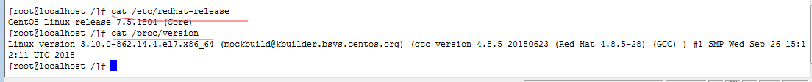

## **搭建之前的操作**

#### **升级系统组件到最新的版本**

```bash
yum -y update
```

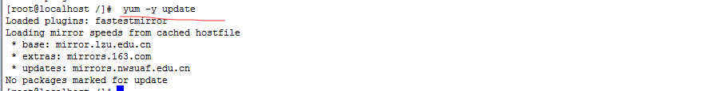

#### **关闭selinux** 

```bash
vim /etc/selinux/config    #将SELINUX=enforcing改为SELINUX=disabled 设置后需要重启才能生效
```

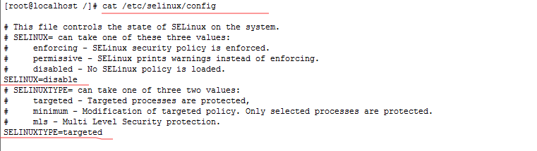

```bash
setenforce 0       #临时关闭命令
getenforce         #检测selinux是否关闭，Disabled 为关闭
```


#### **关闭防火墙**

```bash
firewall-cmd --state    #查看默认防火墙状态，关闭后显示not running，开启后显示running
```

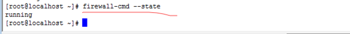

```bash
systemctl stop firewalld.service    #临时关闭firewall
systemctl disable firewalld.service #禁止firewall开机启动
```

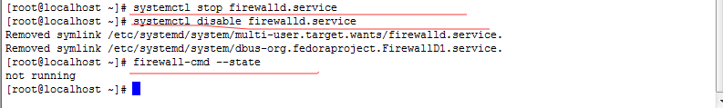

## **搭建LAMP环境**

#### **安装所需所有软体仓库**

Zabbix是建立在LAMP或者LNMP环境之上，在此为了方便就使用yum安装LAMP环境.

```bash
yum install -y httpd mariadb-server mariadb php php-mysql php-gd libjpeg* php-ldap php-odbc php-pear php-xml php-xmlrpc php-mhash

rpm -qa httpd php mariadb            #安装完成后检查应用版本
```

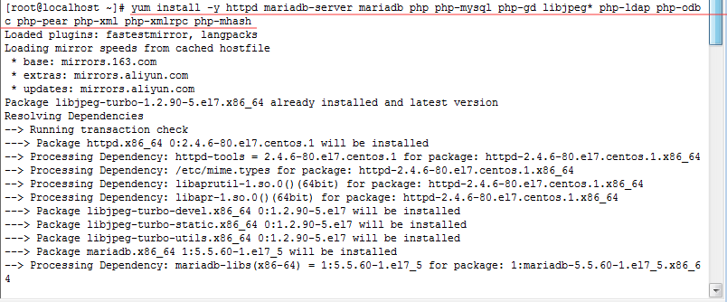


#### **编辑httpd**

```bash
vim /etc/httpd/conf/httpd.conf

ServerName www.zabbixyk.com      #修改为主机名
DirectoryIndex index.html index.php   # 添加首页支持格式　
```

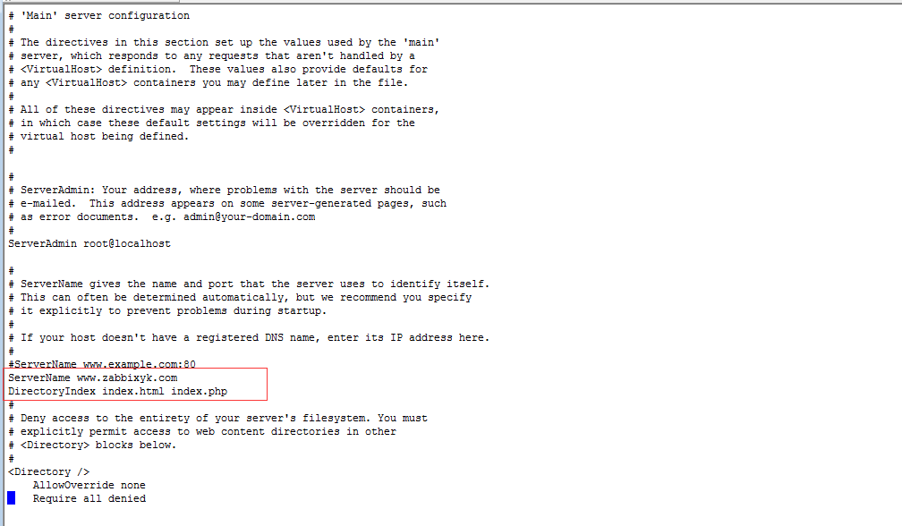

#### **编辑配置php，配置中国时区**

```bash
vi /etc/php.ini

date.timezone = Asia/Shanghai   # 配置时区 
```

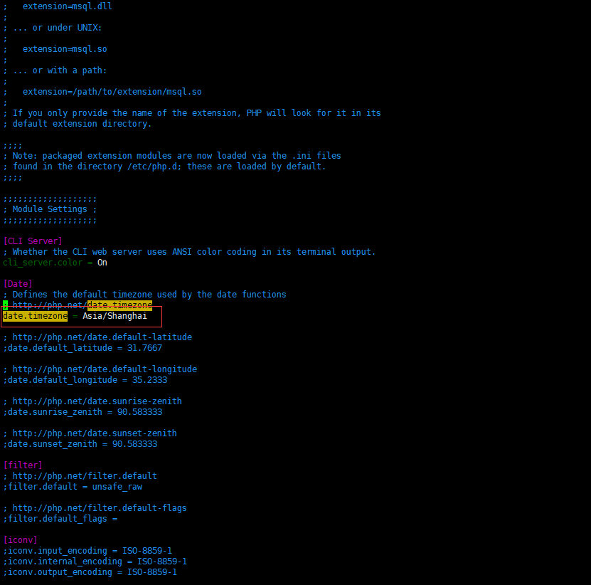

#### **启动httpd和mysqld服务**

```bash
systemctl start httpd   #启动并加入开机自启动httpd
systemctl enable httpd
systemctl start mariadb  #启动并加入开机自启动mysqld
systemctl enable mariadb

ss -anplt | grep httpd   #查看httpd启动情况，80端口监控表示httpd已启动
ss -naplt | grep mysqld  #查看mysqld启动情况，3306端口监控表示mysqld已启动　
```

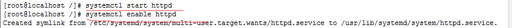

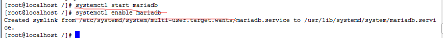

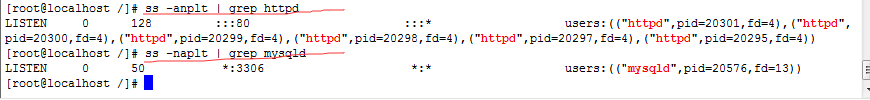

#### **创建一个测试页**

```bash
vi /var/www/html/index.php #创建一个测试页，并编辑

<?php
phpinfo()
?>
```

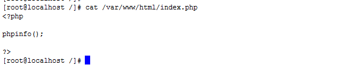

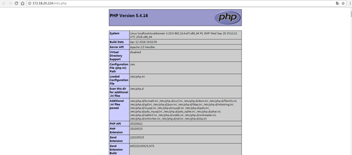

####  本地测试

```bash
curl http://127.0.0.1 -I         #本地测试
```

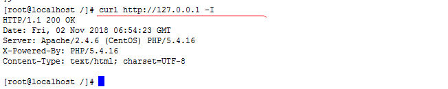

#### **配置mysql和权限**

```bash
mysqladmin -u root password ykadmin123           #设置数据库root密码
```

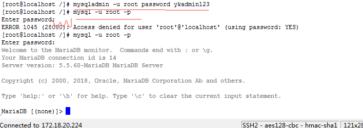

```bash
mysql -u root -p        #root用户登陆数据库
CREATE DATABASE zabbix character set utf8 collate utf8_bin;       #创建zabbix数据库（中文编码格式）
GRANT all ON zabbix.* TO 'zabbix'@'%' IDENTIFIED BY 'ykadmin123';  #授予zabbix用户zabbix数据库的所有权限，密码ykadmin123
flush privileges;    #刷新权限
quit                 #退出数据库   
```

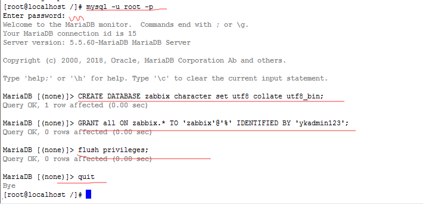

为保证zabbix用户也可以登录数据库，若出现本地无法登录情况，解决方式如下：

```bash
mysql -u root -p  #使用root账户登录数据库；
select user,host from mysql.user;   #有空用户名称占用导致本地无法登录远程可登录
drop user ''@localhost;  #删除空用户　
```

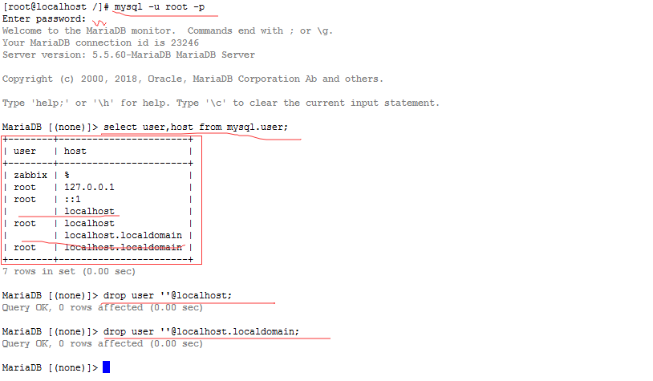

## 安装zabbix

#### **安装依赖包 + 组件**

```bash
yum -y install net-snmp net-snmp-devel curl curl-devel libxml2 libxml2-devel libevent-devel.x86_64 javacc.noarch  javacc-javadoc.noarch javacc-maven-plugin.noarch javacc*
```

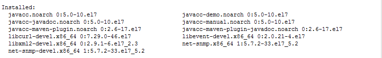

#### 安装zabbix-server，并初始化库

```bash
yum install php-bcmath php-mbstring -y #安装php支持zabbix组件
 
rpm -ivh http://repo.zabbix.com/zabbix/4.0/rhel/7/x86_64/zabbix-release-4.0-1.el7.noarch.rpm  #会自动生成yum源文件，保证系统可以上网
 
yum install zabbix-server-mysql zabbix-web-mysql -y    #安装zabbix组件
 
zcat /usr/share/doc/zabbix-server-mysql-4.0.0/create.sql.gz | mysql -uzabbix -p -h 172.18.20.224 zabbix   #导入数据到数据库zabbix中(最后一个zabbix是数据库zabbix)，且因为用户zabbix是%(任意主机)，所以登录时需要加上当前主机ip(-h 172.18.20.224),密码是用户zabbix登陆密码ykadmin123

```

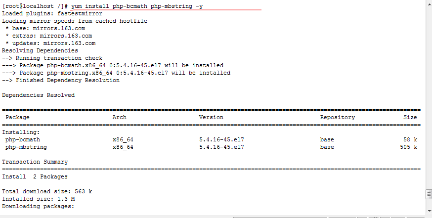

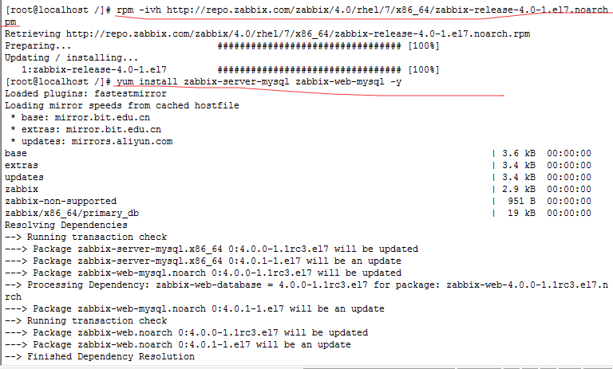

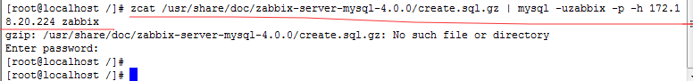

```bash
vi  /etc/zabbix/zabbix_server.conf   #配置数据库用户及密码
grep -n '^'[a-Z] /etc/zabbix/zabbix_server.conf   #确认数据库用户及密码
```

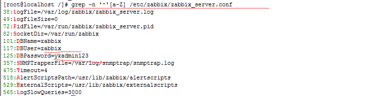

```bash
vi /etc/httpd/conf.d/zabbix.conf     //修改时区

将# php_value date.timezone Europe/Riga 变更成php_value date.timezone Asia/Shanghai

systemctl enable zabbix-server # #启动并加入开机自启动zabbix-server
systemctl start zabbix-server
```

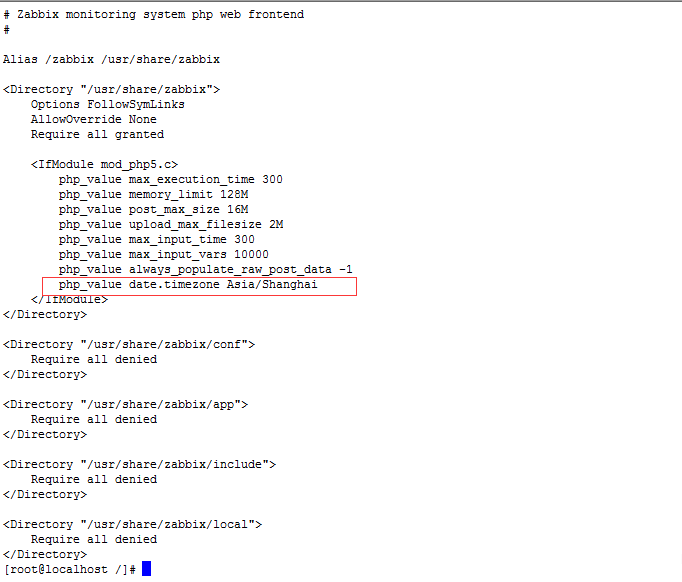

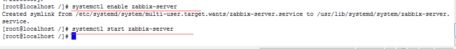

```bash
netstat -anpt | grep zabbix      //监听在10051端口上,如果没监听成功，可重启zabbix-server服务试试
```

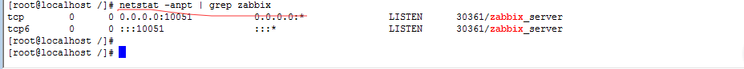

建议重启服务器，再继续。

#### **web界面安装zabbix**

如果以上步骤无误，现在可以使用web打开  

```bash
http://172.18.20.224/zabbix　　//注意这里IE浏览器打不开，本次测试使用chrome浏览器
```

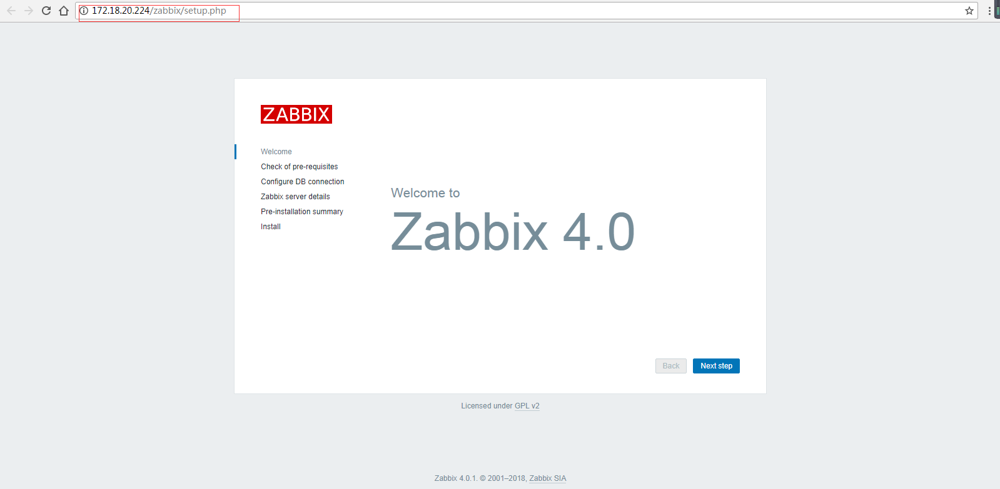

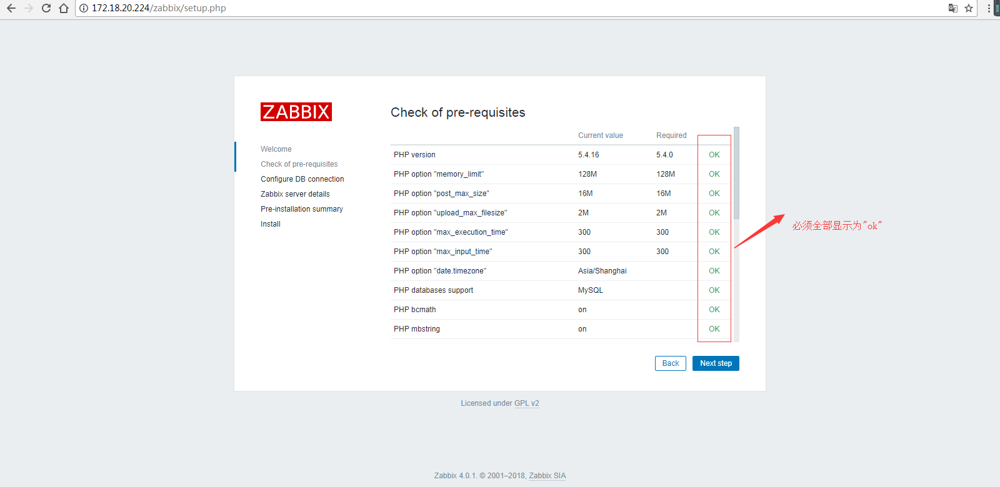

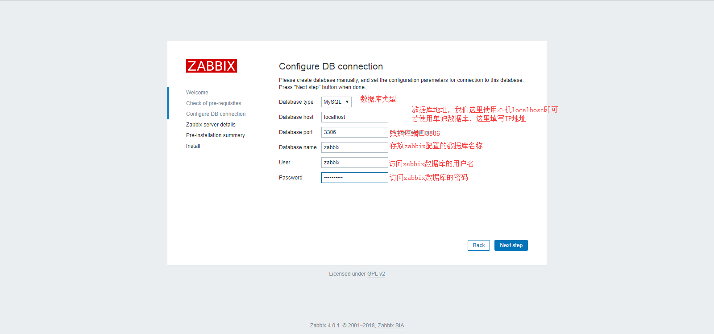

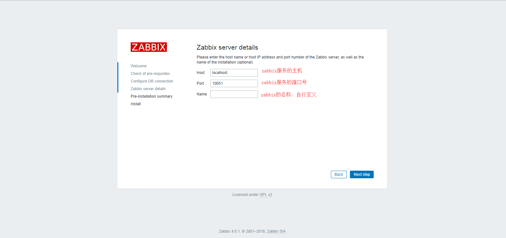

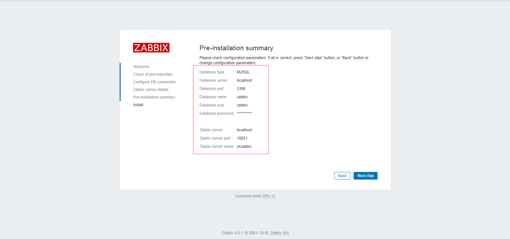

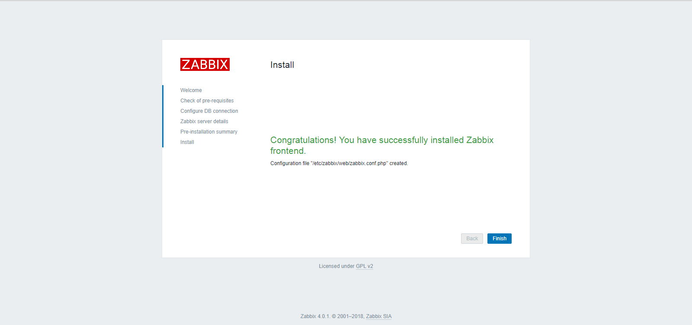

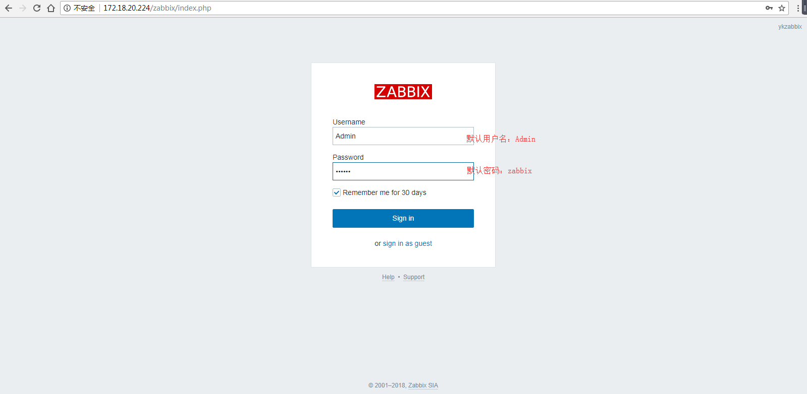

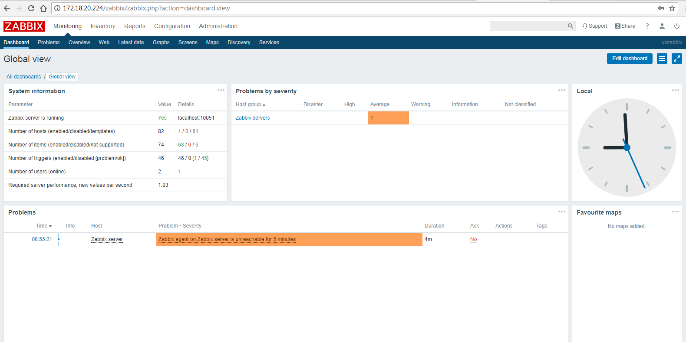

## 优化

#### 安装graphtree

graphtree的功能

> 1)集中展示所有分组设备 
>
> 2)集中展示一个分组图像 
>
> 3)集中展示一个设备图像 
>
> 4)展示设备下的Application 
>
> 5)展示每个Application下的图像
>
>  6)展示每个Application下的日志 
>
> 7)对原生无图的监控项进行绘图 (注意问题:在组和主机级别，默认只显示[系统](https://www.2cto.com/os/)配置的graph)

```bash
cd /usr/share/zabbix
wget https://raw.githubusercontent.com/OneOaaS/graphtrees/master/graphtree3.2.x.patch
yum install -y patch
patch -Np0 < graphtree3.2.x.patch
```

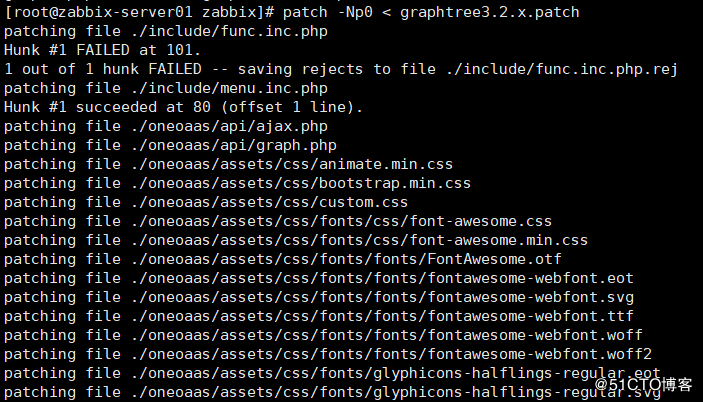

**# 注意此处的权限，必须和nginx或者apache的用户一致，我用的是apache，则此处为chown -R apache:apache oneoaas**

graphtree的删除广告部分修改配置 进入graphtree配置文件，进行相关修改

```bash
vim oneoaas/templates/graphtree/graphtree.tpl
```

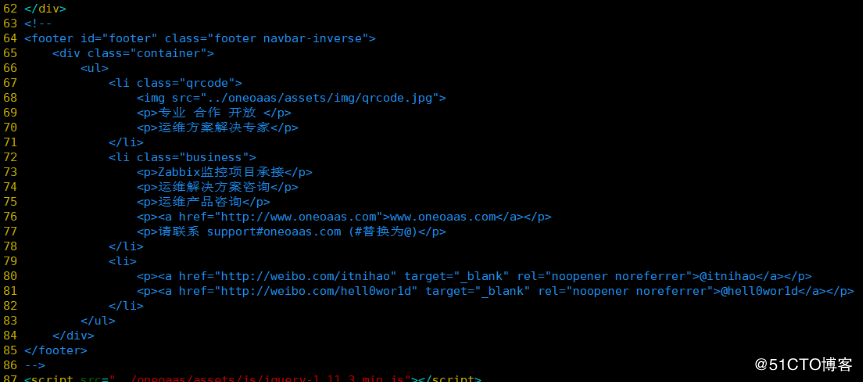

修改logo

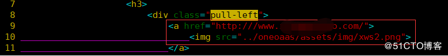

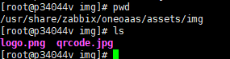

重启httpd服务然后查看效果

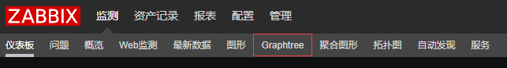

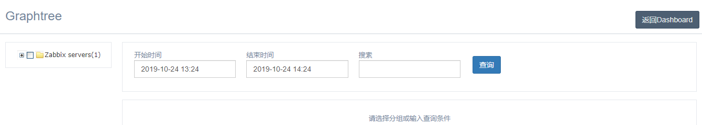

#### 中文乱码

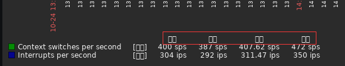

###### 复制字体

复制本地电脑C:\Windows\Fonts\simkai.ttf（楷体）上传到zabbix服务器网站目录的fonts目录下

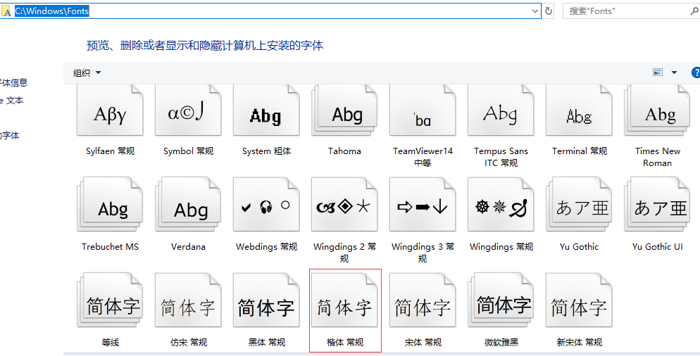

yum或rpm安装的zabbix-server字体目录为：/usr/share/zabbix/assets/fonts

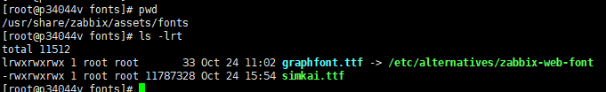

graphfont.ttf是zabbix默认字符集，simkai.ttf是从windows复制过来的字体文件，权限最好给777，要不会影响到zabbix图形显示异常。

###### 字体替换

方法一：

修改此/usr/share/zabbix/include/defines.inc.php文件中字体的配置，将里面关于字体设置从graphfont都替换成simkai，注意:realpath的字体设置路径

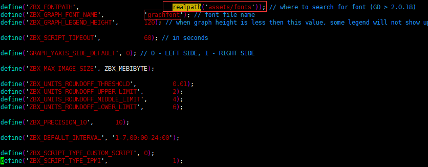

方法二：

```bash
cd  /etc/alternatives/
mv zabbix-web-font zabbix-web-font.bak   #备份
ln -sf /usr/share/zabbix/assets/fonts/simkai.ttf zabbix-web-font  #新链接
```

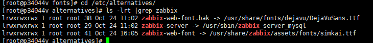

到页面刷新就可看到，如果没有更改，请重启zabbix-server

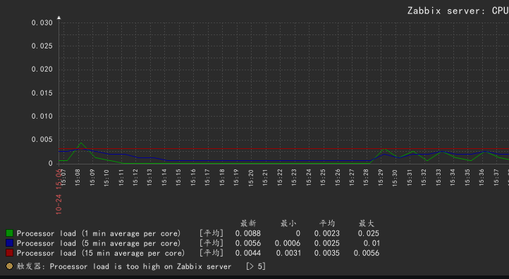

