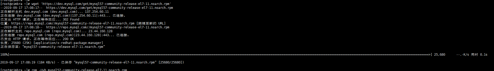
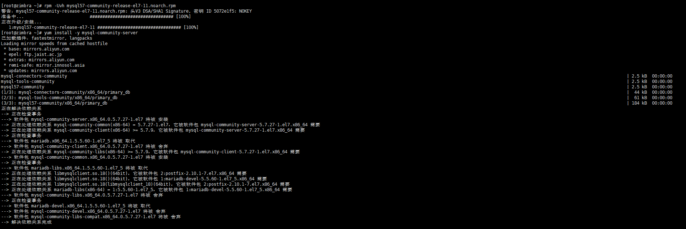
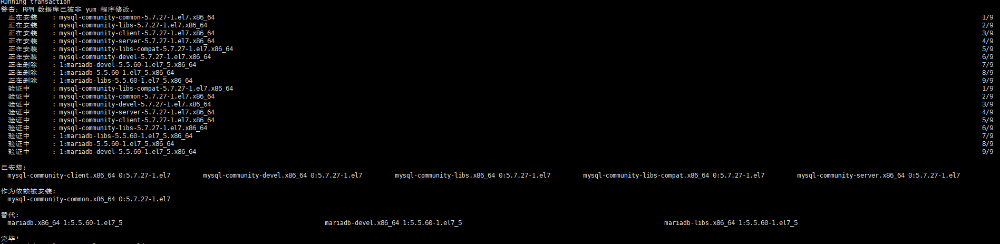
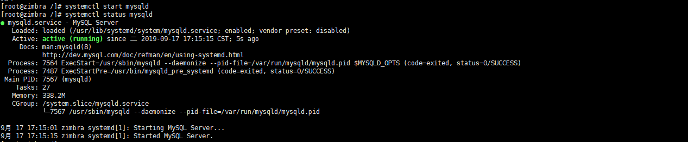
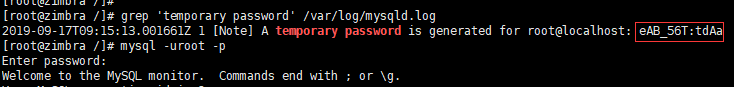
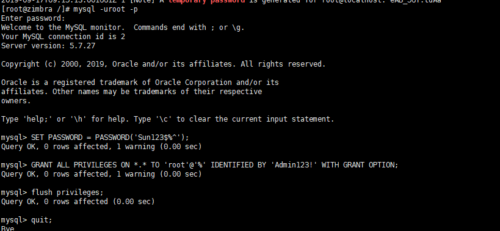

## 目的

现在centos上默认是没有yum源的，yum安装的是 MariaDB。本文详细介绍了centos7下使用yum源安装mysql5.7。


## 环境

系统：centos7

<!--more-->


## 配置yum源

#### 下载yum源：

```bash
wget 'https://dev.mysql.com/get/mysql57-community-release-el7-11.noarch.rpm'
```



#### 安装yum源

```bash
rpm -Uvh mysql57-community-release-el7-11.noarch.rpm
```



## 安装mysql

```bash
yum install -y mysql-community-server
```



## 启动

启动mysql,要知道在centos7中，没有了service命令，都是使用systemctl命令。注意启动的时候是start mysqld而不是mysql。

```bash
# 启动
systemctl start mysqld
# 查看状态
systemctl status mysqld
```



如图所示，是已经启动了

## 配置

#### 修改数据库密码

mysql5.7的新特性之一就是在初始化的时候会生成一个自定义的密码，然后你需要找到这个密码，登录的时候输入。注意，输入密码的时候是不显示。

找到密码: 红框的地方就是密码

```bash
grep 'temporary password' /var/log/mysqld.log
```



**登录数据库：这里-p之后不用输入密码，回车后再输入。改过密码之后登录则是直接在-p后加密码了。**

**修改密码**

注意，修改的密码太简单会不给修改，把大小写字母和数字加上就肯定可以了。然后切记切记，mysql里面的命令要加分号！分号！分号！

```mysql
SET PASSWORD = PASSWORD('Sun123$%^');
```

**设置远程可以登录**

现在这样是无法在本地用工具登录访问的，现在要做两件事，一件事是将云服务器上的3306端口开放；另一件事是配置远程可以访问。

```mysql
GRANT ALL PRIVILEGES ON *.* TO 'root'@'%' IDENTIFIED BY 'Admin123!' WITH GRANT OPTION;
flush privileges;
```

先设置刚才的密码可以远程登录，然后使用flush命令使配置立即生效。
如果还不行可以尝试重启一下数据库。



#### 优化配置

mysql的配置文件真的很多，有的还很蛋疼。比如默认的字符集是拉丁字符集，每次创建数据库的时候要设置字符集；默认还不支持group by语句，默认的时区也不是我们现在的北京时间(东八区)，会导致我们的时间差了13个点。针对以上说几个简要的配置，更多的配置在以后遇到了再加上，或者留言吧！

打开配置文件，yum安装的默认在/etc文件夹下:

```bash
vim /etc/my.cnf

#在[mysqld]下面添加，不需要分号
#字符集:注意是utf8而不是utf-8!
character-set-server=utf8
#这时候使用show variables like 'char%';就可以查看到字符集都是utf8了
#sql支持group by语句
sql_mode=STRICT_TRANS_TABLES,NO_ZERO_IN_DATE,NO_ZERO_DATE,ERROR_FOR_DIVISION_BY_ZERO,NO_AUTO_CREATE_USER,NO_ENGINE_SUBSTITUTION
#设置时区为东八区
default-time_zone = '+8:00'
```

最后重启数据库，使配置生效。

```bash
systemctl restart mysqld
```

## **设置开机启动**

```bash
systemctl enable mysqld
systemctl daemon-reload
```

安装记录就到这里，更多的配置在遇到后继续更新。