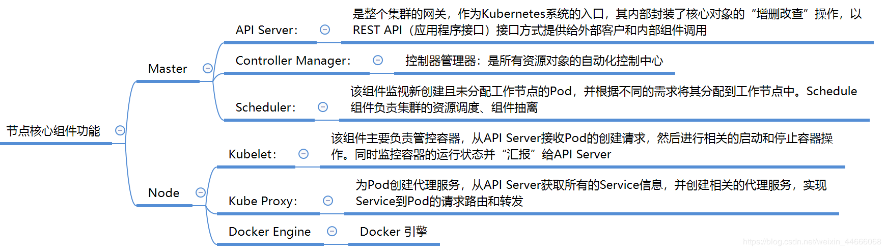

## 目的

Kubernetes是Google 2014年创建管理的，是Google 10多年大规模容器管理技术Borg的开源版本。它是容器集群管理系统，是一个开源的平台，可以实现容器集群的自动化部署、自动扩缩容、维护等功能。本文详细介绍了集群的搭建。

<!--more-->

## 规划

一台master结点，两台node结点

|   主机名   |      IP       |    OS    |    配置     |
| :--------: | :-----------: | :------: | :---------: |
| k8s-master | 192.168.6.201 | CentOS 7 | 2 CPUs， 2G |
| k8s-node1  | 192.168.6.202 | CentOS 7 | 2 CPUs， 2G |
| k8s-node2  | 192.168.6.203 | CentOS 7 | 2 CPUs， 2G |

组件功能：



## 安装

#### 设置主机名

192.168.6.201上执行

```bash
# 设置master节点主机名
hostnamectl set-hostname --static k8s-master
```

192.168.6.202上执行

```bash
# 设置node1节点主机名
hostnamectl set-hostname --static k8s-node1
```

192.168.6.203上执行

```bash
# 设置node2节点主机名
hostnamectl set-hostname --static k8s-node2
```

#### 安装docker-ce

所有节点上（k8s-master, k8s-node1, k8s-node2）安装docker-ce：

```bash
# 安装必要软件包
yum install -y yum-utils device-mapper-persistent-data lvm2
 
# 设置docker镜像源
yum-config-manager --add-repo \
  http://mirrors.aliyun.com/docker-ce/linux/centos/docker-ce.repo
 
# 安装docker-ce
yum update -y && yum install -y \
  containerd.io-1.2.13 \
  docker-ce-19.03.8 \
  docker-ce-cli-19.03.8
 
# 启动docker，并设置开机自启
systemctl enable docker && systemctl start docker
 
# 配置docker镜像加速
cat <<EOF >  /etc/docker/daemon.json
{
  "exec-opts": ["native.cgroupdriver=systemd"],
  "registry-mirrors": [ "https://gcr.azk8s.cn", "https://docker.mirrors.ustc.edu.cn", "http://hub-mirror.c.163.com", "https://registry.docker-cn.com"]
}
EOF
 
# 重启docker
systemctl daemon-reload
systemctl restart docker
```

#### 环境准备

所有节点上（k8s-master, k8s-node1, k8s-node2）做如下准备工作

```bash
# 关闭firewalld
systemctl stop firewalld
systemctl disable firewalld
 
# 关闭SELinux
setenforce 0
sed -i 's/^SELINUX=enforcing$/SELINUX=disabled/' /etc/selinux/config
 
# 关闭swap
swapoff -a
sed -i "s/\/dev\/mapper\/centos-swap/# \/dev\/mapper\/centos-swap/" /etc/fstab
 
# 设置iptables
cat <<EOF >  /etc/sysctl.d/k8s.conf
net.bridge.bridge-nf-call-ip6tables = 1
net.bridge.bridge-nf-call-iptables = 1
EOF
sysctl --system
 
# 载入br_netfilter模块
modprobe br_netfilter
```

#### 安装kubelet kubeadm kubectl

所有节点上（k8s-master, k8s-node1, k8s-node2）安装kubelet kubeadm kubectl：

```bash
# 配置kubernetes镜像源
cat <<EOF > /etc/yum.repos.d/kubernetes.repo
[kubernetes]
name=Kubernetes
baseurl=https://mirrors.aliyun.com/kubernetes/yum/repos/kubernetes-el7-x86_64/
enabled=1
gpgcheck=1
repo_gpgcheck=1
gpgkey=https://mirrors.aliyun.com/kubernetes/yum/doc/yum-key.gpg https://mirrors.aliyun.com/kubernetes/yum/doc/rpm-package-key.gpg
EOF
 
# 安装kubelet kubeadm kubectl
# 查看所有版本
yum list kubelet kubeadm kubectl  --showduplicates|sort -r

yum install -y kubelet-<version> kubectl-<version> kubeadm-<version>

yum install kubelet-1.18.3 kubectl-1.18.3 kubeadm-1.18.3 --setopt=obsoletes=0
 
# 启动kubelet kubeadm kubectl，并设置开机自启
systemctl enable kubelet && systemctl start kubelet
```

#### 下载镜像

k8s-master节点上执行如下命令获取下载镜像所需列表

```bash
# 获取所需镜像列表
[root@k8s-master ~]# kubeadm config images list
W0523 16:59:15.466625   24669 configset.go:202] WARNING: kubeadm cannot validate component configs for API groups [kubelet.config.k8s.io kubeproxy.config.k8s.io]
k8s.gcr.io/kube-apiserver:v1.18.3
k8s.gcr.io/kube-controller-manager:v1.18.3
k8s.gcr.io/kube-scheduler:v1.18.3
k8s.gcr.io/kube-proxy:v1.18.3
k8s.gcr.io/pause:3.2
k8s.gcr.io/etcd:3.4.3-0
k8s.gcr.io/coredns:1.6.7
```

由于国内无法访问k8s.gcr.io镜像仓库，先从daocloud.io镜像仓库下载所需镜像，然后修改镜像标签

所有节点上（k8s-master, k8s-node1, k8s-node2）下载安装kubernetes集群所需镜像

```bash
# 下载镜像
docker pull daocloud.io/daocloud/kube-apiserver:v1.18.3
docker pull daocloud.io/daocloud/kube-controller-manager:v1.18.3
docker pull daocloud.io/daocloud/kube-scheduler:v1.18.3
docker pull daocloud.io/daocloud/kube-proxy:v1.18.3
docker pull daocloud.io/daocloud/pause:3.2
docker pull daocloud.io/daocloud/etcd:3.4.3-0
docker pull daocloud.io/daocloud/coredns:1.6.7
 
# 给镜像打tag
docker tag daocloud.io/daocloud/kube-apiserver:v1.18.3 k8s.gcr.io/kube-apiserver:v1.18.3
docker tag daocloud.io/daocloud/kube-controller-manager:v1.18.3 k8s.gcr.io/kube-controller-manager:v1.18.3
docker tag daocloud.io/daocloud/kube-scheduler:v1.18.3 k8s.gcr.io/kube-scheduler:v1.18.3
docker tag daocloud.io/daocloud/kube-proxy:v1.18.3 k8s.gcr.io/kube-proxy:v1.18.3
docker tag daocloud.io/daocloud/pause:3.2 k8s.gcr.io/pause:3.2
docker tag daocloud.io/daocloud/etcd:3.4.3-0 k8s.gcr.io/etcd:3.4.3-0
docker tag daocloud.io/daocloud/coredns:1.6.7 k8s.gcr.io/coredns:1.6.7
 
# 清理原镜像
docker rmi daocloud.io/daocloud/kube-apiserver:v1.18.3
docker rmi daocloud.io/daocloud/kube-controller-manager:v1.18.3
docker rmi daocloud.io/daocloud/kube-scheduler:v1.18.3
docker rmi daocloud.io/daocloud/kube-proxy:v1.18.3
docker rmi daocloud.io/daocloud/pause:3.2
docker rmi daocloud.io/daocloud/etcd:3.4.3-0
docker rmi daocloud.io/daocloud/coredns:1.6.7
```

为了简化上述拉取镜像操作，特意写了个批量脚本:

```bash
vim sun-k8s.sh

#!/bin/bash

ImageLists=`kubeadm config images list 2>/dev/null`
for i in ${ImageLists[@]};do
imagename=`echo $i|awk -F\/ '{print $2}'`
srcimage="daocloud.io/daocloud/${imagename}"
docker pull ${srcimage}
docker tag ${srcimage} k8s.gcr.io/${imagename}
docker rmi ${srcimage}
done
```

#### 初始化master节点

在k8s-master节点上执行初始化操作

```bash
# 初始化master
kubeadm init --pod-network-cidr=10.244.0.0/16 --apiserver-advertise-address 192.168.92.201
```

日志如下

```bash
# 初始化master
[root@k8s-master ~]# kubeadm init --pod-network-cidr=10.244.0.0/16 --apiserver-advertise-address 192.168.92.201
W0523 16:21:59.515265   10688 version.go:102] could not fetch a Kubernetes version from the internet: unable to get URL "https://dl.k8s.io/release/stable-1.txt": Get https://dl.k8s.io/release/stable-1.txt: net/http: request canceled while waiting for connection (Client.Timeout exceeded while awaiting headers)
W0523 16:21:59.515315   10688 version.go:103] falling back to the local client version: v1.18.3
W0523 16:21:59.515387   10688 configset.go:202] WARNING: kubeadm cannot validate component configs for API groups [kubelet.config.k8s.io kubeproxy.config.k8s.io]
[init] Using Kubernetes version: v1.18.3
[preflight] Running pre-flight checks
error execution phase preflight: [preflight] Some fatal errors occurred:
        [ERROR Swap]: running with swap on is not supported. Please disable swap
[preflight] If you know what you are doing, you can make a check non-fatal with `--ignore-preflight-errors=...`
To see the stack trace of this error execute with --v=5 or higher
[root@k8s-master ~]# swapoff -a    
[root@k8s-master ~]# kubeadm init --pod-network-cidr=10.244.0.0/16 --apiserver-advertise-address 192.168.92.201
W0523 16:22:26.828070   10824 configset.go:202] WARNING: kubeadm cannot validate component configs for API groups [kubelet.config.k8s.io kubeproxy.config.k8s.io]
[init] Using Kubernetes version: v1.18.3
[preflight] Running pre-flight checks
[preflight] Pulling images required for setting up a Kubernetes cluster
[preflight] This might take a minute or two, depending on the speed of your internet connection
[preflight] You can also perform this action in beforehand using 'kubeadm config images pull'
[kubelet-start] Writing kubelet environment file with flags to file "/var/lib/kubelet/kubeadm-flags.env"
[kubelet-start] Writing kubelet configuration to file "/var/lib/kubelet/config.yaml"
[kubelet-start] Starting the kubelet
[certs] Using certificateDir folder "/etc/kubernetes/pki"
[certs] Generating "ca" certificate and key
[certs] Generating "apiserver" certificate and key
[certs] apiserver serving cert is signed for DNS names [k8s-master kubernetes kubernetes.default kubernetes.default.svc kubernetes.default.svc.cluster.local] and IPs [10.96.0.1 192.168.92.201]
[certs] Generating "apiserver-kubelet-client" certificate and key
[certs] Generating "front-proxy-ca" certificate and key
[certs] Generating "front-proxy-client" certificate and key
[certs] Generating "etcd/ca" certificate and key
[certs] Generating "etcd/server" certificate and key
[certs] etcd/server serving cert is signed for DNS names [k8s-master localhost] and IPs [192.168.92.201 127.0.0.1 ::1]
[certs] Generating "etcd/peer" certificate and key
[certs] etcd/peer serving cert is signed for DNS names [k8s-master localhost] and IPs [192.168.92.201 127.0.0.1 ::1]
[certs] Generating "etcd/healthcheck-client" certificate and key
[certs] Generating "apiserver-etcd-client" certificate and key
[certs] Generating "sa" key and public key
[kubeconfig] Using kubeconfig folder "/etc/kubernetes"
[kubeconfig] Writing "admin.conf" kubeconfig file
[kubeconfig] Writing "kubelet.conf" kubeconfig file
[kubeconfig] Writing "controller-manager.conf" kubeconfig file
[kubeconfig] Writing "scheduler.conf" kubeconfig file
[control-plane] Using manifest folder "/etc/kubernetes/manifests"
[control-plane] Creating static Pod manifest for "kube-apiserver"
[control-plane] Creating static Pod manifest for "kube-controller-manager"
W0523 16:22:29.441917   10824 manifests.go:225] the default kube-apiserver authorization-mode is "Node,RBAC"; using "Node,RBAC"
[control-plane] Creating static Pod manifest for "kube-scheduler"
W0523 16:22:29.442422   10824 manifests.go:225] the default kube-apiserver authorization-mode is "Node,RBAC"; using "Node,RBAC"
[etcd] Creating static Pod manifest for local etcd in "/etc/kubernetes/manifests"
[wait-control-plane] Waiting for the kubelet to boot up the control plane as static Pods from directory "/etc/kubernetes/manifests". This can take up to 4m0s
[apiclient] All control plane components are healthy after 15.006156 seconds
[upload-config] Storing the configuration used in ConfigMap "kubeadm-config" in the "kube-system" Namespace
[kubelet] Creating a ConfigMap "kubelet-config-1.18" in namespace kube-system with the configuration for the kubelets in the cluster
[upload-certs] Skipping phase. Please see --upload-certs
[mark-control-plane] Marking the node k8s-master as control-plane by adding the label "node-role.kubernetes.io/master=''"
[mark-control-plane] Marking the node k8s-master as control-plane by adding the taints [node-role.kubernetes.io/master:NoSchedule]
[bootstrap-token] Using token: 19jjaa.6q8jc5u15ykqqoyf
[bootstrap-token] Configuring bootstrap tokens, cluster-info ConfigMap, RBAC Roles
[bootstrap-token] configured RBAC rules to allow Node Bootstrap tokens to get nodes
[bootstrap-token] configured RBAC rules to allow Node Bootstrap tokens to post CSRs in order for nodes to get long term certificate credentials
[bootstrap-token] configured RBAC rules to allow the csrapprover controller automatically approve CSRs from a Node Bootstrap Token
[bootstrap-token] configured RBAC rules to allow certificate rotation for all node client certificates in the cluster
[bootstrap-token] Creating the "cluster-info" ConfigMap in the "kube-public" namespace
[kubelet-finalize] Updating "/etc/kubernetes/kubelet.conf" to point to a rotatable kubelet client certificate and key
[addons] Applied essential addon: CoreDNS
[addons] Applied essential addon: kube-proxy
 
Your Kubernetes control-plane has initialized successfully!
 
To start using your cluster, you need to run the following as a regular user:
 
  mkdir -p $HOME/.kube
  sudo cp -i /etc/kubernetes/admin.conf $HOME/.kube/config
  sudo chown $(id -u):$(id -g) $HOME/.kube/config
 
You should now deploy a pod network to the cluster.
Run "kubectl apply -f [podnetwork].yaml" with one of the options listed at:
  https://kubernetes.io/docs/concepts/cluster-administration/addons/
 
Then you can join any number of worker nodes by running the following on each as root:
 
kubeadm join 192.168.92.201:6443 --token 19jjaa.6q8jc5u15ykqqoyf \
    --discovery-token-ca-cert-hash sha256:36f3a6a07d7007712a6c103fd276716716bbe420101374186ddf01fb4dc24f2b 
[root@k8s-master ~]# 
```

在k8s-master节点上按照提示执行如下命令:

```bash
mkdir -p $HOME/.kube
sudo cp -i /etc/kubernetes/admin.conf $HOME/.kube/config
sudo chown $(id -u):$(id -g) $HOME/.kube/config
```

#### 安装网络插件

这里选择安装flannel网络插件，也可以安装其他网络插件。master节点上安装flannel网络插件:

```bash
# 下载kube-flannel.yaml
wget https://raw.githubusercontent.com/coreos/flannel/master/Documentation/kube-flannel.yml
 
# 安装flannel插件
kubectl apply -f kube-flannel.yml
 
# 确认pod状态，直到所有pod变为running
kubectl get pod --all-namespaces
```

pod状态确认结果如下:

```
[root@k8s-master ~]# kubectl get pod --all-namespaces
NAMESPACE     NAME                                 READY   STATUS    RESTARTS   AGE
kube-system   coredns-66bff467f8-d47nh             1/1     Running   0          11m
kube-system   coredns-66bff467f8-xh6rc             1/1     Running   0          11m
kube-system   etcd-k8s-master                      1/1     Running   0          12m
kube-system   kube-apiserver-k8s-master            1/1     Running   0          12m
kube-system   kube-controller-manager-k8s-master   1/1     Running   0          12m
kube-system   kube-flannel-ds-amd64-sb6vm          1/1     Running   0          2m17s
kube-system   kube-proxy-lxhjf                     1/1     Running   0          11m
kube-system   kube-scheduler-k8s-master            1/1     Running   0          12m
[root@k8s-master ~]#
```

#### 加入node节点

master初始化成功时，屏幕会输出加入节点的命令如下所示:

```bash
# 加入节点
# Then you can join any number of worker nodes by running the following on each as root:
 
kubeadm join 192.168.92.201:6443 --token 19jjaa.6q8jc5u15ykqqoyf \
    --discovery-token-ca-cert-hash sha256:36f3a6a07d7007712a6c103fd276716716bbe420101374186ddf01fb4dc24f2b
```

两台node节点上都执行加入节点命令：

```bash
[root@k8s-node1 ~]# kubeadm join 192.168.92.201:6443 --token 19jjaa.6q8jc5u15ykqqoyf \
>     --discovery-token-ca-cert-hash sha256:36f3a6a07d7007712a6c103fd276716716bbe420101374186ddf01fb4dc24f2b 
W0523 16:37:35.582972   11590 join.go:346] [preflight] WARNING: JoinControlPane.controlPlane settings will be ignored when control-plane flag is not set.
[preflight] Running pre-flight checks
[preflight] Reading configuration from the cluster...
[preflight] FYI: You can look at this config file with 'kubectl -n kube-system get cm kubeadm-config -oyaml'
[kubelet-start] Downloading configuration for the kubelet from the "kubelet-config-1.18" ConfigMap in the kube-system namespace
[kubelet-start] Writing kubelet configuration to file "/var/lib/kubelet/config.yaml"
[kubelet-start] Writing kubelet environment file with flags to file "/var/lib/kubelet/kubeadm-flags.env"
[kubelet-start] Starting the kubelet
[kubelet-start] Waiting for the kubelet to perform the TLS Bootstrap...
 
This node has joined the cluster:
* Certificate signing request was sent to apiserver and a response was received.
* The Kubelet was informed of the new secure connection details.
 
Run 'kubectl get nodes' on the control-plane to see this node join the cluster.
 
[root@k8s-node1 ~]#
```

#### 确认集群状态

kubernetes集群安装完成，确认集群状态：

```bash
# 确认node状态
[root@k8s-master ~]# kubectl get nodes
NAME         STATUS   ROLES    AGE     VERSION
k8s-master   Ready    master   21m     v1.18.3
k8s-node1    Ready    <none>   6m19s   v1.18.3
k8s-node2    Ready    <none>   6m14s   v1.18.3
 
# 确认pod状态
[root@k8s-master ~]# kubectl get pod --all-namespaces -o wide
NAMESPACE     NAME                                 READY   STATUS    RESTARTS   AGE     IP               NODE         NOMINATED NODE   READINESS GATES
kube-system   coredns-66bff467f8-d47nh             1/1     Running   0          21m     10.244.0.2       k8s-master   <none>           <none>
kube-system   coredns-66bff467f8-xh6rc             1/1     Running   0          21m     10.244.0.3       k8s-master   <none>           <none>
kube-system   etcd-k8s-master                      1/1     Running   0          21m     192.168.92.201   k8s-master   <none>           <none>
kube-system   kube-apiserver-k8s-master            1/1     Running   0          21m     192.168.92.201   k8s-master   <none>           <none>
kube-system   kube-controller-manager-k8s-master   1/1     Running   0          21m     192.168.92.201   k8s-master   <none>           <none>
kube-system   kube-flannel-ds-amd64-47tnz          1/1     Running   0          23s     192.168.92.201   k8s-master   <none>           <none>
kube-system   kube-flannel-ds-amd64-74smd          1/1     Running   0          23s     192.168.92.202   k8s-node1    <none>           <none>
kube-system   kube-flannel-ds-amd64-srstj          1/1     Running   0          23s     192.168.92.203   k8s-node2    <none>           <none>
kube-system   kube-proxy-2j7m8                     1/1     Running   0          6m22s   192.168.92.203   k8s-node2    <none>           <none>
kube-system   kube-proxy-lxhjf                     1/1     Running   0          21m     192.168.92.201   k8s-master   <none>           <none>
kube-system   kube-proxy-zwxhp                     1/1     Running   0          6m27s   192.168.92.202   k8s-node1    <none>           <none>
kube-system   kube-scheduler-k8s-master            1/1     Running   0          21m     192.168.92.201   k8s-master   <none>           <none>
```

至此，k8s集群已搭建完成，enjoy  it。