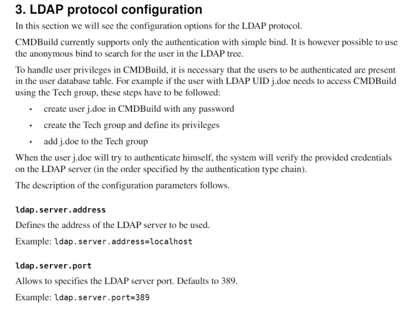
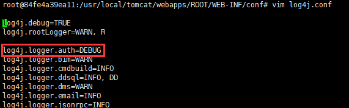
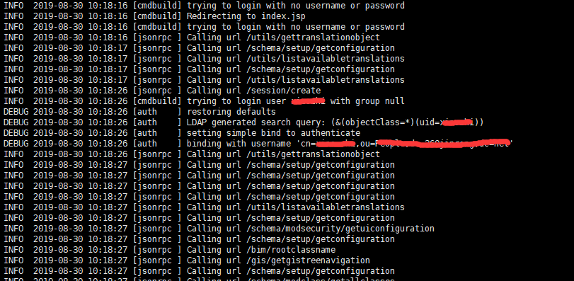

## 目的

cmdbuid接入openldap用户权限，便于用户统一管理。


<!--more-->

## 前提条件

已安装好cmdbuid和openldap。

[安装cmdbuild](https://wandouduoduo.github.io/articles/4fcc594d.html)

[安装openldap](https://wandouduoduo.github.io/articles/931613a4.html#more)


## 步骤

1,  参考官方文档，如下图



翻译大意是

```
LDAP协议配置
在本节中，我们将看到LDAP协议的配置选项。
CMDBuild目前仅支持使用简单绑定进行身份验证。但是可以使用
匿名绑定以在LDAP树中搜索用户。
要在CMDBuild中处理用户权限，必须存在要进行身份验证的用户在用户数据库表中。
例如，如果具有LDAP UID j.doe的用户需要访问CMDBuild使用Tech Group必须遵循以下步骤：
•使用任何密码在CMDBuild中创建用户j.doe
•创建Tech组并定义其权限
•将j.doe添加到Tech组
经过上面三步后，当用户j.doe尝试验证自己时，系统将验证提供的凭据在LDAP服务器上（按身份验证类型链指定的顺序）。

所以就是所需要事先安装openldap树在cmdbuild中创建用户组和用户，这样配置后才能认证，感觉有点多次一举，我既然都事先创建了，干嘛还要接入openldap。最好的方法是直接读取认证，但是目前官方不支持。
有个想法是直接写脚本把openldap信息读取出来定时写入到cmdbuild数据库中，这样就可以实现统一管控。
```

2,  配置cmdbuild认证文件

```bash
vim /usr/local/tomcat/webapps/ROOT/WEB-INF/conf/auth.conf

## Authentication method chain (the first match stops the auth chain)
#auth.methods=HeaderAuthenticator,CasAuthenticator,LdapAuthenticator,DBAuthenticator
auth.methods=LdapAuthenticator

#auth.case.insensitive=false

#force.ws.password.digest=true

##
## HEADER
##

#header.attribute.name=username

##
## CAS
##

#cas.server.url=https://casserver/cas
#cas.login.page=/login
#cas.service.param=service
#cas.ticket.param=ticket

##
## LDAP
##

ldap.server.address=xxx.xxx.xxxx.xxx
ldap.server.port=389
ldap.use.ssl=false
ldap.basedn=dc=wandouduoduo,dc=com
ldap.bind.attribute=uid

ldap.search.filter=(objectClass=*)
##Accept only none (anonymous bind) and simple (simple bind)
#ldap.search.auth.method=none
##This section is only for simple bind
ldap.search.auth.method=simple
ldap.search.auth.principal=cn=admin,dc=wandouduoduo,dc=com
ldap.search.auth.password=xxxx
```

3，重启cmdbuild，生效配置。

4，日志改为debug模式，便于观察。

```
vim /usr/local/tomcat/webapps/ROOT/WEB-INF/conf/log4j.conf
```



经过上述步骤就可实现接入步骤，观察日志，如下图：



表示认证成功，后续会补充同步脚本。