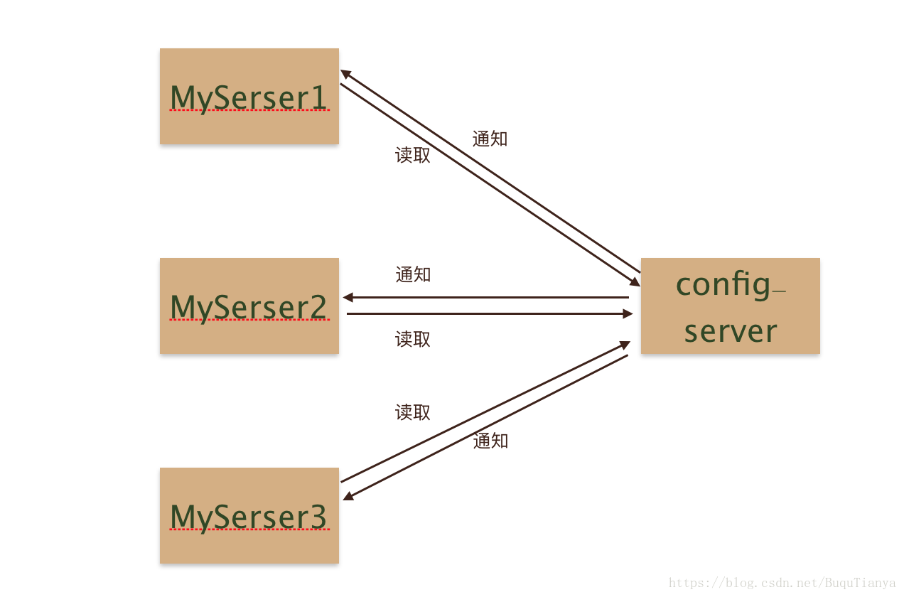
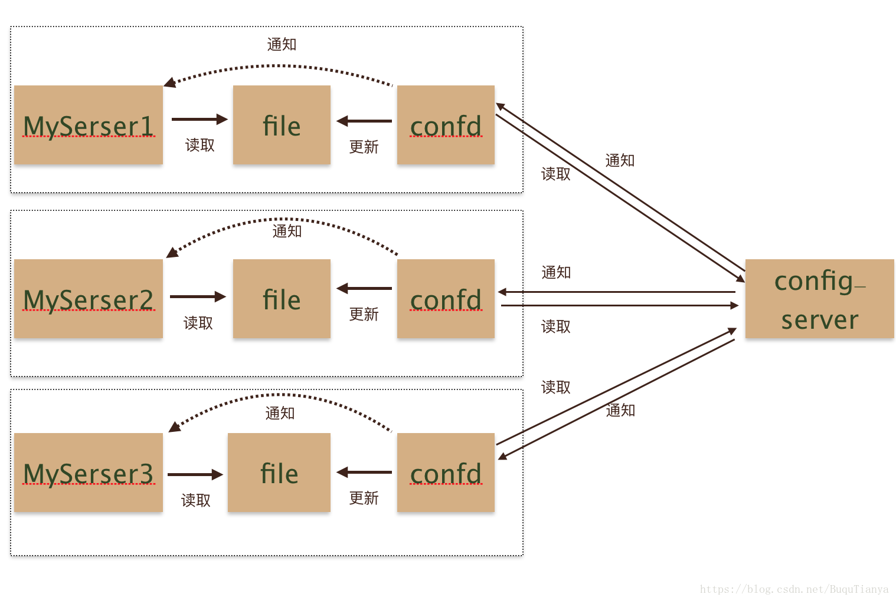
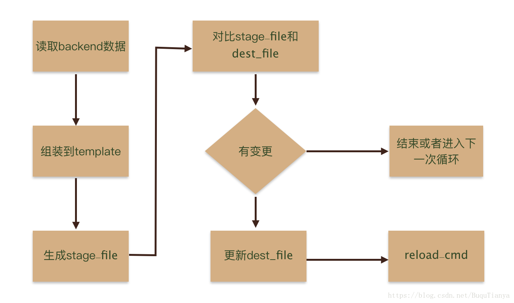

## 概述

当系统变的复杂，配置项越来越多，一方面配置管理变得繁琐，另一方面配置修改后需要重新上线同样十分痛苦。这时候，需要有一套集中化配置管理系统，一方面提供统一的配置管理，另一方面提供配置变更的自动下发，及时生效。提到统一配置管理系统，大家应该比较熟悉，常见的：zookeeper、etcd、consul、git等等。上述的集中配置中心使用的时候，部署图大致是这样的：



server端只需要调用config-server对应客户端获取配置，和监听配置变更就可以了。总体来说没有太大难度。

接下来要说一下confd，它提供了一种新的集成思路。confd的存在有点类似于快递员，买了东西不需要自己到店去取货了，confd这个快递员会把货取过来，然后送到家里，并且通知你货已经送到了。加入confd之后的架构大致是这样的：



<!--more-->

## confd工作原理

confd使用时有几个概念需要熟悉，并且熟悉他们之间的依赖关系，才能理解如何配置confd，不然会比较懵。这里我们先看一下confd配置的几个概念之间是如何交互的：



## confd的部署

以Linux系统为例。[官方下载地址](https://github.com/kelseyhightower/confd/releases)

```shell
# 下载二进制文件
wget https://github.com/kelseyhightower/confd/releases/download/v0.16.0/confd-0.16.0-linux-amd64

# 重命名二进制文件，并移动到PATH的目录下
mv confd-0.16.0-linux-amd64 /usr/local/bin/confd
chmod +x /usr/local/bin/confd

# 验证是否安装成功
confd --help
```

## confd的配置

**详情参考：**[confd模板语法详解](https://wandouduoduo.github.io/articles/9d4187fa.html#more)

`Confd`通过读取后端存储的配置信息来动态更新对应的配置文件，对应的后端存储可以是`etcd`，`redis`等，其中etcd的v3版本对应的存储后端为`etcdv3`。

#### 创建confdir

confdir底下包含两个目录:

- `conf.d`:  confd的配置文件，主要包含配置的生成逻辑，例如模板源，后端存储对应的keys，命令执行等。
- `templates`:  配置模板Template，即基于不同组件的配置，修改为符合 [Golang text templates](http://golang.org/pkg/text/template/#pkg-overview)的模板文件。

```shell
mkdir -p /etc/confd/{conf.d,templates}
```

#### 模板源

模板源配置文件是`TOML`格式的文件，主要包含配置的生成逻辑，例如模板源，后端存储对应的keys，命令执行等。默认目录在`/etc/confd/conf.d`。

**必要参数**

- `dest` （字符串） - 目标文件。
- `keys` （字符串数组） - 键数组。
- `src` （字符串） - [配置模板](https://github.com/kelseyhightower/confd/blob/master/docs/templates.md)的相对路径  。

**可选参数**

- `gid` （int） - 应该拥有该文件的gid。默认为有效的gid。
- `mode` （字符串） - 文件的权限模式。
- `uid` （int） - 应该拥有该文件的uid。默认为有效的uid。
- `reload_cmd` （字符串） - 重新加载配置的命令。
- `check_cmd` （字符串） - 检查配置的命令。
- `prefix` （字符串） - 键前缀的字符串。

**例子**

```shell
cat /etc/confd/conf.d/myapp-nginx.toml

[template]
prefix = "/myapp"
src = "nginx.tmpl"
dest = "/tmp/myapp.conf"
owner = "nginx"
mode = "0644"
keys = [
  "/services/web"
]
check_cmd = "/usr/sbin/nginx -t -c {{.src}}"
reload_cmd = "/usr/sbin/service nginx reload"
```

#### 模板

`Template`定义了单一应用配置的模板，默认存储在`/etc/confd/templates`目录下，模板文件符合Go的[`text/template`](http://golang.org/pkg/text/template/)格式。

模板文件常用函数有`base`，`get`，`gets`，`lsdir`，`json`等。具体可参考https://github.com/kelseyhightower/confd/blob/master/docs/templates.md。

例子：

```shell
cat  /etc/confd/templates/nginx.tmpl

{{range $dir := lsdir "/services/web"}}
upstream {{base $dir}} {
    {{$custdir := printf "/services/web/%s/*" $dir}}{{range gets $custdir}}
    server {{$data := json .Value}}{{$data.IP}}:80;
    {{end}}
}

server {
    server_name {{base $dir}}.example.com;
    location / {
        proxy_pass {{base $dir}};
    }
}
{{end}}
```

## 创建后端存储的配置数据

以`etcdv3`存储为例，在etcd中创建以下数据.

```shell
etcdctl --endpoints=$endpoints put /services/web/cust1/2 '{"IP": "10.0.0.2"}'
etcdctl --endpoints=$endpoints put /services/web/cust2/2 '{"IP": "10.0.0.4"}'
etcdctl --endpoints=$endpoints put /services/web/cust2/1 '{"IP": "10.0.0.3"}'
etcdctl --endpoints=$endpoints put /services/web/cust1/1 '{"IP": "10.0.0.1"}'
```

## 启动confd的服务

confd支持以`daemon`或者`onetime`两种模式运行，当以`daemon`模式运行时，confd会监听后端存储的配置变化，并根据配置模板动态生成目标配置文件。

如果以`daemon`模式运行，则执行以下命令：

```shell
confd -watch -backend etcdv3 -node http://172.16.5.4:12379 &
```

以下以`onetime`模式运行为例。其中对应的后端存储类型是`etcdv3`。

```shell
# 执行命令
confd -onetime -backend etcdv3 -node http://172.16.5.4:12379

# output
2018-05-11T18:04:59+08:00 k8s-dbg-master-1 confd[35808]: INFO Backend set to etcdv3
2018-05-11T18:04:59+08:00 k8s-dbg-master-1 confd[35808]: INFO Starting confd
2018-05-11T18:04:59+08:00 k8s-dbg-master-1 confd[35808]: INFO Backend source(s) set to http://172.16.5.4:12379
2018-05-11T18:04:59+08:00 k8s-dbg-master-1 confd[35808]: INFO /root/myapp/twemproxy/conf/twemproxy.conf has md5sum 6f0f43abede612c75cb840a4840fbea3 should be 32f48664266e3fd6b56ee73a314ee272
2018-05-11T18:04:59+08:00 k8s-dbg-master-1 confd[35808]: INFO Target config /root/myapp/twemproxy/conf/twemproxy.conf out of sync
2018-05-11T18:04:59+08:00 k8s-dbg-master-1 confd[35808]: INFO Target config /root/myapp/twemproxy/conf/twemproxy.conf has been updated
```

## 查看生成的配置文件

在`/etc/confd/conf.d/myapp-nginx.toml`中定义的配置文件的生成路径为`/tmp/myapp.conf`。

```shell
cat myapp.conf

  upstream cust1 {
      server 10.0.0.1:80;
      server 10.0.0.2:80;
  }

  server {
      server_name cust1.example.com;
      location / {
          proxy_pass cust1;
      }
  }

  upstream cust2 {
      server 10.0.0.3:80;
      server 10.0.0.4:80;
  }

  server {
      server_name cust2.example.com;
      location / {
          proxy_pass cust2;
      }
  }
```

## confd动态更新twemproxy

### twemproxy.toml

confd的模板源文件配置：/etc/confd/conf.d/twemproxy.toml

```shell
[template]
src = "twemproxy.tmpl"
dest = "/root/myapp/twemproxy/conf/twemproxy.conf"
keys = [
  "/twemproxy/pool"
]
check_cmd = "/usr/local/bin/nutcracker -t -c /root/myapp/twemproxy/conf/twemproxy.conf"
reload_cmd = "bash /root/myapp/twemproxy/reload.sh"
```

### twemproxy.tmpl

模板文件：/etc/confd/templates/twemproxy.tmpl

```shell
global:
  worker_processes: 4         # 并发进程数, 如果为0, 这 fallback 回原来的单进程模型(不支持 config reload!)
  user: nobody                # worker 进程的用户, 默认 nobody. 只要主进程是 root 用户启动才生效.
  group: nobody               # worker 进程的用户组
  worker_shutdown_timeout: 30 # 单位为秒. 用于 reload 过程中在改时间段之后强制退出旧的 worker 进程.

pools: {{range gets "/twemproxy/pool/*"}}
  {{base .Key}}: {{$pool := json .Value}}
    listen: {{$pool.ListenAddr.IP}}:{{$pool.ListenAddr.Port}}
    hash: fnv1a_64 # 选择实例的 hash 规则
    distribution: ketama
    auto_eject_hosts: true # server 有问题是否剔除
    redis: true # 是否为 Redis 协议
    {{if $pool.Password}}redis_auth: {{$pool.Password}}{{end}}
    server_retry_timeout: 5000 # 被剔除多长时间后会重试
    server_connections: 25 # NOTE: server 连接池的大小, 默认为 1, 建议调整
    server_failure_limit: 5 # 失败多少次后暂时剔除
    timeout: 1000 # Server 超时时间, 1 sec
    backlog: 1024 # 连接队列大小
    preconnect: true # 预连接大小
    servers:{{range $server := $pool.Servers}}
     - {{$server.IP}}:{{$server.Port}}:1 {{if $server.Master}}master{{end}}
    {{end}}
{{end}}
```

### etcd中的配置格式

`etcd`中的配置通过一个map来定义为完整的配置内容。其中`key`是`twemproxy`中`pool`的名称，`value`是`pool`的所有内容。

配置对应go结构体如下：

```shell
type Pool struct{
    ListenAddr  ListenAddr `json:"ListenAddr,omitempty"`
    Servers []Server `json:"Servers,omitempty"`
    Password string `json:"Password,omitempty"`
}

type ListenAddr struct {
    IP string `json:"IP,omitempty"`
    Port string `json:"Port,omitempty"`
}

type Server struct {
    IP string `json:"IP,omitempty"`
    Port string `json:"Port,omitempty"`
    Master bool `json:"Master,omitempty"`
}
```

配置对应`JSON`格式如下：

```shell
{
    "ListenAddr": {
        "IP": "192.168.5.7",
        "Port": "22225"
    },
    "Servers": [
        {
            "IP": "10.233.116.168",
            "Port": "6379",
            "Master": true
        },
        {
            "IP": "10.233.110.207",
            "Port": "6379",
            "Master": false
        }
    ],
    "Password": "987654"
}
```

### 生成`twemproxy`配置文件

```shell
global:
  worker_processes: 4         # 并发进程数, 如果为0, 这 fallback 回原来的单进程模型(不支持 config reload!)
  user: nobody                # worker 进程的用户, 默认 nobody. 只要主进程是 root 用户启动才生效.
  group: nobody               # worker 进程的用户组
  worker_shutdown_timeout: 30 # 单位为秒. 用于 reload 过程中在改时间段之后强制退出旧的 worker 进程.

pools:
  redis1:
    listen: 192.168.5.7:22223
    hash: fnv1a_64 # 选择实例的 hash 规则
    distribution: ketama
    auto_eject_hosts: true # server 有问题是否剔除
    redis: true # 是否为 Redis 协议
    redis_auth: 987654
    server_retry_timeout: 5000 # 被剔除多长时间后会重试
    server_connections: 25 # NOTE: server 连接池的大小, 默认为 1, 建议调整
    server_failure_limit: 5 # 失败多少次后暂时剔除
    timeout: 1000 # Server 超时时间, 1 sec
    backlog: 1024 # 连接队列大小
    preconnect: true # 预连接大小
    servers:
     - 10.233.116.169:6379:1


  redis2:
    listen: 192.168.5.7:22224
    hash: fnv1a_64 # 选择实例的 hash 规则
    distribution: ketama
    auto_eject_hosts: true # server 有问题是否剔除
    redis: true # 是否为 Redis 协议
    redis_auth: 987654
    server_retry_timeout: 5000 # 被剔除多长时间后会重试
    server_connections: 25 # NOTE: server 连接池的大小, 默认为 1, 建议调整
    server_failure_limit: 5 # 失败多少次后暂时剔除
    timeout: 1000 # Server 超时时间, 1 sec
    backlog: 1024 # 连接队列大小
    preconnect: true # 预连接大小
    servers:
     - 10.233.110.223:6379:1 master

     - 10.233.111.21:6379:1
```

## 定时自动更新配置

方法一：使用confd的定时执行机制，启动confd时执行：

```shell
# interval单位是秒，默认值是600秒。
confd -interval 60 -backend file -file /tmp/myapp.yaml
```

方法二：使用操作系统的crontab定时执行：

```shell
crontab -e
0 * * * * confd -onetime -backend file -file /tmp/myapp.yaml
```

