## 背景

收到公司总部安全部门扫描测试，查出公司内部confluence的版本太低，存在安全漏洞。给出的解决方案是升级到最新版本，最新版本已经把该漏洞修复。本文就详细介绍下confluence的升级过程。


## 参考

[官方文档](https://www.cwiki.us/display/CONFLUENCEWIKI/Upgrading+Confluence)

<!--more-->

## 升级流程

### 备份你的数据

#### 官方备份方法

点击一般设置的，点击备份和还原

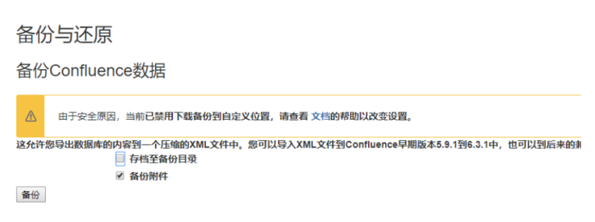

### 自行备份

1，备份数据源。默认路径为：/var/atlassian/application-data/confluence/confluence.cfg.xml

2，备份附件。默认路径为：/var/atlassian/application-data/confluence/attachments

## 安装部署最新版

#### 破解文件备份

```
mv /opt/atlassian/confluence/confluence/WEB-INF/lib/atlassian-extras-decoder-v2-3.4.1.jar ~/atlassian-extras-2.4.jar
```


#### 下载

[官网下载地址](https://www.atlassian.com/software/confluence/download)，放在/opt

#### 执行

```bash
chmod +x atlassian-confluence-6.15.1-x64.bin   #赋予可执行权限
./atlassian-confluence-6.15.1-x64.bin  #执行安装
```

到了红圈这步选择3，回车。表示升级

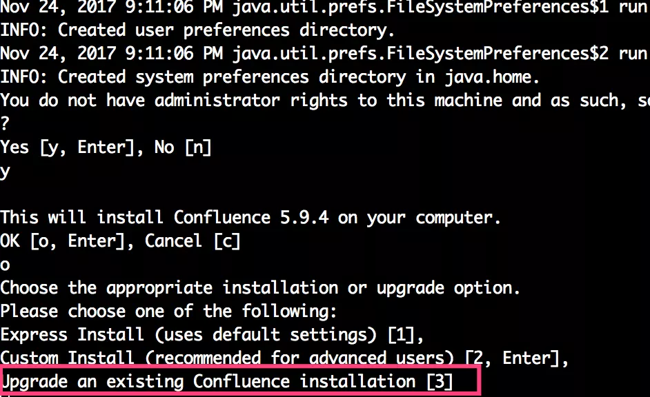

#### 备份

下面询问你是否要备份，上面我们已经自己备份了，也可选他默认备份

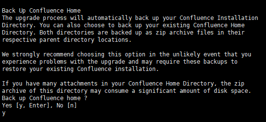

#### 确认更新

会展示了一些改变的文件（破解文件变了，下面伏笔），问你同意

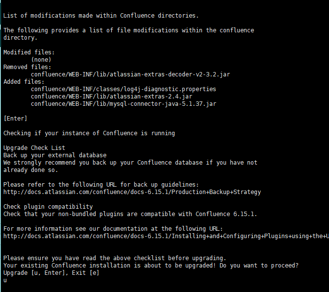

#### 成功部署

访问  ip:8090

#### 重新破解

破解包被升级，有机会出现下面画面，代表验证不通过

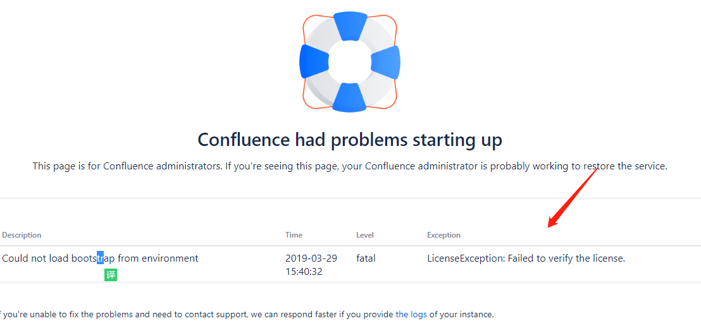

把备份的atlassian-extras-2.4.jar文件复制到/opt/atlassian/confluence/confluence/WEB-INF/lib，并重命名为该版本的文件名

```
mv ~/atlassian-extras-2.4.jar /opt/atlassian/confluence/confluence/WEB-INF/lib/atlassian-extras-decoder-v2-3.4.1.jar 
```

重启服务

数据和附件，无损升级到，6.15.8


## 破解教程

有的同学可能没有备份破解文件，或者可能不是自己搭建的，现在刚刚接手。那么如何破解呢？

#### 下载破解工具

链接: https://pan.baidu.com/s/13GZ-3XutMEyE3cUl9rwg_Q 提取码: 7gtd 

破解工具是个jar包，所以需要jdk环境。jdk环境配置在网上很多，这里省略。java -jar 破解文件.jar

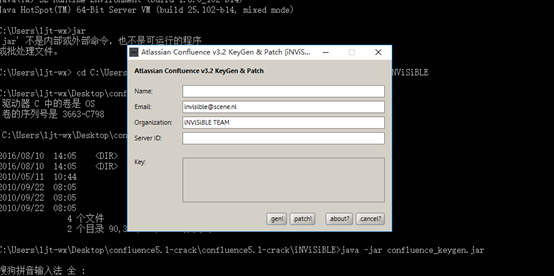

#### 获取信息

```bash
# 升级时
grep -Po "(?<=server.id\"\>).*(?=\<)" /var/atlassian/application-data/confluence/confluence.cfg.xml
# 全新安装此步骤跳过
```

#### 生产key

先点.patch加载从服务器复制出来的atlassian-extras-2.4.jar文件，然后点.gen破解

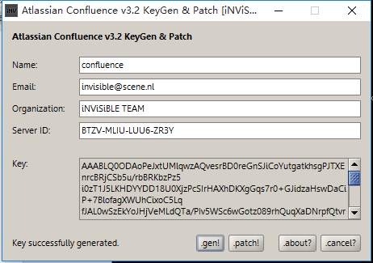

#### 破解

如权限安装，如下图填写

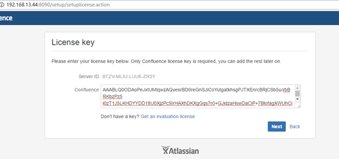

如升级，如下图更改配置

vim /var/atlassian/application-data/confluence/confluence.cfg.xml

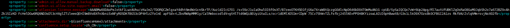

把破解后的文件atlassian-extras-2.4.jar复制到服务器的/opt/atlassian/confluence/confluence/WEB-INF/lib/，并重命名为该版本的名称，如：atlassian-extras-decoder-v2-3.4.1.jar

## 接入Ldap

管理员登录，一般配置-->用户目录-->添加用户目录-->Ldap


填写信息

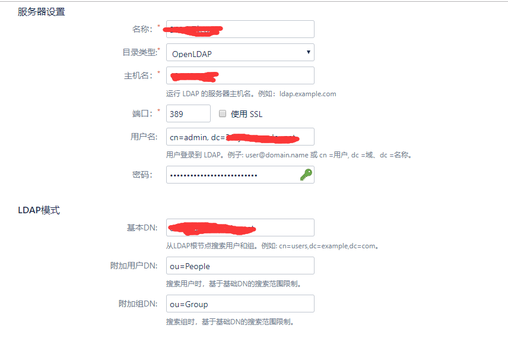

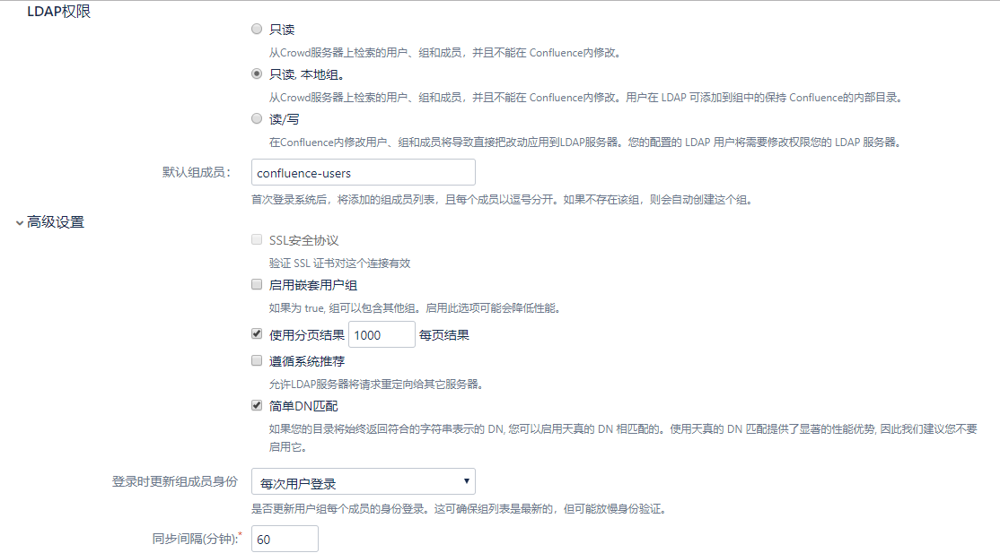

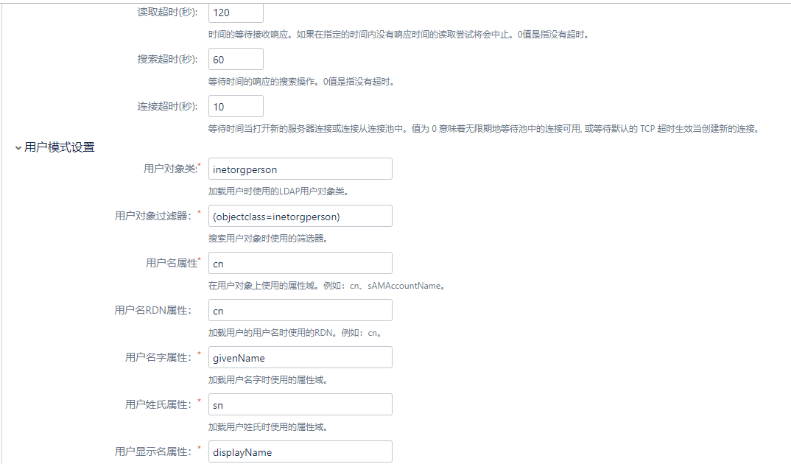

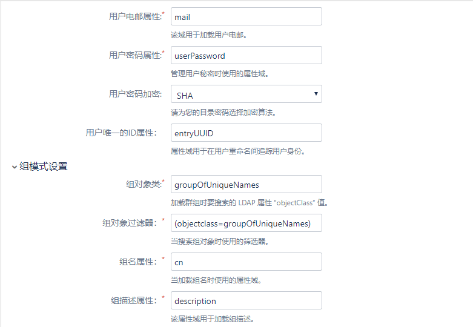


