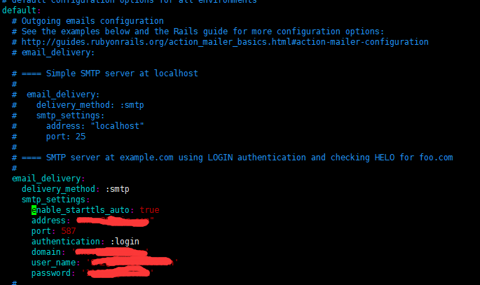
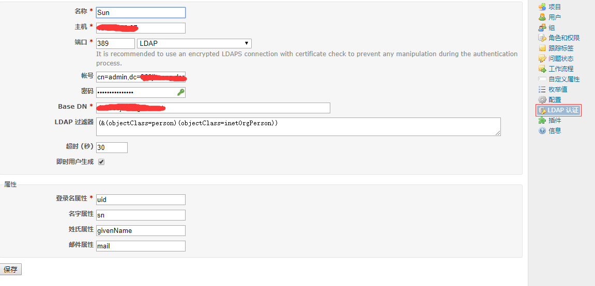
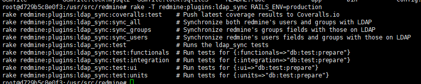
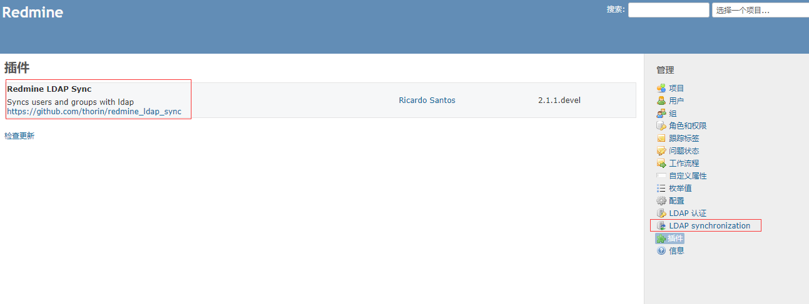
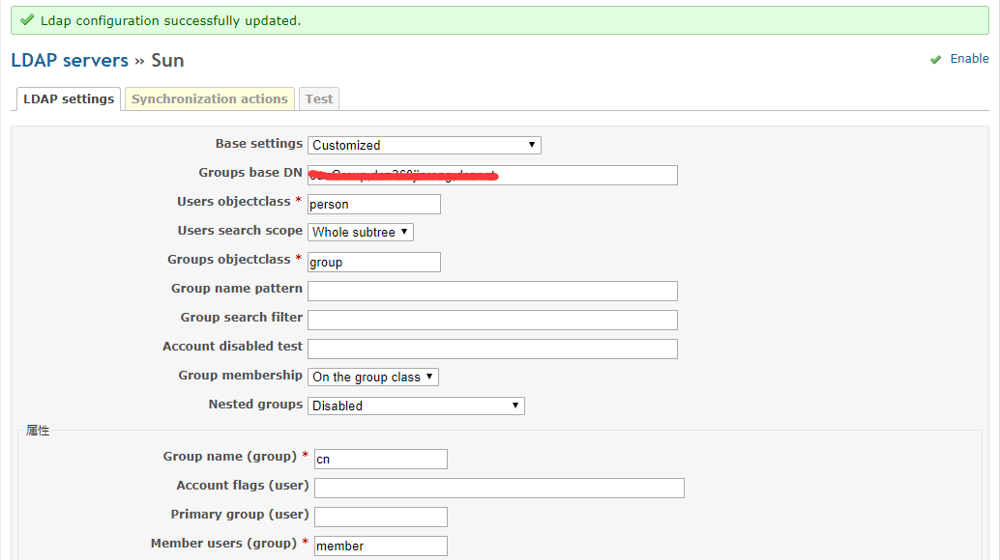
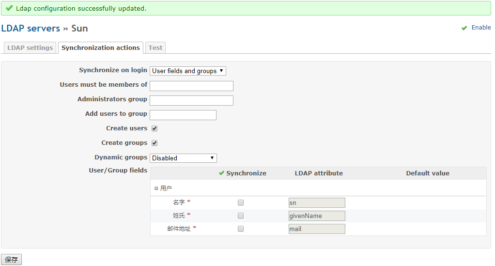
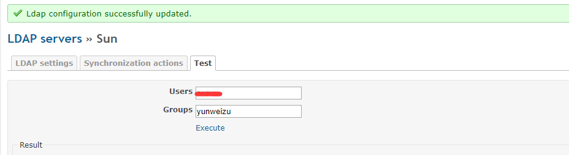

## 目的

快速搭建redmine服务，以便能够对项目和工作流进行管控。


## 参考文档

[官方文档](https://hub.docker.com/_/redmine)或者[docker官方](https://docs.docker.com/samples/library/redmine/)

<!--more-->


## 步骤

#### 用SQLite3运行Redmine

这是最简单的方式

```bash
docker run -d --name sunredmine redmine:3.4
```

#### 使用数据库容器运行Redmine

建议使用数据库服务器运行Redmine。

1, 启动数据库容器

PostgreSQL

```bash
docker run -d --name some-postgres --network some-network -e POSTGRES_PASSWORD=secret -e POSTGRES_USER=redmine postgres
```

MySQL的（替代`-e REDMINE_DB_POSTGRES=some-postgres`与`-e REDMINE_DB_MYSQL=some-mysql`运行管理平台时）

```bash
docker run -d --name some-mysql --network some-network -e MYSQL_USER=redmine -e MYSQL_PASSWORD=secret -e MYSQL_DATABASE=redmine -e MYSQL_RANDOM_ROOT_PASSWORD=1 mysql:5.7
```

2, 运行redmine

```bash
docker run -d --name some-redmine --network some-network -e REDMINE_DB_POSTGRES=some-postgres -e REDMINE_DB_USERNAME=redmine -e REDMINE_DB_PASSWORD=secret redmine
```


## 完整例子

假设已有postgres数据库容器

```bash
docker run --name pgsql -p 5432:5432 -e POSTGRES_PASSWORD=sunxu123 -v /data/postgres:/var/lib/postgresql/data -d postgres:9.4

# 进入容器后操作
docker exec -it pgsql /bin/bash
# 进Postgresql账号
su postgres
#
CREATE USER redmine WITH PASSWORD 'Sun123';
# 建库
createdb -O redmine redmine 和 CREATE DATABASE redmine OWNER redmine等效,二选一即可
# 赋权
GRANT ALL PRIVILEGES ON DATABASE redmine to redmine;

# 启动redmine
docker run  --name redmine -p 10083:3000 -v /data/redmine/data:/usr/src/redmine/files --link pgsql:remine -d redmine:3.4
# 查看日志
docker logs -f remine
```


## 功能完善

#### 邮件

```bash
docker redmine:/usr/src/redmine/config/configuration.yml.example  ./
mv configuration.yml.example configuration.yml
vim configuration.yml

default:
  email_delivery:
    delivery_method: :smtp
    smtp_settings:
      enable_starttls_auto: true
      address: "xxxxxxxxxxx"
      port: 587
      authentication: :login
      domain: 'xxxxxxxxxxxxxx'
      user_name: 'xxxxxxxxxxxxx'
      password: 'xxxxxxxxxxxx'

```



**测试是否配置成功：**
打开Redmine >管理员登陆 > 管理 > 配置 > 邮件通知 >页面底部:发送测试邮件。将会发送邮件到你目前登陆的用户邮箱中。

如果没有配置成功，则这个选项卡显示的是黄色的字，如未对邮件进行配置，config/configuration.yml。

#### ldap接入和用户同步

原始的ldap认证，我试了下不完美，他需要创建用户然后使用ldap认证，也就是说还是需要先去创建用户。这样显得很麻烦



Base dn是基准DN

LDAP过滤器是用来过滤你需要加入到redmine里的用户，我这里是用对象类即objectclass去filter用户

认证模式改以下就好。

但是这样还是创建用户 还是麻烦 这个时候需要用到ldap的插件（Redmine LDAP Sync）

插件安装基本官网都有说

git：https://github.com/thorin/redmine_ldap_sync#rake-tasks

里面有介绍我这里就不说了，大致上就两步

```
因为这个插件好多年不再维护了只能支持redmine3.4.x最新的redmine4.0.x不支持，会报错，这也是为什么docker启动时用3.4版本的原因

1，在#{RAILS_ROOT}/plugins目录下下载插件
git clone git://github.com/thorin/redmine_ldap_sync.git
2，在#{RAILS_ROOT} 目录下执行
rake -T redmine:plugins:ldap_sync RAILS_ENV=production
```



插件安装好之后重启redmine也就是nginx

然后打开web发现会多一个ldap sync


填写好测试完成看看结果







配置项根据自己的环境设置，设置好之后点击第三栏菜单test是否可以取出成功，

可以的话就直接激活这个ldap sync

之后直接去登录就可以了。