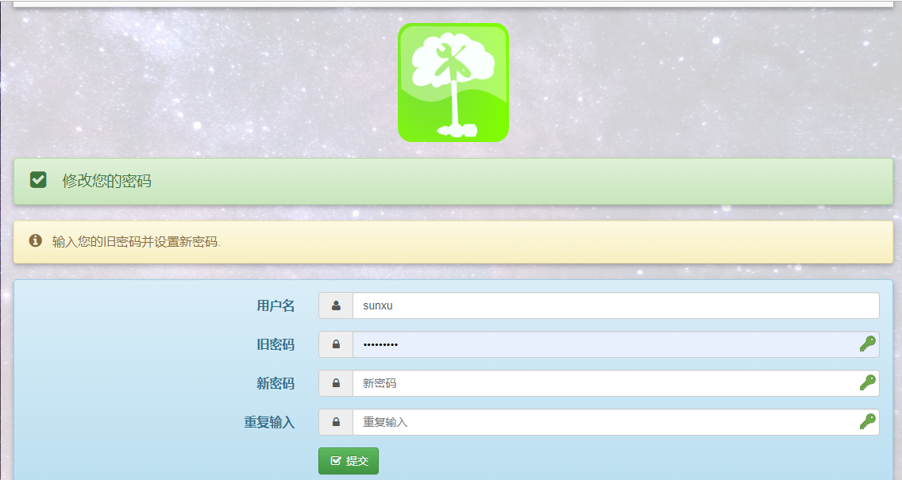
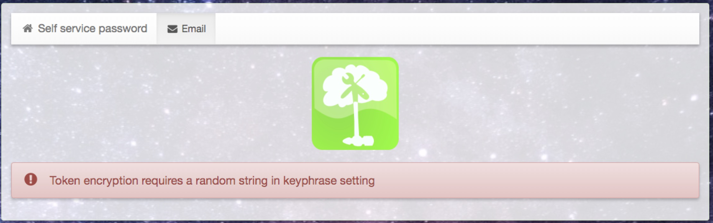
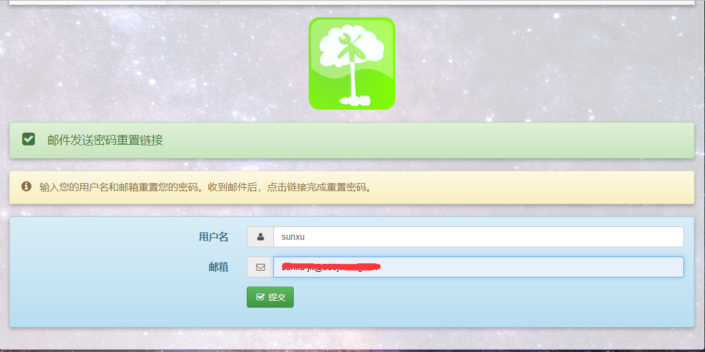
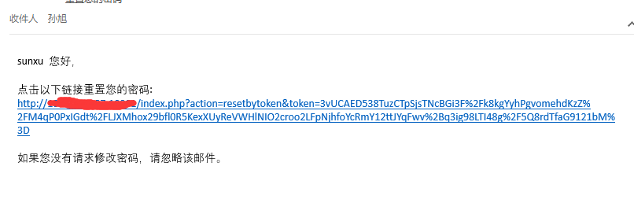

## 背景

OpenLDAP安装完毕后，如果用户要修改密码的话，就需要通过OpenLDAP管理员来进行修改。为了解放管理员的工作，让OpenLDAP用户可以自行进行密码的修改和重置，就需要我们来搭建一套自助修改密码系统。

在此我们使用的是开源的基于php语言开发的ldap自助修改密码系统Self Service Password。


## 教程

[参考文档](https://github.com/wandouduoduo/docker-ssp)

<!--more-->

按照参考文档正确配置并构建镜像，运行后，登录网页访问，通过网页修改账号密码验证



## 问题

如果遇到以下错误：



修改配置:

```
$keyphrase = "secret";  改为  $keyphrase = "sunxu"; #任意字符串
```

重启容器，再次访问。

## 验证

邮件重置密码：



查看邮件



修改完成会收到一条邮件：

