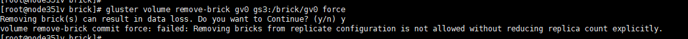

## 目的

glusterfs作为分布式存储，优点和安装这里就不再赘述了，看博客中教程。本文主要是介绍glusterfs常用命令和案例。

<!--more-->

## 命令详解

###  服务器节点

```bash
#查看所有节点信息，显示时不包括本节点
gluster peer status 
#添加节点
gluster peer probe NODE-NAME 
#移除节点，需要提前将该节点上的brick移除
gluster peer detach NODE-NAME 
```

 

### glusterd服务

```bash
#启动glusterd服务
/etc/init.d/glusterd start 
#关闭glusterd服务
/etc/init.d/glusterd stop 
#查看glusterd服务
/etc/init.d/glusterd status 
```

 

### 卷管理

#### 创建卷

**复制卷**

```bash
语法： gluster volume create NEW-VOLNAME [replica COUNT] [transport tcp | rdma | tcp, rdma] NEW-BRICK

示例1：gluster volume create test-volume replica 2 transport tcp server1:/exp1/brick server2:/exp2/brick
```

**条带卷**

```bash
语法：gluster volume create NEW-VOLNAME [stripe COUNT] [transport tcp | rdma | tcp, rdma] NEW-BRICK...

示例：gluster volume create test-volume stripe 2 transport tcp server1:/exp1/brick server2:/exp2/brick
```

**分布式卷**

```bash
语法： gluster volume create NEW-VOLNAME [transport tcp | rdma | tcp, rdma] NEW-BRICK

示例1：gluster volume create test-volume server1:/exp1/brick server2:/exp2/brick
示例2：gluster volume create test-volume transport rdma server1:/exp1/brick server2:/exp2/brick server3:/exp3/brick server4:/exp4/brick
```

**分布式复制卷**

```bash
语法： gluster volume create NEW-VOLNAME [replica COUNT] [transport tcp | rdma | tcp, rdma] NEW-BRICK...
示例： gluster volume create test-volume replica 2 transport tcp server1:/exp1/brick server2:/exp2/brick server3:/exp3/brick server4:/exp4/brick
```

 **分布式条带卷**

```bash
语法：gluster volume create NEW-VOLNAME [stripe COUNT] [transport tcp | rdma | tcp, rdma] NEW-BRICK...

示例：gluster volume create test-volume stripe 2 transport tcp server1:/exp1/brick server2:/exp2/brick server3:/exp3/brick server4:/exp4/brick
```

**条带复制卷**

```bash
语法：gluster volume create NEW-VOLNAME [stripe COUNT] [replica COUNT] [transport tcp | rdma | tcp, rdma] NEW-BRICK...

示例：gluster volume create test-volume stripe 2 replica 2 transport tcp server1:/exp1/brick server2:/exp2/brick server3:/exp3/brick server4:/exp4/brick
```

#### 启动卷

```bash
gluster volume start test-volume
```

####  停止卷

```bash
gluster volume stop test-volume
```

 **删除卷**

```bash
#先停止卷后才能删除
gluster volume delete test-volume 
```

#### 查看卷

```bash
#列出集群中的所有卷
gluster volume list 
#查看集群中的卷信息
gluster volume info [all] 
#查看集群中的卷状态
gluster volume status [all] 

gluster volume status [detail| clients | mem | inode | fd]
```

#### 配置卷

```bash
 gluster volume set <VOLNAME> <OPTION> <PARAMETER>
```

####  扩展卷

```bash
gluster volume add-brick <VOLNAME> <NEW-BRICK>
#注意，如果是复制卷或者条带卷，则每次添加的Brick数必须是replica或者stripe的整数倍。
```

#### 收缩卷

```bash
#先将数据迁移到其它可用的Brick，迁移结束后才将该Brick移除：
gluster volume remove-brick start
#在执行了start之后，可以使用status命令查看移除进度：
gluster volume remove-brick status
#不进行数据迁移，直接删除该Brick：
gluster volume remove-brick commit
#注意，如果是复制卷或者条带卷，则每次移除的Brick数必须是replica或者stripe的整数倍。
```

####  迁移卷

```bash
#使用start命令开始进行迁移：
gluster volume replace-brick start
#在数据迁移过程中，可以使用pause命令暂停迁移：
gluster volume replace-brick pause
#在数据迁移过程中，可以使用abort命令终止迁移：
gluster volume replace-brick abort
#在数据迁移过程中，可以使用status命令查看迁移进度：
gluster volume replace-brick status
#在数据迁移结束后，执行commit命令来进行Brick替换：
gluster volume replace-brick commit
```

#### 重新均衡卷

```bash
#不迁移数据：
gluster volume rebalance lay-outstart
gluster volume rebalance start
gluster volume rebalance startforce
gluster volume rebalance status
gluster volume rebalance stop
```

### Brick管理

#### 添加Brick

```bash
gluster volume add-brick test-volume 192.168.1.{151,152}:/mnt/brick2
```

#### 删除Brick

```bash
#若是副本卷，则移除的Bricks数是replica的整数倍
gluster volume remove-brick test-volume 192.168.1.{151,152}:/mnt/brick2 start
#在执行开始移除之后，可以使用status命令进行移除状态查看。
gluster volume remove-brick test-volume 192.168.1.{151,152}:/mnt/brick2 status
#使用commit命令执行Brick移除，则不会进行数据迁移而直接删除Brick，符合不需要数据迁移的用户需求。
gluster volume remove-brick test-volume 192.168.1.{151,152}:/mnt/brick2 commit
```

#### 替换Brick

任务：把192.168.1.151:/mnt/brick0 替换为192.168.1.151:/mnt/brick2

**开始替换**

```bash
gluster volume replace-brick test-volume 192.168.1.:/mnt/brick0 ..152:/mnt/brick2 start
异常信息：volume replace-brick: failed: /data/share2 or a prefix of it is already part of a volume

#说明 /mnt/brick2 曾经是一个Brick。具体解决方法
rm -rf /mnt/brick2/.glusterfs

setfattr -x trusted.glusterfs.volume-id /mnt/brick2
setfattr -x trusted.gfid /mnt/brick2

#如上，执行replcace-brick卷替换启动命令，使用start启动命令后，开始将原始Brick的数据迁移到即将需要替换的Brick上。
```

**查看是否替换完**

```bash
gluster volume replace-brick test-volume 192.168.1.151:/mnt/brick0 ..152:/mnt/brick2 status
```

**在数据迁移的过程中，可以执行abort命令终止Brick替换。**

```bash
gluster volume replace-brick test-volume 192.168.1.151:/mnt/brick0 ..152:/mnt/brick2 abort
```

**在数据迁移结束之后，执行commit命令结束任务，则进行Brick替换。使用volume info命令可以查看到Brick已经被替换**。

```bash
gluster volume replace-brick test-volume 192.168.1.151:/mnt/brick0 .152:/mnt/brick2 commit
#此时我们再往 /sf/data/vs/gfs/rep2上添加数据的话，数据会同步到 192.168.1.152:/mnt/brick0和192.168.1.152:/mnt/brick2上。而不会同步到192.168.1.151:/mnt/brick0 上。
```

### 文件系统扩展属性

```bash
#获取文件扩展属性
getfattr -d -m . -e hex filename
getfattr -d -m "trusted.afr.*" -e hex filename
```

## 案例

### 增加节点

```bash
#hosts文件中添加对应服务器解析
echo "ip   gs3" >>/etc/hosts
#查看节点信息
gluster peer status
#添加节点
gluster peer probe gs3

#数据卷添加新的brick
gluster volume add-brick 卷名 replica 添加后的副本个数 brick所在的IP:brick所在的地址 force
最后的force是因为，gluster集群推荐不要和系统公用磁盘，如果公用就需添加。

例如：
mkdir -p /brick/gv0
gluster volume add-brick gv0 replica 2 gs2:/brick/gv0  force
```

### 删除节点

```bash
#查看节点信息
gluster peer status
# 删除操作,注意删除节点必须先删除brick
gluster peer detach gs3
```


上面报错，是因为没有删除brick导致。

```bash
#数据卷移除旧的brick
gluster volume remove-brick 卷名 replica 移除后的副本个数 brick所在的IP:brick所在的地址

例如：移除gs3上的static卷
gluster volume remove-brick static gs3:/data/volume/brick/static
```



执行移除报错，是因为先删除副本。

```bash
gluster volume remove-brick gv0 replica 2  gs3:/brick/gv0 force
#注意副本数为删除后还剩的个数
#然后再移除节点
gluster peer detach gs3
```

